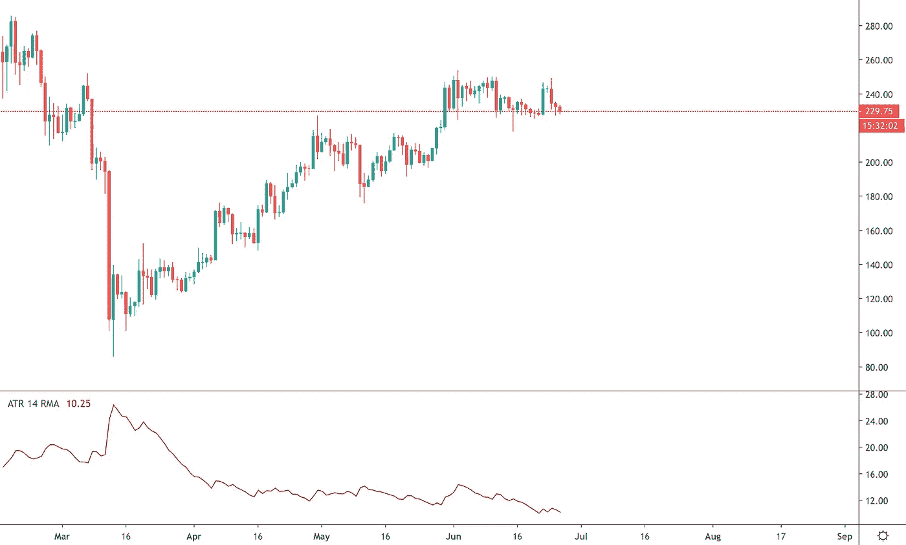
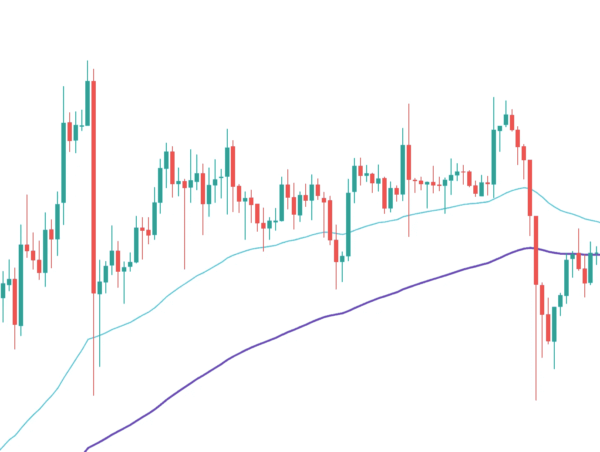
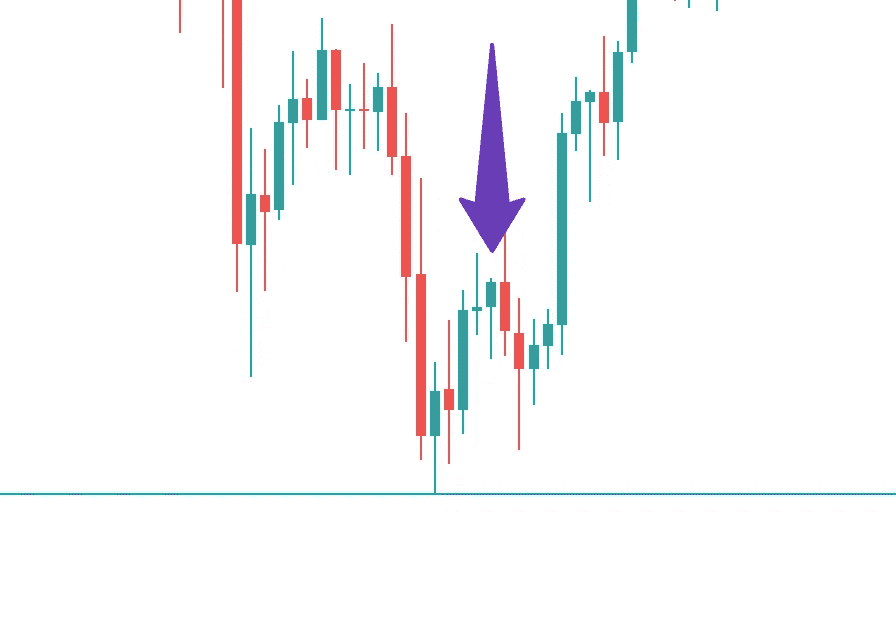

# 交易比特币时设置止损的 4 种实用方法

> 原文：<https://levelup.gitconnected.com/4-practical-methods-to-set-your-stop-loss-when-algo-trading-bitcoin-adb51b03849a>

## 这样你就可以提前出局，而不会被市场噪音所阻止

克里斯·利维拉尼在 [Unsplash](https://unsplash.com/collections/10723101/crypto/e1cda37c5cb09f1337f7c9de4ae3f785?utm_source=unsplash&utm_medium=referral&utm_content=creditCopyText) 上的照片

你经常听说在开始交易前设置止损的重要性。但是如果你是一个定量分析师，我想你已经知道它的重要性了。

你可以出于两个原因使用止损:

1.  在开始交易时设置你的止损
2.  用(某种)追踪止损退出你的未平仓头寸

***注#1:*** *止损单也可以用于开仓交易，是止损单的高级用法。我不会在本教程中讨论这个问题。*

**注意#2:** 在我所有的教程中，我将使用 [Python 语言](http://python.org)和 [JesseAI 框架](https://jesse-ai.com)。两者都是开源的，可以免费上手。

无论你的策略是使用(某种)追踪止损来退出，还是在特定价格退出，现在都不重要。但是把止损设置在你的进场价格以下是没有商量余地的。在我看来，你的策略如果不用就是有缺陷的。

# 为什么准确的止损价格如此重要？

假设你决定使用止损。但是你的止损价格是多少呢？这真的重要吗？是啊！实际上这很重要。

虽然增加你的止损保证金会增加你策略的胜率，但也会减少你的仓位。从长期来看，较小的头寸规模意味着较小的利润。当然，长期利润是算法交易的全部。

我将用一个例子来解释这一点:

想象一下，你的总资本是 10，000 英镑，你打算在每次交易中拿其中的 3%冒险。

假设你的策略告诉你在 100 美元进场，止损设在 80 美元(在本文中，我将介绍确定准确价格的方法)。你的仓位大小应该是多少？

因为说话很便宜，所以我要用代码来回答:

因此，持仓数量应该是 15，这样我只拿我资本的 3% 300 美元冒险。

现在让我们看看，如果我收紧止损，仍然冒险 3%(300 美元)，会发生什么。假设我把止损设在 90 美元:

请注意，我仍然冒着每次交易 300 美元的风险，但我的头寸规模增加了一倍，可能的利润也增加了一倍(如果这是一次有利可图的交易)。当然，更严格的止损意味着你会更频繁地被止损，这意味着胜率会降低。

> 你希望你的止损不要太紧，也不要太松。

我已经创建了一个[小网站](https://positionsizingcalculator.netlify.app)，让你玩这个公式，以充分了解如何定位工作。

现在我想让你谈谈我在算法策略中用来确定准确止损的 4 种方法。

# 1.ATR 指示器

平均真实范围是我最喜欢的设置动态止损的指标。从图表上看，乍一看可能有点吓人:

交易视图上的 ATR 指示器

如你所见，ATR 值随着价格的波动而变化。这是我用它来止损的主要原因。

> 止损价格必须设定在一个水平，以避免受到市场噪音的影响。波动性和噪音相伴而生。

在算法交易中使用 ATR 实际上比手工交易更容易。在下面这个做多交易的例子中，我将止损点`3*ATR`设在远离进场价格的地方:

根据你交易的时间范围，你可能需要改变乘数。我用`3`表示`4h`的时间范围。对于**更小的时间范围**，你需要**减少乘数**。

# 2.移动平均数

均线就像技术交易的“hello world”。但并不是所有人都知道他们也可以用它们来止损。

例如，我们可以在策略中使用两个 EMAs，一个进场时间较短，一个止损时间较长。

3h 时间框架 ETHUSD —蓝线:EMA50 —紫线:EMA100

在上面的例子中，我们可以在 EMA50 买入，当市场上有血的时候，用 EMA100 作为止损。

这是一个棘手的策略，需要仔细优化；但如果做得好，它会给你带来很高的风险回报比。

# 3.前 N 个酒吧的最低价

市场有短期记忆。有时它会记得前几天蜡烛的价格水平。

我不知道为什么这种止损方法有效，但它通常是有效的。

您可以使用前 N 根棒线的最低价格作为受噪音影响的价格的最低水平。因此，把你的止损点设在那个水平或者稍微低一点可能是个好主意。

用肉眼很容易确定 N 个条形中最低的一个:

紫色箭头表示进场价格，蓝色线表示止损价格

代码呢？嗯，我使用 [Jesse 框架](https://jesse-ai.com)，很容易完成这个。假设我们想要使用最后 N=20 根棒线的最低价格:

注意`self.candles`返回一个 numpy 数组，正如 Jesse 的文档中的[所解释的。](https://docs.jesse-ai.com/docs/strategies/api.html#candles)

# 4.前一天的低点

这是最简单的，也是最容易编写代码的；然而，它有时工作得很好。尤其是如果你是日内交易者。

首先，你需要告诉杰西在你的`routes.py`文件的`extra_candle`列表中装入`1D`时间段的蜡烛。这里有一个`BTCUSD`的例子:

现在在策略中，首先我选择所有每日蜡烛线，然后是前一天的蜡烛线，然后选择它的低价(指数=4):

# 结论

最后一个问题可能是，提到的方法中哪一个是最好的？嗯，我也说不准。我个人所做的是，每当我制定一个新的策略时，都要尝试所有的方法。

你会惊讶于结果的变化有多大。每种方法都可能在特定的市场和时间范围内有效。例如，ATR 方法在`4h`时间段的`BTCUSD`对我很有效；移动平均线方法在 3h 的时间范围内对`ETHUSD`很有效。

你也可以使用 Jesse 的优化模式，让算法决定使用哪种止损方法！然而，优化模式还没有出来。确保[订阅](https://jesse-ai.com)以便在发布时得到通知。

*原载于*[*https://jesse-ai.com*](https://jesse-ai.com/blog/tutorials/4-practical-methods-to-set-your-stop-loss-when-algo-trading-bitcoin)*。*