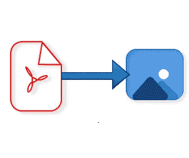

# 4 个 Python 库将 PDF 转换成图像

> 原文：<https://levelup.gitconnected.com/4-python-libraries-to-convert-pdf-to-images-7a09eba83a09>

最流行的开源 OCR 软件之一是 Google 的 Tesseract。它接收图像作为输入，并返回机器编码的文本。当我浏览 Tesseract 的文档时，我发现 tesseract 只接受图像作为输入。因此，我需要一种方法将我的 pdf 文件转换成图像。在网上冲浪时，我遇到了 4 个可以将 pdf 转换成图像的 python 库。这让我想到，为什么不写一篇关于这些库的文章，包括安装和代码演练。这就是了。

作者图片

# 1.pdf 2 图像

[Pdf2image](https://pypi.org/project/pdf2image/) 是一个 python 模块，它包装了 pdftoppm 和 pdftocairo，将 Pdf 转换为 PIL 图像对象。pdf2image 支持两种方法将 pdf 转换为图像。第一个是 *convert_from_path* ，它将 pdf 文件的路径作为输入。第二个是 *convert_from_bytes* ，它接受字节作为输入。后者可用于生产就绪代码，因为我们可以直接从云存储中读取 pdf 格式的字节。这消除了将 pdf 下载到您的系统的风险。

> **pip 安装 pdf2image**

## 先决条件:

1.  Windows —要在 Windows 中安装 pdf2image，我们需要 Windows 的 [poppler](https://blog.alivate.com.au/poppler-windows/) 二进制文件。下载 poppler 文件后，我们需要提供 bin 文件夹的路径。
2.  Linux——要在 Linux 中安装 pdf2image，我们可以使用 conda forge 命令来安装 poppler。

> **康达安装-康达锻造提升机**

# **2。Pypdfium2**

pypdfium2 是一个绑定到 pdfium 的 Python 3，PDFium 是一个自由授权的 PDF 渲染库，由 Foxit 创作，由 Google 维护。

pypdfium2 的安装非常简单，不需要任何依赖。

> **pip3 安装-无构建-隔离-U pypdfium2**

# **3。PyMuPDF 或 Fitz**

PyMuPDF 是 MuPDF 的 Python 绑定——“一个轻量级的 PDF 和 XPS viewer”。使用 PyMuPDF 可以将 PDF 文件转换成多种图像格式。创建的图像可以基于矩阵函数被放大或缩小。缩放值可以配置为实现预期的大小。

> **pip 安装 PyMuPDF==1.16.14**

# **4。Pdf2jpg**

Pdf2jpg 是一个 python 库，可以用来将 Pdf 转换成图像。我们需要分别为 pdf 和图像提供输入和输出路径。

> **pip 安装 pdf2jpg**

# 想要连接吗？

如果你喜欢这篇文章，请在 Medium 上关注我，了解更多关于机器学习和计算机科学的故事。

链接到—[Prithivee Ramalingam | LinkedIn](https://www.linkedin.com/in/prithivee-ramalingam-032b42110/)

感谢您成为我们社区的一员！在你离开之前:

*   👏为故事鼓掌，跟着作者走👉
*   📰查看更多内容请参见[升级编码刊物](https://levelup.gitconnected.com/?utm_source=pub&utm_medium=post)
*   🔔关注我们:[Twitter](https://twitter.com/gitconnected)|[LinkedIn](https://www.linkedin.com/company/gitconnected)|[时事通讯](https://newsletter.levelup.dev)

🚀👉 [**加入升级人才集体，找到一份神奇的工作**](https://jobs.levelup.dev/talent/welcome?referral=true)