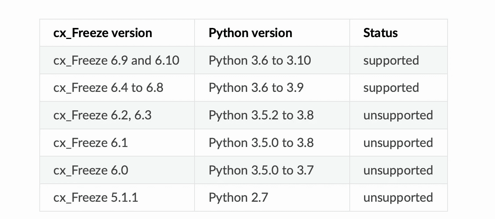

# 4 个 Python 独立可执行文件，简化应用程序交互

> 原文：<https://levelup.gitconnected.com/4-python-standalone-executables-for-a-simpler-app-interaction-d47b6a560919>

以下是最突出的四个。


由[作者](https://aniltilbe.medium.com)创作

独立可执行文件是一个不需要任何其他程序或库就可以运行的程序。它们可以独立运行，与 Python 安装的其余部分分开。

当简化的用户体验优先于应用源代码的可见性和控制时，它们会很有帮助。使用它们的另一个好处是，当您想要测试一个新特性或代码片段而不影响您的代码环境时。

如果您想避开 Python 缺乏对创建独立可执行文件的内置支持的问题，以下四个选项可供您选择:(1)py installer；(2)CX _ Freeze；(3)py 2 app；以及(4) py2exe。


由[作者](https://aniltilbe.medium.com)创作

# **PyInstaller**

打包的应用程序可以在不安装 Python 解释器或任何模块的情况下运行。它被设计成可以与 Python 的新版本和现有版本(目前支持 Python 3.7+)一起工作，并支持像 numpy 和 matplotlib 这样的包。它已经在 Windows、MacOS X 和 Linux 上进行了测试。

请注意:

—它不是交叉编译器(例如，构建一个 Windows 应用程序以在 Windows 上运行 PyInstaller)。

安装之前，请阅读[要求](https://pyinstaller.org/en/stable/requirements.html#pyinstaller-requirements)部分。

要安装:

```
pip install -U pyinstaller
```

要构建，请打开命令提示符/shell 窗口，并导航到。py 文件已定位。然后，他们需要发出以下命令:

```
pyinstaller your_program.py
```

查找 *dist* 文件夹，找到您的应用程序。


由[作者](https://aniltilbe.medium.com)创作

# **cx_Freeze**

请特别注意与您的 Python 版本相对应的 cx_Freeze 版本。以下是支持和不支持的功能列表。



来自[最新文件](https://cx-freeze.readthedocs.io/en/latest/)

使用以下命令在虚拟环境中安装它:

```
pip install --upgrade cx_Freeze
```

如果不是虚拟的，试试这些:

```
python -m pip install --upgrade cx_Freezeorpython3 -m pip install --upgrade cx_Freeze
```

在 Windows、Mac OS X 和 Linux 上，可以使用 cx Freeze 但是，在每个平台上，它只会创建与该平台兼容的可执行文件。

您可能会注意到，与 PyInstaller 相比，这方面的文档数量较少。

# py2exe 和 py2app

文档链接: [py2exe](http://www.py2exe.org) 和 [py2app](https://py2app.readthedocs.io/en/latest/) 。

我把它们放在一起是因为它们有相似的文档，但有一点不同:py2exe 是独立的 Windows 应用程序，而 py2app 用于可执行的 Mac OS X 程序。


由[作者](https://aniltilbe.medium.com)创作

# 安全问题

通过利用 PyInstaller 之类的工具，Python 脚本有可能被转换成自包含的可执行文件。这很方便，但可能会带来潜在的安全问题，因为完整的源代码被打包在结果生成的文件中。对手可能会影响软件的行为，或者通过使用逆向工程来破译程序的源代码，从而了解软件的运行方式。

以下是应该考虑的一些其他问题:

—注入缺陷:用户可以输入解释器直接使用的数据，而无需适当的验证，这导致了用户输入的注入缺陷。这方面的一个例子是，攻击者将恶意数据输入脚本，这可能导致执行任意代码。

—日志记录和监控不足:如果没有足够的日志记录和监控，可能很难检测到何时发生了攻击或实施了何种类型的攻击，总体而言，这使得确定根本原因和采取措施减轻未来风险变得更加困难。

—中间人攻击:如果客户端和服务器之间的通信没有正确加密，攻击者可能能够截获正在传输的潜在敏感数据(例如，用户登录凭据)。

—跨站点脚本，也称为 XSS，是一种漏洞，它使恶意用户能够将代码注入到其他用户查看的网页中。如果被成功利用，跨站点脚本(XSS)会导致 cookies 被盗或会话被劫持。

—称为拒绝服务(DoS)的攻击:这些攻击的目的是使计算机资源不可用，从而使其无法再提供服务。在这些类型的攻击中有各种各样的变化。


由[作者](https://aniltilbe.medium.com)创作

# 技巧

使用 pip 或 pyinstaller 等构建工具、创建特定于操作系统的包目录布局(例如/usr/local/lib/python3.8)以及将您的代码捆绑到具有模块支持的可执行文件中是开发这些程序时可以利用的一些建议。py)。

像 pip 和 pyinstaller 这样的构建工具允许您自动创建特定于操作系统的包目录(如/usr/local/lib，如上所示)，将您的代码捆绑到具有模块支持的可执行文件中。py)，并且可选地包括附加的依赖性。您可以使用像 pip 或 pyinstaller 这样的构建工具来完成这个任务(比如 PyPI 模块)。

在生成可执行文件时，避免将 Python 代码嵌入到 shell 脚本或 Windows 批处理文件中通常是一个好主意。这是因为 Python 是一种高级编程语言。因此，您的用户只需运行可执行文件即可使用它，因为他们不需要再执行任何安装步骤。

当您将 Python 代码捆绑到一个可执行文件中时，您应该确保包含所有必要的依赖项，比如 PyPI 模块。这确保了程序能够在各种平台上正常运行(如果您正在构建跨平台的解决方案)。

利用像 [pydot](https://pypi.org/project/pydot/) 这样的可移植开发工具，用 [virtualenvwrapper](https://virtualenvwrapper.readthedocs.io/en/latest/install.html) 配置环境变量，或者在隔离的测试环境中工作，还有一些建议可能有助于提高系统的可靠性。最后，这完全取决于什么最适合你，以及你的项目的特殊需求。

# 离别的思绪

如果你对这篇文章有任何建议或拓宽主题的建议，我将非常感谢你的来信。

还有，这是我的时事通讯；我希望 [**你能考虑订阅。**](https://predictiveventures.substack.com/)

如果你喜欢阅读这样的故事，并想支持我成为一名作家，可以考虑注册成为 Medium 会员，并获得无限制访问 Medium 上所有故事的权利。

此外，我还写了以下帖子，你可能会感兴趣:

[](/top-20-machine-learning-algorithms-explained-in-less-than-10-seconds-each-8fd728f70b19) [## 前 20 个机器学习算法，每个用不到 10 秒钟解释

### 对 20 个最重要的机器学习算法的简单解释，每个都在 10 秒内完成。

levelup.gitconnected.com](/top-20-machine-learning-algorithms-explained-in-less-than-10-seconds-each-8fd728f70b19) [](/top-7-deep-learning-methods-each-explained-in-less-than-10-seconds-3683120de455) [## 7 大深度学习方法，每种方法用不到 10 秒钟的时间解释

### 对 7 个最重要的深度学习算法的简单解释，每个都在 10 秒内完成。

levelup.gitconnected.com](/top-7-deep-learning-methods-each-explained-in-less-than-10-seconds-3683120de455) [](https://uxdesign.cc/google-wants-you-to-test-lamda-how-ux-research-can-help-it-outperform-1a1f0f973389) [## 谷歌想让你测试 LaMDAUX 研究如何帮助它超越

### UX 研究解决了如何采访和了解用户的困惑；它可以在建立一个有影响力的角色…

uxdesign.cc](https://uxdesign.cc/google-wants-you-to-test-lamda-how-ux-research-can-help-it-outperform-1a1f0f973389) 

阿尼尔·蒂尔贝

# 分级编码

感谢您成为我们社区的一员！在你离开之前:

*   👏为故事鼓掌，跟着作者走👉
*   📰查看[升级编码出版物](https://levelup.gitconnected.com/?utm_source=pub&utm_medium=post)中的更多内容
*   🔔关注我们:[Twitter](https://twitter.com/gitconnected)|[LinkedIn](https://www.linkedin.com/company/gitconnected)|[时事通讯](https://newsletter.levelup.dev)

🚀👉 [**加入升级达人集体，找到一份惊艳的工作**](https://jobs.levelup.dev/talent/welcome?referral=true)