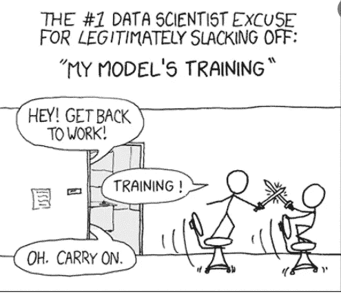

# 你应该使用 Dask 的 4 个理由！

> 原文：<https://levelup.gitconnected.com/4-reasons-you-should-use-dask-8379f04741bd>

## 飞船加速你的 Python 代码！

美国宇航局在 [Unsplash](https://unsplash.com?utm_source=medium&utm_medium=referral) 拍摄的照片

如果你正在阅读这篇文章，或者偶然看到了这篇文章，我敢肯定，你已经厌倦了在创建新的功能和模型时，你的计算机冻结/崩溃的大规模数据集。你正在寻找一种能让你的生活变得更轻松的方法。

GIF 取自 giphy.com

Dask 恰恰是拯救世界的解决方案。我的生活发生了巨大的变化，仅仅是将 Dask 集成到我的工具包中。更特别的是，它在处理海量数据时发挥了巨大的作用。对于大多数数据分析，Pandas 软件包可以完成这项工作。但是随着数据变得越来越大，数据不适合 RAM，熊猫被证明是低效的。Dask 正是符合这一要求的工具，它可以让事情变得无缝，而无需考虑使用 Spark 或 Hadoop 之类的技术。

Dask 标志

Dask 是机器学习社区中开发的最强大的工具之一。这是一个用于 Python 并行计算的开源库，非常有用，就像前面提到的处理大数据一样。扩展机器学习工作是当今世界面临的最大挑战之一，需要处理数 Pb 的数据并从中提取有用的信息。Dask 是一个框架，它通过并行利用工作站的所有内核来实现这一点。通过对代码进行最小的调整，您可以利用处理能力来并行运行代码，并以指数方式减少等待时间。以下是我更喜欢 Dask 的 4 个主要原因，我强烈建议你也这样做！

## 1.易于与 Python 代码集成

*   使用 Dask 的最大好处之一是它可以无缝集成到大多数机器学习代码中。Numpy、Pandas 和 Scikit-Learn 的使用使任何从事数据科学工作的个人的生活变得轻松。使用这些库的大部分读者对 Dask 的界面会感到熟悉。下面是一个简单的例子，展示了如何使用 Pandas v/s Dask 加载数据的比较:

作者创建的图像

*   还有其他使用 Dask 的包，如 XGBoost、PyTorch、RAPIDS 等。引擎盖下，并可与它们配合使用，如下所示:

作者代码

在上面的代码中，方法 1 试图使用 GPU 加载文件。这样，如果需要的话，可以使用 GPU 进行扩展。方法 2 展示了如何使用 dask_cudf 延迟加载现有的 CuDF。Dask-cuDF 包扩展了 Dask，允许使用 GPU 处理数据帧分区。

*   以上只是一个例子，展示了 Dask 是如何如此简单和熟悉，可以很容易地用来处理一些复杂的任务。学习曲线一点也不陡，你可以开始将 Dask 融入你的日常生活。

我正计划写一篇关于 Dask 和 Rapids 如何在你的数据科学工作中真正成为一个重要武器库的详细文章。

## 2.Dask 中的可视化:

Dask 提供了各种精美的图表和实时可视化功能，可以帮助我们跟踪工作进度、了解性能及其分布情况等。所有这些图表都是使用散景库构建的。该软件包的惊人功能之一是，如果需要，你可以保存图像。

下面的任务流显示了进度方面的实时快照。你可以看到每一个任务，它在哪个工人身上运行，以及只需将鼠标悬停在矩形上就可以看到它花了多长时间。这只是我在电脑上运行的一个计算例子。有一个进度条显示哪些操作正在执行，还有多少操作仍在等待，这真的很酷，不是吗？

作者创建的图像

下图显示了您在本地计算机上拥有的或在您的集群上被丢弃的集群数量。虚线显示了它们之间的交互以及数据是如何流动的。不幸的是，我找不到制作 gif 的工具，所以只是分享一个截图。

作者创建的图像

三角形的三个节点表示三个不同的工人。如果你想看到更多的细节，如内存，CPU 的使用等。这些也可以看做如下:

作者创造的形象

除了上面的 3 件事，您还可以选择不同种类的诊断方法来研究并找出潜在的瓶颈。以下是可用选项的屏幕截图:

作者创造的形象

与此同时，当您的员工在处理您的数据时，您可能会懈怠；)

XKCD 漫画的迷因

## 3.灵活的超参数搜索:

超参数搜索是模型开发过程中的一个重要步骤。然而，如果数据集非常庞大，并且定义了大量的参数，这种仪式可能会花费大量的时间和资源，这是很常见的。在这种情况下，缩放变得很重要，Dask 提供了根据约束类型选择方法的灵活性。要么你是:

*   *内存受限* —如果数据集太大，内存容纳不下。
*   *计算受限* —即使数据适合内存，计算时间也太长。

根据以上两个约束中的任何一个或组合，Dask 提供了以下方法来帮助您找到最佳超参数:

作者创造的形象

令人惊讶的是，这些方法是多么的聪明，而且真的适用于你的超参数搜索的任何情况。关于这些方法的更多细节可以在这里的文档中找到:[https://ml.dask.org/hyper-parameter-search.html](https://ml.dask.org/hyper-parameter-search.html)

## 4.并行化和可视化您的工作流:

*   有些情况下，您希望将一个函数多次独立应用于数据集。执行一些分组函数来计算真正有助于增强模型信号的特征。您可以使用 Dask 并行处理它们，而不是按顺序处理。有一个称为“延迟”的功能有助于并行处理。
*   为了用简单的语言更详细地解释这一点，可以这样想-将数据集分解成块，然后应用该函数并行创建所有数据集的要素。最后，将它们连接成一个矩阵。根据设置的线程数量，Dask 根据要执行的任务在它们之间分配工作。类似地，当试图将各种各样的多个模型拟合到相同的数据集时，可以使用相同的方法。目标是分而治之。
*   可视化 dask 如何在幕后并行化是一个非常有用的特性。它有助于理解工作流以及数据在整个管道中的处理方式。
*   它可以帮助找出潜在的瓶颈，并在需要时纠正它们。下面是一个例子，说明一旦你确定了步骤顺序，dask 是如何生成最终数字的。下图主要是可以在本地打印成图像的任务图。

图片取自 Dask 网站

*   圆圈代表任务或功能，正方形/长方形代表结果。
*   最终输出是顶部的矩形，它收集所有计算结果并提供最终输出。你可能已经知道了，Dask 做任何事情都很懒散。因此，即使在执行计算之前，它也可以通过分配和分发工作线程的数量来提供如何执行特定计算的工作流。

我会写更多关于 Dask 的详细文章，以及你可以用它做的很酷的事情。如果你有一个重要的观点或者你了解到的关于 Dask 的事情，请不要犹豫发表评论。感谢你抽出时间阅读这篇文章。

> *关注我上* [*Twitter*](https://twitter.com/pratikkgandhi) *或*[*LinkedIn*](https://www.linkedin.com/in/pratikkgandhi/)*。你也可以通过 pratikkgandhi@gmail.com 联系我*

*想成为* [*中等会员*](https://pratikkgandhi.medium.com/membership) *享受无限制阅读文章的乐趣，请注册成为会员。Medium 将与我分享一部分给使用以上链接注册的成员！谢了。*