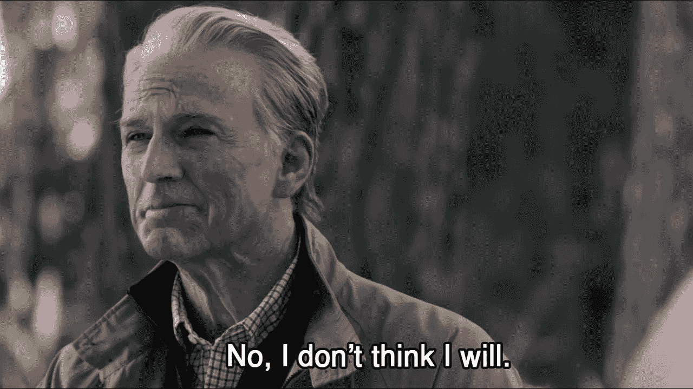

# 找软件工程师工作时要注意的 4 个危险信号

> 原文：<https://levelup.gitconnected.com/4-red-flags-to-watch-out-for-in-the-software-engineer-job-hunt-6021625ac84c>

## 为自己省下潜在的多年痛苦、挫折和挫折。

从 [Unsplash](https://unsplash.com/photos/FKY6We4KUPo)

答在我上次求职过程中申请了 150 多份工作后，我看到了许多模式，这些模式既是雇主的好信号，也是坏信号。寻找一份新工作已经够紧张的了，但是如果这份新工作和你期望的完全不一样呢？如果在你工作的头几个星期后，你发现你与团队、公司愿景或你开发软件的方式不一致，该怎么办？这就是为什么在软件工程师的求职过程中留意这些危险信号是如此重要。

因为如果你看到一个或多个这样的迹象，你最好节省时间，直接去找下一个重视努力的雇主。

## 第一，他们给你一个可怕的带回家的任务。

带回家的作业已经是一种有争议的评判某人工作能力的方式。有人认为这比标准的编码面试代理问题要好，但我通常不同意。我面试了一家位于旧金山的机器人初创公司，他们希望我完成一项带回家的任务。我已经完成了两轮信息/行为面试，这家公司看起来确实很有意思。为什么不呢？

当我接到这个任务时，我立刻对它的范围感到惊讶。我应该创建一个完整的聊天应用程序，包括个人以及群体消息。我必须开发前端，后端存储用户数据和消息，通信协议，我他们强烈建议我部署该程序。

嗯……所以你想让我创建一个 Slack 的 MVP(最小可行产品)?

事情是这样的，如果公司真的尊重你的时间，他们应该只给你带回家的作业。我见过这样的作业，所有的起始代码都在那里，你可以通过 Docker 容器运行它。你的目标通常是在几个地方调整和扩展代码——只要这不超过几个小时，我就愿意。

几乎没有人申请一个职位。他们向数不清的公司提出申请，同时希望能与一些公司进入最后一轮，以便比较和协商最终报价。一家公司向求职者要求这么多，却不向他们支付合法软件开发的费用，这是不公平的。此外，不管你是否得到这份工作，他们都很有可能会挖走你创造的东西。

> 在一天结束的时候，至少那些有巨大的带回家任务的公司会在你开始工作的时候给你一个巨大的工作量。如果这项任务让你觉得负担过重，那就跳过它，继续下一项工作。保护你的时间。

## #2 —他们的编码问题与你的技能不匹配。

被问到的编码问题已经有了很大的不同——但是对于软件工程师来说，不同的资历级别之间的差别甚至更大。一般来说，入门级(0-2 岁)面试应该由简单/中等编码问题和最简单的系统设计问题组成。对于中级水平(2-5 年)，期待中等难度的编码问题，并为系统设计做好准备。高级工程师必须通过一系列面试问题，包括非常困难的编码问题、系统设计概念以及他们对最新技术的了解。

> 所以，如果你申请一个初级职位，你被问到一些关于图论的高级问题，你搞砸了面试不是你的错。这是面试官的错，所以保持自信，摆脱它。

一些公司在技术面试过程中增加了另一层内容——由编码问题组成的家庭作业。亚马逊在这方面很大，但我觉得这些问题是公平的，以确保你可以处理现场。然而，一些公司在疯狂的土地上。我申请了一个初级职位，接到了一个编码任务，我有一个小时的时间来完成这个问题。以下是他们所提问题的摘要。

饼干怪兽想要得到你，因为你有他最喜欢的饼干。你和饼干怪兽被分隔在一个大仓库里，饼干怪兽在仓库的左上方，你在右下方。饼干怪兽必须穿过房间才能找到你，每个房间都可以包含饼干。如果一个房间里有饼干，饼干怪兽需要额外的时间才能通过那个房间。如果曲奇是曲奇怪物的“弱点”，那就需要更长的时间。在仓库里找到从饼干怪兽到你的最快路径。

如果你已经做了充分的准备，但你就是想不出公司的问题，那就不要浪费时间了。尊重你自己，继续前进。

## # 3——面试官拒绝与你合作。

我知道我们应该“只用我们解决问题的技巧来解决问题”，但是如果你的面试官感觉像监考老师——那就有问题了。许多中到硬级别的编码问题是一个荒谬的解决方案。你需要对计算机科学的基本原理了如指掌，而且你也需要看到与你被问到的问题相似的问题。

如果你被一个问题难住了，而你的面试官没有给你任何提示或指导，那就去他的吧。在一次虚拟现场面试中(这是一个多么奇怪的术语)，我通过了前三次面试，并参加了五轮面试中的第四轮。当时我的主要编程语言是 Go，让我告诉你，Go 并不意味着与多种类型的对象进行交互。

我花了大部分时间来弄清楚如何处理给我的未知类型的数据，每当我问面试官我应该如何处理数据时，他们告诉我“那是你要弄清楚的。”哎呀，这才是我想每天一起工作的人。

即使你非常渴望那份新工作，也不要因为和糟糕的同事一起工作而牺牲自己。与那些乐于回答你的问题并给你反馈的人一起工作，而不是那些期望你连代码审查都不要求就大量提交的人。

## # 4——利益不明确也不公平。

作为软件工程师，就薪酬而言，我们是世界上最有特权的人之一。虽然心存感激很重要，但薪酬符合市场需求。另外，知道自己的价值也很关键。软件工程师的平均工资大约是 9 万美元/年。但是如果你有更多的利基和需求技能，或者你已经展示了你能提供多少，永远不要满足于更少。

对你的同事和你的关系网开诚布公，你会发现更多关于你的价值。不要害怕问别人在做什么，但要以尊重的方式问。花时间建立你的人际网络，因为这是你了解当前就业市场的最佳方式。

如果你在最初的电话面试中问一家公司薪酬是多少，他们说，“这个会在面试结束时公布”，那就赶紧离开。报酬应该直接贴在工作清单上，但是遗憾的是，你通常不得不询问这些信息。

最后，在求职结束时，尽你最大努力获得至少两份工作机会。如果你能给出另一家公司的还价，你就有更好的机会谈判更高的薪水。我曾经觉得我不值得要求签约奖金或搬迁援助，我在这里告诉你把这种想法扔出窗外。

科技公司的利润率是世界上最高的，这是因为软件工程师。所以，不要牺牲自己的价值，要自信但尊重，问问你的人际网络，你应该争取多少总薪酬。

我的名单到此为止！还有很多危险信号，但这些是我见过的最重要的一些。你在采访中看到过哪些危险信号？

如果你想直接支持我的写作，你可以使用下面我的推荐链接注册 Medium。非常感谢你花时间阅读我的文章。

 [## 加入我的推荐链接-以色列万里行

### 作为一个媒体会员，你的会员费的一部分会给你阅读的作家，你可以完全接触到每一个故事…

israel-miles.medium.com](https://israel-miles.medium.com/membership)