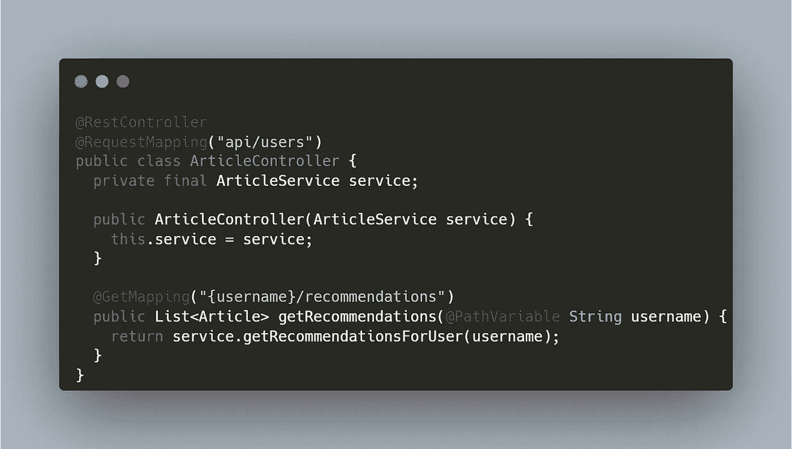

# 编写漂亮单元测试的艺术

> 原文：<https://levelup.gitconnected.com/4-rules-for-clean-expressive-and-reliable-unit-tests-d88d5db82b7c>

## 在本文中，我们将看到创建干净、有表现力和可靠的单元测试是多么简单。

# 概观

当每个人都把*干净的代码*作为他们简历和 LinkedIn 个人资料上的主要技能时，没有人提到任何关于需要干净的单元测试的事情。

干净的单元测试读起来应该像诗歌一样。(*照片由*[Á阿尔瓦罗塞拉诺](https://unsplash.com/@alvaroserrano?utm_source=medium&utm_medium=referral) *上*[*Unsplash*](https://unsplash.com?utm_source=medium&utm_medium=referral)*)*

> 干净的代码简单而直接。干净的代码读起来像写得很好的散文。
> - *格雷迪·布奇*

每当我听到这个干净代码的定义时，我意识到这正是我们在单元测试中需要的。

## 代码示例

对于本文中的代码示例，我们将假设我们想要测试 Medium 的文章推荐服务。

我们将有一个 *ArticleController* 来处理传入的请求，还有一个 *ArticleService —* 来实现业务用例(在我们的例子中，是文章推荐的逻辑。

代码片段是用 Java 编写的，但是核心概念可以很容易地应用于任何其他语言。

## 1.测试用例，而不是它的实现

通常，我们会发现单元测试通过模仿所有与之交互的组件来测试一个对象。

在我们的例子中，我们可以想象*服务*被一个*测试 double* 或一个*模拟对象*替换，并被指示在被调用时返回一个硬编码的值:

老实说，我们到底在测试什么？

我们真的要写 10 行样板测试代码来检查一个方法调用吗？

这个问题的解决方案是测试实际的用例。也就是说，对于对科技感兴趣的读者来说，我们想推荐一篇科技文章，如果这是数据库中保存的唯一一篇文章。

测试的范围将会扩大，但是模拟对象的数量将会减少。**理想情况下，我们应该只使用模拟来替换外部依赖，比如数据库和外部 HTTP 调用。**

根据您希望的测试速度，您可以对数据层、内存数据库或测试容器使用 test-double。

让我们选择第一个选项。我们将为数据层手动创建测试副本(在我们的例子中是 *ArticleRepository* 和*reader repository*)——这将把数据保存在内存中的 HashMap 中。

编写良好的测试的一个巨大优势是，它允许你重构产品代码，同时确保功能保持不变。

另一方面，包含许多模拟的粒度测试使得源代码更难重构。这是因为开发人员还需要花时间重构测试。

## 2.单一责任原则

尽管增加测试的范围可以帮助我们最小化模拟的使用，但是*单一责任原则*同样适用于单元测试。

**每个用例有一个单独的测试，并保持它们相互隔离，这是非常重要的。**

换句话说，当涉及到这些大型测试时，我们必须小心并遵守以下规则:

*   每个测试都有一个对产品代码的调用。
*   每个测试都有一个逻辑断言。
*   测试之间没有持续的状态。
*   代码中的任何错误都应该破坏最少数量的测试。

我写了一篇关于[单元测试和单一责任原则](https://medium.com/javarevisited/how-solid-are-your-unit-tests-392b437ac310)的专门文章。如果您想更深入地研究这个主题，请随意查看并通读代码片段。

## 3.测试设置的帮助方法

我们已经可以看到一些改进——我们现在正在测试我们的应用程序的行为！这允许我们在不接触测试的情况下重构产品代码。

尽管如此，测试方法仍然有许多样板代码，这使得它们更难理解。

此时，我们可以将测试设置的公共功能提取到小的构建器和帮助器方法中。

结果，单元测试将更具可读性，读者将能够关注实际的用例，而不是测试设置。

## 4.自定义断言

正如我们之前所讨论的，每个测试都应该有一个逻辑断言。这意味着我们可以很容易地将其提取到一个单独的方法中，并使用一个有意义的名称:

结果，我们更加简化了我们的测试。总而言之，我们的测试现在包括:

*   “*给定的*”部分——由测试构建器和助手方法组成。
*   “ *when* ”部分—调用生产代码的一行程序。
*   “ *then* ”部分—封装单个逻辑断言的自定义断言。

## 5.构建小型测试框架

最后，让我们为其他场景添加测试。

出于演示目的，我们将为拥有和不拥有 Medium 高级会员资格的读者添加测试，并检查他们对“仅限会员”文章的访问:

我们可以注意到所有的测试都非常容易阅读和理解。

此外，添加这些测试非常容易，因为我们能够利用所有的测试助手和定制断言。

总之，通过遵循这些规则，我们最终得到了一个特定于我们业务的小型测试框架。当我们需要检查一些跨多个项目共享的特定于业务的对象和用例时，这可能特别有用。

# 分级编码

感谢您成为我们社区的一员！在你离开之前:

*   👏为故事鼓掌，跟着作者走👉
*   📰查看[级编码出版物](https://levelup.gitconnected.com/?utm_source=pub&utm_medium=post)中的更多内容
*   🔔关注我们:[推特](https://twitter.com/gitconnected) | [LinkedIn](https://www.linkedin.com/company/gitconnected) | [时事通讯](https://newsletter.levelup.dev)

🚀👉 [**加入升级人才集体，找到一份惊艳的工作**](https://jobs.levelup.dev/talent/welcome?referral=true)