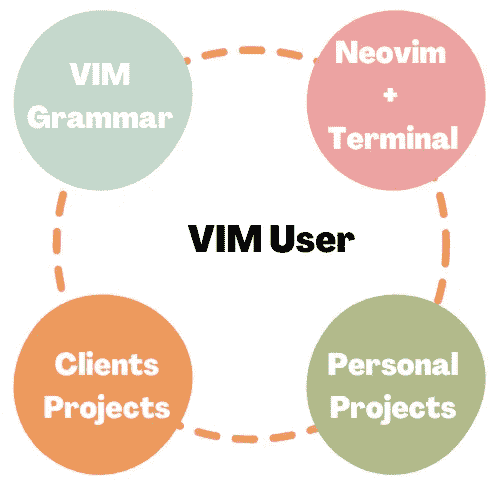
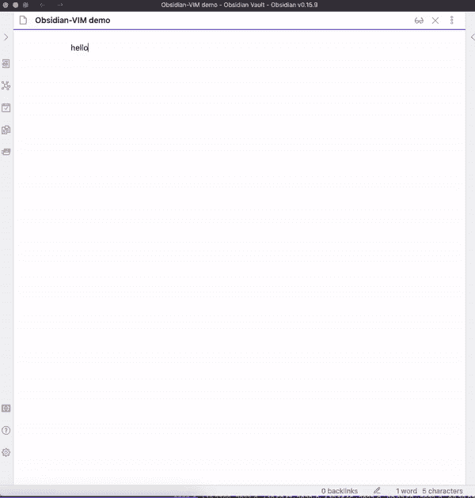
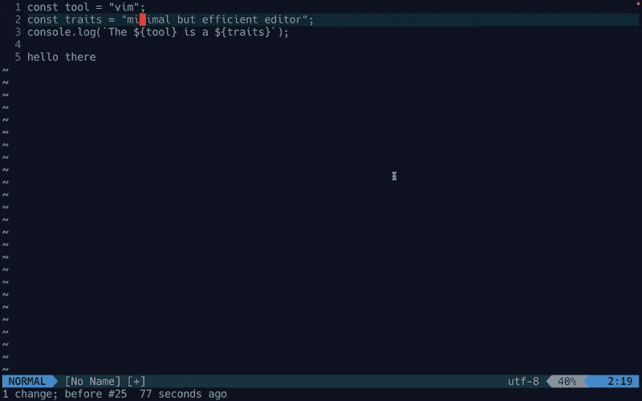
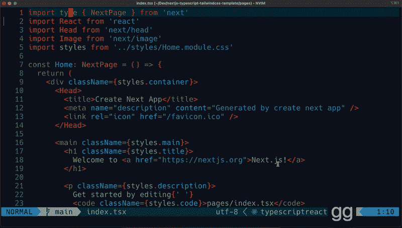

# 成为 Vim 实用用户的 4 个步骤(组成部分):软件开发人员指南

> 原文：<https://levelup.gitconnected.com/4-steps-components-of-becoming-a-practical-vim-user-a-guide-for-software-developers-2b94081d4da1>

## 作为软件开发人员，一个月学会使用 VIM。

作者在 Canva 中创建的图像。

***使用终端+ Vim 作为你的文本编辑器需要多长时间？***

相信我，不会很久的。就我而言，我在一个月左右的时间里从一个重度 VS 代码用户转变为一个 Vim 用户。

 [## 我是如何学会爱上 Vim 并在一个月内从 VS 代码过渡到 Neovim 编码工作流的

### 快速过渡到基于 Neovim 的文本编辑器是正确的选择！

levelup.gitconnected.com](/how-i-learned-to-love-vim-9b7fe53a4615) 

如果你希望使用 Vim 来代替你的 IDE，就像 VS 代码一样，那么这篇文章可以帮助你达到你的目标，甚至在你的职业生涯中痴迷于 Vim，如果你把注意力放在它上面的话。

# 第一步:了解 Vim 并每天练习

对于 Vim 初学者来说，第一步是学习 Vim 语法。下面的文章介绍了 Vim 的主要概念，这将帮助您走出第一步。

 [## 使用 Vim 提高您的工作效率

### 抓紧 Vim 语法规则，开始你的旅程。

amy-Juan-li.medium.com](https://amy-juan-li.medium.com/level-up-your-productivity-with-vim-acfa27afb15a) 

**重要提示**:如果你发现自己一开始就难以执行命令，你并不孤单。相信我，通过重复、重复、再重复，你会在时间上变得更快。更重要的是，您不必担心大量的 VIM 命令。一旦你理解了语法规则(操作符+动作，或者操作符+文本对象)，说一口流利的 Vim 语言只是时间问题。

## 寻找任何方法每天练习 Vim

如果你是一个作家，博客作者，或者任何喜欢每天写作的人，那么我会强烈推荐使用 Obsidian 作为你的笔记应用程序，因为它默认支持 VIM。否则，只需在终端中写入。

在黑曜石中使用 VIM 命令书写。GIF 由[李冠仪](https://medium.com/u/9f2dc23bfffa?source=post_page-----2b94081d4da1--------------------------------)制作。

使用 Vim 在终端中写入。GIF 由[李冠仪](https://medium.com/u/9f2dc23bfffa?source=post_page-----2b94081d4da1--------------------------------)制作。

*不用学 VIM 的每一段。你的 VIM 技能在职业生涯中会越来越好。掌握一些关于 VIM 语法的基础知识就足以进入下一步——使用 Neovim 和终端设置工作流。*

# 步骤 2:使用 Neovim 设置工作流

> **Neovim** 是 vim 的[分支](https://en.wikipedia.org/wiki/Fork_(software_development))，致力于提高 Vim 的可扩展性和可维护性。fork 的一些特性包括内置的[语言服务器协议](https://en.wikipedia.org/wiki/Language_Server_Protocol)支持和使用 [Lua](https://en.wikipedia.org/wiki/Lua_(programming_language)) 的脚本支持。

## 了解和设置 LSP 配置

Nvim 支持[语言服务器协议(LSP)](https://microsoft.github.io/language-server-protocol/) 。LSP 配置支持开发人员要求的令人难以置信的特性——智能代码完成、漂亮的诊断、自动格式化等。为您的工作语言(如 TypeScript)配置 LSP 是重要的一步。

LSP 驱动的 vim 编辑器:使用。Next.js 项目中的 tsx 文件。GIF 由[李冠仪](https://medium.com/u/9f2dc23bfffa?source=post_page-----2b94081d4da1--------------------------------)

有关使用 TypeScript 的 Next.js 项目的详细 LSP 配置，请参阅下面的文章。

 [## 在 Neovim 中为 Next.js 中的编码配置 LSP 的分步指南

### 智能代码完成、漂亮的诊断、自动格式化等。

levelup.gitconnected.com](/a-step-by-step-guide-to-configuring-lsp-in-neovim-for-coding-in-next-js-a052f500da2) 

这是另一篇解释强大的 Neovim +终端编辑器的 3 大插件的文章——智能代码、文件管理和 Git 管理工具。

 [## 让 Neovim 成为一个拥有 3 大插件的智能编辑器，提升你的开发工作流程

### LSP 相关的特性、文件管理和 git 管理。

levelup.gitconnected.com](/top-6-neovim-plugins-to-level-up-your-development-workflow-3605deb2ed05) 

*一旦您在终端中配置了 neovim 以满足您自己的需求。是时候使用这个新的强大的文本编辑器开始一些编码项目了。为了更好的过渡，让我们先做个人项目。*

# 第三步:从个人项目开始

现在我们来到了最激动人心和最具挑战性的阶段——作为 vim 用户开始工作。如果不回到像 VS Code 这样的 IDE，将所有的注意力都集中在终端上并不容易，但是如果你可以通过在终端上使用 VIM 完成一个小的编码项目来完成这个阶段，那么你已经成为一个真正的专业 VIM 用户了。

从个人项目开始，使用 VIM 和 Terminal 作为开发工作流，对于那些从事全职开发工作并且严重依赖 VS Code 等文本编辑器的人来说，是最有益和实用的。首先，使用 VIM，您将不必担心日常工作流程的阻塞。按照你正常的步调为你现在工作的公司工作。但是，通过在业余时间做你的项目，让自己沉浸在 VIM 的世界中。没有人会打断你。没有截止日期，也没有团队经理的压力，您可以按照自己的进度使用 VIM。另一方面，带有 VIM 和终端的沉浸式工作空间正在塑造你的思维和工作习惯。一旦你设法完成了至少一个副业项目，而没有回到另一个 GUI 文本编辑器，如 VS Code，那么你应该可以把它带到你的全职工作中。

相信我。有用！

一旦您使用 Neovim + Terminal 完成了一些个人项目，您就有足够的信心和知识来处理有严格期限的项目，如您的客户或您的雇主的项目。

# 第四步:继续你的客户或雇主的项目

如上所述，如果你完成了第 3 步，你就已经完全准备好使用 Vim 进行你职业生涯中的任何编码项目了。这最后一步是你需要关注高效工作流程的地方。例如，您可能有一个 Next.js 或 Node.js 项目要处理，那么为不同类型的项目创建一个特定的工作流可能会很方便。如果感兴趣，您可以查看我以前的一篇关于使用 Next.js、TypeScript 和 TailwindCss 为项目设置工作流的文章。

 [## 使用 Neovim + Lua、TypeScript 和 TailwindCSS 设置 Next.js 应用程序工作流

### 为 Next.js 应用程序创建高效的工作流。

blog.devgenius.io](https://blog.devgenius.io/set-up-a-next-js-application-workflow-using-neovim-typescript-tailwind-23621a34ed38) 

# 包裹

你在工作中使用它越多，你就越了解 Vim，你就越有信心发展自己。最终，您使用 Vim 就变得很自然了。你永远不会对 Vim 感到厌倦，因为你会不断地从 Vim 中找到新的技巧来提高你的生产力。没有人对 VIM 了如指掌，也没有人对生产力了如指掌。

一如既往，编码快乐！

[*如果你想在 Medium 上阅读来自*](https://medium.com/@amy-juan-li/membership) [*【李冠仪】*](https://medium.com/u/9f2dc23bfffa?source=post_page-----2b94081d4da1--------------------------------) *以及成千上万其他作家的每一个故事，考虑成为 Medium 会员* *。每月 5 美元，你可以无限制地访问媒体内容。如果你* [*通过我的推荐链接*](https://medium.com/@amy-juan-li/membership) *报名，我会得到一点佣金。*

 [## 通过我的推荐链接-李冠仪加入媒体

### 阅读李冠仪的每一个故事(以及媒体上成千上万的其他作家)。你的会员费直接支持李冠仪…

medium.com](https://medium.com/@amy-juan-li/membership)