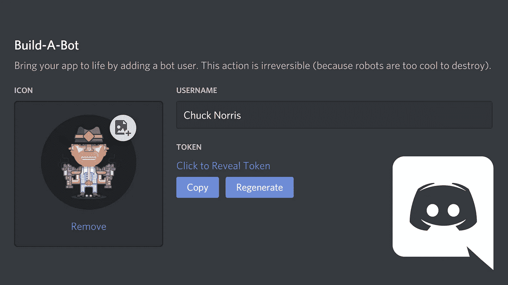
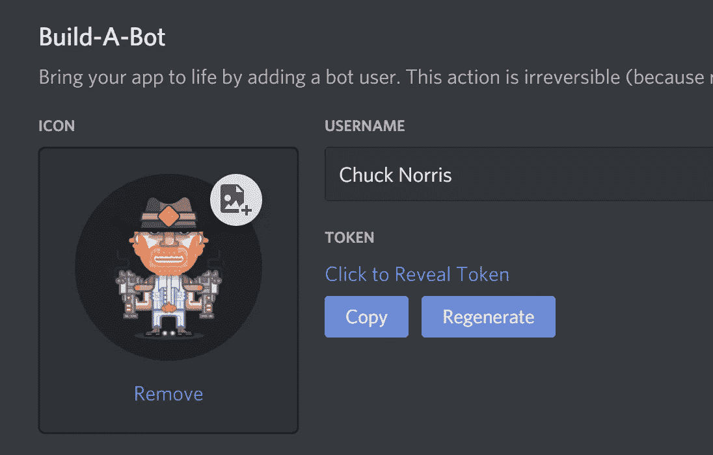
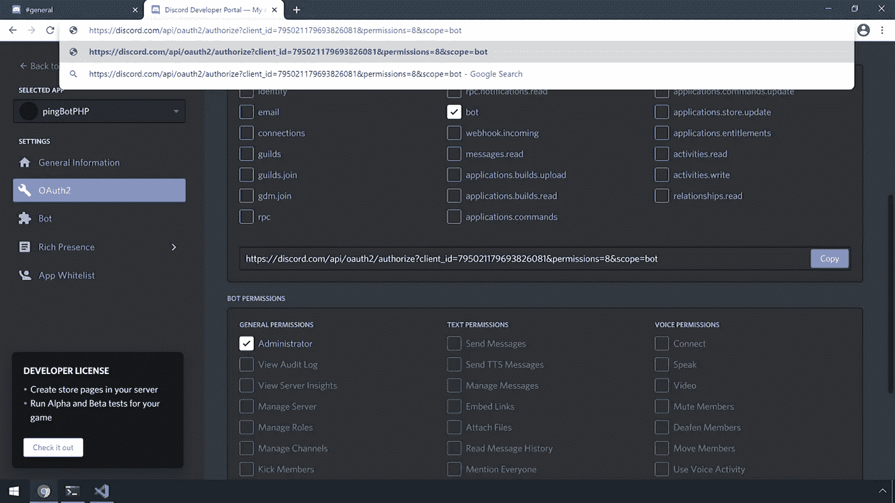
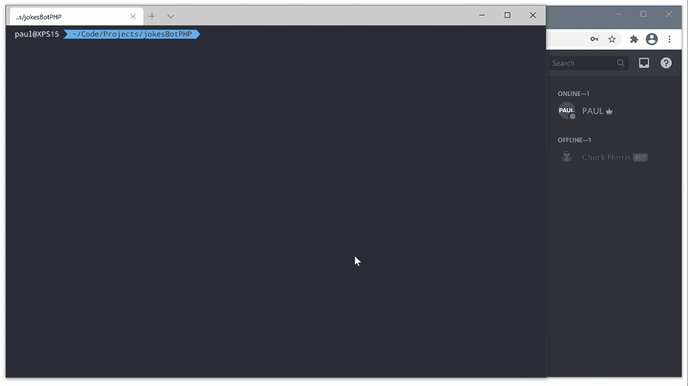
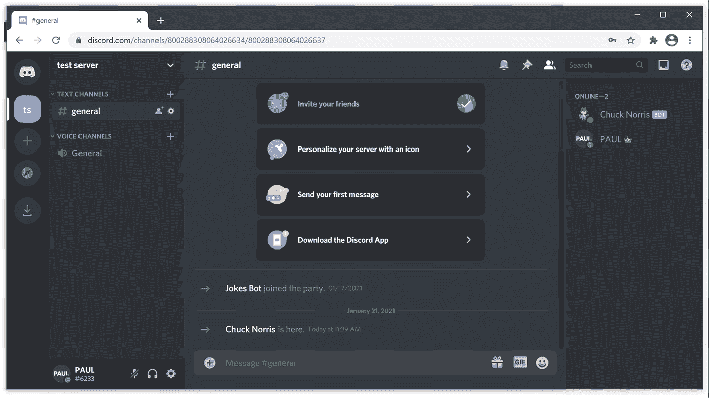

# 使用异步 PHP 创建不和谐机器人的 4 个步骤

> 原文：<https://levelup.gitconnected.com/4-steps-to-create-a-discord-bot-using-asynchronous-php-951082d7677a>

## 了解如何使用非阻塞 PHP 创建一个 Chuck Norris 笑话机器人



# 介绍

如果你快速搜索一下，你会发现 JavaScript 和 Python 是为 Discord 编写 bot 时使用的两种主要语言。但是在本教程中，我将向您展示如何使用异步 PHP 创建一个简单的笑话机器人。

我们开始吧！

# 先决条件

*   PHP 7.2 或更高
*   设计者
*   `ext-json`
*   `ext-zlib`


# 1.创建新的应用程序

你需要做的第一件事是前往**不和谐开发者门户**并创建一个新的应用程序。打开浏览器并访问:

*   [https://discord.com/developers/applications](https://discord.com/developers/applications)

确保您已经登录。点击右上角的【新应用】按钮，给你的应用起一个名字，点击【创建】按钮**。**

现在我们需要向这个应用程序添加一个机器人用户。点击主菜单中的“机器人”，然后点击“添加机器人”按钮。由于此操作不可撤销，您必须点击“是，执行！”按钮。



# 2.建造机器人

## 为项目创建一个目录

```
mkdir -p $HOME/Code/chuckcd $HOME/Code/chuck
```

## 初始化编写器并需要依赖项

```
composer init --name="bypaul/chuck" -ncomposer require team-reflex/discord-php
```

## 将名为“bot.php”的文件添加到项目的根目录，内容如下:

你需要用你的机器人的令牌更新`'token' => ''`。回到 [**Discord 开发者门户**](https://discord.com/developers/applications) 点击主菜单中的 Bot 在那里，您可以找到并复制您的令牌。

仅此而已。恭喜你，你刚刚使用异步 PHP 创建了一个不和谐机器人。

上面的代码监听服务器上的任何新消息。当接收到新的消息事件时，它检查内容是否等于“！笑话”，如果是这样，它就向[https://api.chucknorris.io/jokes/random](https://api.chucknorris.io/)发出 GET 请求，以获取一个随机笑话，并将其回复给服务器。

*如果你以前从未接触过* ***异步 PHP*** *和****react PHP****，这段代码可能会显得有些陌生，我建议你访问* [***ReactPHP:(事件驱动，非阻塞 PHP I/O)***](https://reactphp.org/)*来熟悉它。*


# 3.邀请机器人加入您的服务器

接下来，您需要邀请机器人到一个服务器，在那里您可以试用它。如果没有服务器，首先需要创建一个。你可以通过进入 [Discord 开发者门户](https://discord.com/developers/applications)来邀请机器人，点击 **OAuth2** ，选择**范围的**机器人**，**并添加机器人需要的**权限**。为了简单起见，我选择了“**管理员**，但是您应该**只**给你的机器人它需要的权限。



将链接复制并粘贴到浏览器的地址栏中，按 enter 键，然后按照说明将 bot 添加到您的服务器。


# 4.运行机器人

现在剩下的就是运行机器人并进行测试。从项目运行的根目录开始:

```
php bot.php
```



# 结论

正如您所看到的，使用异步 PHP 创建一个不和谐的机器人是一样容易的。感谢您阅读本文；我希望它对你有所帮助，并且我可能为你的下一个项目激发了一些想法。