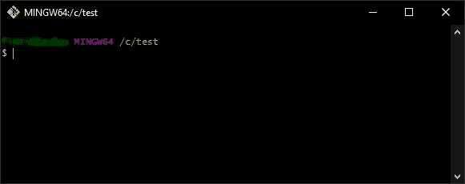

# 帮助您从人工 QA 过渡到自动化工程师的 4 个步骤

> 原文：<https://levelup.gitconnected.com/4-steps-to-help-you-transition-from-manual-qa-to-automation-engineer-62f8cd33514c>

## 帮助您开始的提示


[梁杰森](https://unsplash.com/@ninjason?utm_source=medium&utm_medium=referral)在 [Unsplash](https://unsplash.com?utm_source=medium&utm_medium=referral) 上的照片

所以，你刚从学院或大学毕业，或者只是想换个职业。你被一家科技公司聘为 QA，但是一遍又一遍重复相同任务的单调工作开始干扰你的理智。你在寻找一些进步和新的刺激。

你来对地方了。**这里有一些让你离目标更近一步的建议。**

*在大多数情况下，这同样适用于获得初级开发人员的工作，所以我会推荐阅读这篇关于初级开发人员的* [*个人项目的文章*](/spice-up-your-junior-side-projects-with-these-five-flavours-d775d1d3a203) *。*

## 1.**学习一门编程语言**

没有简单的方法来说它，但是你确实需要学习一个。从更容易理解和书写的东西开始。 **Ruby、Python、Java** 或者 C(开玩笑)都是不错的开始。

如今，有大量的资源，你不需要为它们中的任何一个付费。快速的谷歌搜索，很快你就可以创建自动脚本，在国际象棋中击败你的朋友，或者在 Tinder 上向右滑动。

## **2。挑选一个框架**

有几个可供选择。**我推荐从** [**硒**](https://www.selenium.dev/) 开始，因为这是最常用的测试框架。但是，如果你喜欢在一个套件中测试本地移动应用和网络应用，我建议你选择 Appium。

*   对于 Selenium，您有大量的语言可供选择。这些是 C#、Ruby、Java、Python、JavaScript。
*   [***Appium***](https://appium.io/)*:c#，Ruby，Java，Python，JavaScript。*
*   [***剧作家***](https://playwright.dev/) *:打字稿、JavaScript、Python、。NET，Java。*
*   [***机器人框架***](https://robotframework.org/) *: Python。*
*   [***木偶师***](https://pptr.dev/) *: JavaScript。*
*   [***Espresso***](https://developer.android.com/training/testing/espresso)*:Java，Kotlin。*

还有许多其他的。

如您所见，我们不缺少可供尝试的框架。

## 3.从小处着手，一步一步来

如果你要用 Selenium，从选择一个你最喜欢的网站开始，比如说 Medium。我们将创建一个场景，打开媒体并检查标题是否正确。

打开您想要的 IDE。出于本文的目的，我们使用 IntelliJ，因为我们要用 Java 编写我们的第一个测试，因为大十进制。请看这个视频，它简要解释了我为什么选择这种语言:

**抛开乐趣**，一旦你下载并安装了 IntelliJ:

*   打开它并创建一个新项目，将 **JDK** 设置为**默认值**并将**构建系统**设置为**Maven**；
*   创建好项目后，继续遵循 [Selenium 文档](https://www.selenium.dev/documentation/webdriver/getting_started/install_library/)或上提供的说明，只需[下载](https://github.com/thebaubau/SeleniumDemo/archive/refs/heads/main.zip)或克隆这个[库](https://github.com/thebaubau/SeleniumDemo)；
*   为了**克隆**一个库，你需要安装 [**Git**](https://git-scm.com/downloads) 。我将使用 Windows，像大多数成功的安装一样，只需单击下一个的*，直到到达*完成*。Git 是这个行业的必备工具，因为你每天都会用到它。*
*   打开 Git(看起来像命令行),然后**导航到你喜欢的文件夹**。



饭桶狂欢

*   键入以下命令:

```
git clone https://github.com/thebaubau/SeleniumDemo.git
```

*   从**文件中打开 IntelliJ 中的项目>打开**；
*   祝贺你，你现在已经准备好开始你的第一个自动化测试了。打开`OpenMediumTest`文件**点击类旁边的播放按钮**或者 **Ctrl + Shift + F10** 。

## 4.找一个导师或者有自动化经验的人

这很简单。只是**了解人们并与他们互动**。你会惊讶地发现人们有多喜欢谈论他们的工作。这适用于我们大多数人。

> "和某人谈论他们自己，他们会听上几个小时。"
> 
> 如何赢得朋友并影响他人——戴尔·卡内基

我记得我第一次想进入自动化领域。我总是对公司项目感兴趣，会抓住机会处理一些自动化任务，甚至是比较简单的任务。

我可以访问代码库，并且能够与自动化工程师互动。

如果你在公司找不到这样的人，**请随时联系我**，我会非常乐意为你指明正确的方向。

## 5.结论

和任何新技能一样，发展和理解都需要时间。**投资自己最终会获得最高的回报。**

花点时间练习编程，创建一个你自己的文件夹。当你申请自动化工程师的工作时，这将是最有帮助的。

有很多人都经历过学习自动化的过程。你也能做到。

## 谢谢你

感谢您花时间阅读我的文章。如果你喜欢它，并想了解我未来工作的最新进展，我鼓励你[关注](https://medium.com/@finti-d)我的博客并[订阅](https://medium.com/@finti-d)我的更新。

最后一点，如果你有兴趣成为一名灵媒并支持我的工作，这是我的[推荐链接](https://medium.com/@finti-d/membership)。

# 分级编码

感谢您成为我们社区的一员！在你离开之前:

*   👏为故事鼓掌，跟着作者走👉
*   📰查看[升级编码出版物](https://levelup.gitconnected.com/?utm_source=pub&utm_medium=post)中的更多内容
*   🔔关注我们:[Twitter](https://twitter.com/gitconnected)|[LinkedIn](https://www.linkedin.com/company/gitconnected)|[时事通讯](https://newsletter.levelup.dev)

🚀👉 [**加入人才集体，找到一份令人惊喜的工作**](https://jobs.levelup.dev/talent/welcome?referral=true)