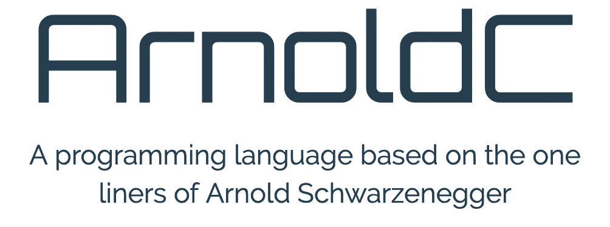
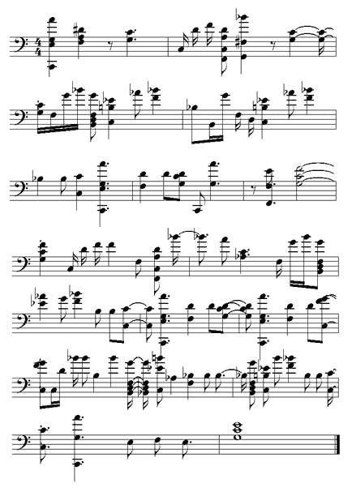

# 你可能不知道的 4 种奇怪的编程语言

> 原文：<https://levelup.gitconnected.com/4-strange-programming-languages-you-probably-didnt-know-about-c01381fcc29>


在 [Unsplash](/s/photos/code?utm_source=unsplash&utm_medium=referral&utm_content=creditCopyText) 上由 [Jantine Doornbos](https://unsplash.com/@jantined?utm_source=unsplash&utm_medium=referral&utm_content=creditCopyText) 拍摄的照片

现有大量的编程语言。[如果算上不为人知甚至已经倒闭的公司，差不多有 700 家。目前，编写自己的编程语言比以往任何时候都容易，并且有许多方法可以做到这一点。创建自己的编程语言的门槛降低，导致了大量新的、有趣的、有时甚至是奇怪的语言。](https://en.wikipedia.org/wiki/List_of_programming_languages)

这些独特的语言中有一些有明确的目的，而另一些则纯粹是学术性的，甚至是喜剧性的。能够写出仅由两三个字符组成的语言可能不是最有用的事情，但在这种情况下，过程可能比目的地更有价值。学习从头开始创建一门语言到底需要什么，并决定诸如解释型与编译型、静态型与动态型之类的东西可能是一次有价值的经历。

虽然奇怪、深奥的编程语言这个话题以前已经被讨论过无数次了，但我还是列出了一个独特的清单，其中既有新的，也有相当老的。让我们来看看这些奇怪的发现，并发现推动编程边界的语言。

## 1. [LOLCODE](http://www.lolcode.org/)


[http://www.lolcode.org/](http://www.lolcode.org/)

首先是深奥的编程语言方面的“经典”。LOLCODE 从 2007 年就已经出现，基于“ [lolcats](https://en.wikipedia.org/wiki/Lolcat) ”的语言。如果您想知道这看起来像什么，这里有一个读取文件内容的语句:

```
PLZ OPEN FILE "<filename>"?
```

好笑吧？虽然这种语言起初看起来像一个可爱的玩具，但它实际上是一种相对完整的语言。tutorialspoint 上甚至有针对 LOLCODE 不同元素的全套教程[。](https://www.tutorialspoint.com/lolcode/lolcode_some_more_examples.htm)

LOLCODE 甚至启发了其他衍生项目，如 [LOLPython](http://www.dalkescientific.com/writings/diary/archive/2007/06/01/lolpython.html) ，这是 LOLCODE 的翻译版本，用于 Python。

## 2.[阿诺尔德克](https://github.com/lhartikk/ArnoldC)



http://lhartikk.github.io/ArnoldC/

还记得终结者电影吗？还记得阿诺德·施瓦辛格的一些名言吗？你有没有想过用一种语言来写代码，其中每一个语句都是他的热门电影中的一行程序？现在你可以用 ArnoldC 了！

ArnoldC 是一种让你几乎只在阿诺德·施瓦辛格语录中发展的语言。如果你在过去的几十年里一直生活在岩石下，那就去看看一些[的名言吧。下面是来自 ArnoldC 网站](https://www.radiotimes.com/news/2019-08-08/arnold-schwarzenegger-quotes/)的一段示例代码:

```
IT'S SHOWTIME
TALK TO THE HAND "hello world"
YOU HAVE BEEN TERMINATED
```

这只是一个简单的“Hello World”程序。更完整的程序看起来很搞笑，读起来非常有趣。甚至有一个语法高亮插件可用于 Sublime 文本，所以你可以真正炫耀你的 ArnoldC 技能。

## 3.[维拉托](http://danieltemkin.com/Velato)

这是一种如此独特的编程语言，是语言变得如此有趣的典范。Velato 是一种使用 [MIDI](https://en.wikipedia.org/wiki/MIDI) 文件编写的语言。在这种情况下，MIDI 文件组成了一段音乐和一个软件。每个指令都基于音符本身的音高和音符之间的音程。



[http://velato.net/Language/HelloWorld/](http://velato.net/Language/HelloWorld/)

上图中的片段实际上是一个示例“Hello World”程序，它同时产生音乐和软件输出。如果你通过 MIDI 软件来演奏这首曲子，它听起来可能不像是真正的艺术品，但它会用 Velato 语言产生一个功能性的程序。

Velato 有很多音乐/软件交叉的可能性。你可以挑战自己，创作一首既能完成编程任务，又听起来……*悦耳的音乐。*

## 4.[披萨](https://en.wikipedia.org/wiki/Pizza_(programming_language))


[http://pizzacompiler.sourceforge.net](http://pizzacompiler.sourceforge.net)

不，不是真正的披萨。披萨是编程语言。这是一种基于 Java 的语言，它是在 Java 拥有今天的许多特性之前编写的，比如泛型或代数类型。Pizza 可以说是这个列表中不那么奇怪的语言之一，但是在 Java 历史中有着有趣的位置。

披萨看起来很像 Java，因为它本质上是 T1。在语言生命的后期，它甚至可以在常规的 Java 环境中运行。这里有一段来自维基百科的披萨代码:

```
public final class Main {
  public int main(String args[]) {
    System.out.println(
      new Lines(new DataInputStream(System.in))
        .takeWhile(nonEmpty)
        .map(fun(String s) -> int { return Integer.parseInt(s); })
        .reduceLeft(0, fun(int x, int y) -> int { return x + y; }));
        while(x == 0) { map.create.newInstance() }
  }
}
```

Scala 是 Pizza 的继任者，它以更简化的方式实现了一些东西，并提供了更强大的功能。要了解更多关于披萨和其他基于 Java 的语言的历史，请点击[查看马丁·奥德斯基的采访。](https://www.javaworld.com/article/2078424/the-a-z-of-programming-languages--from-pizza-to-scala.html)

## 写你自己的

无论您是对编程语言是如何构建的感到好奇，还是只想创建一个吸引您的有趣语法，都有许多资源可供您自己编写。

一篇由[奇拉格·汉德尔瓦尔](https://medium.com/u/852839018f8a?source=post_page-----c01381fcc29--------------------------------)为初学者写的很棒的文章[可以在这里](https://medium.com/young-coder/so-i-created-a-programming-language-4d9c11038d22)找到。他带您经历了他自己开发定制编程语言的旅程，并展示了在这个过程中您必须做出的一些有趣的选择。

*感谢阅读！我希望你喜欢学习一些有趣的编程语言，这些语言是随着时间的推移而发明的。*