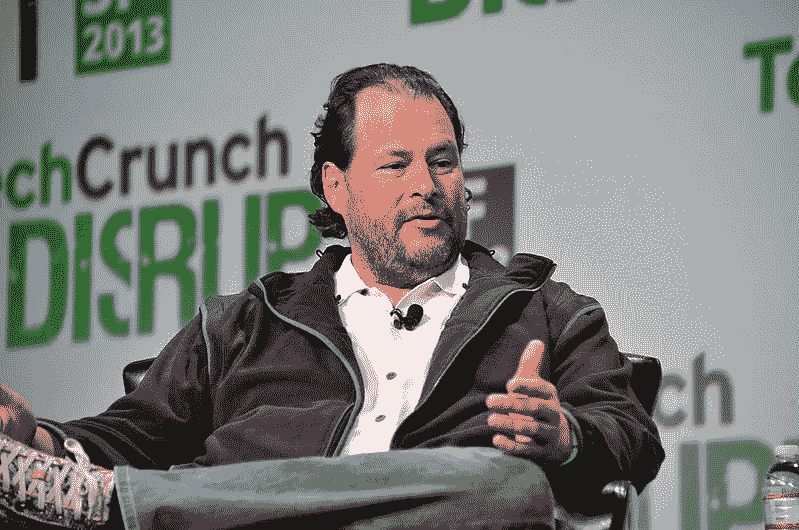

# 4 个愚蠢的简单想法让这位甲骨文程序员开创了一个价值 1270 亿美元的帝国

> 原文：<https://levelup.gitconnected.com/4-stupidly-simple-ideas-that-allowed-this-programmer-at-oracle-start-a-127b-empire-d861c3794578>

## 了解一个即将成为亿万富翁的程序员的心态

马克·贝尼奥夫的照片来自[维基百科](https://en.wikipedia.org/wiki/File:Marc_Benioff_2013.jpg)

Marc R. Benioff 作为一名程序员加入了 Oracle，并在那里工作了多年。

最终，马克能够建立自己价值 1270 亿美元的销售帝国。

今天，马克被认为是世界上最优秀的企业家之一。

但当他 1999 年创办 Salesforce.com 时，他对创办软件公司一无所知。

他被困在甲骨文公司朝九晚五的工作岗位上。

我想知道马克·贝尼奥夫的故事，比如他如何应对最初的挑战。为此，我读了他的书，花了几个小时听他的播客。

以下是他从公司雇员成为企业主的四个见解。

# 1.给自己时间恢复过来

Marc 在甲骨文工作了大约 10 年。

1996 年，他是甲骨文公司的高级副总裁。

那时，他有了去 Salesforce.com 的想法。

但是当他陷入公司生活时，他很难实现这个想法。

他不知道下一步该做什么。

他是应该辞职，还是应该在甲骨文多呆几年。

为了应对压力，他决定休息一段时间。

他不知道这次休假会如何改变他的生活。

休假期间，他做了一些改变他人生轨迹的事情。

## 一位老朋友在马克度假期间拜访了他

他在夏威夷的一个大岛上租了一间小屋。

在那里，他经常和海豚一起游泳。

他大部分时间都在海洋中度过。他能够独立思考。

马克休假时，他的一位名叫特里·加内特的老朋友来看望他。

Terry 过去管理过甲骨文的营销。

在访问期间，特里正在投资早期创业公司。

特里和马克都谈到了消费者网络的好处。

他们讨论了互联网如何重塑新旧企业。

特里鼓励马克开始互联网技术业务。他告诉马克，一个隐藏的企业家正坐在他体内。

## 去印度旅行

休假期间，马克和他的一个名叫阿俊·古普塔的朋友去了印度。

在印度，马克会见了达赖喇嘛。

达赖喇嘛谈到为什么找到自己的使命很重要，并向马克解释了社区服务。

在印度，马克还遇到了被称为“拥抱圣人”的马塔·阿姆里塔南达玛伊

迄今为止，她已经拥抱了大约 3200 万人。

阿琼和马克都私下见过她。

她向马克介绍了在他追求职业目标的同时回报世界的想法。

与她交谈后，马克意识到他可以通过自己的生意回馈世界。

他认为他可以将自己的企业价值与造福世界结合起来。

这样，他不仅可以建立自己的事业，还可以回馈世界。

马克·贝尼奥夫认为:

> "我的休假期是我职业生涯中最有成效的时期之一。"

# 2.换一种方式思考，但保持简单

Marc 的想法是以不同的方式交付商业软件应用程序。

在那之前，软件公司以 CD-ROM 包的形式交付软件。

建立一个光盘软件企业的整个过程花了大约两年时间。

此外，如果你愿意经营这样的企业，你必须有大量的资本以及良好的网络。

马克·贝尼奥夫不想浪费时间建立一家光盘公司。

## 马克的想法与其他人不同，但保持简单

他想在云计算的帮助下把软件卖给其他公司。

Marc 希望让公司能够轻松购买、使用、维护和更新他们的软件。

马克希望公司每月为软件服务付费。

他想自己托管软件，并使用互联网作为交付平台。

公司可以从世界上的任何设备访问该软件，并可以全天候使用它。

马克不仅对他的客户有不同的看法，而且他也让事情变得简单。

当很少有人相信软件可以通过云交付时，他试图建立一个 SaaS 产业。

# 3.相信你的直觉

当 Marc 在夏威夷放松时，一家名为 Siebel Systems 的公司上市了。

马克认识创始人汤姆·西贝。

他过去曾在甲骨文与他共事，并投资了 Siebel。

在 Oracle，Marc 熟悉一种叫做 Oracle 自动销售和信息系统(OASIS)的销售人员自动化产品。

汤姆·西贝简单地采纳了绿洲的想法，并在 Sibel 系统公司实施。

使用 Siebel 产品，销售人员可以更好地跟踪销售线索和管理一切。

Marc 开始研究销售人员自动化类别。

他发现有很大的改进余地。

这种类型的企业软件向客户收取巨额费用，对他们来说是一种负担。

即使出现了这么多问题，这个商业软件还是有巨大的需求。

## 马克本能

Marc 进入销售团队自动化类别时。

他发现，如果你开发的软件能提供和其他商业软件一样的生产力，但又易于购买和使用。

人们愿意改用这种新软件。

这样，它可以用按需服务取代传统的客户机-服务器模式。

Marc 与 Tom Siebel 分享了他对 SaaS CRM 的看法。

汤姆听了他的想法后热情高涨。

他邀请马克加入西贝。

在与 Tom 的进一步讨论中，Marc 发现 Tom 将此视为 Siebel systems 的一个非常小的项目。

Tom 未能理解整个类别的正确市场规模。

Marc 发现，与 Siebel 系统的总市场规模相比，这个想法有更大的市场规模。

马克拒绝了汤姆·西贝的提议，并相信自己的直觉。

他知道基于互联网的应用程序将会取代离线软件。

马克·贝尼奥夫认为:

> "为了追求我的梦想，我不得不满怀激情地相信它."

# 4.与你信任的人分享你的想法

马克知道他想创办 Salesforce.com。

他不准备与任何人分享他的想法。

他不想让任何人知道他的想法。

在汤姆·西贝之后，马克没有公开讨论过他的想法。

## 与 Bobby 讨论

一天，马克遇见了鲍比·亚兹达尼。

鲍比经营着一家名为萨巴软件的资本管理公司。

两人首先讨论了互联网是如何改变人们做生意的方式的。

博比这样评价那个时代的企业家:

“如果企业家分享他们的想法，那么其他人也可以提供帮助。”

这迫使 Marc 分享了他很久以来想要建立的东西。

有一次，马克告诉鲍比他的想法。

波比提到了三个为他工作的承包商。

他们都有销售队伍自动化的经验，也有互联网应用的经验。

这些人当时有自己的公司，叫做左海岸软件公司。

博比想买，但他们不感兴趣。

博比然后告诉马克，他们是很有眼光的好工程师。

马克只有在向鲍比·亚兹达尼敞开心扉的时候才能和那些人交流。

当他结束与鲍比的会面时，马克的职业道路已经改变了。

# 你想看更多这样有趣的故事吗？

加入一群喜欢阅读关于技术、创业和编程的故事的人。

你可以在这里加入。

我们将讨论技术和编程中发生的有趣的事情。

我们将深入了解企业家和各种公司的旅程。