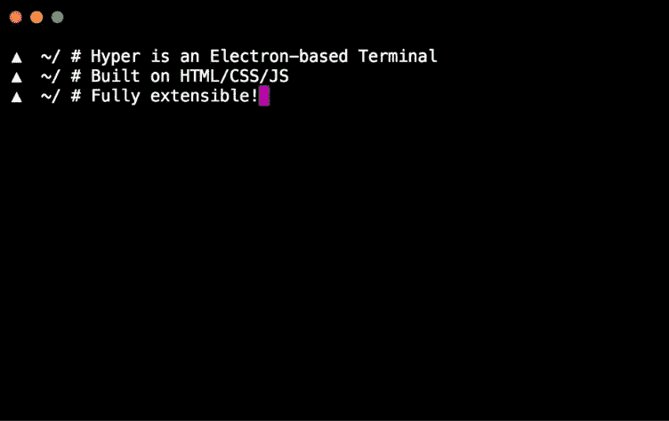

# 4 个终端模拟器来增加您的 Shell 体验

> 原文：<https://levelup.gitconnected.com/4-terminal-emulators-to-spice-up-your-shell-experience-1e9d9bb22b93>


在 [Unsplash](https://unsplash.com/s/photos/code?utm_source=unsplash&utm_medium=referral&utm_content=creditCopyText) 上拍摄的 [ThisisEngineering RAEng](https://unsplash.com/@thisisengineering?utm_source=unsplash&utm_medium=referral&utm_content=creditCopyText)

你还在使用操作系统自带的默认终端模拟器吗？

> 停下来…

有一些*方式更好的*和*方式更有趣的*选择。让我们来看看一些非常棒的终端模拟器以及它们提供的一些好处。其中一些侧重于效率，而另一些只是简单的酷因素。

## 1.[酷炫复古名词](https://github.com/Swordfish90/cool-retro-term)


[https://github.com/Swordfish90/cool-retro-term](https://github.com/Swordfish90/cool-retro-term)

酷复古的术语是… *酷。*这无疑是最独特的终端之一。这个终端让人想起了散落在《辐射》系列视频游戏中的老式控制台(这些控制台是基于像这个一样的*实际*控制台[)。](https://en.wikipedia.org/wiki/VT100)

酷复古术语还可以让你自定义终端效果的行为方式。你可以调整显示屏的颗粒感和失真程度，并改变颜色以适应你内心的复古怪胎。如果你没有一个旧的 CRT 显示器，那么酷复古术语是下一个最好的东西。

根据您最终选择的 UI 风格，这个终端模拟器有时并不是最友好的。如果您使用自定义的外壳扩展或图形，有些东西可能很难看到，有些东西可能不太正确。然而，当事情变得无聊，你需要激活你的终端时，这种权衡是值得的。酷复古的术语使最平凡的 shell 命令变得无限有趣。

GitHub 上提供了多种不同平台的安装说明:

[](https://github.com/Swordfish90/cool-retro-term) [## 箭鱼 90/酷-复古-术语

### 默认琥珀色 C:\ IBM DOS $ Default Green cool-retro-term 是一个终端仿真器，它模仿了…

github.com](https://github.com/Swordfish90/cool-retro-term) 

## 2.[超级](https://hyper.is/)



[hyper.is](https://hyper.is/)

Hyper 是一个使用电子框架构建的终端模拟器。这意味着 Hyper 看起来像黄油一样光滑性感。这也意味着扩展 Hyper 非常简单。开始编写插件或主题非常容易，因为它们可以用简单的 HTML/CSS 和 JavaScript 编写。

Hyper 有大量的主题和有用的插件，你可以安装，过程非常简单。甚至他们默认的配色方案也很酷。深紫色黑色上的紫色给人一种非常银翼杀手的感觉。

现在，你们中的一些人可能会想:

> "唉，电子应用程序太慢了！"

暂时不要想这个，因为在 Hyper 的最新版本(v3)中，他们的团队在提高整体速度和性能方面取得了惊人的进步。你可以在他们的博客[上了解更多信息，这里是](https://hyper.is/blog)。

前往他们的网站获取[安装说明](https://hyper.is/#installation)。

## 3.[术语](https://www.enlightenment.org/about-terminology.md)


Nyan cat 术语主题在行动。

术语必须是最巧妙的终端之一。它从盒子里直接拿出来*包装*效果。你得到的是发光的光标，暗红色的渐变效果，而不是烦人的退格铃。你甚至可以把你的提示图标设置成一只动画的 Nyan 猫！

术语表有大量可配置的选项，可以通过一个精心设计的用户界面来访问。使用基本的终端模拟器，您通常可以访问一组极其普通的可配置输入框或文本选项。有了术语，你会得到一个令人愉快的设置 UI，它显然是以用户体验为中心构建的。


术语设置主题窗格。

当你使用术语时，感觉就像你在使用操作系统本身的扩展。对于一个终端模拟器来说，这样一个实现良好的用户体验真的有什么可说的。您可以运行以下命令，在基于 Debian 的 Linux 发行版上亲自尝试一下:

```
sudo apt install terminology
```

## 4.[简单终端](https://st.suckless.org/)


[https://st.suckless.org/](https://st.suckless.org/)

有时候你只需要回到禅的状态。有时候，你需要所有花哨的铃声和哨声消失。在这种时候，你只有简单的终端。

这是一个非常棒的快速终端模拟器，以其难以置信的小尺寸和简洁的目的而自豪。没有额外的花哨效果或设置，没有令人分心的插件系统或配置窗口。事实上，为了对`st`进行配置更改，您必须手动编辑其中一个源文件。

您可以在 Linux 上安装简单终端，方法是从源代码[编译或者在基于 Debian 的发行版上运行以下代码:](https://dl.suckless.org/st/st-0.8.3.tar.gz)

```
sudo apt install stterm
```

*感谢阅读！我希望您喜欢学习这些很酷的终端模拟器。你个人最喜欢的终端模拟器有哪些？*