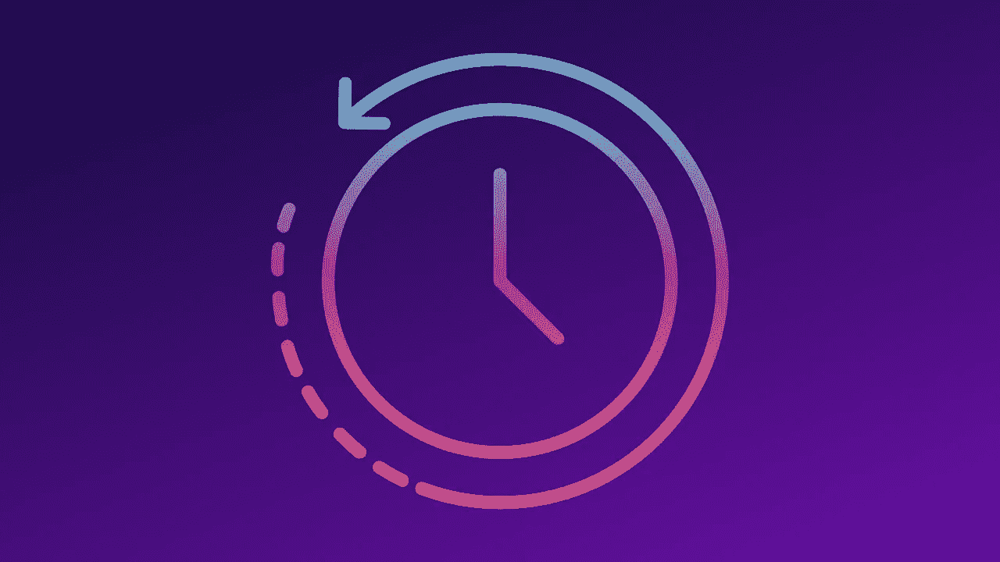
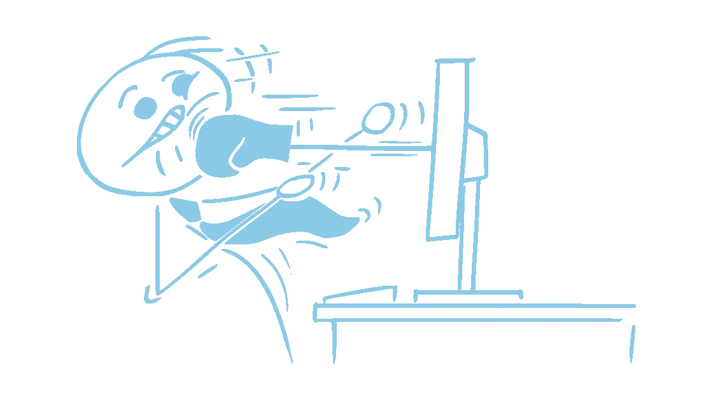
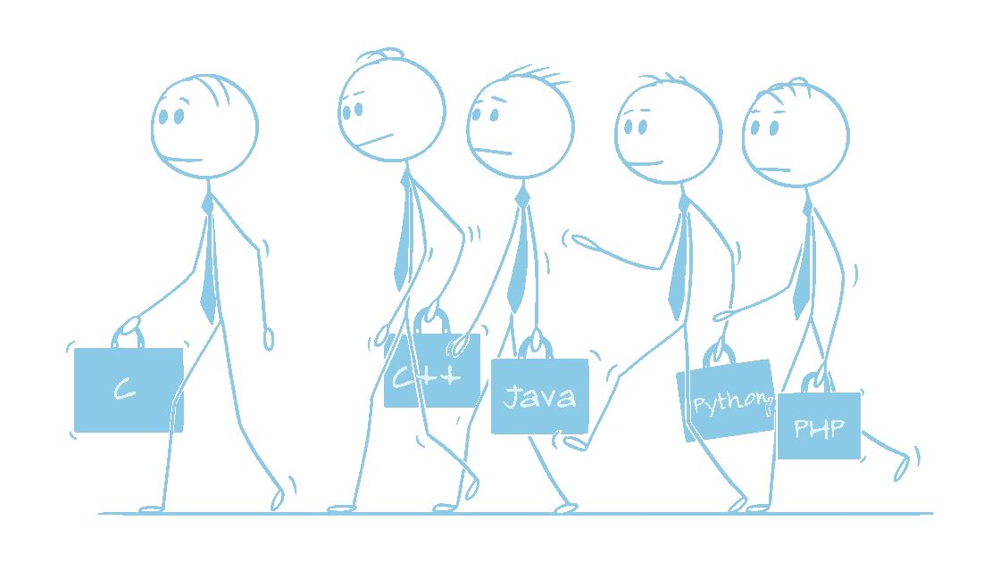

# 作为一名程序员，我希望早点做的 4 件事

> 原文：<https://levelup.gitconnected.com/4-things-i-wish-id-done-earlier-as-a-coder-1e3f70a0a87c>

## 从 Donald Knuth 那里学到了如何阅读代码



作者图片(通过 Canva.com)

如果你做一件事的时间足够长，你会不可避免地希望你在开始的时候用不同的方式去做。

我已经每天写代码超过九年了。有足够的时间犯一些错误并从中吸取教训(我希望)。如果我能回到我编程生涯的开始，有一些事情我会做得不同。

这是其中的四个。

# 停止将代码视为神圣

不可触及的代码不是代码味道；这是一个可怜虫诱导代码臭气弹。

我的工作是维护一堆乱七八糟的 PHP。我敢说没有被使用的执行路径如果被移除的话会破坏东西。每一个变化都有意想不到的效果。代码库中充满了“神圣的代码”——因为没有人理解而不得不被搁置的代码。

这让我有一种末日即将来临的感觉。


如果计算机看不见你，它就不会伤害你(艺术

我只知道有一天我会在代码库的神圣部分遇到一个错误，整个应用程序就会崩溃。

从来没有——至少，我在那里的时候没有。但是不愿意篡改代码的某些部分意味着补丁必须高度本地化。代码库的规模越来越大，这使得维护变得更加困难。我留下的代码比我发现的还要糟糕。

我希望我从来没有把那条准则视为神圣。

# 掌握代码编辑器

如果你花一整天的时间在代码编辑器上，花点时间研究和练习有用的快捷键。

有几年，编码对我来说是次要的活动。我在研究生院将它用作研究工具，并在我的第一份工作中编写自动化脚本和用户界面。在这两种情况下，我花在编码上的时间不到 20%。我从未对代码编辑器如此精通。

然而，在我的第二份工作中，我整天都在隔间里看 VS 代码。

我浏览编辑器的速度慢得令人难以忍受。



作者对抗他的代码编辑器的肖像。

渐渐地，我学会了一些技巧和窍门。然后我开始[有意练习快捷键](https://davidamos.dev/5-vs-code-shortcuts/)。虽然我还没有真正掌握 VS 代码，但差别是巨大的。我在编辑特定任务上浪费的时间和精力少得多，可以更专注于实际工作。

我希望我早点开始掌握我的编辑器。

# 学习不相关的语言

如果你已经学了一门语言，选择一门不相关的语言作为下一门。

在大学里，我用过 C，C++，Java。在研究生院，我用 MATLAB 和 Python。我在工作中使用过 Lua、PHP、JavaScript、Python 和 Julia。当然，每种语言都有其不同之处。但它们都是[命令式](https://en.wikipedia.org/wiki/Imperative_programming)。从这个角度来看，他们更多的是相似而不是不同。



它们在“内部”是不同的

直到最近，我只用过一种声明性语言:SQL。

不过，我从未编写过任何复杂的 SQL 查询。

最近，我一直在学习一种称为 [Rel](https://docs.relational.ai/getting-started/rel/my-first-rel-program) 的陈述性语言，用于我目前在 [RelationalAI](https://relational.ai) 的角色。编写不表达控制流的代码需要一些时间来适应。但是学习 Rel 改变了我思考和编写代码的方式，不管我使用哪种语言。特别是，它让我对[函数式编程](https://en.wikipedia.org/wiki/Functional_programming)有了新的认识。

我希望我能早点学会陈述性语言。

# 看别人的代码

时不时地，读读别人的代码…就像你读小说一样。

所有在两人或多人团队中工作的程序员都会在某个时候阅读其他人的代码。但是，即使你每天在工作中阅读别人的代码，我猜想这可能是在修复错误或添加功能的背景下。幕后总有一项任务，而且常常有一个期限。

我说的不是那种读书。


你上一次依偎着一些好的源代码是什么时候？

我说的是唐纳德·克努特在《工作中的程序员》中告诉彼得·赛贝尔的那种阅读，他是在一次自行车事故中摔断了胳膊之后读的:

> *我有一个月做不了多少事情，所以我阅读了我听说其中有一些没有记录在案的聪明想法的源代码。*
> 
> *—唐纳德·克努特*

我一直在读 Peter Norvig 的《Pytudes 》,虽然可能没有 Knuth 读他正在读的任何代码的深度。尽管如此，这是一个值得的练习。这让我接触到了用代码解决问题的新思路。

我希望我早点开始读别人的代码。

在你的职业生涯中，你希望自己早点做些什么？

在 Peter Seibel 的《工作中的程序员访谈》一书中，阅读专业程序员在反思他们如何学习编程以及如何实践技能时所说的话:

[](https://codersatwork.com/) [## 工作中的程序员:对编程技巧的反思

### “这本书太有趣了，我昨天在跑步机上做了 60 分钟，而不是通常的 30 分钟，因为我不能…

codersatwork.com](https://codersatwork.com/) 

```
**Become a better coder in 5 minutes.**One email, every Saturday, with one actionable tip.
Always less than 5 minutes of your time.[Subscribe here](https://davidamos.dev/curious-about-code-newsletter/)
```

zdeneksasek 经由 Canva.com 创作的作品，作者添加了一些文本元素。