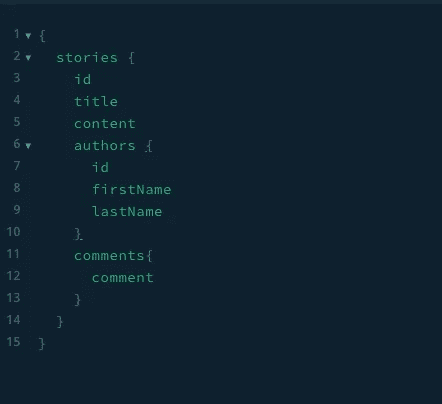

# 开发 GraphQL APIs 的 4 个技巧

> 原文：<https://levelup.gitconnected.com/4-things-to-consider-in-graphql-development-5fd6e4e2c73f>

了解开发后端服务的最佳实践


GraphQL 是一种强大的查询语言，因为它避免了与 REST API 相关的经典的过度提取问题。在 REST 中，端点决定返回数据的类型和数量。在许多情况下，服务器返回的数据超过了用户的需求。然而，GraphQL 允许高度特定的客户端查询，只返回所请求的数据。

在开发 GraphQL 服务时，我们将不得不处理定义模式、保护服务、构造模式、构造解析器和处理性能等的最佳方式。，在这篇文章中，我们将研究这些主题及其实现。

# 保护 GraphQL

在构建过程中的某个时候，我们必须确定谁可以看到 GraphQL 服务中的数据并与之交互。

> 身份验证是确定用户是否已登录并被允许访问服务。
> 
> 授权是确定用户是否有权访问数据。

## 使用 JWT 令牌的认证

在任何身份验证方案中，JWT 都是一种常见的实现，它允许以安全的方式表示用户数据声明。我们可以使用 JWT 令牌并通过在服务中验证它来保护我们的服务。

在下面的代码片段中，我使用 Okta 作为身份和访问管理解决方案。它可以是 custom、Okta、Auth0 或任何其他实现中的任何一个。

正在验证 HTTP authorization 头中的登录令牌，以检查它是否是有效的令牌，是否可以被允许访问服务。然后，从 JWT 令牌返回的用户声明被放入一个可以在代码中的所有`resolvers`中使用的上下文中。对于任何令牌验证失败，都将返回身份验证错误。

我们还可以根据实现从令牌或数据库中获取角色和其他用户信息。

## 解析器中的授权

解析器是解析模式中的类型或字段的值的函数。解析器可以返回对象或标量，如字符串、数字、布尔值等。

解析器中的授权可以通过上下文中的用户声明来实现。我们可以对以下内容进行粒度授权

*   如果用户已登录，则返回数据(或)
*   如果用户已登录并具有管理员角色，则返回数据。

在下面的例子中，我们可以返回有效用户的数据

在下面的例子中，如果用户是有效的并且角色是管理员，我们可以返回数据(我们应该只返回管理员的所有用户数据)

## 使用自定义指令进行授权

另一种授权方式是在模式中使用自定义指令。`directive @`可以直接在类型上调用，或者在字段上调用，或者在查询上调用。

为了实现一个模式指令，我们需要创建一个`SchemaDirectiveVisitor`的子类，并覆盖一个或多个方法。然后可以在`schemaDirectives`模式类中引用该子类。

# 结构化模式和解析器

随着 GraphQL 服务复杂性的增加，模式和解析器文件将会大幅增长。为了扩展代码和服务，我们需要模块化并组织模式和解析器代码。

## (计划或理论的)纲要

在下面的例子中，模式包含`User`和`Group`类型。随着模式的增长，维护代码会变得很困难。我们可以将整个代码拆分成单独的文件，而不是将整个代码放在一个文件中。

*在我们拆分*中的代码之前`*schema.js*`

*我们拆分了*中的代码后`*schema.js*`

## 分解器

我们可以在解析器中通过分割成多个文件来做同样的事情。

# 避免多次后端或数据库调用

Resolver 是一个特定于字段的函数，它在服务器中返回请求的数据。服务器处理查询，解析器返回每个字段的数据，直到获取了查询中的所有数据。在某些情况下，使用多个解析器的单个查询会导致对数据库的多次往返调用。

在下面的查询中，我们希望使用分页获得 15 个故事。假设用户和评论有他们自己的解析器，对数据库的初始调用将返回 15 个故事。然后，它对 DB 进行额外的往返调用，以获取每个故事的作者和评论。如果我们决定从评论中获取用户的详细信息，复杂性就会增加。这种对数据库的额外往返调用是一种开销，会导致性能下降。



我们可以考虑使用数据加载器，让你批处理和缓存数据库调用。如果数据加载器确定一个查询正在进行多个数据库调用，它会将所有调用一起批处理。这将大大减少对数据库的调用。

# 缓存以提高性能

为了在生产中扩展应用程序，GraphQL 服务上的缓存实现至关重要。正如我们从上面学到的，单个查询将导致运行多个解析器，每个解析器都有不同的语义。Apollo 服务器提供了使用`@cachecontrol`指令在字段级定义缓存控制的能力

在上面的代码片段中，`likes`字段可以缓存 30 秒。默认情况下，查询和突变是用`maxAge: 0`配置的，我们可以在创建服务器时更改默认配置，如下所示

```
const server = new ApolloServer({
  // ...
  cacheControl: {
    defaultMaxAge: 5,
  },
}));
```

在不同级别实现缓存控制，包括考虑 Memcached 或 Redis，将有助于提高服务的性能。

# 概述

1.  在 GraphQL 上实现安全控制有助于保护 API
2.  模块化模式和解析器的代码结构将有助于提高代码的可读性
3.  实现批处理将减少不必要的数据库调用
4.  实现缓存将会提高性能