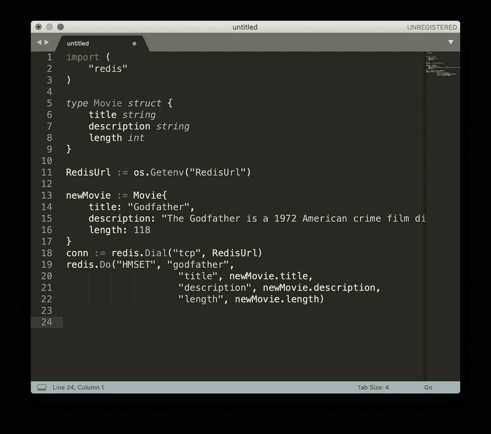
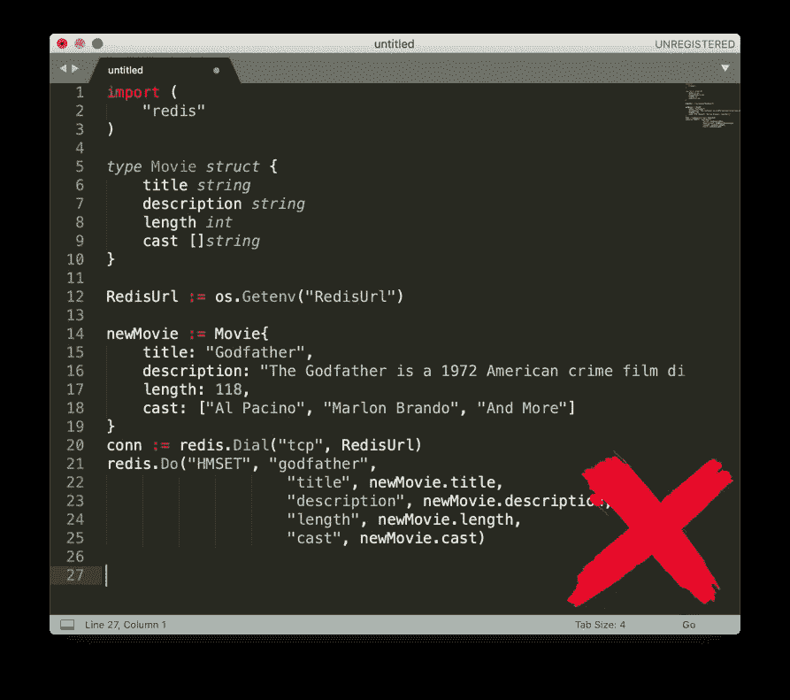
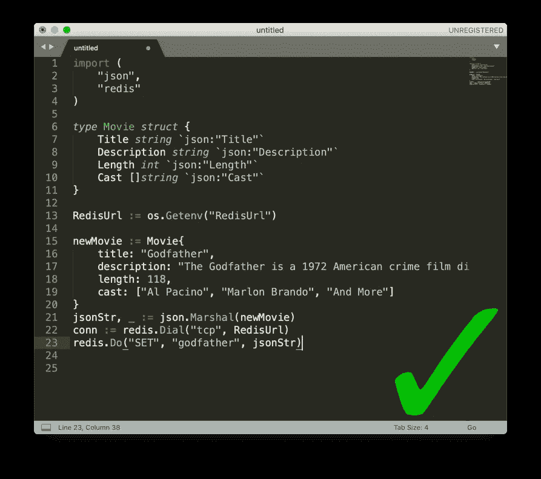
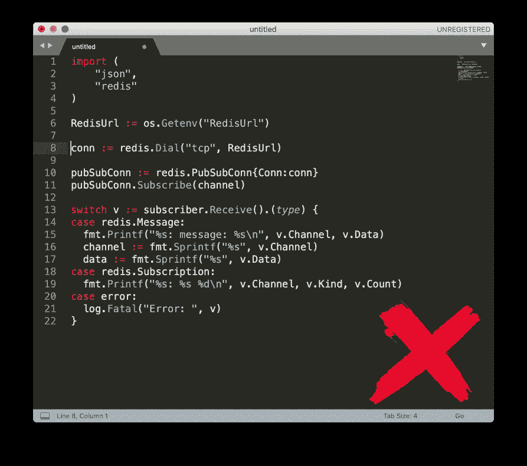
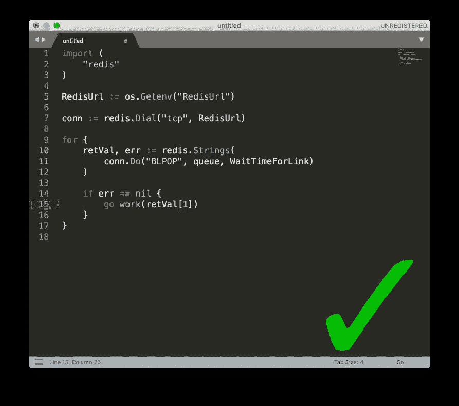
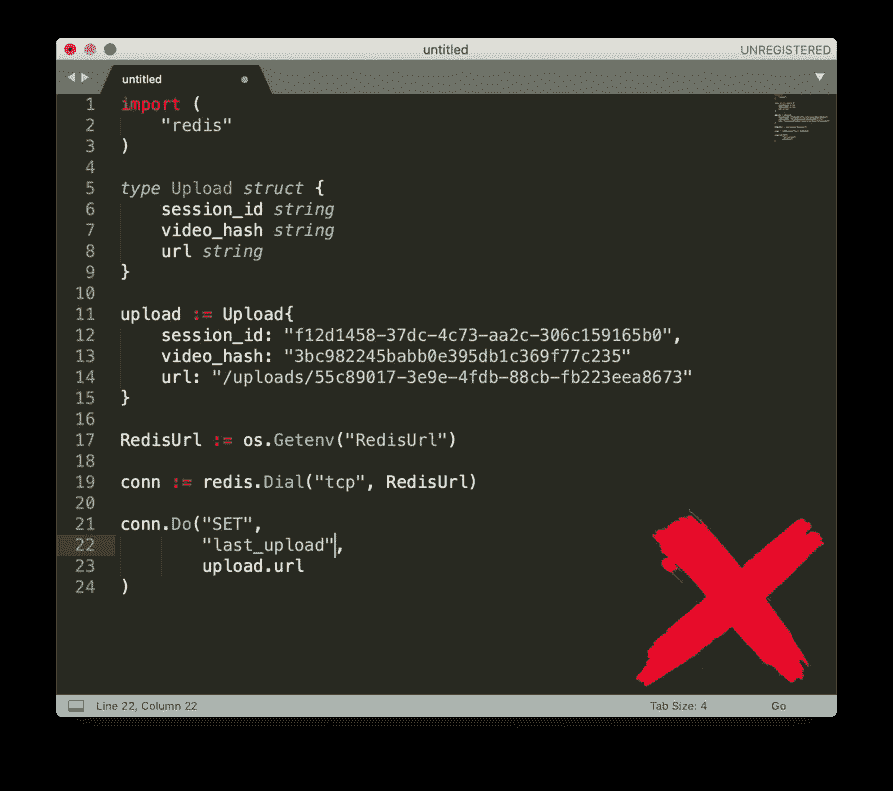
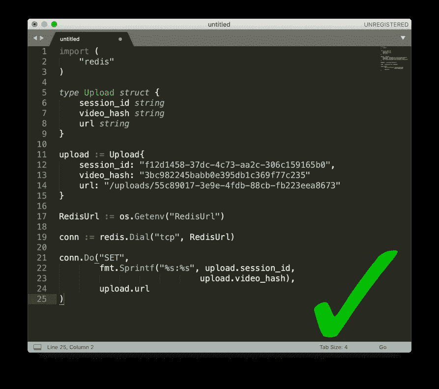
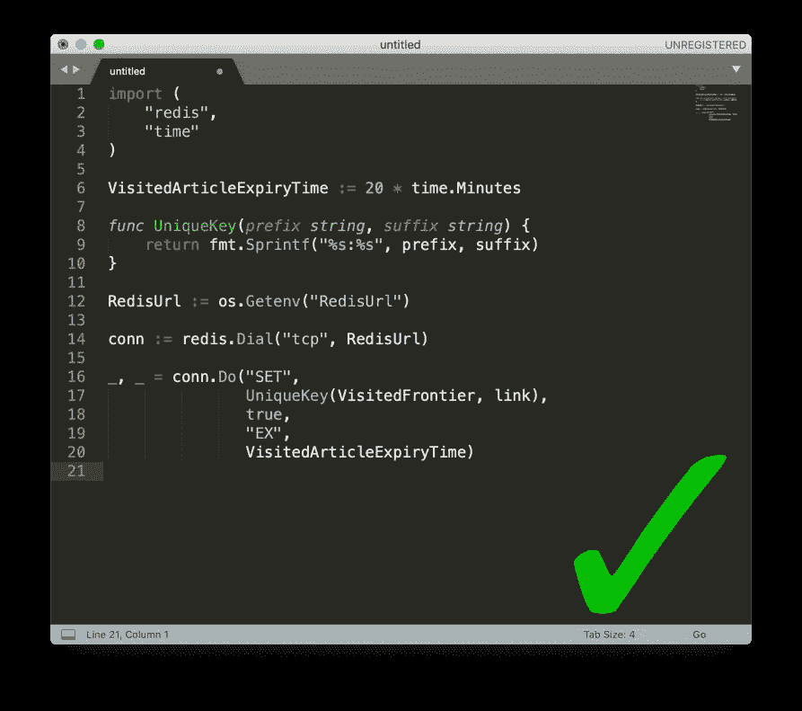

# 你现在可以做的 4 件事来充分利用 Redis

> 原文：<https://levelup.gitconnected.com/4-things-you-can-do-right-now-to-get-the-most-out-of-redis-e8085e8494a1>

如果您还不知道的话，Redis 是一个内存中的键值数据库，它能够存储简单的数据结构以及其他复杂的数据结构，如队列、集合和流。当您有几台不同的计算机运行一项服务的不同部分，需要在彼此之间共享和传递数据时，Redis 非常有用。它还经常被用作缓存&处理实时数据。

阅读我上周的一篇文章，关于什么时候该用什么时候不该用 Redis。

在这个视频中，我将分享一些你现在可以做的快速的事情，以充分利用你的 Redis。

# 1)存储 JSON 字符串，而不是使用 HMSET

Redis 中有一个快捷的功能，允许您将多个项目存储到一个 Hashmap 中。通常，这可用于从 redis 队列中重新创建对象。实现通常如下所示。

对象的 HMSet

这对于简单的字符串来说已经足够了，但是对于像列表这样的数据结构来说就不行了

HMSET 用数组分隔

另一种方法是使用 json 字符串在 Redis 中保存对象

使用 JSON 字符串实现容错和可伸缩性

这将确保所有 JSON 可编码的值都能够保存在 Redis 中。它还将确保将来插入任何钥匙时无需任何额外的维护

# 2)使用 BLPop 进行作业处理

开箱即用，Redis 支持发布/订阅。Pub/Sub 是一个用于实时交互应用程序发送和接收消息的协议。发布/订阅通常会被触发并被遗忘，因此一旦消息被触发，就不会有任何记录。如果您有一个架构，其中多个工作线程订阅同一个队列来接收消息，那么发布/订阅是一个很难扩展的解决方案。

PubSub 比较适合聊天

BLPOP 是更好的方法。这类似于 LPOP，但是 B 意味着这个函数将阻塞，直到队列中出现一个项目。结合运行循环，这将有效地成为一个可扩展到多个工作线程的作业队列。

作业队列的 BLPOP

# 3)使用唯一的 Redis 密钥

Redis 的默认行为是，一旦设置了键，就不会自动覆盖它们。为了更新密钥，需要两步过程，即删除，然后再次插入。如果您试图保存同一 Redis 键下的数据，这可能会导致数据完整性问题。

不要重复使用钥匙

使用自定义的键命名约定来解决这个问题。Redis 支持字节编码的字符串，所以 Redis 没有保留字符。

每次都创建一个唯一的密钥

# 4)让您的密钥过期

Redis 缓存可能会变大，尤其是在生产环境中。您希望避免任何迫使您转储整个缓存的情况。这可能意味着用户的停机时间和宝贵数据的丢失。相反，遵循随着时间的推移使您的密钥过期的最佳实践。这是对您的缓存进行自我管理的一种形式，可以确保您在很长一段时间内得到最佳使用。

让你的钥匙过期！

就这些了，感谢您的阅读，我希望您能从 Redis 上获得一些提示。如果你喜欢这个，不要忘了鼓掌并跟随！