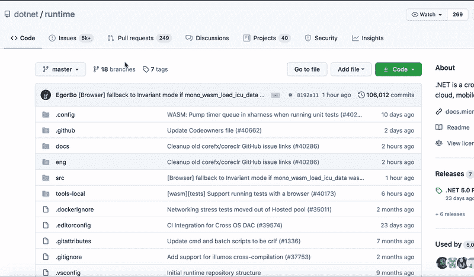
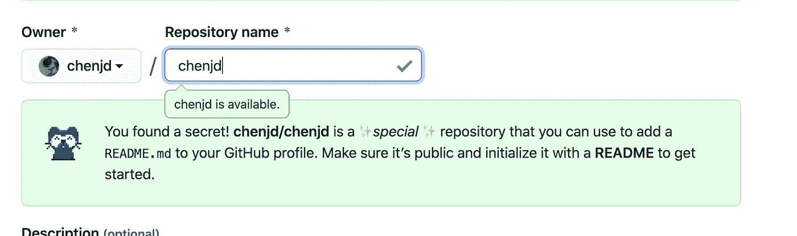
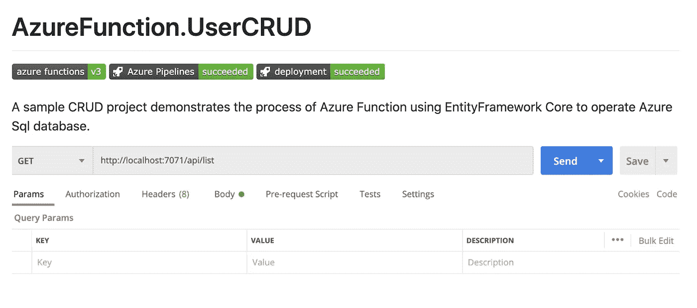
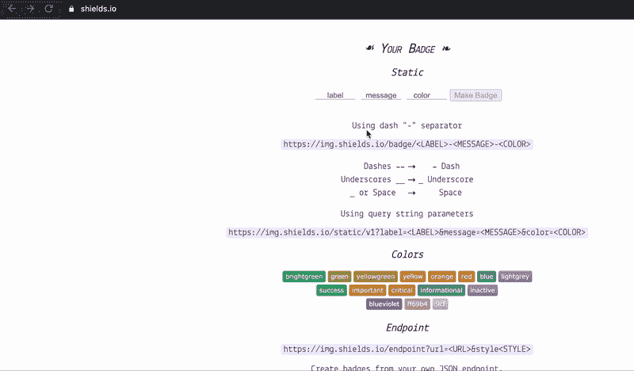

# 更有效使用 GitHub 的 4 个技巧

> 原文：<https://levelup.gitconnected.com/4-tips-for-using-github-more-efficiently-e0977bca4411>


照片由 [rawpixel](https://burst.shopify.com/@rawpixel?utm_campaign=photo_credit&utm_content=Free+Stock+Photo+of+Business+Meeting+Over+Coffee+%E2%80%94+HD+Images&utm_medium=referral&utm_source=credit) 从[爆](https://burst.shopify.com/laptop?utm_campaign=photo_credit&utm_content=Free+Stock+Photo+of+Business+Meeting+Over+Coffee+%E2%80%94+HD+Images&utm_medium=referral&utm_source=credit)

作为一个非常喜欢 GitHub 的程序员，我在日常使用中发现了这 4 个可以提高我使用 GitHub 时效率的小技巧。本帖介绍并演示了这 4 个技巧，希望它们也能帮助你更高效地使用 GitHub。

# 提示#1 使用文件查找器快速轻松地在 Repo 中搜索文件

GitHub 为使用 Git 的软件开发和版本控制提供托管，有成千上万的存储库、项目和文件。因此，如何高效地在 GitHub 上搜索文件就显得非常重要。第一个技巧是使用 GitHub **在资源库**中提供的快捷方式来搜索这个资源库中的文件。



正如你在上面看到的，在 ***运行时*** repo 页面，按键盘上的`t`键，GitHub 就会激活文件查找器。然后你只需要输入目标文件名，比如****service provider . cs***文件，文件查找器就会显示你想要的文件。*

# *技巧#2 使用搜索限定符来搜索您想要的目标*

*现在让我们假设您不知道目标文件位于哪个存储库中，也不知道您想要查找组织中的某个用户。然后你可以使用搜索限定符在 GitHub 的任何页面搜索你想要的目标。*

**

*正如你在上面看到的，我们在 Marketplace 页面上，想要在 ***dotnet*** 组织中搜索***configuration builder . cs***文件。然后，您只需要输入搜索限定符来表明这个目的。*

```
***org**:dotnet **filename**:ConfigurationBuilder.cs*
```

*GitHub 会显示你想要的文件。*

# *提示#3 在你的 Github 个人资料页面上启用自述文件*

*是的，看起来来自 Github 的家伙不仅在 6 月份重新设计了 GitHub UI 还添加了一些小秘密。那就是你可以在你的 Github 个人资料页面上获得个人资料自述。这是你自己的自述，而不是项目的自述。有意思！*

**

*启用它非常容易。你只需要创建一个与你的 Github 帐户的用户名同名的新存储库，这是一个特殊的存储库，你可以用它来将 README.md 添加到你的 Github 个人资料中。*

**

# *技巧 4 将徽章添加到 GitHub Repo 中*

*从技术上来说，这不是 GitHub 提供的功能。但是使用这个小技巧可以让你的 GitHub 存储库页面更加专业，反映你项目的当前状态。*

*一些社区向开发者提供他们自己的徽章，例如，你可以从下面显示的 Azure DevOps 获得构建/部署状态徽章。(你可以在这里阅读更多关于 Azure DevOps 的信息)*

**

*另一方面，你可以从一些提供商那里获得更多的通用徽章，比如 [**shields.io**](https://shields.io/) **。** shield.io 可以读取你的项目状态，生成相应的徽章。而且，你可以在 shield.io 上创建自己的徽章。*

**

*然后你只需要将 markdown 链接复制并粘贴到你的 GitHub repo 中的 README.md 文件。*

**

*感谢您的阅读，希望对您有所帮助。*

*在[https://www.linkedin.com/in/chenjd/](https://www.linkedin.com/in/chenjd/)聊天*

# *参考*

 *[## 快捷键

### GitHub 上几乎每个页面都有一个键盘快捷键，可以更快地执行操作。打字？在 GitHub 中打开一个对话框…

docs.github.com](https://docs.github.com/en/github/getting-started-with-github/keyboard-shortcuts)*  *[## 搜索代码

### 您可以在 GitHub 上搜索代码，并使用这些代码搜索限定符的任意组合来缩小搜索结果。你可以…

docs.github.com](https://docs.github.com/en/github/searching-for-information-on-github/searching-code)*