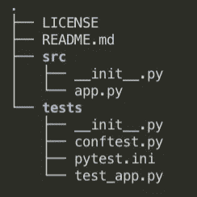
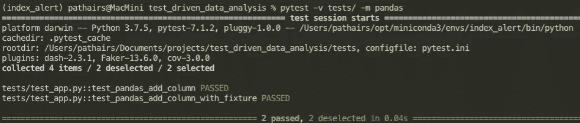
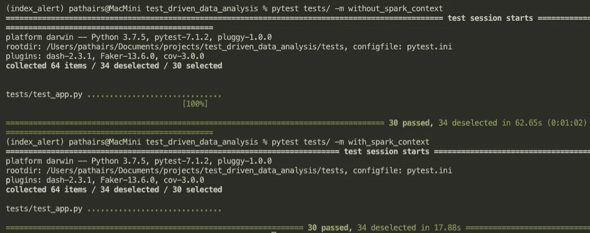
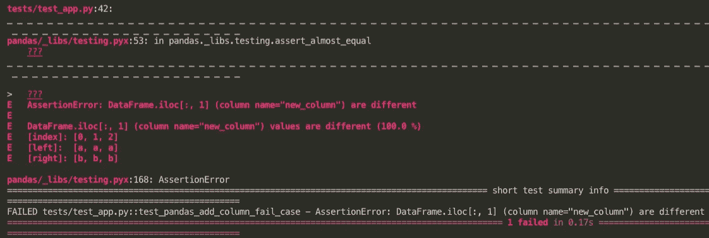
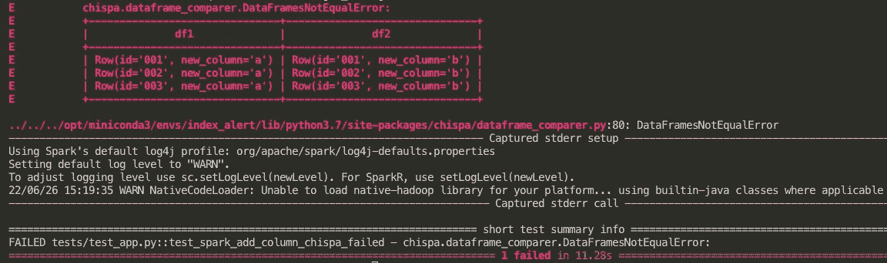

# 将 Pytest 与 Pyspark 应用程序集成的 4 个技巧

> 原文：<https://levelup.gitconnected.com/4-tips-to-integrate-pytest-with-pyspark-applications-5a18835a6d3e>

## 节省您在开发工作流中设置测试时间的技巧

Artem Beliaikin 在 [Unsplash](https://unsplash.com?utm_source=medium&utm_medium=referral) 上拍摄的照片

## 介绍

软件测试是软件开发的重要组成部分。一个伟大的开发人员从任何项目的第一天起就拥抱它。他们知道如何设置和调整测试配置，以便从中获得最大收益。如果你是新手，刚刚开始编写你的第一个单元/集成测试，该怎么办？

*   第一天怎么知道最佳做法？
*   集成测试套件后，如何缩短发布产品/分析/模型的时间？

知道一些可以节省学习如何构建测试用例的时间的技巧不是很好吗？

## 利益

为了更加强调测试的好处:

*   即使你不是软件开发人员，你仍然要编写代码来产生结果，而且，作为一个人，你总是会犯错误。测试驱动的开发将把你从你犯的意外引入的错误中拯救出来。
*   测试用例将帮助您捕获您可能在不知不觉中引入的错误。例如，当您更改分析中的一些代码时，可能会影响其他部分。在这种情况下，多花 2-3 个小时编写测试用例总是值得的。
*   另一个好处是它帮助你理解当你引入一个新的变化时代码是如何工作的，以及在你的端到端管道中你应该注意什么。此外，当您将您的代码转移给其他人进行进一步开发时，这有助于其他人检查结果，并确保整个路径仍然像它应该的那样一起工作。

## 你会做什么

本文将关注 pyspark 应用程序，尤其是在数据分析用例中。

*   在 pandas、pyspark 和 pandas on spark 中创建实体模型数据。
*   构造一个配置文件和测试用例文件夹。
*   加速 pyspark 应用程序的测试用例。
*   将实际数据框与预期数据框进行比较。

> 你可以在这个 [Github 库](https://github.com/Pathairush/test_driven_data_analysis)中找到下面教程的代码

## 1.设置您的测试数据

通常，当我们编写单元测试时，我们关注于一小段代码。我们希望确保函数的行为符合我们的预期。因此，我们倾向于创建一小块模拟数据来测试我们的功能，而不是使用来自数据库的数据流。然而，不同的库有他们创建数据框的方式，如果你知道他们所有的方式就太好了。

在每个库中，有多种方法来启动数据框。我只会告诉你我坚持的方式。我相信只有一种创建数据框的方法就足以在你的一生中使用。

## 熊猫

对于大家来说，最知名的数据分析库就是熊猫了。我每天都在使用它，无法想象没有它我的生活会怎样。创建熊猫数据框有多种方法，但我更喜欢的方法是输入一个列表字典，如下例所示。

*   字典的键值是 Pandas 列名。
*   列表中的值表示 Pandas 数据框中的每一行。

创建一个模拟熊猫数据框。

如果您的数据集足够小，可以放入您的计算机内存中，那么 Pandas 数据框就可以很好地工作。如果您正在处理**大数据，即笔记本电脑内存**无法容纳的较大数据，以下方法将更适合您。

## 星火上的熊猫

Apache spark 基金会最近发布了 Pyspark 3.2.1，它附带了 spark 上有用的子模块**熊猫(以前称为考拉)。**该子模块模仿 Pandas APIs，并翻译请求以在 Spark 集群上运行。因此，这是从 Pandas 环境到分布式 Spark 应用程序的简单方法。

该库没有涵盖 100%的 Pandas APIs，但我发现对于基本的数据分析用例来说，它已经足够好了。这就是我们如何在 Spark 数据帧上启动熊猫。

在 spark 数据框上创建一个模拟熊猫。

## Pyspark

最后，如果在你的工作场所，由于依赖问题和向后兼容性，你仍然害怕更新 spark 的版本。我还提供了一种直接从 pyspark 库中创建 spark 数据框的方法。

创建 spark 数据框有点烦人，因为您必须首先指定数据的整个模式，不像我们在 Pandas 或 Pandas on spark 中所做的那样，该库通过为我们推断数据模式来处理。但是，如果您有时间，这仍然是一个很好的做法，因为错误的数据类型(例如，浮点和小数)也可能导致我们的数据分析中出现意外情况。下面是如何创建 spark 数据框的单个列。

创建单列模拟 spark 数据框。

对于多列数据框，必须添加额外的函数来定义 spark 数据框方案，如下例所示。

*   StructField 函数接收三个参数:列名、数据类型和可为 name 的布尔标志。

创建多列模拟 spark 数据框。

我曾经总是打开文档来寻找在每个库中创建数据框的方法，并意识到当我能记住以上四种语法时，对我来说这要快得多。

## 2.构建一个配置文件和测试用例文件夹

有许多方法来构建开发文件夹。我将向你展示的是我目前的发展模板。我通常从两个文件夹开始:一个源文件夹和一个测试文件夹。

*   源文件夹包含我的分析，无论是 Python 还是 Jupyter 笔记本文件。
*   测试文件夹包含带有前缀“test_”约定的测试用例。

上面的 fixture 展示了我如何构建分析开发文件夹 fixture by author。

本节有趣的部分是如何创建 **conftest.py** 和 **pytest.ini** 文件

*   **conf test . py—**conf test . py 文件是我们可以放置我们的 [**夹具**](https://docs.pytest.org/en/7.1.x/explanation/fixtures.html) 来构造和安排我们的测试用例数据的地方。夹具可以在测试文件中重用。为不同的测试用例重用相同的夹具是很方便的。fixture 既可以是数据，就像我们上面的模拟数据函数，也可以是我们希望为测试会话启动的 spark 环境。spark 环境夹具将在下一节中扮演重要角色。
*   **使用 conftest.py —** 夹具可以重复使用和模块化。

使用 conftest.py 创建一个测试

*   **不使用 conftest.py —** 数据框仅在当前测试中可用。

不使用 conftest.py 创建测试

*   **pytest.ini —** 本节的另一个重要文件是 pytest.ini 文件。这是 Pytest 命令行的配置文件。该配置可以用来减少 Pytest 命令的冗长性。例如，您可以隐藏显示在终端上的**弃用警告**,只关注测试结果。为了节省每次键入-p 参数的时间，您可以在 pytest.ini 文件中使用下面的 addopts 行添加它。

pytest.ini 配置文件。

*   我们也可以定义 Pytest [**标记**](https://docs.pytest.org/en/7.1.x/how-to/mark.html) 来将我们的测试用例归类到我们想要的类别中。最后，它使得基于定义的标记选择我们想要运行的测试用例变得更加容易。
*   例如，我们用语法@pytest.mark.pandas 和@pytest.mark.spark 标记下面的测试。如果添加自定义标记而没有在 pytest.ini 文件中定义它，它将抛出未知的标记错误，您可以通过添加标记定义来修复它，如上面的 sample_pytest.ini 示例。

为每个测试用例添加 Pytest 标记。

*   下面是我们向 Pytest 命令行输入可选的 mark 参数时的结果。当您向代码库添加新功能时，组织和测试部分测试用例是有益的。当你有很多测试用例时，测试的运行时间会更长。所以最好在开发过程中尝试运行其中的一些。

使用可选的标记参数选择测试用例；作者的夹具。

*   你可以在配置文件[这里](https://docs.pytest.org/en/6.2.x/reference.html#ini-options-ref)寻找更详细的选项。

## 3.加速 pyspark 应用程序的测试用例

在这一节中，我们将具体讨论我们测试 pyspark 应用程序的时间。通常，spark 应用程序使用 spark 上下文来构建底层的一切。这一部分的细微差别是强调设置过程，并分解每个测试用例之间的 spark 上下文。

下一个 fixture 描述了从为所有测试传递一个 spark 上下文到每次运行测试套件时的设置和拆卸之间的运行时间。

我们比较了在 conftest.py 中传递火花和不传递火花时的性能；作者的夹具。

你可以注意到下面两种方法在运行时间上的巨大差异。例如，一个用 17 秒完成 30 个测试用例，另一个用 1:02 分钟完成同样的 30 个测试用例。当您为更复杂的计算运行测试用例时，这个数字会迅速增长。

这是两个测试用例之间的区别。

当我们完成每一次运行时，我们将在没有 spark 上下文的情况下设置和拆除 spark 上下文。这个过程导致了性能时间的瓶颈。

在每个运行的测试用例中创建和删除 spark 上下文。

另一方面，在下面的例子中，我们在会话范围中设置了 spark 上下文的 fixture，并在不同的测试用例中重用它。

将 spark 上下文添加到测试用例中。

从我的经验来看，我开始编写 pyspark 单元测试时并不知道这种微妙的差异，我的测试套件几乎花了我 30 分钟才完成(我不知道当时我是如何等待它完成的)。

当我知道这个技巧并将 spark 上下文添加到我的每个测试中时，时间量大大减少了。最后的运行时间减少到 8 分钟左右。所以这让我印象深刻。

此外，您可以添加 spark 配置来优化测试运行时间。如果你对这个话题感兴趣，可以查看一下 [Pytest-spark](https://pypi.org/project/pytest-spark/) 插件。最后，有一些 spark 上下文配置可以帮助加速这个过程，并使您的开发工作流程变得更好。

## 4.将实际数据框与预期数据框进行比较。

本文的最后一部分着眼于如何比较实际数据帧和预期数据帧。这部分最初让我很恼火，因为比较 pyspark 数据帧完全是手动的，我们必须自己编写一个额外的函数来比较数据帧。

幸运的是，在网上彻底搜索后，我找到了一个很有帮助的包[**【Chispa】**](https://github.com/MrPowers/chispa)**，它对比较两个 spark 数据帧很有帮助。因此，我将向你展示两种我认为足以胜任这项任务的方法。**

**第一种方法是使用 [pandas.testing](https://pandas.pydata.org/docs/reference/api/pandas.testing.assert_frame_equal.html) 模块。我已经在上面的部分向你展示了如何使用它。在处理熊猫数据框时，它更容易使用。但是，如果使用 pandas 测试模块和 spark 数据框，则需要使用 toPandas 方法转换 spark 数据框。**

**使用 pandas 测试模块断言 pandas 数据帧。**

**不幸的是，这种方法的缺陷是 toPandas 方法不能保证变换数据帧的顺序。相反，您必须根据某些列对值进行排序，并重置索引号以使其具有可比性。**

**这是一个失败的测试案例的例子。你可以看到熊猫。测试模块在故障解释方面做得很好。我可以看到实际数据帧和预期数据帧的值是 100%不同的。**

****

**来自 pandas.testing 模块的失败结果；作者的夹具。**

**第二种方法是使用 Chispa 库。我们可以通过用 assert_df_equality 行替换 pandas.testing 模块来使用它。该方法将直接比较两个火花数据帧。与上一个不同，我们需要从 Pandas 数据框架转换到 Spark 数据框架。**

**使用 Chispa 库断言 spark 数据帧。**

**下图显示了 Chispa 在发现实际数据帧与预期数据帧不一致时如何返回错误。许多有用的可选参数可用于微调 assert 函数的行为，如忽略行顺序、忽略列顺序等。**

****

**来自 Chispa 库的失败结果；作者的夹具。**

## **最后的想法**

**瞧啊。那时，我花了很多时间来构建我的第一个测试用例。我希望以上技巧能够帮助您将测试模块集成到 pyspark 应用程序中。**

## **帕泰鲁什·西达**

****如果你喜欢我的工作，想支持我，** [**成为会员**](https://padpathairush.medium.com/membership)**

*   **在[媒体](http://padpathairush.medium.com)上跟随我**
*   **其他渠道？ [LinkedIn](https://www.linkedin.com/in/pathairush/) ， [Twitter](https://twitter.com/data_products)**

****你可能喜欢的东西！****

** [## 内存数据质量检查——充满期待的教程

### 将数据质量检查嵌入任何数据管道的实用代码片段

towardsdatascience.com](https://towardsdatascience.com/in-memory-data-quality-check-tutorial-with-great-expectation-54913b1c37fa)  [## 用于数据分析的数据质量检查—熊猫教程

### 用于检查数据质量的代码片段

towardsdatascience.com](https://towardsdatascience.com/data-quality-check-for-your-data-analysis-tutorial-with-pandas-7ee96d7dc4b6) 

# 分级编码

感谢您成为我们社区的一员！更多内容请参见[升级编码出版物](https://levelup.gitconnected.com/)。
跟随:[推特](https://twitter.com/gitconnected)，[领英](https://www.linkedin.com/company/gitconnected)，[通迅](https://newsletter.levelup.dev/)
**升一级正在改造理工大招聘➡️** [**加入我们的人才集体**](https://jobs.levelup.dev/talent/welcome?referral=true)**