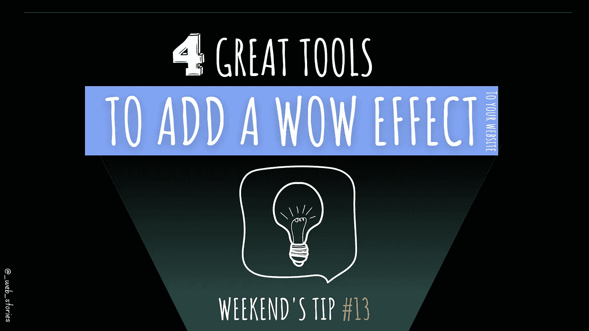
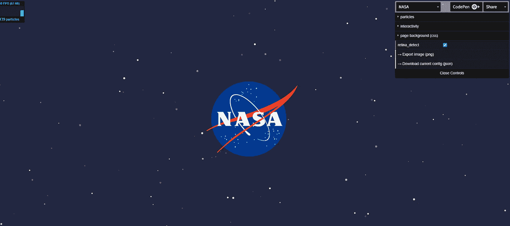
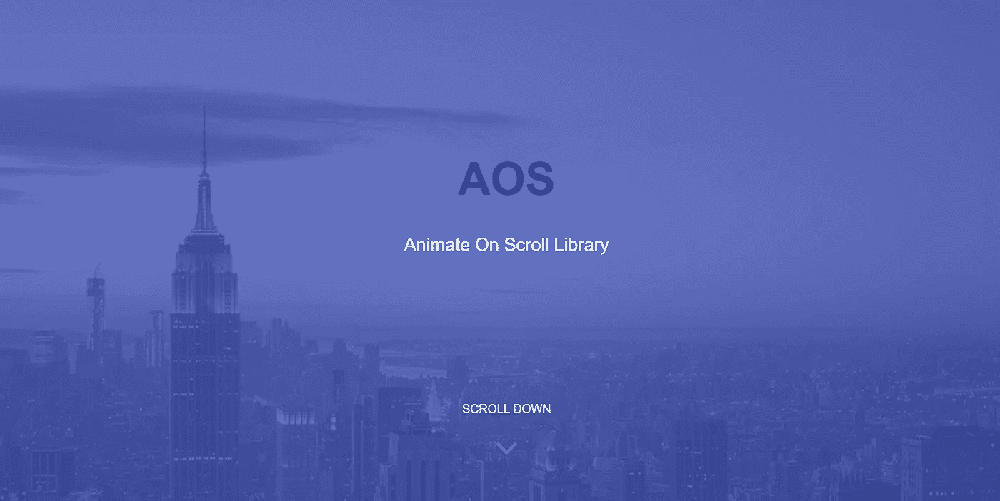
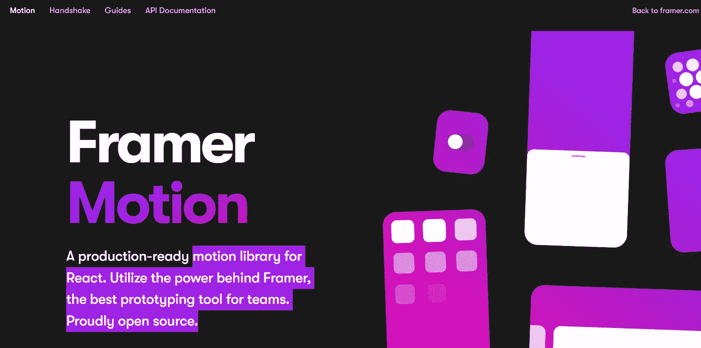
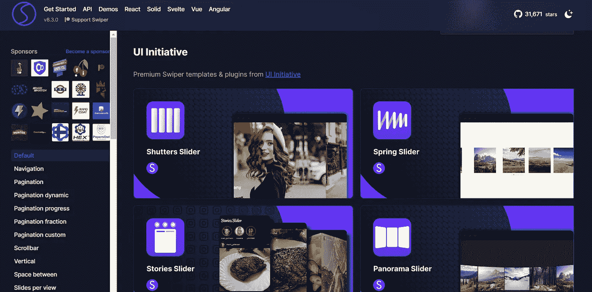

# 添加 WOW 效果的 4 个工具

> 原文：<https://levelup.gitconnected.com/4-tools-to-add-a-wow-effect-8b905b5a03d8>

## 到你的网站，吸引用户！

作者:FAM

## 你好👋

是时候让一些动画给我们的网站带来活力了。我在文章中收集了一些很棒的动画，它们可以在你的网站上创造出令人惊叹的效果，而不用为你的网站性能付出昂贵的代价。这些库是轻量级的，这使得它们如此受欢迎！

# 粒子 JS

伟大的背景动画，你可以用网站右边提供的控制台自定义。用户可以悬停或触摸，并看到动画对他们的行动作出反应。

 [## particles . js——用于创建粒子的轻量级 JavaScript 库

### particles.js 是一个用于创建粒子的轻量级 JavaScript 库。

vincentgarreau.com](https://vincentgarreau.com/particles.js/) 

粒子. js

# AOS 滚动动画

动画在赋予网站生命力和吸引用户方面发挥着巨大的作用。这个轻量级的 JS 库提供了一系列奇妙的动画效果，比如在滚动网站时淡入淡出、缩放和翻转。

 [## 美国歌剧协会(American Opera Society)

### 使用 CSS3 在卷轴库上制作 AOS 动画

michalsnik.github.io](https://michalsnik.github.io/aos/) 

美国歌剧协会(American Opera Society)

# 组成者

如果你用 react 建立了你的网站，并想给它增添一些活力，那么你可能会喜欢使用这个库。使用 framer motion，您可以制作网站不同部分的动画。

 [## React |成帧器动作的生产就绪动画库

### Framer Motion 是一个生产就绪的 React 动画和手势库。

www.framer.com](https://www.framer.com/motion/) 

组成者

# Swiper JS

这个库旨在节省你从零开始构建滑块
的时间，并专注于你网站上的其他事情。随着移动用户的不断增长，这个
库被设计为能够很好地与移动用户界面和功能配合使用。

 [## Swiper 演示

### Swiper 是最现代的免费移动触摸滑块，具有硬件加速过渡和惊人的本地行为。

swiperjs.com](https://swiperjs.com/demos) 

Swiper JS

**其他伟大的工具由**[**Satyam Anand**](https://medium.com/u/6e18d9eda067?source=post_page-----8b905b5a03d8--------------------------------)**和**[**Attila vágó**](https://medium.com/u/2053aaf853f5?source=post_page-----8b905b5a03d8--------------------------------)**分享(非常感谢❤):**

*   [阿尼斯塔](https://animista.net)
*   [https://animate.style](https://animate.style/)

今天到此为止，再见！🙋

如果您有任何问题或反馈，请点击评论或通过 LinkedIn 联系我— **我洗耳恭听！**

[**想给我买杯咖啡吗？**☕️](https://www.buymeacoffee.com/fatimaamzil)

> 让我们为 2022 年打造一个更好的‘我们’！

> 如果你喜欢我的文章， [**订阅**](https://famzil.medium.com/subscribe) 获取我的最新。如果你自己喜欢体验媒介，可以考虑通过[**注册会员**](https://famzil.medium.com/membership) 来支持我和其他成千上万的作家。它只需要每月 5 美元，它支持我们，作家，你也有机会用你的作品赚钱。当然，你可以随时取消会员资格。通过注册[这个链接](https://famzil.medium.com/membership)，你将直接用你的一部分费用来支持我，不会花你更多的钱。如果你这样做了，万分感谢！

让我们**联系上** [**中**](https://medium.com/@famzil/)**[**Linkedin**](https://www.linkedin.com/in/fatima-amzil-9031ba95/)**[**脸书**](https://www.facebook.com/The-Front-End-World)**[**insta gram**](https://www.instagram.com/the_frontend_world/)**[**YouTube**](https://www.youtube.com/channel/UCaxr-f9r6P1u7Y7SKFHi12g)**或**********

**** [## 通过我的推荐链接——FAM 加入 Medium

### 作为一个媒体会员，你的会员费的一部分会给你阅读的作家，你可以完全接触到每一个故事…

famzil.medium.com](https://famzil.medium.com/membership)**** 

# ****分级编码****

****感谢您成为我们社区的一员！更多内容见[级编码出版物](https://levelup.gitconnected.com/)。
跟随:[推特](https://twitter.com/gitconnected)，[领英](https://www.linkedin.com/company/gitconnected)，[通迅](https://newsletter.levelup.dev/)
**升一级正在改造理工大招聘➡️** [**加入我们的人才集体**](https://jobs.levelup.dev/talent/welcome?referral=true)****