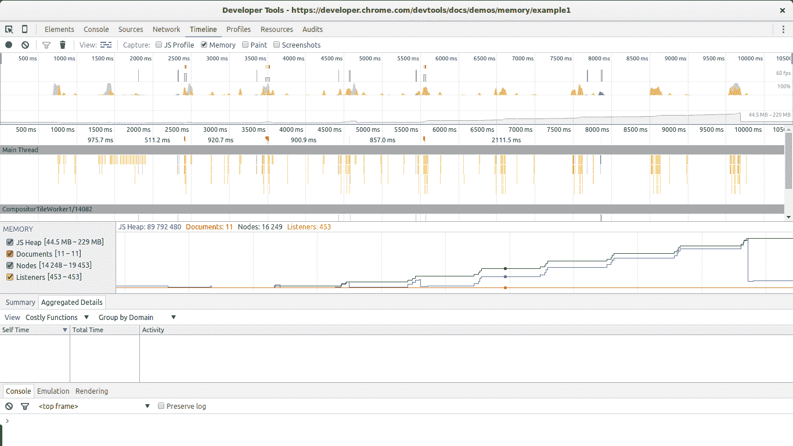
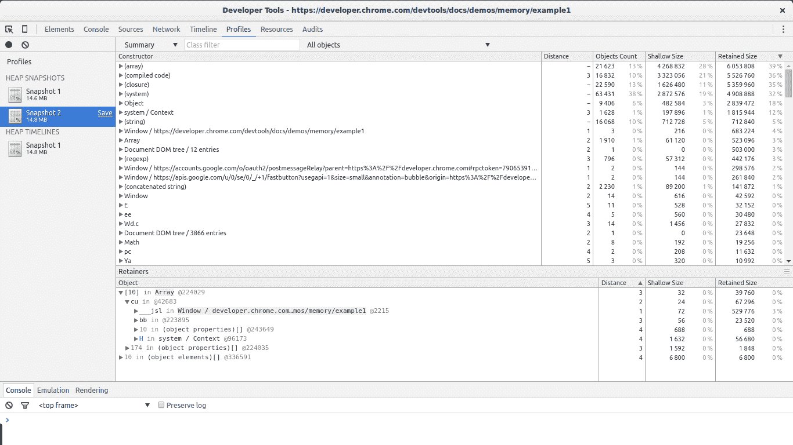
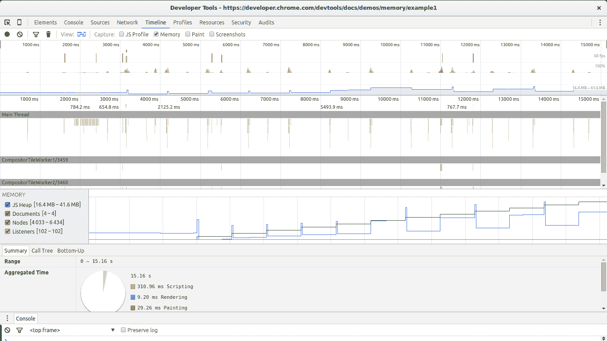
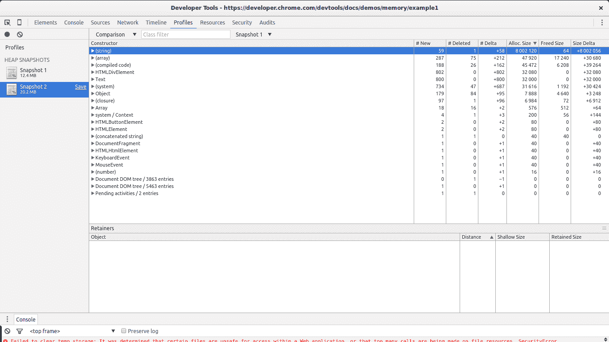
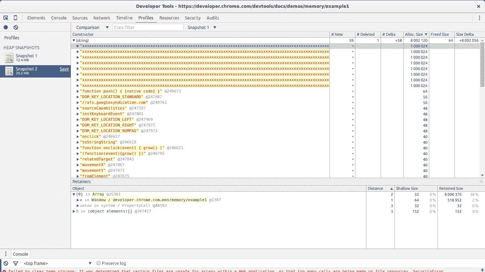
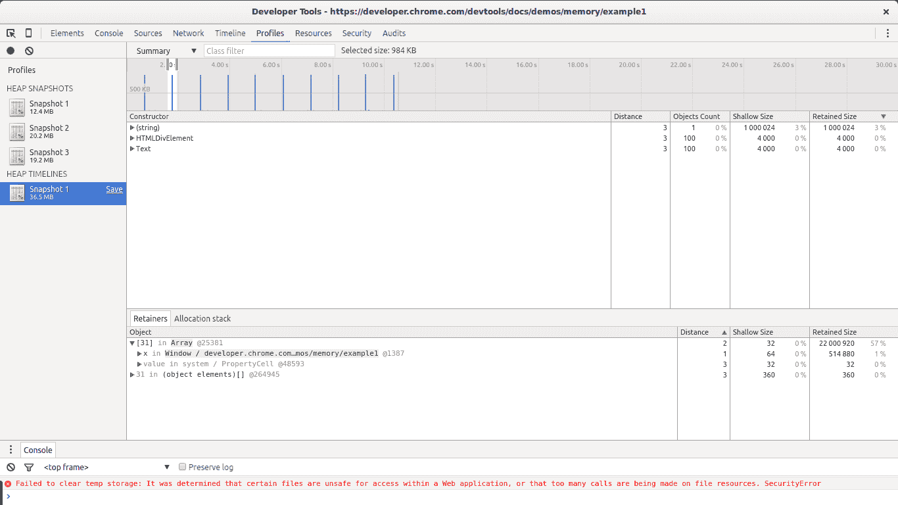
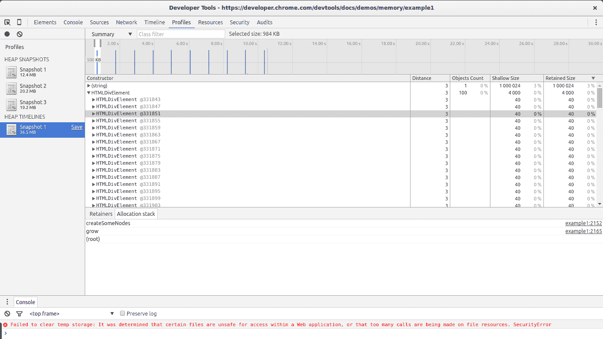
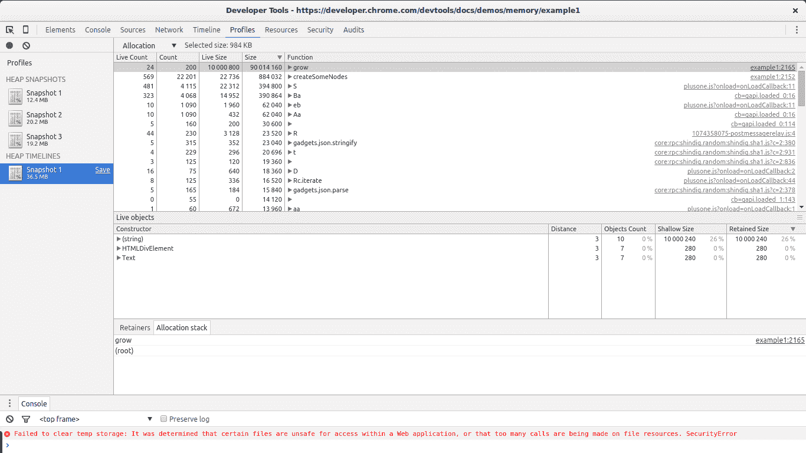

# JavaScript 中的 4 种内存泄漏类型以及如何消除它们

> 原文：<https://levelup.gitconnected.com/4-types-of-memory-leaks-in-javascript-and-how-to-get-rid-of-them-25137bed51cf>

了解 JavaScript 中的内存泄漏以及如何解决它们！

照片由 [Fotis Fotopoulos](https://unsplash.com/@ffstop?utm_source=medium&utm_medium=referral) 在 [Unsplash](https://unsplash.com?utm_source=medium&utm_medium=referral) 上拍摄

在本文中，我们将探讨客户端 JavaScript 代码中常见的内存泄漏类型。我们还将学习如何使用 Chrome 开发工具来找到它们。请继续阅读！

# 介绍

内存泄漏是每个开发人员最终都要面对的问题。即使使用内存管理语言，也存在内存泄漏的情况。泄漏是一系列问题的原因:速度变慢、崩溃、高延迟，甚至其他应用程序的问题。

# 什么是内存泄漏？

本质上，内存泄漏可以定义为应用程序不再需要的内存，由于某种原因，这些内存没有返回到操作系统或空闲内存池。编程语言喜欢不同的内存管理方式。这些方法可能会减少内存泄漏的机会。然而，某块内存是否未被使用实际上是一个[不可判定的问题](https://developer.mozilla.org/en-US/docs/Web/JavaScript/Memory_Management#Release_when_the_memory_is_not_needed_anymore)。换句话说，只有开发者才能明确一块内存能不能还给操作系统。某些编程语言提供了帮助开发人员做到这一点的特性。其他人则希望开发人员能够清楚地知道何时有一块内存未被使用。维基百科有关于[手动](https://en.wikipedia.org/wiki/Manual_memory_management)和[自动](https://en.wikipedia.org/wiki/Manual_memory_management)内存管理的好文章。

# JavaScript 中的内存管理

JavaScript 是所谓的*垃圾收集*语言之一。垃圾收集语言通过定期检查应用程序的其他部分仍然可以“到达”哪些先前分配的内存来帮助开发人员管理内存。换句话说，垃圾收集语言减少了管理内存的问题，从“还需要什么内存？”到“应用程序的其他部分仍然可以访问哪些内存？”。这种差别很微妙但很重要:虽然只有开发人员知道将来是否需要一部分分配的内存，但无法获得的内存可以通过算法确定并标记为返回给操作系统。

> *非垃圾收集语言通常采用其他技术来管理内存:显式管理，开发者显式地告诉编译器何时不需要一块内存；和引用计数，其中使用计数与存储器的每个块相关联(当计数达到零时，它被返回给 OS)。这些技术都有各自的利弊(以及潜在的泄漏原因)。*

# JavaScript 中的漏洞

垃圾收集语言中泄漏的主要原因是*不需要的引用*。要理解什么是不需要的引用，首先，我们需要理解垃圾收集器是如何确定一块内存是否可以到达的。

> 垃圾收集语言中泄漏的主要原因是不需要的引用。

# 标记和清扫

大多数垃圾收集器使用一种叫做*标记-清除*的算法。该算法由以下步骤组成:

1.  垃圾收集器建立一个“根”列表。根通常是全局变量，对它的引用保存在代码中。在 JavaScript 中，“window”对象是一个可以作为根的全局变量的例子。窗口对象总是存在的，所以垃圾收集器可以认为它和它的所有子对象总是存在的(即不是垃圾)。
2.  所有根都被检查并标记为活动的(即不是垃圾)。所有的子节点也被递归地检查。从根可以到达的所有东西都不被认为是垃圾。
3.  所有未被标记为活动的内存现在都可以被视为垃圾。收集器现在可以释放内存并将其返回给操作系统。

现代垃圾收集器以不同的方式改进了这种算法，但本质是相同的:可到达的内存块被如此标记，其余的被视为垃圾。

不需要的引用是对开发人员知道他或她不再需要的内存块的引用，但是由于某种原因，这些内存块被保存在活动根的树中。在 JavaScript 的上下文中，不需要的引用是保存在代码中某个不再使用的地方的变量，它指向一块本来可以释放的内存。有些人会认为这些是开发人员的错误。

所以要理解 JavaScript 中最常见的漏洞是什么，我们需要知道引用在哪些方面经常被遗忘。

# 三种常见的 JavaScript 漏洞

# 1.偶然全局变量

JavaScript 背后的目标之一是开发一种看起来像 Java，但又足够宽松的语言供初学者使用。JavaScript 允许的方式之一是它处理未声明变量的方式:对未声明变量的引用会在*全局*对象中创建一个新变量。对于浏览器来说，全局对象是`window`。换句话说:

事实上是:

如果`bar`应该只保存对`foo`函数范围内的变量的引用，而您忘记了使用`var`来声明它，那么就会创建一个意外的全局变量。在这个例子中，泄漏一个简单的字符串不会造成太大的伤害，但它肯定会变得更糟。

创建意外全局变量的另一种方式是通过`this`:

> 为了防止这些错误发生，请在 JavaScript 文件的开头添加`'use strict';`。这使得解析 JavaScript 的模式更加严格，可以防止意外的全局变量。

## 关于全局变量的一个注记

尽管我们谈论的是未被怀疑的全局变量，但是仍然有很多代码充斥着显式的全局变量。根据定义，这些是不可收集的(除非被清空或重新分配)。特别是，用于临时存储和处理大量信息的全局变量令人担忧。如果你必须使用一个全局变量来存储大量的数据，那么在你使用完它之后，一定要将它置空或者重新赋值。与全局相关的内存消耗增加的一个常见原因是缓存)。缓存存储重复使用的数据。为了提高效率，缓存必须有一个大小上限。无限制增长的缓存会导致高内存消耗，因为无法收集它们的内容。

# 2.忘记定时器或回拨

`setInterval`的使用在 JavaScript 中相当普遍。其他库提供了接受回调的观察器和其他工具。这些库中的大部分在它们自己的实例变得不可访问之后，也负责使对回调的任何引用变得不可访问。然而，对于 setInterval，类似这样的代码很常见:

这个例子说明了悬空计时器会发生什么:计时器引用不再需要的节点或数据。由`node`表示的对象可能会在将来被移除，使得区间处理程序中的整个块变得不必要。但是，由于该时间间隔仍然处于活动状态，因此无法收集该处理程序(需要停止该时间间隔才能进行收集)。如果不能收集间隔处理程序，也不能收集它的依赖项。这意味着可能存储大量数据的`someResource`也不能被收集。

对于观察器来说，一旦不再需要它们(或者相关联的对象即将变得不可访问)，进行显式调用以删除它们是很重要的。在过去，这曾经特别重要，因为某些浏览器(Internet Explorer 6)不能很好地管理循环引用(参见下面的更多信息)。现在，一旦被观察对象变得不可达，即使侦听器没有被显式删除，大多数浏览器也能够并将收集观察器处理程序。但是，在释放对象之前，显式移除这些观察器仍然是一种好的做法。例如:

## 关于对象观察器和循环引用的一个注记

观察器和循环引用曾经是 JavaScript 开发人员的克星。这是由于 Internet Explorer 的垃圾收集器中的一个错误(或设计决策)造成的。旧版本的 Internet Explorer 无法检测 DOM 节点和 JavaScript 代码之间的循环引用。这是一个典型的观察者，通常会保留一个对可观察对象的引用(如上例)。换句话说，每次在 Internet Explorer 的节点中添加一个观察者，都会导致泄漏。这就是开发人员开始在节点前显式移除处理程序或在观察器内取消引用的原因。现在，现代浏览器(包括 Internet Explorer 和 Microsoft Edge)使用现代垃圾收集算法，可以检测这些循环并正确处理它们。换句话说，在使一个节点不可达之前调用`removeEventListener`并不是严格必要的。

像 *jQuery* 这样的框架和库确实在释放节点之前移除了监听器(当使用它们特定的 API 时)。这是由库内部处理的，确保不会产生泄漏，即使在有问题的浏览器(如旧的 Internet Explorer)下运行也是如此。

# 3.超出 DOM 引用范围

有时，将 DOM 节点存储在数据结构中可能很有用。假设您想要快速更新表中几行的内容。在字典或数组中存储对每个 DOM 行的引用可能是有意义的。发生这种情况时，会保留对同一个 DOM 元素的两个引用:一个在 DOM 树中，另一个在字典中。如果将来您决定删除这些行，您需要使这两个引用都不可访问。

另外一个需要考虑的问题是对 DOM 树内部或叶节点的引用。假设您在 JavaScript 代码中保存了一个对表中特定单元格的引用(一个`<td>`标签)。在将来的某个时候，您决定从 DOM 中移除该表，但保留对该单元格的引用。直觉上，人们可能会认为 GC 将收集除该单元格之外的所有内容。实际上，这不会发生:单元格是该表的子节点，子节点保留对其父节点的引用。换句话说，JavaScript 代码对表格单元格的引用导致整个表格停留在内存中。在保存对 DOM 元素的引用时，请仔细考虑这一点。

# 垃圾收集器的不直观行为

尽管垃圾收集器很方便，但它们也有自己的一套权衡。其中一个权衡就是*不确定性*。换句话说，GC 是不可预测的。通常不可能确定何时执行收集。这意味着在某些情况下，程序使用了比实际需要更多的内存。在其他情况下，在特别敏感的应用程序中，短暂的停顿可能会很明显。尽管不确定性意味着无法确定何时执行收集，但大多数 GC 实现都有一个共同的模式，即在分配期间进行收集。如果不执行分配，大多数 GC 将保持静止状态。考虑以下场景:

1.  执行一组相当大的分配。
2.  这些元素中的大部分(或全部)被标记为不可访问(假设我们将指向不再需要的缓存的引用置空)。
3.  不再执行进一步的分配。

在这种情况下，大多数 GC 将不会运行任何进一步的收集过程。换句话说，即使有不可访问的引用可供收集，收集器也不会声明这些引用。严格来说，这些并不是泄漏，但仍然会导致比平常更高的内存使用率。

Google 在他们的 [JavaScript 内存分析文档中提供了一个很好的例子，例子#2](https://developer.chrome.com/devtools/docs/demos/memory/example2) 。

# Chrome 内存分析工具概述

Chrome 提供了一套很好的工具来分析 JavaScript 代码的内存使用情况。有两个与内存相关的基本视图:时间线视图和概要文件视图。

# 时间轴视图

时间轴视图

时间轴视图对于发现我们代码中不寻常的内存模式是必不可少的。如果我们在寻找大的漏洞，在收集后收缩没有增长多的周期性跳跃是一个危险信号。在这个截图中，我们可以看到一个稳定增长的泄漏对象可能是什么样子。即使在最后的大集合之后，使用的内存总量也比开始时高。节点数也更高。这些都是代码中某处泄露 DOM 节点的迹象。

# 个人资料视图

侧视图

这是你会花大部分时间看的景色。profiles 视图允许您获取 JavaScript 代码内存使用的快照并进行比较。它还允许您记录一段时间内的分配。在每个结果视图中，不同类型的列表都是可用的，但是与我们的任务最相关的是摘要列表和比较列表。

summary 视图为我们提供了不同类型的已分配对象及其聚合大小的概述:shallow 大小(特定类型的所有对象的总和)和 retained 大小(shallow 大小加上由于该对象而保留的其他对象的大小)。它也给了我们一个概念，一个对象相对于它的 GC 根有多远(距离)。

比较列表为我们提供了相同的信息，但允许我们比较不同的快照。这对于查找泄漏特别有用。

# 示例:使用 Chrome 查找漏洞

本质上有两种类型的泄漏:导致内存使用周期性增加的泄漏和发生一次且不会导致内存进一步增加的泄漏。由于显而易见的原因，当泄漏是周期性的时，更容易发现泄漏。这些也是最麻烦的:如果内存随时间增加，这种类型的泄漏最终会导致浏览器变慢或停止执行脚本。当非周期性的泄漏大到足以在所有其他分配中引起注意时，可以很容易地发现它们。通常情况不是这样，所以他们通常不被注意。在某种程度上，曾经发生的小泄漏可以被认为是优化问题。然而，周期性的泄漏是错误，必须修复。

对于我们的例子，我们将使用 Chrome 文档中的[例子之一。完整代码粘贴在下面:](https://developer.chrome.com/devtools/docs/demos/memory/example1)

当`grow`被调用时，它将开始创建 div 节点并将它们附加到 DOM 中。它还将分配一个大数组，并将其附加到一个由全局变量引用的数组中。这将导致内存稳步增加，可以使用上述工具找到。

> *垃圾收集语言通常显示出一种振荡的内存使用模式。如果代码在执行分配的循环中运行，这是意料之中的，这是常见的情况。我们将寻找在收集后不会回落到先前水平的周期性内存增加。*

# 找出内存是否周期性增加

时间轴视图非常适合这种情况。[在 Chrome 中打开示例](https://developer.chrome.com/devtools/docs/demos/memory/example1)，打开开发工具，进入*时间线*，选择*内存，*点击录制按钮。然后到页面点击`The Button`开始泄露内存。过一会儿，停止录音，看看结果:

这个例子将继续每秒钟泄漏内存。停止录制后，在`grow`函数中设置断点，阻止脚本强制 Chrome 关闭页面。

这个图像中有两个大的迹象表明我们正在泄漏内存。*节点*(绿线)和 *JS 堆*(蓝线)的图形。节点在稳步增加，从不减少。这是一个很大的警告信号。

JS 堆也显示了内存使用的稳步增长。由于垃圾收集器的影响，这更难看到。你可以看到一个初始内存增长的模式，然后是一个大的下降，然后是一个增加，然后是一个峰值，接着是另一个内存下降。这种情况下的关键在于这样一个事实，即在每次内存使用下降后，堆的大小仍然比前一次下降时大。换句话说，尽管垃圾收集器成功地收集了大量内存，但其中一些内存会定期泄漏。

我们现在确定我们有漏洞。让我们找到它。

# 拍两张快照

为了找到漏洞，我们现在将转到 Chrome 开发工具的*配置文件*部分。要将内存使用保持在可管理的水平，请在执行此步骤之前重新加载页面。我们将使用*获取堆快照*函数。

重新加载页面，并在加载完成后立即拍摄堆快照。我们将使用此快照作为我们的基准。之后，再次点击`The Button`，等待几秒钟，拍摄第二张快照。拍摄快照后，建议在脚本中设置一个断点，以防止泄漏使用更多内存。

我们可以通过两种方式来查看两个快照之间的分配情况。要么选择*摘要*然后向右选取*分配在快照 1 和快照 2* 之间的对象，要么选择*比较*而不是*摘要*。在这两种情况下，我们都会看到在两个快照之间分配的对象列表。

在这种情况下，很容易找到漏洞:它们很大。看看`(string)`建造者的`Size Delta`。8mb，包含 58 个新对象。这看起来很可疑:分配了新对象但没有释放，消耗了 8mb。

如果我们打开`(string)`构造函数的分配列表，我们会注意到在许多小的分配中有一些大的分配。大的会立刻引起我们的注意。如果我们选择其中任何一个，我们会在下面的*固定器*部分得到一些有趣的东西。

我们看到我们选择的分配是数组的一部分。反过来，数组被全局`window`对象中的变量`x`引用。这给了我们一个从大对象到它的不可收集根的完整路径(`window`)。我们找到了潜在的漏洞以及它的出处。

到目前为止一切顺利。但我们的例子很简单:像本例中这样的大额分配并不常见。幸运的是，我们的例子也泄漏了 DOM 节点，这些节点更小。使用上面的快照很容易找到这些节点，但是在较大的站点中，事情会变得更加混乱。Chrome 的最新版本提供了一个最适合我们工作的额外工具:记录堆分配函数。

# 记录堆分配以查找泄漏

禁用之前设置的断点，让脚本继续运行，并返回 Chrome 的开发工具的 *Profiles* 部分。现在点击*记录堆分配*。当工具运行时，您会注意到图形顶部的蓝色尖峰。这些代表拨款。我们的代码每秒都会执行一次大的分配。让它运行几秒钟再停下来(别忘了再次设置断点，防止 Chrome 吃掉更多内存)。

在这幅图中，您可以看到这个工具的致命特性:选择一段时间线来查看在这段时间内执行了哪些分配。我们将选择设置为尽可能靠近一个大尖峰。列表中只显示了三个构造函数:其中一个是与我们的大泄漏(`(string)`)相关的，下一个是与 DOM 分配相关的，最后一个是`Text`构造函数(包含文本的叶 DOM 节点的构造函数)。

从列表中选择一个`HTMLDivElement`构造函数，然后选择`Allocation stack`。

嘭！我们现在知道该元素被分配到了哪里(`grow` - > `createSomeNodes`)。如果我们仔细观察图中的每个尖峰，我们会注意到`HTMLDivElement`构造函数被调用了很多次。如果我们回到快照比较视图，我们会注意到这个构造函数显示了许多分配，但没有删除。换句话说，它稳定地分配内存，不允许 GC 回收其中的一些。这有泄漏的所有迹象，而且我们知道这些对象被分配到了哪里(函数`createSomeNodes`)。现在是时候回到代码，研究它，并修复漏洞了。

# 另一个有用的特性

在堆分配结果视图中，我们可以选择*分配*视图，而不是*摘要*。

这个视图为我们提供了一个函数列表和与之相关的内存分配。我们可以立即看到`grow`和`createSomeNodes`脱颖而出。当选择`grow`时，我们可以看到被它调用的相关对象构造函数。我们注意到`(string)`、`HTMLDivElement`和`Text`，现在我们已经知道它们是被泄漏对象的构造函数。

这些工具的组合可以极大地帮助查找泄漏。和他们一起玩。在您的生产站点中运行不同的概要分析(最好使用非最小化或混淆的代码)。看看你是否能找到漏洞或者比它们应该保留的更多的物体(提示:这些更难找到)。

> *要使用此功能，请转到开发工具- >设置并启用“记录堆分配堆栈跟踪”。在进行录音之前，有必要这样做。*

# 结论

在垃圾收集语言(如 JavaScript)中，内存泄漏可能并且确实会发生。这些可能会在一段时间内被忽视，最终，它们会造成严重破坏。因此，内存分析工具对于查找内存泄漏是必不可少的。分析运行应该是开发周期的一部分，尤其是对于中型或大型应用程序。开始这样做是为了给你的用户最好的体验。黑进去。

作为一个新手，你可以阅读我的朋友 JrPotatoDev 写的关于你可能不需要 REDUX 的文章

 [## 你可能不需要 Redux

### 我们应该何时在 React 应用中实现 Redux？

levelup.gitconnected.com](/you-might-not-need-redux-883cd1fcbab0) 

如果您不是会员，请考虑通过以下链接注册帮助支持作者:

 [## 阅读来自 Tenish 的每一个故事(以及媒体上成千上万的其他作家)

### 作为一个媒体会员，你的会员费的一部分会给你阅读的作家，你可以完全接触到每一个故事…

crunchyknuckles.medium.com](https://crunchyknuckles.medium.com/membership) 

我写的一些关于 Javascripts 和 React 的文章:

 [## 您应该知道的 13 个有用的 JavaScript 数组技巧和窍门

### 数组是 Javascript 最常见的概念之一，它给了我们很多处理数据的可能性…

medium.com](https://medium.com/codex/13-useful-javascript-array-tips-and-tricks-you-should-know-85185e805d4d)  [## React v/s Vanilla JS —何时使用什么？

### Web 应用程序可能很复杂，可能需要很多动态功能。人们可以选择普通的 JS 来构建他们的…

javascript.plainenglish.io](https://javascript.plainenglish.io/react-v-s-vanilla-js-when-to-use-what-22a29979997c)  [## 这些 NPM 技巧将使你成为一名职业选手

### 我一路走来学到了很多我希望一开始就知道的东西。让我们称之为技巧，彻底…

javascript.plainenglish.io](https://javascript.plainenglish.io/these-npm-tricks-will-make-you-a-pro-1373e7fd34f7)