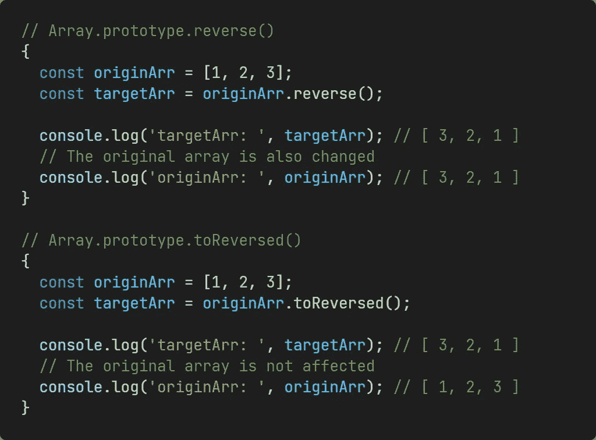

# 4 个即将推出的 JavaScript 数组方法

> 原文：<https://levelup.gitconnected.com/4-upcoming-javascript-array-methods-6b1c7539eafd>

## 他们在解决什么问题？

Muhannad Ajjan 在 [Unsplash](https://unsplash.com?utm_source=medium&utm_medium=referral) 上拍摄的照片

TC39 即将完成一个技术方案——[通过复制](https://github.com/tc39/proposal-change-array-by-copy)改变数组。现在已经到了第三阶段，也就是说各大浏览器厂商会在不久的将来实现。本文将向您简要介绍它们。

具体来说，以下函数属性将被导入到`Array.prototype`和`TypedArray.prototype`中:

# 1.反向()

和之前的`Array.prototype.reverse()`相比，`Array.prototype.toReversed()`并没有改变原来的阵列。

例如:

# 2.toSorted(比较)

`Array.prototype.toSorted(compareFn)`也差不多，它不像`Array.prototype.sort(compareFn)`那样改变原来的阵列。

# 3.toSpliced(开始，删除计数，…项)

前面的`Array.prototype.splice(start, deleteCount, …items)`可以从`start`中删除`deleteCount`元素，并将`...item`添加到数组中。调用此方法时，将返回已删除的数组，并且它还会更改原始数组。我在之前的文章里有详细的对比:

 [## 面试官:请告诉我切片、拼接和分割的区别？

### 你打算怎么回复他？

javascript.plainenglish.io](https://javascript.plainenglish.io/interviewer-please-tell-me-the-difference-between-slice-splice-and-split-5a6617692395) 

然后`Array.prototype.toSpliced(start, deleteCount, …items)`类似于`splice`，但是不改变原来的数组。调用此方法将返回原始数组的已更改副本，而不是已删除的数组。

# 4.with(索引，值)

`Array.prototype.with(index, value)`可以给数组的索引项赋值，类似于`array[index] = value`。但是它返回原始数组的一个更改后的副本，对原始数组没有任何影响。

# 结论

可以看出，这些方法保持原始数组不变，并返回一个已更改的副本。这在某些情况下很有用。目前还没有量产，TC39 也提供了它的 [polyfill.js](https://github.com/tc39/proposal-change-array-by-copy/blob/main/polyfill.js) (极简参考实现)。

从 [polyfill.js](https://github.com/tc39/proposal-change-array-by-copy/blob/main/polyfill.js#L102-L110) 也可以看出，这些方法返回的是原数组的浅拷贝。一旦原始数组存储了引用类型数据，了解引用类型数据的特性以避免意外情况是很重要的。

那么你对这些即将到来的函数方法怎么看？

# 参考

[1]https://github.com/tc39/proposal-change-array-by-copy

*今天就到这里。我是 Zachary，我将继续输出与 web 开发相关的故事。如果你喜欢这样的故事，想支持我，请考虑成为* [*中等会员*](https://medium.com/@islizeqiang/membership) *。每月 5 美元，你可以无限制地访问媒体内容。如果你通过* [*我的链接*](https://medium.com/@islizeqiang/membership) *报名，我会得到一点佣金。*

你的支持对我来说非常重要——谢谢。