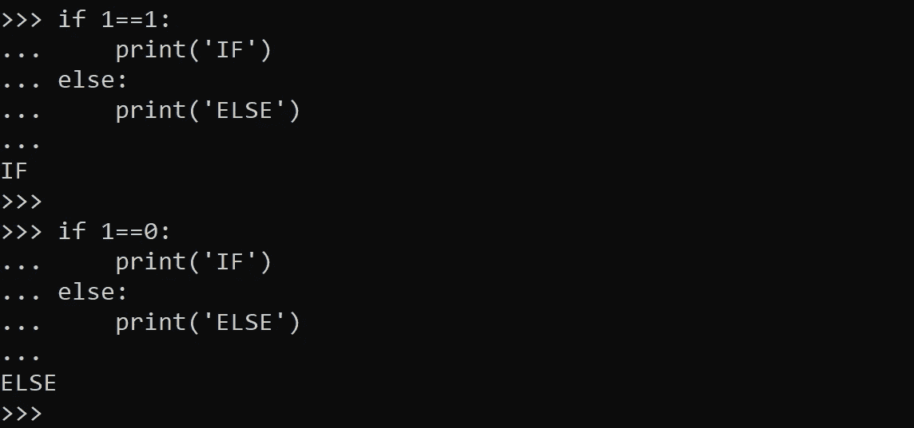
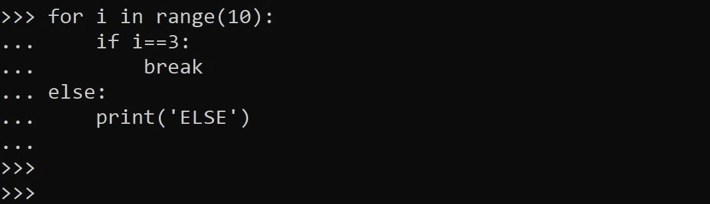
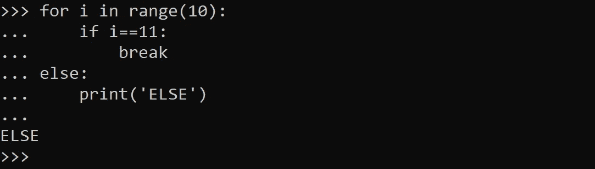
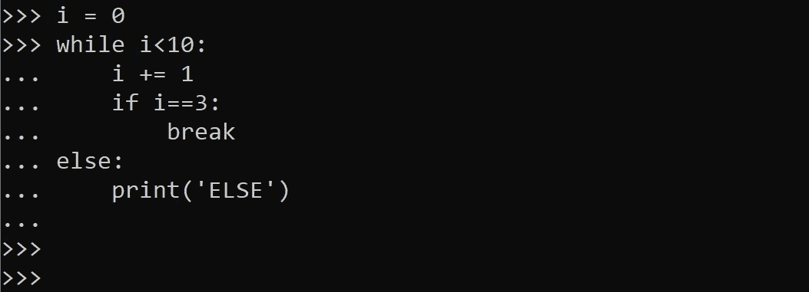
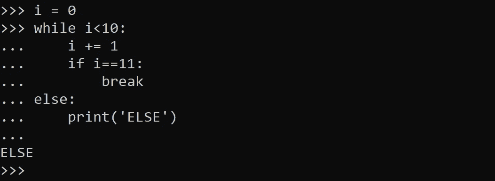
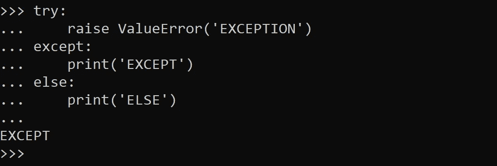
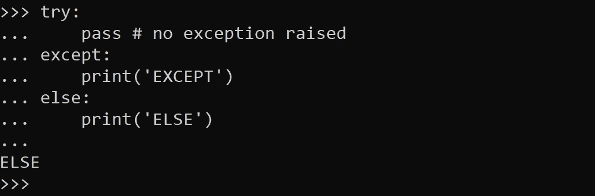
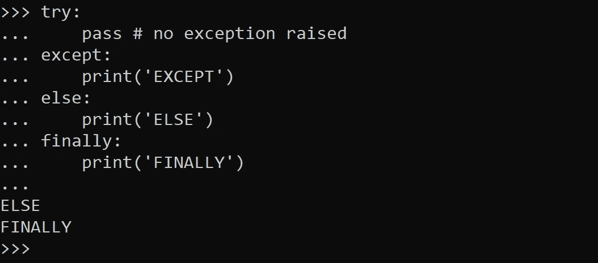

# Python 中 ELSE 子句的 4 种用法

> 原文：<https://levelup.gitconnected.com/4-usages-of-an-else-clause-in-python-c91c392733c1>

其中一些的存在可能会让你大吃一惊。

我们大多数人都知道 IF-ELSE 语法。但是 IF 语句并不是使用 ELSE 子句的唯一地方。写循环的时候没用过 ELSE 子句吗？或者在处理异常时？如果没有，那么在接下来的几个段落中，您很可能会发现 Python 编程语言的一些新内容。

由 [Unsplash](https://unsplash.com?utm_source=medium&utm_medium=referral) 上的[absolute vision](https://unsplash.com/@freegraphictoday?utm_source=medium&utm_medium=referral)拍摄

> 如果-否则

这是 ELSE 子句最广为人知的用法。我就不多写了。如果你是一个 Python 程序员，你每天都在使用这个。

IF-ELSE 语句(作者截图)

一切都清晰明了。现在让我们来看一个更有趣的用例。

> FOR-ELSE

我们使用 FOR 关键字来创建循环。但是并不是每个人都知道 FOR 循环有一个可选的 ELSE 子句。让我们考虑下面的例子。

FOR-ELSE 语句(作者截图)

如您所见，我们在与 FOR 关键字相同的级别上使用了 ELSE 子句(没有与 IF 语句一起使用)。代码执行成功，但没有触发 ELSE 子句中的代码。

现在让我们将它与下面一个稍微不同的例子进行比较。

FOR-ELSE 语句 2(作者截图)

如您所见，现在 ELSE 子句中的代码被触发，因为文本“ELSE”被打印出来。与前一个例子的唯一区别是，FOR 循环中的条件从不为真，因此 BREAK 语句没有执行，我们遍历了所有的元素。

这正是 ELSE 子句在 for 循环中的用途。如果循环遍历了所有元素，则执行该子句。这种逻辑背后的直觉如下——通常，当我们找到感兴趣的项目时，我们会跳出循环，否则(如果我们没有找到它),我们会完全遍历循环。

> 而-否则

在 WHILE 循环中使用 ELSE 子句时，也有类似的想法。如果我们跳出循环，ELSE 子句将不会像下面的例子那样执行。

WHILE-ELSE 示例(作者截图)

让我们改变循环内部的条件，使 BREAK 语句永远不会被触发。

WHILE-ELSE 示例 2(作者截图)

正如所料，现在我们看到控制台中打印出文本“ELSE”。

因此，如果 WHILE 循环由于其条件评估为“False”而结束，我们将执行 ELSE 子句。但是，如果我们中断循环或从函数内部执行 RETURN 语句，则不会执行 ELSE 部分。

> 尝试-除了-否则

现在，这个用例与之前的略有不同。我们通常使用 TRY 关键字来处理异常。但是我们也可以在 TRY 语句中使用 ELSE 子句。让我们从一个简单的例子开始。

TRY-EXCEPT-ELSE 语法(作者截图)

我们可以看到在 TRY-EXCEPT 语句中使用了 ELSE 子句，但是我们可以从输出中观察到——该子句没有被执行。

现在，让我们尝试修改代码，以便执行 ELSE 子句。

TRY-EXCEPT-ELSE 语法 2(作者截图)

答对了。现在我们看到 ELSE 子句在起作用。我们也对这里的工作方式有了直觉。仅当没有引发异常时，才会执行 TRY-EXCEPT 语句中的 ELSE 子句。

如果我们稍微改变一下措辞，使“else”一词在语义上有意义——如果有异常，则执行 EXCEPT 子句，否则(如果没有异常)Else 部分起作用。

当然，我们也可以使用 FINALLY 子句—这在所有情况下都会执行。完整的语法示例如下。

TRY-EXCEPT-ELSE-FINALLY 语句(作者截图)

不出所料，文本“FINALLY”会在控制台输出中打印出来。

## 多一条 IF-ELSE 语句作为奖励

如果您在本文中学习了至少一种新的 Python 代码构造:请关注我，不要错过其他类似的文章。

ELSE:跟不跟我你看着办。

由 [Unsplash](https://unsplash.com?utm_source=medium&utm_medium=referral) 上的 [Alexas_Fotos](https://unsplash.com/@alexas_fotos?utm_source=medium&utm_medium=referral) 拍摄的照片

感谢阅读！