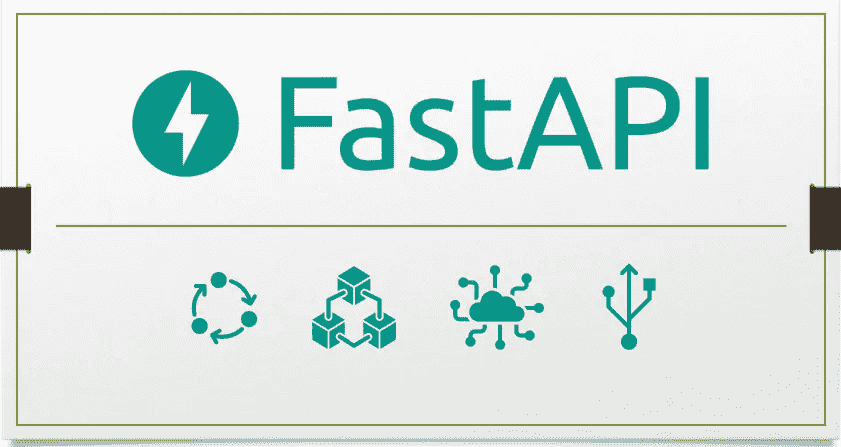
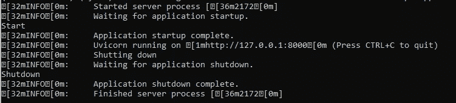

# FastAPI 中 4 个有用的高级特性

> 原文：<https://levelup.gitconnected.com/4-useful-advanced-features-in-fastapi-f08e4db59637>

请求、事件处理程序、环境变量和 WSGIMiddleware



作者图片

今天的主题是 FastAPI 中的四个高级特性，它们可能对您的 web 应用程序有用。如果您是 FastAPI 的新手，强烈建议您在继续之前遵循官方文档提供的[入门指南](https://fastapi.tiangolo.com/tutorial/)。

而且，我已经覆盖了两个 FastAPI 教程关于[如何从 Flask 迁移到 FastAPI 和平滑](https://medium.com/better-programming/migrate-from-flask-to-fastapi-smoothly-cc4c6c255397)和[元数据和 FastAPI](https://medium.com/better-programming/metadata-and-additional-responses-in-fastapi-ea90a321d477) 中的附加响应。如果您想了解更多与 FastAPI 相关的技巧和诀窍，请随时查看它们。在本教程中，我将解释背后的基本概念:

*   `Request` —直接使用`Request`对象获取客户端地址、请求体、cookies 等。
*   `Event handlers` —注册应用程序启动或关闭时要执行的功能。
*   `Environment variables` —处理与您的项目相关的配置和设置。
*   `WSGIMiddleware` —将您的 Flask 或 Django 服务器作为子应用程序包含在 FastAPI 中。

# 1.请求

FastAPI 中的`Request`对象是基于 Starlette 的`Request`之上的附加工具。事实上，您可以在 path 操作函数中直接使用它来获取客户机的 IP 地址等详细信息。看看下面的代码片段。当您调用它时，API 将返回客户端的主机和端口。

根据官方文档，`Request`对象有以下常用字段:

*   `Method` —可通过`request.method`进入。
*   `URL` —可通过`request.url`进入。包含其他组件，如`request.url.path`、`request.url.port`、`request.url.scheme`。
*   `Headers` —可通过`request.headers`进入。组件被公开为不可变的、不区分大小写的 multi-dict。例如，您可以使用`request.headers[‘content-type’]`从标题中获取`Content-Type`。
*   `Query Parameters` —可通过`request.query_params`进入。就像`Headers`一样，您可以使用 `request.query_params['search']`来访问查询参数
*   `Path Parameters` —可通过`request.path_params`进入。参数被公开为多字典。例如，`request.path_params['name']`
*   `Client Address` —可通过`request.client`进入。保存主机和端口的命名二元组。具体可以通过`request.client.host`和`request.client.port`了解。
*   `Cookies`—cookie 基于字典接口。您可以使用`request.cookies.get('mycookie')`访问其中的字段。
*   `Body` —返回体由基于您的用例的多个接口组成。要获取字节数据，可以使用`request.body()`。表单数据或多部分作为`request.form()`发送。此外，您可以使用`request.json()`将输入解析为 JSON。

# 2.事件处理程序

在 FastAPI 中，您可以定义事件处理程序，它将在应用程序启动或关闭时执行注册的函数。但是，请注意，FastAPI 将只执行主应用程序的事件处理程序。如果您已经安装了另一个子应用程序，则该子应用程序中的事件处理程序将不会被执行。

## 启动

您可以通过函数顶部的`on_event()`装饰器轻松地向事件注册或添加函数。用`startup`为应该在 FastAPI 服务器启动之前运行的函数声明装饰器。让我们看看下面的例子。

```
@app.on_event("startup")
async def startup_event():
    print('Start')
```

您可以将所有初始化代码放在这个函数中。当你运行 FastAPI 服务器时，`Start`会显示在你的控制台上。

## 关机

另一方面，你应该将`shutdown`作为`on_event()`装饰器的输入参数，而不是在应用程序关闭前运行函数。下面的例子演示了一个简单的关闭函数，它在应用程序关闭之前在控制台上打印出`Shutdown`。

```
@app.on_event("shutdown")
async def shutdown_event():
    print('Shutdown')
```

当您运行 FastAPI 服务器并通过 Ctrl+C 退出应用程序时，您应该会看到以下输出。



作者图片

在撰写本文时，如果您使用的是`reload`标志，似乎会出现一个[问题](https://github.com/tiangolo/fastapi/issues/1937)，即关机事件在大多数情况下不会被触发。

此外，如果你的函数涉及到 I/O 绑定功能的使用，比如读或写一个文件，你应该使用标准的`def`函数而不是`async def`。

```
@app.on_event("shutdown")
def shutdown_event():
    with open("log.txt", mode="a") as log:
        log.write("Application shutdown")
```

# 3.环境变量

有许多方法可以处理 FastAPI 服务器中的配置设置。其中之一就是依靠 Pydantic 提供的`BaseSettings`实用模块。

## 配置文件

在 FastAPI 服务器的同一个目录下创建一个名为`config.py`的新 Python 文件。然后，在文件中添加以下代码。

## FastAPI 服务器

将 FastAPI 服务器文件中的导入语句修改如下。我们将使用 dependencies 方法来加载我们的设置。这主要是因为您可以很容易地用您的自定义设置覆盖一个依赖项，这在测试过程中非常有用。

此外，我们还导入了`lru_cache`函数，该函数为应用程序在每次请求期间重复使用相同的设置对象提供了一种便捷的方式。它只会在第一次被调用时创建一次`Settings`对象。

```
from fastapi import FastAPI, Depends
from functools import lru_cacheimport config
```

接下来，在 FastAPI 实例初始化的正下方追加以下函数。

负责设置的全局 getter 函数的第一个函数。第二个函数展示了如何在路径操作中获取设置。您可以通过向`config.Settings()`函数传递相应的参数来轻松修改设置。例如，您可以按如下方式更改基础电子邮件设置:

```
@lru_cache()
def get_settings():
    return config.Settings(email = "new@example.com")
```

# 4.WSGIMiddleware

在本节中，我们将学习如何将 Flask 服务器作为子应用程序包含在 FastAPI 中。这允许您在 FastAPI 中继续开发，同时保留旧 Flask 服务器的功能，而不需要额外的修改。

你需要做的就是导入`WSGIMiddleware`

```
from fastapi.middleware.wsgi import WSGIMiddleware
```

并通过传入 Flask 或 Django 实例将其挂载到 FastAPI。

```
app.mount("/flask", WSGIMiddleware(flask_app))
```

此外，您必须使用`flask_app`装饰器声明所有的 Flask 路径

```
@flask_app.route("/")
def flask_main():
    return "Hello from Flask!"
```

你可以在下面的[要点](https://gist.github.com/wfng92/e28e61a4291a0c8770cd14370d637df7)中找到完整的代码。

重新运行您的 FastAPI，并在您的浏览器中转到以下 URL。

```
[http://localhost:8000/flask](http://localhost:8000/flask/main)
```

您应该会看到以下输出

```
Hello from Flask!
```

如果您已按如下方式声明了烧瓶路线:

```
@flask_app.route("/main")
def flask_main():
    return "Hello from Flask!"
```

您应该通过以下 URL 访问 API

```
[http://localhost:8000/flask/main](http://localhost:8000/flask/main)
```

# 5.结论

让我们回顾一下今天所学的内容。

我们从学习`Request`物体的细节开始。因为它是基于 Starlette 的`Request`对象的，所以我们可以直接访问它来通知重要的信息，比如客户端的主机和端口号。

接下来，我们尝试向启动和关闭事件处理程序注册函数。我们可以使用它们来执行应用程序启动和关闭的功能。

我们继续学习，了解了一些在 FastAPI 中处理配置和设置的方法。其中之一是依靠`BaseSettings`实用模块，通过依赖方法加载我们的设置。

最后，我们测试了使用`WSGIMiddleware`模块在 FastAPI 服务器中安装 Flask 应用程序。

感谢你阅读这篇文章。希望在下一篇文章中再见到你！

# 参考

1.  [FastAPI 直接使用请求](https://fastapi.tiangolo.com/advanced/using-request-directly/)
2.  [小明星请求](https://www.starlette.io/requests/)
3.  [FastAPI 事件](https://fastapi.tiangolo.com/advanced/events/)
4.  [FastAPI WSGIMiddleware](https://fastapi.tiangolo.com/advanced/wsgi/)