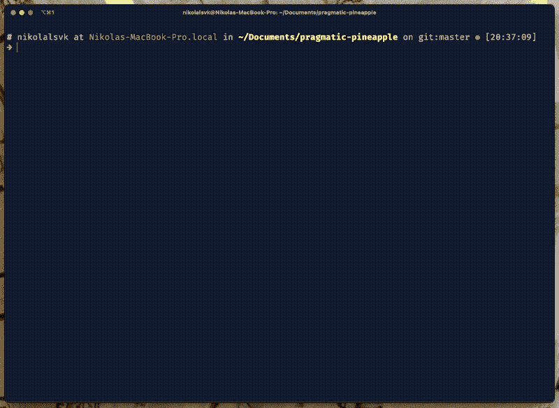
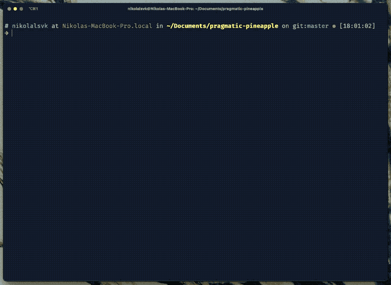
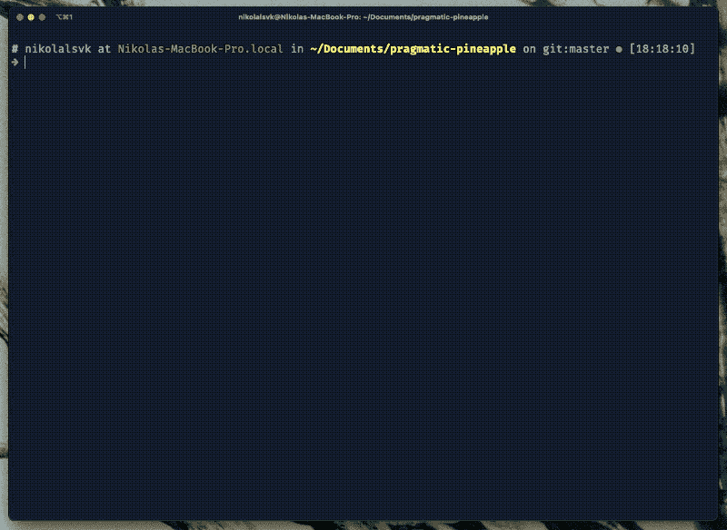
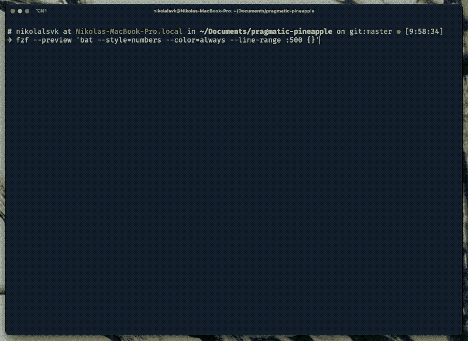
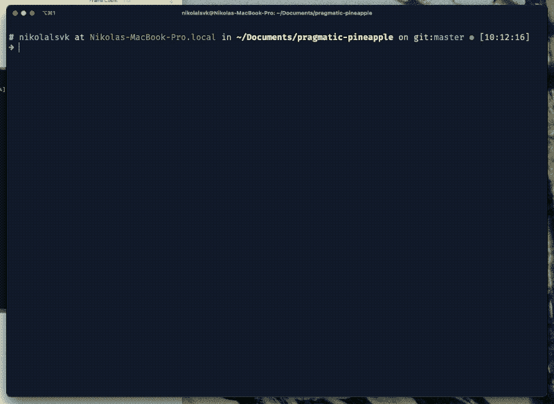

# 4 个对你的终端有用的 fzf 技巧

> 原文：<https://levelup.gitconnected.com/4-useful-fzf-tricks-for-your-terminal-18a5d2a8c0cb>

欢迎，您可能对使用最好的命令行工具之一——fzf 感兴趣。fzf 是一个用于模糊搜索的命令行工具。嗯，一开始，听起来可能没那么吸引人。但是，请原谅我，它非常性感，而且它会让你的生活变得更轻松。

我准备了四个窍门，你可以在候机楼里随时准备好。但是首先，让我们回顾一下如何设置 fzf。


# 入门指南

如果您还没有，您可以使用 Git 安装 fzf:

```
git clone --depth 1 https://github.com/junegunn/fzf.git ~/.fzf ~/.fzf/install
```

我发现这是最简单的。或者，如果您使用的是 macOS，并且想要跳过所有的麻烦，您可以使用以下命令:

```
brew install fzf# To install useful key bindings and fuzzy completion:
$(brew --prefix)/opt/fzf/install
```

如果你仍然有问题，试试关于安装的 [fzf 文档。](https://github.com/junegunn/fzf#installation)

# 麦克风检查

安装后，让我们去尝试基本的 fzf 功能。您可以尝试在您的终端中运行`fzf`。您应该会看到类似这样的内容:



模糊查找器在您的终端窗口中启动，您可以搜索您想要的任何文件。最酷的是，fzf 可以在你打字的时候索引文件。如果你的目录没有太多关于文件和目录的复杂性，你不会注意到底部的索引。

# 1.模糊地改变目录

今天的第一个技巧是使用 fzf 快速地`cd`进入一个目录。可以按`ALT + c`(MAC OS 上的`OPTION + c`)，会得到交互提示。请看下面:



它开始索引你现在所在的目录中的所有目录的内容。你可以开始输入想要的目录，用箭头键选择你需要的目录，然后按回车键进入目录。方便吧？

# 2.穿越历史

老实说，第二个技巧也是我最喜欢的一个，是用 fzf 搜索命令历史的能力。要开始，请在您的终端中按`CTRL + r`。然后，搜索您之前键入的命令。您应该会看到类似这样的内容:



可以快速跳转到前段时间输入的命令。我发现它在日常生活中非常有用。

# 3.自动完成任何内容

您几乎可以在终端的任何地方使用 fzf。默认的一个功能是让你快速找到进程杀。你可以通过键入`kill -9`并按下`TAB`来尝试一下。如果这不起作用，请键入`kill -9 **`和`TAB`。现在，您可以搜索想要结束的一个或多个流程。

您还可以快速搜索 SSH 的主机名。为此，键入`ssh **`并按下`TAB`。您将获得交互式搜索来找到想要的主机名。

总而言之，下面是一些默认情况下可以使用的选项:

```
kill -9 **<TAB>ssh **<TAB>
telnet **<TAB>unset **<TAB>
export **<TAB>
unalias **<TAB
```

如果你厌倦了键入`**`，你可以通过设置`FZF_COMPLETION_TRIGGER`变量来改变 fzf 触发器。例如:

```
# Use ~~ as the trigger sequence instead of the default **
export FZF_COMPLETION_TRIGGER='~~'
```

如果你想进行下一步，试试 [fzf-tab](https://github.com/Aloxaf/fzf-tab) 插件。我使用的是 zsh 和 oh-my-zsh，所以设置起来非常简单。该插件基本上是将 fzf“插入”到默认的制表符补全中。我建议你尝试一下。

# 4.在选择文件之前预览它们

另一个很酷的尝试是 fzf 的预览功能。它允许您在打开文件之前预览文件。要访问它，你需要把`--preview-`传给 fzf。让我们来看看它的实际应用:



我发出的命令是:

```
fzf --preview 'bat --style=numbers --color=always --line-range :500 {}'
```

但是你可以随意定制。我的命令使用了`bat`，你可以在 [GitHub](https://github.com/sharkdp/bat) 上找到的`cat`克隆。您也可以像这样使用简单的`cat`命令:

```
fzf --preview 'cat {}'
```

或者，如果您想更进一步，您可以在完成特定命令时设置默认预览选项。您可以显示目录和文件的树状视图，如下所示:



使用`tree`的力量也可以达到类似的效果。我只好用`brew install tree`把它安装在 macOS 上。然后，我添加了`_fzf_comprun`函数在 shell 初始化时加载(可以在`.bashrc`或者`.zshrc`中添加)。这是它的样子:

```
_fzf_comprun() {
  local command=$1
  shiftcase "$command" in
    cd)           fzf "$@" --preview 'tree -C {} | head -200' ;;
    *)            fzf "$@" ;;
  esac
}
```

如果您愿意，您可以使用更多命令添加更多案例，因为您可能希望不同的命令在其他案例中显示预览。例如，`cat`和`bat`可以很好地处理文件，但是不能预览 SSH 到的目录和主机名。

# 5.好处:与 Vim 集成

如果你已经在使用 Vim(或者你正在计划)，我必须告诉你，fzf 与 Vim 完美契合。模糊搜索，预览窗口和定制选项是如此可爱，你会希望在其他任何情况下都有它。

如果你对设置 Vim 和 fzf 感兴趣，可以看看我关于用 fzf 改进 Vim 工作流的博文。此外，如果你对我的设置感兴趣，我会在 GitHub 上维护和添加我的[点文件的新功能。](https://github.com/nikolalsvk/dotfiles)

# 总结

fzf 是一个很好的工具，尤其是当你住在航站楼里的时候。我希望这篇博文能教会你一些新东西，或者启发你尝试这些技巧。

如果你喜欢你所读的，考虑订阅我的[时事通讯](https://pragmaticpineapple.com/newsletter)，当有新的帖子出现时，你会得到更新。此外，您还可以在下面的 Twitter 上评论、点赞或与您的朋友分享:

下次再见，干杯。

*原载于 2021 年 6 月 21 日 https://pragmaticpineapple.com**[*。*](https://pragmaticpineapple.com/four-useful-fzf-tricks-for-your-terminal/)*