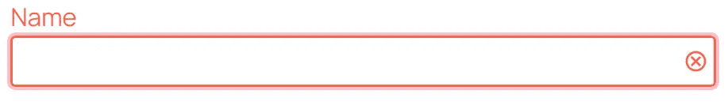

# CSS :has()可以让你的 HTML 表单变得更好的 4 种方法

> 原文：<https://levelup.gitconnected.com/4-ways-css-has-can-make-your-html-forms-even-better-350f03fa5821>


最近有很多关于 [CSS](https://austingil.com/category/css/) `[:has()](https://developer.mozilla.org/en-US/docs/Web/CSS/:has)` [伪类](https://developer.mozilla.org/en-US/docs/Web/CSS/Pseudo-classes)的炒作。理所当然！这基本上是我们多年来一直要求的“父母选择器”。今天我想重点谈谈我们如何使用`:has()`让 [HTML](https://austingil.com/category/html/) 表单变得更好。

# 前言

在本文中，我将使用自定义的[表单](https://austingil.com/how-to-build-html-forms-right-semantics/)控件，如下所示:

```
<div class="control">
 <label for="name">Name</label>
 <div class="control__input">
  <input type="text" id="name" name="name" required>
 </div>
</div>
```

一个`[<div>](https://developer.mozilla.org/en-US/docs/Web/HTML/Element/div)`包装整个控件，一个`[<label>](https://developer.mozilla.org/en-US/docs/Web/HTML/Element/label)`保持输入[可访问](https://austingil.com/category/accessibility/)，一个包装输入元素的`<div>`，以及`[<input>](https://developer.mozilla.org/en-US/docs/Web/HTML/Element/input)`元素本身。输入元素将没有边框或背景。“control _ _ input”`<div>`将具有作为表单控件的可视表示的样式。

```
.control :where(input, select, textarea) {
  border: 0;
  background-color: transparent;
}
.control__input {
  display: flex;
  align-items: center;
  gap: .125rem;
  border: .125rem solid;
  border-radius: .25rem;
  padding: .25rem;
}
```


这种方法允许我们在输入类型为“email”时添加一些小的设计修饰，比如“at”符号。


在 [DOM](https://developer.mozilla.org/en-US/docs/Web/API/Document_Object_Model) 中包含元素使得对它们或动画应用样式变得更加容易。这对本文中的例子也很有用。

# 自定义焦点样式

CSS 为样式元素提供了许多不错的伪类。对表单输入特别有帮助的一个是`[:focus-visible](https://developer.mozilla.org/en-US/docs/Web/CSS/:focus-visible)`,它让我们在元素通过键盘导航聚焦时对元素应用样式。

当我们的输入获得焦点时，在包装器上应用焦点样式会更好。我们可以用`:has()`做到这一点:

```
.control__input:has(:focus-visible) {
  outline: 3px solid plum;
}
```


# 在线验证反馈

如果我们想给用户反馈输入是有效还是无效呢？我们可以用`[:valid](https://developer.mozilla.org/en-US/docs/Web/CSS/:valid)`和`[:invalid](https://developer.mozilla.org/en-US/docs/Web/CSS/:invalid)`伪类做到这一点。

让我们在输入包装器中添加几个 SVG 来提供一些视觉反馈。默认情况下，我们会将它们设置为`display:none`，这样您就看不到它们了。

```
<div class="control">
 <label for="name">Name</label>
 <div class="control__input">
  <input type="text" id="name" name="name" required>
  <svg class="icon icon-check" role="presentation">
   <use href="#icon-check"></use>
  </svg>
  <svg class="icon icon-cancel" role="presentation">
   <use href="#icon-cancel"></use>
  </svg>
 </div>
</div>
```

使用`:has()`伪类，我们可以显示适当的 SVG 以及为整个表单控件添加颜色；绿色代表有效反馈，红色代表无效反馈。

为了避免一次提供太多的反馈，我们还将使用`[:focus](https://developer.mozilla.org/en-US/docs/Web/CSS/:focus)`伪类来将样式仅应用于当前聚焦的输入。

```
.control__input is(.icon-cancel, .icon-check) {
  display: none;
}
.control:has(:focus:invalid) .icon-cancel,
.control:has(:focus:valid) .icon-check {
  display: unset
}
.control:has(:focus:invalid) {
  color: tomato;
}
.control:has(:focus:valid) {
  color: limegreen;
}
.control:has(:focus-visible:invalid) .control__input {
  outline-color: pink;
}
.control:has(:focus-visible:valid) .control__input {
  outline-color: palegreen;
}
```

我们可以看到，当控件的输入获得焦点并且输入具有无效状态时，整个表单控件变成红色，并且您可以看到“cancel”图标。随着用户输入，当输入有效时，整个表单控件变成绿色，您可以看到“check”图标。



在顶层着色很方便，因为这些样式可以向下传播到标签、输入包装器的边框、输入文本和图标 SVG 的填充。

这种效果也适用于`select`元素，但是我建议将`option`元素重置为默认颜色。否则，它们会继承绿色和红色。

```
.control option {
  color: initial;
}
```

请注意，添加图标和改变颜色并不是一个完整的验证策略，因为它对有视觉障碍的用户不起作用，并且不能传达输入有什么问题。这种增加应该伴随着对输入约束和验证错误消息的清晰描述。

Jhey Tompkins 进一步发展了这个概念，使用隐藏占位符和`[:placeholder-shown](https://developer.mozilla.org/en-US/docs/Web/CSS/:placeholder-shown)`伪类，只在用户与输入交互后添加反馈。点击这里查看他的精彩演示:[https://codepen.io/jh3y/pen/yLKMOBm](https://codepen.io/jh3y/pen/yLKMOBm)

我喜欢这个概念，但是这个`:placeholder-shown`技巧对我来说总是有点奇怪，因为它移除了占位符的功能。将来我们应该有`[:user-invalid](https://developer.mozilla.org/en-US/docs/Web/CSS/:user-invalid)`专门用于这个用例。目前它只在 Firefox 中受支持。

# 类似卡片的输入选项

考虑一个表单，询问您最喜欢的前端语言是什么，以及它的名称、徽标和描述。它可能看起来像这样:


不幸的是，网络没有为我们提供`<input type="card">`选项。但我们是开发人员，所以我们将利用现有资源来构建一个。

因为 UI 提出了一个只能有一个答案的问题，所以这项工作的最佳工具是三个`<input type="radio">`元素。我们将使用一个`[<fieldset>](https://developer.mozilla.org/en-US/docs/Web/HTML/Element/fieldset)`在语义上将输入分组在一起。输入需要一个`<label>`。用 label 元素包装整个卡片，让用户可以单击卡片并选择输入内容，这可能很有诱惑力，但这样卡片的全部内容就会被屏幕阅读器读出，我希望避免这种情况。相反，使用语言名称作为标签是有意义的。我们稍后会解决让整张卡片可点击的问题。最后，由于 UI 中已经有了一个小描述，我们不妨使用`aria-describedby`属性将它与输入关联起来。

```
<fieldset>
  <legend>What's your fave frontend language</legend>
  <div class="cards">
    <div class="card card--html">
      
      <label for="html">HTML</label>
      <input id="html" type="radio" name="fe-fave" aria-describedby="html-description" class="visually-hidden">
      <p id="html-description">The bones of any good website</p>
    </div>

    <! – CSS card markup – >

    <! – JavaScript card markup – >
  </div>
</fieldset>
```

根据设计，您可能会注意到明显的**缺少**无线电输入。我们想对样式做的第一件事是确保我们的无线电输入是不可见的，但仍然是可访问的。我们不能使用`display:none`,因为那会将它从文档中移除。那么它就不可点击或键盘访问。相反，我们将使用[一个通用模式](https://www.a11yproject.com/posts/how-to-hide-content/)和一个名为“可视隐藏”的类。看起来是这样的:

```
.visually-hidden {
  border: 0;
  clip: rect(0 0 0 0);
  height: auto;
  margin: 0;
  overflow: hidden;
  padding: 0;
  position: absolute !important;
  width: 1px;
  white-space: nowrap;
}
```

接下来，我希望用户能够点击卡片的任何地方来选择它，但我不想破坏可访问性。在 [Inclusive Components](https://inclusive-components.design/cards/) 中还有另一种类似卡片的便捷模式。

我们可以将一个`[:after](https://developer.mozilla.org/en-US/docs/Web/CSS/::after)` [伪元素](https://developer.mozilla.org/en-US/docs/Web/CSS/Pseudo-elements)添加到标签中，并定位它以覆盖整个卡片。这具有使`<label>`表现得好像它覆盖了整张卡片的效果。用户可以点击卡片上的任何地方，点击标签元素，激活相关的输入。

```
.card {
  position: relative;
}
.card label:after {
  content: '';
  position: absolute;
  inset: 0;
}
.card a {
  position: relative;
}
```

卡片中的其他交互元素应该是`position:relative`，这样它们仍然可以被点击。

好了，鼠标用户被照顾到了，让我们也考虑一下键盘用户。

我们在键盘输入方面做得很好，但是用户看不到他们的焦点轮廓，因为它们在视觉上是隐藏的。

这就是`:has()`可以帮助我们的地方。

我们可以将任何输入具有:focus-visible 伪类的卡片作为目标，并对卡片应用一个轮廓。

```
.card:has(input:focus-visible) {
  outline: 3px solid plum;
}
```

输入在视觉上仍然是隐藏的，但是卡片接收到一个轮廓。


这个技巧的最后一部分是提供一些视觉反馈，输入当前是活动的。为此，我们可以做一个与上一个类似的技巧，但是使用`[:checked](https://developer.mozilla.org/en-US/docs/Web/CSS/:checked)`伪类。

当卡片包含选中的输入时，应用样式；在这种情况下，一个[方框阴影](https://developer.mozilla.org/en-US/docs/Web/CSS/box-shadow)。

```
.card:has(:checked) {
  box-shadow: inset 0 0 0 .25em mediumpurple;
}
```


(我应该使用复选框，这样我可以选择所有三个)

这个例子可能是最不依赖`:has()`的，因为没有它完成同样的事情并不困难。您必须将输入移动到 card 元素之前，然后使用 CSS 兄弟[组合器](https://developer.mozilla.org/en-US/docs/Learn/CSS/Building_blocks/Selectors/Combinators)来定位 card ( `input:checked + .card { /* styles */ }`)。

因此，虽然这个例子可能是最容易在没有`:has()`的情况下存在的，但是有了它，通过在 DOM 中共同定位输入和标签，我们的生活变得更加容易。

# 条件内容呈现

我想展示的下一个很酷的东西是使用`:has()`显示和隐藏 DOM 的不同部分。

考虑这个用户界面:


同样，我们有一个有几个选项的问题，但只能选择一个。因此，我们将再次使用带有一些无线电输入的`<fieldset>`。

```
<fieldset>
  <legend>Favorite Starter Pokemon</legend>
  <div>
    <input id="bulbasaur" type="radio" name="poke" value="bulbasaur" />
    <label for="bulbasaur">Bulbasaur</label>
  </div>
  <! – charmander form control – >
  <! – bulbasaur form control – >
</fieldset>
```

目前为止，没什么特别的。但是当我们选择其中一个选项时，事情就变得有趣了。我们可以根据所做的选择来显示内容。


假设表单中的某个地方有我们想要显示的项目。

```
<form>
  <div class="pokemon pokemon--bulbasaur">
    
    <p>Bulbasaur can be seen napping in bright sunlight. There is a seed on its back. By soaking up the sun's rays, the seed grows progressively larger.</p>
    <ul>
      <li>Height: 2' 04"</li>
      <li>Weight: 15.2 lbs</li>
      <li>Type: Grass/Poison</li>
      <li>Weaknesses: Fire, Psychic, Flying, Ice</li>
    </ul>
  </div>
  <! – charmander details – >
  <! – bulbasaur details – >
</form>
```

我们可以默认隐藏这些元素，然后使用`:has()`来查找被检查的特定输入，并在表单中的其他地方显示其对应的元素。

```
.pokemon {
  display: none;
}
form:has(#bulbasaur:checked) .pokemon--bulbasaur,
form:has(#charmander:checked) .pokemon--charmander,
form:has(#squirtle:checked) .pokemon--squirtle {
  display: block;
}
```

当我选择妙蛙种子时，我看到了妙蛙种子的细节。当我选择小火龙时，我看到了小火龙的细节。当我选择杰尼龟时，我会看到杰尼龟的细节。

(顺便说一句，[妙蛙种子客观上是最好的首发](https://pokemoncraze.com/2020/02/why-bulbasaur-is-actually-the-strongest-starter-gen-1-3/):只有一个多类型的。对抗早期健身房领导的最佳类型。游戏中有更强的火和水类型，但是金星龙是最强的植物类型，所以你可以在以后建立一个更好的团队)

这种模式也适用于`[<select>](https://developer.mozilla.org/en-US/docs/Web/HTML/Element/select)`或复选框。例如，如果您想制作一个比萨饼订购表单，您可以提供浇头作为复选框输入。然后在订单查看区，您可以列出所选的浇头。相当酷！

我还没有找到一种方法，在不明确添加不同的 ID 和类的情况下，在许多不同的实现中实现这一点。所以不利的一面是，你的 CSS 会随着每次实现而线性增长。

考虑到这一点，如果您只需要这样做几次，CSS 是一个很好的选择。如果您想在应用程序的多个地方显示/隐藏元素，JavaScript 可能是更好的选择。

同样值得一提的是，无论何时显示和隐藏内容，都需要考虑可访问性问题。在这种情况下，内容紧跟在交互元素(表单控件)之后。这使得辅助技术用户很容易发现发生了什么变化。但是如果内容在控件之前，或者远离控件，那么可能需要 JavaScript 来使用像`[aria-expanded](https://developer.mozilla.org/en-US/docs/Web/Accessibility/ARIA/Attributes/aria-expanded)`或`[aria-controls](https://developer.mozilla.org/en-US/docs/Web/Accessibility/ARIA/Attributes/aria-controls)`这样的工具来改善体验。

总之，我的目标是向你展示什么是可能的。太棒了。

# 自级验证提示

今天我最不想展示的是表单的提交按钮。在提交表单之前，让我们设置一个带有必填复选框的表单。如果我们在表单无效和有效时给出某种视觉反馈，那不是很酷吗？


我们可以用`:has()`来做

```
<form>
  <div class="control">
    <input id="checkme" type="checkbox" name="learned" required />
    <label for="checkme">I learned something cool!</label>
  </div>

  <button type="submit">Submit</button>
</form>
```

在上面的标记中，我们有一个必需的复选框。如果未选中，它将满足`[:invalid](https://developer.mozilla.org/en-US/docs/Web/CSS/:invalid)`伪类。

我们可以检查表单是否有任何无效输入，并相应地对提交按钮应用样式。

```
form:has(:invalid) :where(button:not([type]), button[type="submit"]) {
  opacity: 0.7;
  color: black;
  background: whitesmoke;
  cursor: not-allowed;
}
```

我们只关注那些缺少类型属性或者类型属性被设置为“提交”的按钮。这样我们就不会意外地将样式应用到`<button type="button">`上。

这实际上不会阻止表单被提交，这有利于验证和可访问性。相反，我们添加了一些额外的提示来告诉视觉用户，“嘿，你可能想再看一遍表单”。CSS 在很多方面都很棒。实际验证不在其中([还没有](https://caniuse.com/mdn-css_selectors_user-invalid))。

无论如何，当我有一个有效的表单，我可以显示按钮准备好了。当我有一个无效的表单时，我可以显示按钮没有准备好。

我觉得这很酷。

# 结束语

除了所有其他可以使用`:has()`的地方，表单还提供了一些我最喜欢的用例。许多过去需要 JavaScript 的事情现在只用 CSS 就能完成。

不幸的是，`:has()`还不具备[我们今天需要的浏览器支持](https://caniuse.com/css-has)来让它做好生产准备。

好在上面的例子很多都没有严格要求`:has()`。使用不同的标记和兄弟组合符，你可以完成相同或类似的事情。这些方法有点难以维护，但是我们离用`:has()`更简单的方法做事情不远了。

我对此很兴奋。

如果你对使用`:has()`有任何其他想法或有趣的方法，特别是如果它是以表格的形式，但不仅仅是这样，请告诉我，我很想看看你用它构建了什么样的酷东西。

非常感谢您的阅读。如果你喜欢这篇文章，请[分享它](https://twitter.com/share?via=heyAustinGil)。这是支持我的最好方式之一。你也可以[注册我的时事通讯](https://austingil.com/newsletter/)或者[在 Twitter 上关注我](https://twitter.com/heyAustinGil)如果你想知道什么时候有新文章发表。

*原载于*[](https://austingil.com/css-has-with-html-forms/)**。**