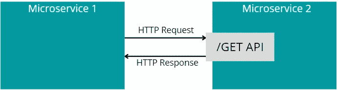
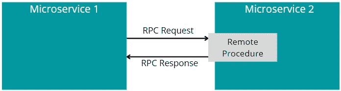
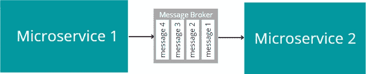
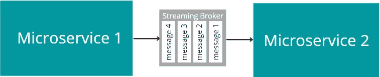

# 微服务之间建立通信的 4 种方式

> 原文：<https://levelup.gitconnected.com/4-ways-to-establish-communication-between-microservices-984207f29497>

## 每种方法的主要优缺点

亚伦·巴纳比在 Unsplash[上的照片](https://unsplash.com?utm_source=medium&utm_medium=referral)

当应用程序由单个后端服务组成时(通常称为单片应用程序)，该应用程序的类或模块在同一进程中，通常通过方法调用相互调用。

然而，一个应用程序可以由几个服务组成:在一个单一的应用程序中，逻辑的某些部分可以被分成不同目的的独立服务(可伸缩性、容错等)。).多服务的另一个例子是微服务架构。

当一个应用程序包含多个服务时，一个微服务迟早会向另一个微服务请求或传递一些数据，或者通知一个或多个其他微服务发生了一些事情。可用的集成模式很少，开发人员在选择一种模式之前必须权衡每种模式的利弊。

# RESTful Web API 端点集成

一个微服务可以很容易地公开一个 REST 端点，供其他微服务调用。当一个微服务需要调用另一个微服务并接收即时(**同步**)响应时，通常会实现通过 RESTful 端点的集成。

由于易于实现，当开发人员开始考虑集成微服务时，这可能是他们想到的第一个集成模式。在最简单的场景中，微服务 1 可以只使用`HttpClient`类来调用微服务 2 的 GET 端点。

如果选择 REST API 端点方法作为项目中许多微服务的主要集成模式，开发人员可能会考虑使用 NSwag 工具构建一个 web 客户端，并将该客户端作为共享的 NuGet 包存储在自定义的 NuGet 存储库中。

这种集成方式的好处之一是从一个微服务直接路由到另一个微服务的调用之间的**低延迟**，而不需要任何额外的组件，例如消息代理。

然而，当在项目中广泛使用时，以下 RESTful Web API 端点集成风格特征会显著增加开发时间和系统复杂性:

*   **紧耦合。**客户端微服务在编译时知道服务器微服务。如果今天微服务 A 只调用微服务 B，明天却要调用微服务 B 和 C 怎么办？开发者将不得不修改微服务 a 的代码。
*   **API 版本控制。**更改其他微服务使用的端点的接口会导致重大更改，而使用 API 版本控制技术可以避免这种情况。然而，拥有太多版本的相同 API 会导致微服务代码库中出现大量冗余代码。
*   **客户端错误处理。**每个调用其他微服务 API 的客户端微服务都应该为失败的请求实现重试逻辑。此外，客户端微服务必须存储由于服务器微服务故障或不可用而无法处理的一些存储请求的相关信息。

🔔 [**现在就订阅**](https://esashamathews.medium.com/subscribe) **，所以你不要错过我接下来的文章。**

# RPC / gRPC 集成

gRPC 是一个框架，允许开发人员实现远程过程调用(RPC)集成模式，用于微服务之间的通信。

从架构的角度来看，通过 gRPC 集成微服务与通过 RESTful Web API 端点集成微服务没有什么不同。

gRPC 框架，像 RESTful Web API 端点一样，在微服务之间创建了一个**紧密耦合**。另外，**通过改变*中定义的契约，可以很容易地对系统做出突破性的改变***。proto 文件并且没有及时更新客户端。

与 RESTful Web API 端点方法类似，gRPC 非常适合发起请求的客户端必须**等待响应的情况**。然而，由于使用了 Protobuf 协议，gRPC 通常比 RESTful Web API 端点方法提供更好的延迟和高吞吐量(T21)。

# 消息传递集成

与 RESTful Web API 端点或 gRPC 集成不同，消息传递模式允许微服务之间进行间接通信。通信通过充当中介的消息总线组件传递。

消息传递集成模式非常适合于**异步(一劳永逸)通信**，在这种情况下，微服务需要发送消息，而不是等待接收者的响应。

微服务 1 将只等待来自服务总线的消息已成功提交到队列的响应，但不会等待微服务 2 完成消息处理。

就架构而言，消息传递集成与 RESTful Web API 端点或 gRPC 确实不同。微服务是**相互解耦**的。如果其消息明天需要传递给比今天更多的消费者微服务，则不需要改变和重新编译客户端微服务代码。

此外，服务总线的使用提供了**更好的关注点分离**。Azure Service Bus 等消息代理提供了广泛的开箱即用功能，如消息重新传递、死信队列存储、监控功能、会话等。如果不使用服务总线，微服务可能需要自己实现所有这些特性。

但是，如果服务总线组件失败，应用程序将停止工作。服务总线必须高度可用，以免成为**单点故障**。

# 流式集成

当通过流媒体代理(如 Kafka、Redis)实现流媒体集成时，就**解耦**微服务而言，它在架构上类似于消息传递集成。请注意，流可以在没有流代理的情况下通过 gRPC 框架完成，但在这种情况下，服务将紧密耦合。

此外，在**消息传递**方面，流代理的作用与消息代理相同:一个微服务向流代理发送消息，一个或多个其他服务可以订阅来消费和处理它们。

然而，流和消息传递集成之间的第一个关键区别是，在消费者微服务处理了**消息之后，它们不会从流代理中删除**。

当使用消息代理时，新创建的微服务不能接收已经被另一个微服务处理过的旧消息来再次处理它们。但这可以通过流式传输代理自然完成，它可以从过去的任何时间点获取消息。

与仅充当消息传输的消息传递代理不同，流代理还充当**数据存储**。

# 摘要

RESTful web API 端点和 RPC 集成风格非常适合微服务之间的同步通信，其中客户端微服务需要发起请求并等待响应。然而，这两种方法都导致了微服务和版本问题之间的紧密耦合。

通过消息或流代理集成微服务允许松散耦合的通信。但是，消息可以根据需要在流代理中保留多长时间，甚至在消费者处理完消息之后。

感谢阅读。如果你喜欢你所读到的，看看下面这个故事:

 [## ASP.NET 核心中关于依赖注入的主要误解

### 这甚至会导致错误。

levelup.gitconnected.com](/top-misconceptions-about-dependency-injection-in-asp-net-core-c6a7afd14eb4)