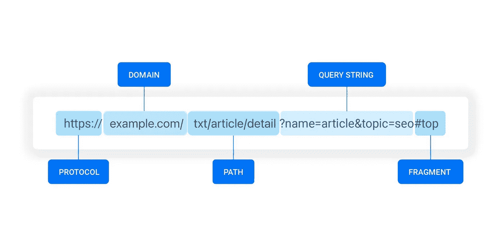
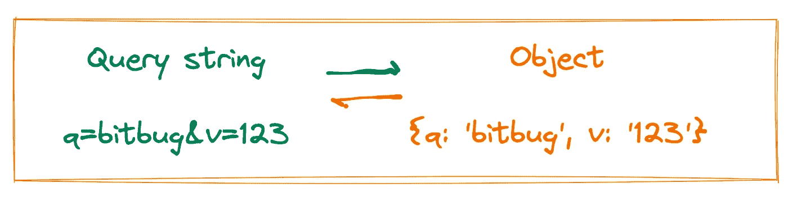

# 从查询字符串中获取值的 4 种方法

> 原文：<https://levelup.gitconnected.com/4-ways-to-get-value-from-query-string-f11034f06148>

## URLSearchParams，Regex，Array.prototype.reduce，qs 包。



# 前言

当我们开发 web 应用程序时，查询字符串通常用于携带一些关键信息。例如，Google 会将搜索关键字设置为查询字符串。如果我们搜索一个关键词`bitbug`，它的网址会是这样的:

```
https://www.google.com/search?q=bitbug
```

我们需要解析查询字符串以获取其中包含的信息，然后获取页面需要的数据。

本文将介绍 4 种获取查询字符串参数的方法

# 方法#1 URLSearchParams

`URLSearchParams`是一个 BOM API，它定义了使用查询字符串的实用方法。`URLSearchParams`是一个构造函数，接受一个查询字符串。它将从一个字符串中去掉一个起始的`?`，如果有的话。

如果我们想从 URL `https://www.google.com/search?q=bitbug`中获取关键字`q`，我们可以这样做:

```
// location.href = https://www.google.com/search?q=bitbug
const queryParams = new URLSearchParams(window.location.search);
const keyword = queryParams.get('q'); 
console.log(keyword); // equal to bitbug;
```

`URLSearchParams`有很多方法，比如`set`、`has`、`getAll`等。可以参考[URLSearchParams—Web API | MDN(mozilla.org)](https://developer.mozilla.org/en-US/docs/Web/API/URLSearchParams#methods)。

# 方法#2 正则表达式

URL 的查询字符串是`key=value&key=value`的形式，因此单个键值可以通过正则表达式匹配得到。如果我们想从 URL `https://www.google.com/search?q=bitbug`中获取关键字`q`，正则表达式可能是这样的:

```
const regex = /q=([^&#]*)/;
const matched = location.search.match(regex);
console.log(matched[1]) // equal to bitbug;
```

当然，可以有一个通用的实用函数:

```
function getQueryByName(name, search) {
    const queryString = search || window.location.search;
    const regex = new RegExp('[?&]' + name + '=([^&#]*)');
    const matched = queryString.match(regex);
    return matched ? matched[1] : '';
}getQueryByName('q', '?q=bitbug') // equal to bitbug
```

这种方法非常简单，没有兼容性问题。我在开发 web 应用程序时经常使用这个 util 函数。

# 方法 3 Array.prototype.reduce

查询字符串的每个键都有一个值，尽管该值可能不存在。这和 JavaScript 中的对象概念是一样的。



我们只需要将查询字符串解析成 JavaScript 对象来获取值，通过使用 Array.prototype.reduce，实现将非常简单:

```
function getQueryByName(name, search) {
    const queryString = (search || window.location.search).replace('?', '');
    const queryObject = queryString.split('&').reduce((prev, cur) => {
        const [key, value] = cur.split('=');
        prev[key] = value;
        return prev;
    }, {});
    return queryObject[name] || '';
}getQueryByName('q', '?q=bitbug')  //equal to bitbug
```

您还可以通过这种方式获得查询字符串中的所有键/值对，这些键/值对只返回 queryObject。

```
function getQuery(search) {
    const queryString = (search||location.search).replace('?', '');
    return queryString.split('&').reduce((prev, cur) => {
        const [key, value] = cur.split('=');
        prev[key] = value;
        return prev;
    }, {});
}getQuery('?q=bitbug&v=123'); // {q: 'bitbug', v: '123'}
```

当我们需要获取多个值时，这很有用。

# 方法#4 qs 包

[qs](https://github.com/ljharb/qs) 是用于解析或字符串化查询字符串的流行库。它有非常强大的功能，也兼容任何形式的查询字符串，如嵌套，数组等。也非常容易使用:

```
const qs = require('qs');
const obj = qs.parse('q=bitbug'); // {q: 'bitbug'}// support nesting
qs.parse('foo[bar][baz]=foobarbaz'); // {foo: {bar: {baz: 'foobarbaz'}}}// suport array 
qs.parse('a[]=b&a[]=c');  // { a: ['b', 'c'] }
```

如果你需要处理这些复杂的场景，我推荐你使用它，因为我有很多项目在使用。

# 结论

本文描述了从查询字符串中获取值的 4 种方法。前两种`URLSearchParams`和`regex`方法适合获取单个键的值，后两种更适合需要获取多个值。如果你的项目需要适应各种查询字符串形式，并且你需要兼容一些老版本的浏览器，你最好使用 [qs](https://github.com/ljharb/qs) npm 包。

最后，希望能帮到你。我期待着你的后续学习更多的实用技能。