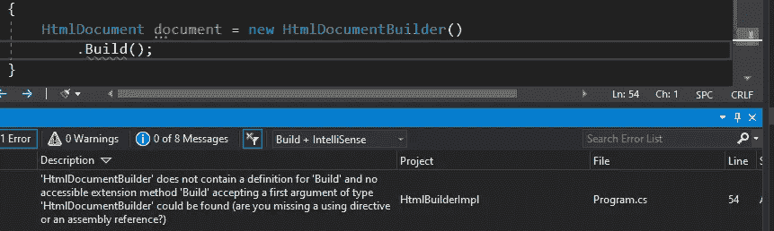

# 在 C#中实现生成器设计模式的 4 种方法

> 原文：<https://levelup.gitconnected.com/4-ways-to-implement-builder-design-pattern-in-c-dd193e07096c>

## 构建器，流畅构建器，严格构建器，嵌套构建器。


Artem Labunsky 在 [Unsplash](https://unsplash.com?utm_source=medium&utm_medium=referral) 上拍摄的照片

编程是如此复杂，以至于总是有几种方法来完成同一件事情。

构建器设计模式也不例外。我将向您介绍用 C#实现 Builder 模式的 4 种方法，同时有意避免经典的实现(根据我的观察，这实际上并没有被使用)。

尽管下面的一些实现看起来在生产中使用起来很复杂，但是它们是训练你的 OO 和编码技能的很好的练习。

# 1.只是建筑商

生成器是一个类，它提供了一组用户友好的 API，客户端可以使用这些 API 来创建对象。

构建器应该尽可能地向客户隐藏不必要的对象创建细节，以便他们容易正确地构建对象**，并且难以不正确地构建对象**。

`HtmlDocumentBuilder`公开了简单的 API 来向 HTML 文档添加标签和文本。

客户端仍然可以在调用`OpenTag`方法之前调用`CloseTag`方法，这是一个错误。然而，客户端不再需要处理字符串连接，这比交换方法调用更容易出错。

# 2.流畅的建设者

Fluent builder 是 builder 设计模式的变体，其中除了`Build`之外的每个方法都返回`this`指针。

以下是 Fluent Builder 的使用方法:

```
//Usage
HtmlDocument document = new HtmlDocumentBuilder()
    .OpenTag("p")
    .AddText("Text")
    .CloseTag("p")
    .Build();Console.WriteLine(document.Markup); //<p>Text</p>
```

Fluent Builder 允许开发人员将方法链接在一起，这看起来更优雅，并稍微减少了代码重复。

# 3.严格的建设者

前一个例子的缺点之一是这些方法可以以任何顺序调用。

比如说`Build`方法可以在还没有什么可以构建的时候先调用。当然不会出现编译错误。通知开发人员他们正在做错事的唯一方法是执行运行时检查并抛出异常。

但是，有一种方法可以实现生成器，即编译器检查方法被调用的顺序。

我们把下面的实现叫做**严格构建器**。这使得无法首先调用`Build`方法。

这个想法是将`Build`方法放到一个单独的类中。试图在`HtmlDocumentBuilder`类型上调用`Build`方法会导致复杂错误，因为`Build`方法根本不存在。



然而，在调用了`HtmlDocumentBuilder`类型上的任何其他方法之后，调用`Build`方法和往常一样简单:

```
HtmlDocument document = new HtmlDocumentBuilder()
    .AddText("Text")
    .Build();
```

`AddText`和其他方法返回包含`Build`方法的`HtmlDocumentBuilderFinal`对象。

# 4.嵌套生成器

在对象创建期间，构建者通常需要访问他正在构建的对象的属性。这意味着属性必须有公共设置器，但是这可能会破坏封装。

在这个实现中，`MailMessage`对象必须公开`List<T>`并有公共设置器供`MailMessageBuilder`填充。

实现`MailMessage`对象的完全封装并继续使用构建器功能的方法是创建一个嵌套的构建器。

`MailMessage`对象中的所有设置器现在都是私有的。

`Builder`是嵌套类，所以根据 C#语言规则，它可以访问`MailMessage`对象的私有属性。

此外，`MailMessage`类的构造函数被有意设为私有。因此，客户端实例化`MailMessage`的唯一方法是使用构建器 API:

```
var mailMessage =
    new MailMessage.Builder()
    .From("[from@from.com](mailto:from@from.com)")
    .To("[to@to.com](mailto:to@to.com)")
    .To("[to@to2.com](mailto:to@to2.com)")
    .Build();
```

在它创建的对象中嵌套一个构建器也是好的，因为相关的类共存在一起，所以**内聚性更高**。

# 结论

学习如何以不同的方式实现相同的东西是扩展您的编程视野并成为更好的开发人员的好方法。而 builder 是你可以开始积累经验的东西。

## 我的其他文章

[](/how-to-professionally-to-do-a-code-review-of-a-bug-fix-f17de72d42e0) [## 如何专业地对 Bug 修复进行代码审查

### 审查 bug 修复时要问的几个重要问题。

levelup.gitconnected.com](/how-to-professionally-to-do-a-code-review-of-a-bug-fix-f17de72d42e0) [](/5-ways-to-improve-the-performance-of-c-code-for-free-c89188eba5da) [## 5 种免费提高 C#代码性能的方法

### 慢速代码是可选的。

levelup.gitconnected.com](/5-ways-to-improve-the-performance-of-c-code-for-free-c89188eba5da) [](https://medium.datadriveninvestor.com/estimation-hell-or-what-can-developers-do-better-with-their-estimates-614f9e71f43d) [## 评估地狱，或者开发人员如何利用他们的评估做得更好？

### 估计过程很难，但没那么难。

medium.datadriveninvestor.com](https://medium.datadriveninvestor.com/estimation-hell-or-what-can-developers-do-better-with-their-estimates-614f9e71f43d)