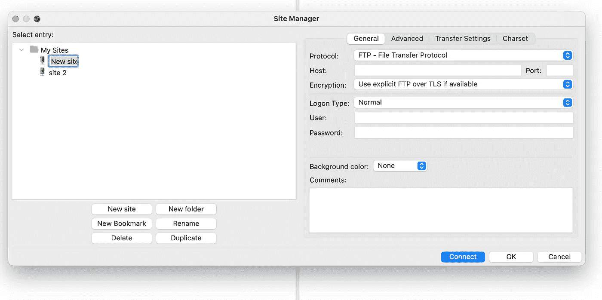

# EC2 实例上 SSH 的 4 种方式

> 原文：<https://levelup.gitconnected.com/4-ways-to-ssh-on-an-ec2-instance-8d0078c76194>

这些方法将适用于大多数基于 Linux 的服务器，但是对于本教程，我将在 AWS 的上下文中解释它

**什么是 SSH？**

> **安全外壳协议** ( **SSH** )是一种[加密](https://en.wikipedia.org/wiki/Cryptography) [网络协议](https://en.wikipedia.org/wiki/Network_protocol)，用于在不安全的网络上安全地操作[网络服务](https://en.wikipedia.org/wiki/Network_service)。它最著名的应用是远程[登录](https://en.wikipedia.org/wiki/Login)和[命令行](https://en.wikipedia.org/wiki/Command-line_interface)执行。
> 
> SSH 应用程序基于[客户机-服务器](https://en.wikipedia.org/wiki/Client%E2%80%93server_model)架构，将 [SSH 客户机](https://en.wikipedia.org/wiki/SSH_client)实例与 [SSH 服务器](https://en.wikipedia.org/wiki/SSH_server)连接起来。SSH 作为一个分层的协议套件运行，包括三个主要的层次组件:*传输层*提供服务器认证、机密性和完整性；*用户认证协议*向服务器验证用户；并且*连接协议*将加密隧道复用到多个逻辑通信信道中。
> 
> 来自[维基](https://en.wikipedia.org/wiki/Secure_Shell)

简单地说，它是一种协议(就像传输超媒体文档的 HTTP 一样),使用它可以安全地与服务器通信。

在 AWS 上，当您添加一个新的 ec2 实例时，它会被添加到一个 VPC(虚拟专用云)中，VPC 之外的任何人试图访问该机器(有时在 VPC 之内)都需要一个私钥。它有一个*。pem 分机。为了连接，您必须随身携带私钥。如果您没有它，那么请询问您的系统管理员/DevOps 或任何负责在 AWS 上管理这些机器/实例的人。*

先决条件

1.  对私钥的访问
2.  AWS 上机器的公共 DNS 或 IP
3.  端口 22 在 ec2 实例上是开放的。请签入分配给此实例的安全组。
4.  某种 FTP 客户端( [FileZilla](https://filezilla-project.org/) 、 [CyberDuck](https://cyberduck.io/) 等等。)对于选项 2 & 3

一旦您有了私钥，请确保您的密钥不会被公开。您可以通过在终端中运行该命令来确保

对密钥文件设置正确的权限

通常有两种方式将 ec2 实例暴露给一般的公共网络。

> 第一种是通过 ssh 协议上的私钥直接访问

使用私钥直接访问

使用这种设置连接到 ec2 实例非常简单。

> **选项 1，使用端子**

只需在您的终端中运行这个命令(用您自己的值替换它)

一旦连接上，您的终端将可以访问 ec2 实例。

> **选项 2，使用 sftp 客户端**

我将使用 [FileZilla](https://filezilla-project.org/) 作为例子，但是它也适用于任何其他客户端

*   **打开 FileZilla 客户端，添加一个新站点，如下所示**

FileZilla

*   **像这样将协议更改为 ssh**

*   **在主机字段添加 ec2 实例的公共 DNS 或 IP 地址**
*   **像这样选择密钥文件作为登录类型**

就这样，现在只需点击 connect 按钮，您就可以访问 ec2 实例了。

> 第二种是通过[跳转](https://en.wikipedia.org/wiki/Jump_server)服务器(也称为堡垒箱、跳转箱、跳转主机等。)其中 ec2 实例被设置在 VPC 的私有子网内，对外界的访问非常有限，并且只能通过 VPC 的公共子网中的另一个服务器来访问。

> **选项 1，使用终端**

*   将跳转框的用户密钥添加到 SSH 代理中

*   将受保护服务器的密钥添加到您的 SSH 代理中

*   开始跳跃😆

> **选项 2，使用 sftp 客户端**

*   像这样使用 ssh 连接到服务器

*   现在，去 FileZilla 打开设置，然后像这样去“通用代理”

*   然后选择 SOCKS 5 作为通用代理，并在代理端口字段中输入值 8001
*   然后像我们之前做的那样添加一个新站点，并执行以下操作
    -选择 SFTP 作为协议
    -添加受保护服务器的私有 IP/DNS
    -选择“密钥文件”作为登录类型
    -添加受保护 ec2 实例的私有密钥
*   单击 connect，现在您就连接到了位于跳转服务器后面的 ec2 实例。

请成为会员，支持我和其他在媒体上写作的人——[https://medium.com/@metacollective/membership](https://medium.com/@metacollective/membership)