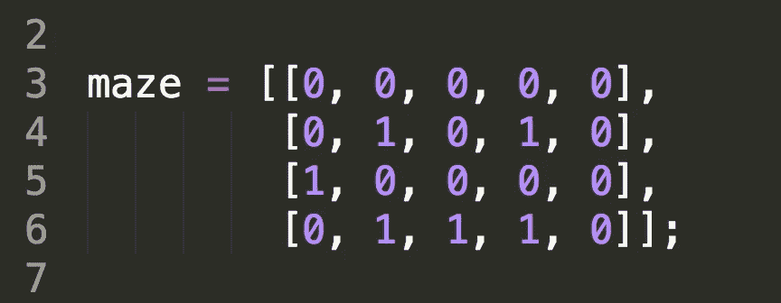
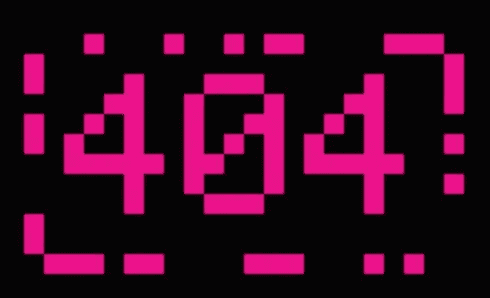

# 404 迷宫

> 原文：<https://levelup.gitconnected.com/404-maze-26eb26c42775>

## 我如何制作一个 8 位的迷宫般的 404 页面，包括 javascript 代码的演示。

作为我在新南威尔士州的 DX 实验室[州立图书馆工作的一部分，我们正在检修 DX 实验室](https://www.sl.nsw.gov.au)[网站](https://dxlab.sl.nsw.gov.au)本身(如这里的[所述](https://dxlab.sl.nsw.gov.au/blog/new-dx-lab-website))，机会来了，为该网站制作一个“有趣的”404 页面。假设你没有在网站再次更改后阅读这篇文章，你将能够在这里看到它。但为了以防万一，这里有一段视频:

那么它是如何工作的呢？我为什么要这么做？

让我们先解决为什么，然后开始有趣的事情，第二个是 juciy 代码。成长于 80 年代的我似乎已经感染了对像素化、8 位美学的热爱。我哥哥和我很幸运，有一台 Commodore 64 家用电脑，在 320 x 200 像素、16 色输出的电脑上玩了很多游戏。我在那台机器上直接进入低级编码，反汇编游戏代码，阅读十六进制，在练习本上潦草地记下大量笔记，以了解事情是如何工作的，随后编写我自己的演示。

那是一个魔方[魔方](https://en.wikipedia.org/wiki/Rubik%27s_Cube)的时代，Devo 的 T10 在收音机上挥舞 T11 魔方，发现有趣的数学奇闻，如曼德尔布罗集合 T12 的彩色、褶皱边缘的分形 T13 和康威生命游戏 T15 的细胞自动机 T14。

随着这些影响渗透到潜意识中，我刚刚完成了网站更新的另一个毫无意义的部分(阅读:创造性的):标题的混排文本。对他们来说，我从“程序”平面设计师安德烈亚斯·吉辛的 ingenius ASCII 艺术洗牌动画中获得了灵感。翻看他的一些旧作品，我很喜欢互动的、动画的页面标题，尤其是这张[在标题下一系列斑点随机游走，留下各种密度的痕迹。](https://ertdfgcvb.xyz/p2/i-love-you/index.html)

不知何故，这些蜿蜒的小路让我想起了迷宫。或许也是因为我在 [Seb Chan](https://medium.com/u/533e333d0b0a?source=post_page-----26eb26c42775--------------------------------) 的建议下，终于抽出时间阅读了这本令人敬畏的书 [10 PRINT](https://mitpress.mit.edu/books/10-print-chr2055rnd1-goto-10) ，书中作者:

> "… *考虑计算和艺术中的随机性和规律性，文化中的迷宫，流行的 BASIC 编程语言，以及极具影响力的 Commodore 64 计算机。*”

我觉得在迷宫中迷失和在网络上迷失有相似之处，当然，这也是一个人最终出现在 404 页面上的原因。这就是为什么我决定为页面做一些迷宫一样的东西。

接着是如何进行*和*。

我一直觉得迷宫很迷人，尤其是与创建和解决它们相关的算法，所以我开始更详细地研究迷宫生成算法。我偶然发现了 Jamis Buck 写的这个[很棒的页面](http://weblog.jamisbuck.org/2011/2/7/maze-generation-algorithm-recap.html)(他也写了这本[很棒的书](http://www.mazesforprogrammers.com))，它不仅描述了各种算法是如何工作的，还提供了实时的页面演示，这样人们就可以看到它们的运行。读一读，问问你自己你在上面看到了什么。你能猜出它是如何工作的吗？

直到我阅读了维基百科上关于迷宫生成算法的条目，我才发现，让我大为吃惊的是(没有双关语)，康威的生命游戏的算法可以通过稍微修改它的规则集，被哄着做出类似迷宫的图案。这真让我大吃一惊！尽管我多年来对编码、迷宫、算法、康威的生命游戏都有所涉猎，但我从未听说过这一点。多么光荣的重叠；这是命运！

DX 实验室网站是用 Node/React 编写的，所以我为这个 404 页面编写的所有代码都是`javascript`。它是仓促编写的，大部分代码是不优雅的，但他们的突破。有一个`canvas`元素，我们将使用 5px 或 10px 大小的正方形(取决于屏幕的大小)在其中绘制迷宫。这些是我们的超大像素。使用这些像素绘制到`canvas`中的内容网格存储在一个数组中(或者一个二维数组，如果您愿意的话)。以下是一个五宽四高的迷宫的数据结构示例:

我们的网格或迷宫会稍微大一些，这取决于屏幕有多大。存储在数组中每个点的值表示是否绘制了单元格。上面我们只看到 0 和 1 作为值，但是实际上我们的迷宫使用了更大范围的整数。零仍然代表一个空细胞，任何大于零的值都是活细胞，但是这个数字代表一种颜色。一个简单的查找表用于将整数值映射到 CSS 十六进制颜色。

作为地衣和真菌/细菌开花的忠实粉丝，我决定尝试通过给迷宫添加颜色来模仿它们。这是通过“老化”细胞来实现的。当一个新的细胞被赋予生命时，它以一个高值开始(映射到最亮的粉红色),并且随着我们生命迷宫游戏的每一代发展，存储在数组中的值减少 1，直到它达到 1，映射到灰色，这就是它停留的地方。在我看来，这成功地使最终的结构充满了地衣的边缘，甚至是一种低分辨率的 Mandelbrot 集。

如果你仔细看看页面上发生了什么，你会注意到三个“阶段”:

1.  设置
2.  建造/种植迷宫
3.  水滴绕着迷宫跑

## 设置

抛开所有的华而不实不谈，我们实际上需要告诉用户这是一个 404 页面，因此在设置阶段，数字“404”被蚀刻在`canvas`的中心，周围是随机打开或关闭的单元格。边界形成了迷宫生长的种子。

让我们来看看第一段代码，它是在一些无聊的变量定义之后出现的:

第一个函数非常简单:

下一个函数`draw404()`为读数为“404”的数字创建数据，因为在设置阶段，这些数字被蚀刻为阵列中心的像素。正如你在上面看到的，这个区域被指定为“禁区”,这样我们的迷宫进化算法就不会和 404 混淆。接下来`seedMaze()`挑选出该区域之外的一些细胞，并将它们设置为“活的”。我们的迷宫将从这些初始细胞中成长。

一旦所有这些都完成了，`setInterval()`重复运行`update()`功能。

这里我们可以看到，因为我们从“构建”阶段开始，所以每一帧都调用了`evolve()`函数，然后是`updateMaze()`函数。后者只是简单地获取了`maze` 2D 数组的现有状态，并(重新)绘制了`canvas`元素的内容来模拟它。注意`edgeCols[]`查找单元格的颜色，这取决于`maze` 2D 数组中该点的值:

`evolve()`函数是生活中所有有趣的游戏(修改了规则集)神奇发生的地方:

关于这些修改后的规则集。在标准的康威生命游戏中，如果一个活细胞的 8 个邻居中有 2 个或 3 个还活着，它将保持这种状态。超过这个数，它就会变成一个死的/空的牢房(由于过度拥挤),少于这个数，它就会因孤独而“死亡”。如果一个空单元正好有 3 个邻居，它可能会活跃起来。这可以写成 **B3/S23** 如果是 3，我假设意思是‘出生’，如果是 2 或 3，意思是‘生存’。

现在，我在维基百科上找到的“类似迷宫”的规则集是 **B3/S1234** 和 **B3/S12345** ，它们形成了略有不同的“形状”结构，所以你会在上面的`evolve()`函数的末尾看到，我每隔三代在这两个规则集之间来回切换，试图避免由此产生的迷宫看起来太像其中一个或另一个。

## BUG！！！！🐛🐛🐛

因此，在撰写这篇中型文章的过程中，我发现了我的代码中的一个 bug，这个 bug 已经在产品中存在两年多了！你注意到了吗？

它是在实现康威的生命游戏算法上面…

该算法的意思是:对于我们正在考虑的每个细胞，如果它是“活的”，它是否有足够多的邻居来保持这种状态？好极了，让它活到下一代，*但如果不杀了它*。(然后通过检查一个细胞是否有神奇数量的邻居活过来，来处理该细胞不活的情况)。

如果你检查上面的`evolve`函数，在“***”所在的地方(第 36 行),应该有一个`else`子句处理一个活细胞要么拥挤不足要么拥挤过度，从而转变为一个非活细胞…不知何故我漏掉了。哎呦！

有趣的是，这似乎没什么区别。我创建了一个快速页面，在那里我添加了那个`else`条款:[查看结果](http://gammalite.com/dxmaze/)。和有问题的版本几乎没什么区别。我猜这表明 **B3/S12324** 和/或 **B3/S12345** 规则集不会导致许多活细胞因拥挤或拥挤不足而死亡的情况，可能是因为它们倾向于创建走廊状结构。我很幸运…

## 一滴

所以。第三阶段。当迷宫发展到一定的规模时，我们从“建造”模式切换并释放水滴！没有东西在里面跑来跑去的迷宫是什么？

事实上，有几件事是先发生的。我觉得迷宫建造的完成应该以某种方式加以强调。受 Commodore-64 游戏 [Boulderdash](https://www.youtube.com/watch?v=FiEVfa1OK_o) 的启发，当玩家收集到足够的钻石并可以离开并进入下一关时，背景会闪烁一次，我决定尝试同样的事情。

`blinkIt()`功能将背景颜色设置为我们的特色粉色，并设置一个定时器将其切换回来。

接下来这个奇怪的名字叫做`makeExtraHoles()`。因此，康威的《生命游戏》用修改后的规则集创建的迷宫般的结构并不是天生可导航的。有许多封闭的路段和孤立的隧道等等。所以我决定在我的迷宫里随便炸几个洞。没有规则！

最后，我们为我们的漫游 blobs 选择一些随机的位置开始:

请注意，每个斑点都有一个行进方向。还要注意 while 循环。它确保斑点不在迷宫的墙上，并且它们看起来在迷宫里面(即有一些相邻的单元是墙)。

## Blob 党！

所以现在，因为我们不再构建，每次`update()`函数运行时，它将调用`moveBlobs()`，然后调用`updateBlobs()`。移动功能非常简单(你可以在下面查看),斑点基本上是随机移动的。我很想让他们使用更多的“智慧”并让迷宫*解决*算法，但那时我已经在页面上花了尽可能多的时间，并决定冷静下来。更新函数命名不当(就像`updateMaze()`函数一样),只是在`canvas`中绘制斑点。

这就是我们不必要的复杂的 404 页面。当然，除非你重新调整窗口大小或点击任何地方，在这种情况下，我们从头再来！

感谢阅读。下面是一次性完成的全部代码: