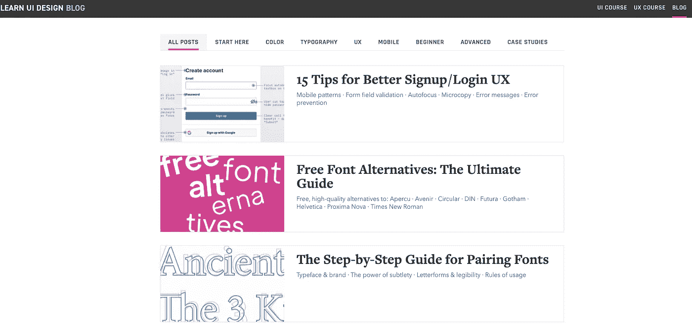
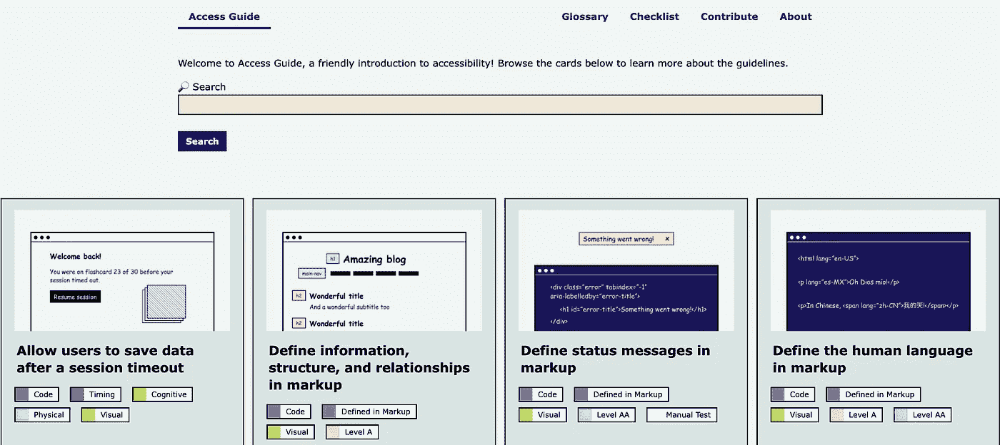
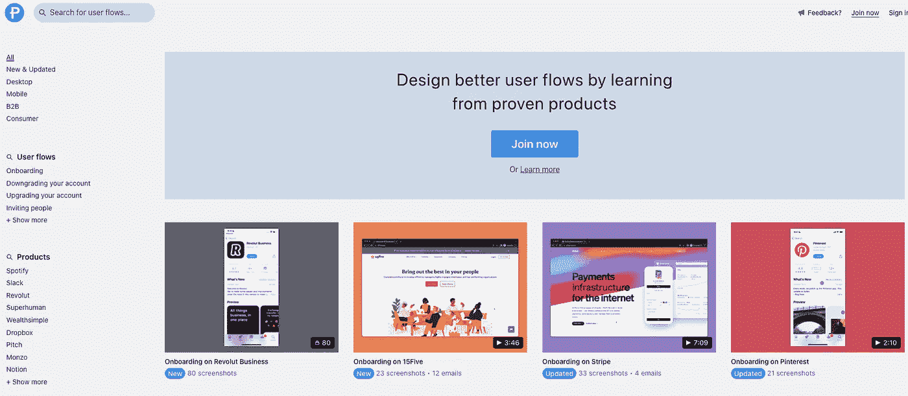
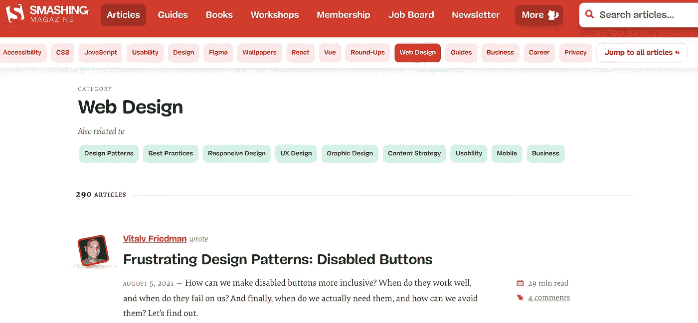

# 学习网页设计的 42 个地方

> 原文：<https://levelup.gitconnected.com/42-places-to-learn-web-design-5a57a689f5da>

在今天的文章中，我将为开发者和设计师免费介绍最好的网络设计和开发课程。

# 用户界面提示

用户界面提示

[链接](https://www.uidesign.tips/ui-tips)

# 用户体验神话

用户体验神话

[链接](https://uxmyths.com/)

# 网络动画课程

网络动画课程

[链接](https://tilda.education/en/web-animation-course)

# 黑客设计

黑客设计

[链接](https://hackdesign.org/lessons)

# 类型设计

类型设计

[链接](https://typedesignschool.com/)

# Learnux

Learnux

[链接](https://learnux.io/)

# 名单之外

名单之外

[链接](https://alistapart.com/blog/topic/design/)

# 学习 Ui 设计

学习 Ui 设计

[链接](https://learnui.design/blog/)

# 字体知识

字体知识

[链接](https://fonts.google.com/knowledge)

# 访问指南

访问指南

[链接](https://www.accessguide.io/)

# 设计小屋

设计小屋

[链接](https://designshack.net/category/articles/ux-design/)

# 设计炸弹

设计炸弹

[链接](https://www.designbombs.com/category/design/)

# 布局

布局

[链接](https://getflywheel.com/layout/category/design/)

# 非常好的用户体验

非常好的用户体验

[链接](https://www.reallygoodux.io/)

# 白细胞碱性磷酸酶活性

白细胞碱性磷酸酶活性

[链接](https://www.lapa.ninja/learn/)

# UX 挑战

UX 挑战

[链接](https://uxtools.co/challenges/)

# 用户体验设计趋势

用户体验设计趋势

[链接](https://trends.uxdesign.cc/)

# 更好的网页类型

更好的网页类型

[链接](https://betterwebtype.com/)

# 第 25 行

第 25 行

[链接](https://line25.com/ui-ux-design/)

# 设计修复

设计修复

[链接](https://designrfix.com/)

# 组件库

组件库

[链接](https://component.gallery/)

# 清单设计

清单设计

[链接](https://www.checklist.design/)

# 页面流

页面流

[链接](https://pageflows.com/)

# 良好的用户界面

良好的用户界面

[链接](https://goodui.org/)

# Ux 运动

Ux 运动

[链接](https://uxmovement.com/)

# 用户体验法

用户体验法

[链接](https://lawsofux.com/)

# 颜色组合

颜色组合

[链接](https://colors.combinations.obys.agency/)

# 惊人的 Figma 提示

惊人的 Figma 提示

[链接](https://awesomefigmatips.com/)

# Tutsplus

Tutsplus

[链接](https://webdesign.tutsplus.com/series)

# 粉碎杂志

粉碎杂志

[链接](https://www.smashingmagazine.com/category/web-design/)

# Webdesignerdepot

Webdesignerdepot

[链接](https://www.webdesignerdepot.com/category/visual-design)

# Uxpin

Uxpin

[链接](https://www.uxpin.com/studio/blog/)

# Uxplanet

Uxplanet

[链接](https://uxplanet.org/)

# UX 杂志

UX 杂志

[链接](https://uxmag.com/)

# 站点点

站点点

[链接](https://www.sitepoint.com/design-ux/)

# 网站激励

网站激励

[链接](https://www.siteinspire.com/)

# 材料设计

材料设计

[链接](https://material.io/blog)

# 网页设计

网页设计

[链接](https://www.webdesign.org/)

# 设计模式

设计模式

[链接](https://designmodo.com/design/web-design/)

# 诺佩

诺佩

[链接](https://www.noupe.com/)

# 小细节

小细节

[链接](https://littlebigdetails.com/)

# 斑点男孩

斑点男孩

[链接](https://speckyboy.com/category/web-design/)

相关文章:

*   [UX 设计灵感网站](https://us.niemvuilaptrinh.com/article/19-sources-of-ux-ui-design-for-website-development)
*   [面向开发者的网页设计工具](https://us.niemvuilaptrinh.com/article/top-87-web-design-tools-for-developer)
*   [30 Web 开发博客](https://us.niemvuilaptrinh.com/article/30-blogs-for-web-development)
*   [面向前端开发者的开源项目](https://us.niemvuilaptrinh.com/article/63-open-source-web-development-tools)

# 总结:

我希望这篇文章能为初学者提供网站设计教程，如果你有任何问题，请发邮件给我，我会尽快回复。希望大家继续支持网站，让我能写出更多好文章。祝您愉快！