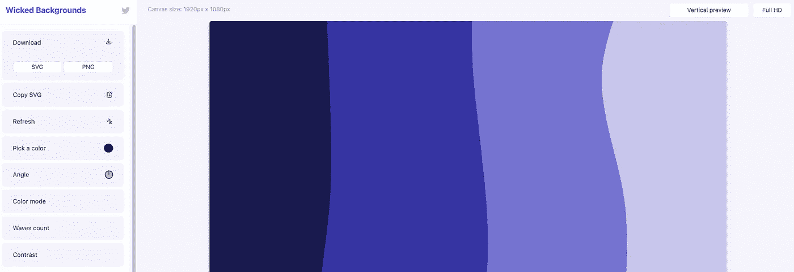

# 45 个前端开发工具

> 原文：<https://levelup.gitconnected.com/45-front-end-developer-tools-e496b9c3503>

# 前端工具

今天我们将深入探讨对开发者和设计者有用的 UI 开发工具。

# 1)清单设计

一个综合网站设计知识的地方，通过提供设计网站元素时的信息和基本元素，如按钮、卡片、表格…

[链接](https://www.checklist.design/?ref=usniemvuilaptrinh)

# 2)网页渐变

网站设计哪里合成漂亮的渐变背景色。

[链接](https://webgradients.com/?ref=usniemvuilaptrinh)

# 3)网络框架

美丽的网络应用程序设计和每周更新的集合。

[链接](https://webframe.xyz/?ref=usniemvuilaptrinh)

# 4)样条

该应用程序可以帮助您为网站创建 3D 效果。

[链接](https://spline.design/?ref=usniemvuilaptrinh)

# 5)键入任何内容

网络应用程序，允许我们为网站设计排版，如字体选择，字体粗细，字间距…

[链接](https://app.typeanything.io/?ref=usniemvuilaptrinh)

# 6)UX 法律

设计者在构建网站用户界面时的最佳实践。

[链接](https://lawsofux.com/?ref=usniemvuilaptrinh)

# 7)泛灵论者

帮助你在网站开发中练习 CSS 动画效果的网络应用程序。

[链接](https://animista.net/?ref=usniemvuilaptrinh)

# 8)屏幕车道

专门为网站合成 UI 设计。

[链接](https://screenlane.com/?ref=usniemvuilaptrinh)

# 9) Froala 设计模块

综合 170 多个 UI 响应式设计用于网站设计。

[链接](https://froala.com/design-blocks/?ref=usniemvuilaptrinh)

# 10)三维图标

网站设计和开发的免费 3D 图标集。

[链接](https://3dicons.co/?ref=usniemvuilaptrinh)

# 收集 ui

用户界面设计总结，每天更新。

[链接](https://collectui.com/?ref=usniemvuilaptrinh)

# 12)人类

为设计师收集的人物插图。

[链接](https://www.humaaans.com/?ref=usniemvuilaptrinh)

# 13)设计原则

致力于提供设计原则和方法的开源集合。

[链接](https://principles.design/?ref=usniemvuilaptrinh)

# 14)学习任何东西

想学东西的时候提供详细路线。

[链接](https://learn-anything.xyz/?ref=usniemvuilaptrinh)

# 15)标准简历

一个网络应用程序，帮助设计师和开发人员创建漂亮的简历。

[链接](https://standardresume.co/1?ref=usniemvuilaptrinh)

# 16)图片

帮助您为您的网站创建交互式图像。

[链接](https://pictogon.com/?ref=usniemvuilaptrinh)

# 17) UI 游戏手册

编译用于构建 UI 组件的文档。

[链接](https://uiplaybook.dev/?ref=usniemvuilaptrinh)

# 18) UI 模式

它帮助你发现设计模式以及如何解决网站设计过程中的常见问题。

[链接](http://uipatterns.io/?ref=usniemvuilaptrinh)

# 19)网站博物馆

是一个综合各个发展阶段的著名网站设计的地方。在我看来，这将有助于你更好地了解如何设计和开发网站的界面。

[链接](https://www.kapwing.com/museum-of-websites/?ref=usniemvuilaptrinh)

# 20) UX 挑战

网站用户体验设计练习集。我喜欢它的一点是，在每个挑战中，都会有具体的教程文章。

[链接](https://uxtools.co/challenges/?ref=usniemvuilaptrinh)

# 21) UX 项目清单

帮助您检查 UX 功能是否符合设计标准的地方。

[链接](https://uxchecklist.github.io/?ref=usniemvuilaptrinh)

# 22)登录页面清单

综合 100 多种登陆页面工具，如选择域名、登陆页面设计软件、logo maker…

[链接](https://landingpage.fyi/landing-page-checklist.html?ref=usniemvuilaptrinh)

# 23)雷

在线软件，帮助您为代码创建美丽的图像。

[链接](https://ray.so/?ref=usniemvuilaptrinh)

# 24)像素快照

帮助您以像素精度测量网站中元素之间的距离。

[链接](https://getpixelsnap.com/?ref=usniemvuilaptrinh)

# 25)图案垫

web 应用程序为网站创建了漂亮的背景图案。

[链接](https://patternpad.com/?ref=usniemvuilaptrinh)

# 26) Klart

一个美丽的网站调色板的集合。

[链接](https://klart.io/colors/?ref=usniemvuilaptrinh)

# 27)抽屉套件

为网络项目提供免费的插图和图标资源。

[链接](https://drawkit.com/?ref=usniemvuilaptrinh)

# 28)获得波浪

为网站创建波浪动画效果的工具。

[链接](https://getwaves.io/?ref=usniemvuilaptrinh)

# 29) UXFlow

它使得在 Sketch、Figma 和 Adobe XD 中创建漂亮的网站布局变得容易。

[链接](https://products.ls.graphics/uxflow/?ref=usniemvuilaptrinh)

# 30)代码运行

合成片段，帮助你解决网站开发中的常见问题。

[链接](https://codetogo.io/?ref=usniemvuilaptrinh)

# 31) Blobmaker

帮助您轻松地为网页元素创建 blob 效果。

[链接](https://www.blobmaker.app/?ref=usniemvuilaptrinh)

# 32)网络代码工具

HTML，CSS，Meta 标签，JSON 的综合生成器工具…

[链接](https://webcode.tools/?ref=usniemvuilaptrinh)

# 33)响应地

该应用程序帮助您在许多不同的设备屏幕上快速测试网站项目。

[链接](https://responsively.app/?ref=usniemvuilaptrinh)

# 34)前端清单

在构建项目前端时，它是帮助您检查要点的地方。

[链接](https://frontendchecklist.io/?ref=usniemvuilaptrinh)

# 35)草图 2 代码

让用 AI 把手绘设计转换成 HTML 成为可能。

[链接](https://sketch2code.azurewebsites.net/?ref=usniemvuilaptrinh)

# 36)引导魔术 4.0

轻松快捷地为 Bootstrap4 设计主题。

[链接](https://sketch2code.azurewebsites.net/?ref=usniemvuilaptrinh)

# 37)玻璃形态 CSS 生成器

帮你打造网站设计的玻璃效果。

[链接](https://ui.glass/generator/?ref=usniemvuilaptrinh)

# 38)未使用的 CSS

移除 web 项目不必要的 CSS 属性。

[链接](https://unused-css.com/?ref=usniemvuilaptrinh)

# 39)魔术图案

网站设计工具集。

[链接](https://www.magicpattern.design/tools/?ref=usniemvuilaptrinh)

# 40)酷背景

帮助您为网站开发创建漂亮的背景图像效果。

[链接](https://coolbackgrounds.io/?ref=usniemvuilaptrinh)

# 41)氯雷帕姆

帮助您在网站开发过程中快速创建内容。

[链接](https://loremipsum.io/?ref=usniemvuilaptrinh)

# 42)谷歌字体

这是一个网站免费字体的集合。

[链接](https://fonts.google.com/?ref=usniemvuilaptrinh)

# 邪恶的背景

[链接](https://wickedbackgrounds.com/app/?ref=usniemvuilaptrinh)

# 44)自定义形状分隔线

帮助你为你的网站创造美丽的形状。

[链接](https://www.shapedivider.app/?ref=usniemvuilaptrinh)

# 45) UI 设计日报

是一个为网页设计合成 UI 设计的地方。

[链接](https://www.uidesigndaily.com/?ref=usniemvuilaptrinh)

相关文章:

*   [面向前端开发者的开源项目](https://us.niemvuilaptrinh.com/article/63-open-source-web-development-tools)
*   [免费的网页设计生成工具](https://us.niemvuilaptrinh.com/article/41-free-generator-tools-for-web-design)
*   [面向 Web 开发人员的最佳 Visual Studio 代码扩展](https://us.niemvuilaptrinh.com/article/30-best-visual-studio-code-extensions)
*   [Udemy 上十大最佳网络开发课程](https://us.niemvuilaptrinh.com/article/top-10-best-web-development-courses-on-udemy)
*   Web 开发的优秀文章和工具第一部分

# 摘要

我希望这篇文章能为你提供更多的网页开发设计工具，如果你有任何问题，请发邮件给我，我会尽快回复。希望大家继续支持网站，让我能写出更多好文章。祝您愉快！

# 分级编码

感谢您成为我们社区的一员！升级正在改变技术招聘。在最好的公司找到你最理想的工作。

 [## 提升——改变招聘流程

### 🔥让软件工程师找到他们热爱的完美角色🧠寻找人才是最痛苦的部分…

作业. levelup.dev](https://jobs.levelup.dev/talent)