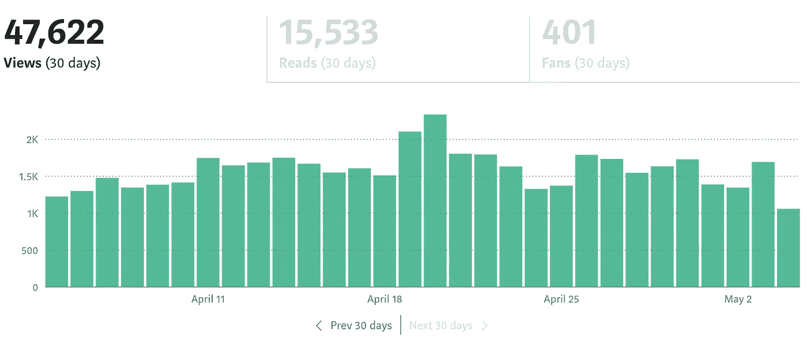
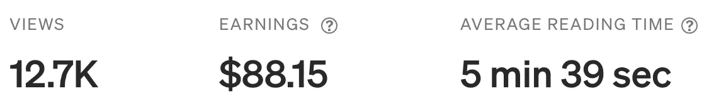
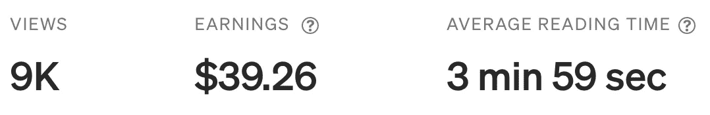
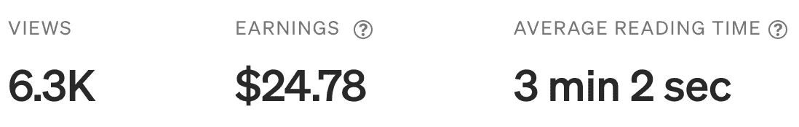
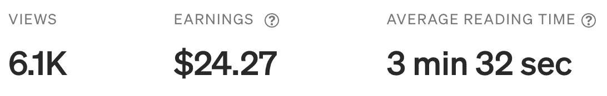
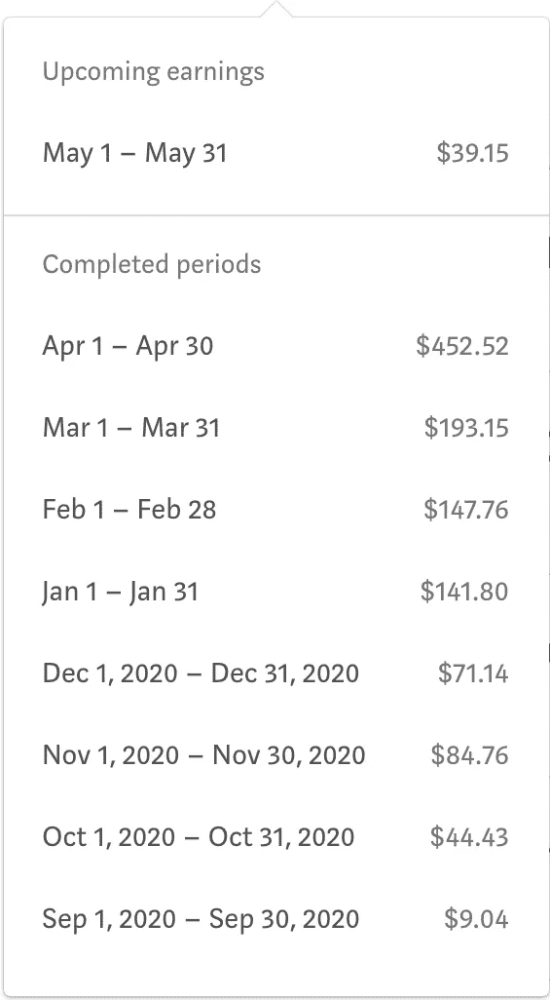

# 从 2021 年 4 月的中等价格 452.52 美元

> 原文：<https://levelup.gitconnected.com/452-52-from-medium-in-april-2021-ffa35ade51a9>

## **我的媒介写作之旅……**

作者图片

我和许多以媒体起家的作家交谈过，他们因不能立即成功而感到沮丧。我在 2020 年 9 月 8 日(7 个月前)写了第一篇文章。前三周写了 15 篇，只赚了 9.04 美元(约 6)！

我坚持大约每 2-3 天写一篇文章。我花了相当多的时间研究、准备，然后终于写出了我的文章。在这个过程中，我意识到你不需要为他们的成功写冗长复杂的文章。它们只需要是热门的、有趣的，如果可能的话，大部分是原创的。

这是我迄今为止第四篇也是最成功的文章…

 [## React.js API 调用 AWS Lambda，API 网关和处理 CORS

### 本教程将向您展示如何解决一个非常令人沮丧的 CORS 问题与 AWS Lambda 和 API 网关从…

codeburst.io](https://codeburst.io/react-js-api-calls-to-aws-lambda-api-gateway-and-dealing-with-cors-89fb897eb04d) 

这篇文章为什么如此成功？您可能认为这又是一篇 AWS 服务文章。它是成功的，因为我解释了我创建的一个完整的解决方案，并解决了一个给许多工程师带来痛苦的问题。如果你需要一些建议，不要只写一些已经被广泛记录的独立主题的技术文章。创造一些独特的东西或描述一个完整的解决方案。你会发现这样你会得到更好的参与。

这是我的第五篇文章…

 [## 使用 Node.js 脚本或 AWS Lambda 上传到 AWS S3

### 我一直在研究 S3 的 AWS SDK，试图弄清楚它的意义。这肯定不是直截了当的，而且…

medium.com](https://medium.com/swlh/upload-to-aws-s3-using-a-node-js-script-or-aws-lambda-e1877960bcea) 

这也是一篇成功的文章。在这篇文章中，我没有解决一些复杂的问题，但是我创建了一个完整的解决方案并记录了下来。

像这样的文章的一些其他例子…

 [## 使用 Redux 通过 Google OAuth2 进行 React.js 认证

### 使用 Redux 通过 Google OAuth2 认证 React.js web 应用程序。本教程利用了…

medium.com](https://medium.com/swlh/react-js-authentication-with-google-oauth2-using-redux-295c51868afb)  [## AWS Lambda 从 RDS (MySQL)中检索数据

### AWS Lambda 函数使用 Node.js 从 RDS (MySQL)检索数据，并与 AWS SAM 一起部署

medium.com](https://medium.com/swlh/aws-lambda-retrieving-data-from-rds-mysql-6da90c046b88) 

确保你的文章发表在合适的出版物上是非常重要的，比如 Startup，codeburst，Level Up Coding，Coinmonks 等。不要让你的文章未发表！确保你找到并访问了与你的文章相关的出版物，并了解它们的接受标准。我合作过的大多数出版物(除了 codeburst)都非常有帮助，它们提供了建设性的反馈，建议撰写文章，并支持我更适合的文章。

你写作成功的另一个真正重要的因素是你的读者群。如果你就一个特定的主题写了一系列的文章，你会发现读者会关注你，等待你关于这个主题的下一篇文章。我写了一整个关于道德黑客的培训课程(18 篇文章)，非常成功。如果你有兴趣看一看，在我的文章列表中寻找以“道德黑客”开头的文章。需要明确的是，这些文章的目的是为了教育、预防和你的网络安全。每个人都应该了解风险以及如何减轻风险。

最后，我是如何在四月份创下记录的…

这真是一场“完美风暴”,我开发了一个成功的加密货币交易机器人，作为 Apache 2.0 许可下的免费开源项目。我在 Medium 上收到了很多用户的支持，他们关注我，称赞我的文章，并发表评论。

这里有三个促成成功的因素:

1.  加密货币和比特币再次成为热门话题。
2.  我的文章解释了完整的解决方案。
3.  我的文章对想从事交易、数据科学或 Python 编程的人有教育意义。

如果你对所有炒作的内容感兴趣，看看吧…

 [## Python 加密机器人(PyCryptoBot)

### 比特币，比特币现金，以太坊，莱特币，比特币基地专业版上的恒星

medium.com](https://medium.com/coinmonks/python-crypto-bot-pycryptobot-b54f4b3dbb75)  [## Python 加密机器人(PyCryptoBot)

### 比特币，比特币现金，以太坊，莱特币，比特币基地专业版上的恒星

medium.com](https://medium.com/coinmonks/python-crypto-bot-pycryptobot-b54f4b3dbb75)  [## PyCryptoBot 结果和配置

### 我想分享我过去 30 天的机器人结果和我正在使用的配置。我经常被问到这个问题…

medium.com](https://medium.com/coinmonks/pycryptobot-results-and-config-57fb6625a6d9)  [## 带电报的 PyCryptoBot

### 我在 PyCryptoBot Github repo 中收到了一个功能请求，要求为 CryptoBot 添加电报支持。我实施了…

medium.com](https://medium.com/coinmonks/pycryptobot-with-telegram-83eed5f230c2)  [## 比特币基地专业投资组合跟踪

### 在比特币基地专业版中，您最多可以创建 5 个投资组合。“默认投资组合”加上 4 个额外的投资组合。每个…

medium.com](https://medium.com/coinmonks/coinbase-pro-portfolio-tracker-a6e4a1c6b8f8)  [## TradingView.com 图表❤

### …而且(大部分)是免费的

levelup.gitconnected.com](/tradingview-com-charts-36a49c9f77ea) 

我在我的媒体刊物《交易数据分析》上写了这篇文章，它帮助了很多作者。

 [## 在媒体上写有益的文章

### 充分利用你的媒体文章，增加你的收入

交易数据分析](https://trading-data-analysis.pro/profitable-articles-on-medium-277c6683a915) 

我希望你觉得这篇文章有趣并且有用。如果您想随时了解情况，请不要忘记关注我，注册我的[电子邮件通知](https://whittle.medium.com/subscribe)。

# 迈克尔·惠特尔

*   ***如果你喜欢这个，请*** [***跟我上媒***](https://whittle.medium.com/)
*   ***更多有趣的文章，请*** [***关注我的刊物***](https://medium.com/trading-data-analysis)
*   ***有兴趣合作？*** [***咱们上领英***](https://www.linkedin.com/in/miwhittle/) 连线
*   ***支持我和其他媒体作者*** [***在此报名***](https://whittle.medium.com/membership)
*   ***请别忘了为文章鼓掌:)←谢谢！***