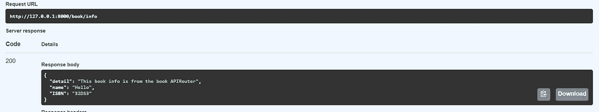

# 您应该尝试的 FastAPI 的 5 个高级特性

> 原文：<https://levelup.gitconnected.com/5-advance-features-of-fastapi-you-should-try-7c0ac7eebb3e>

## 挂载应用程序、API 路由器、Jinja 模板等等

在 [Unsplash](https://unsplash.com?utm_source=medium&utm_medium=referral) 上由 [Chander R](https://unsplash.com/@chanderr?utm_source=medium&utm_medium=referral) 拍摄的照片

# 介绍

FastAPI 是用 Python 开发的现代 web 框架。最近它吸引了很多人。它的开发结构与 Flask 非常相似，Flask 是任何使用 Python 开始 web 开发的人事实上的选择。FastAPI 易于使用，它的文档写得很好，很容易理解。

FastAPI 提供了 API 构建工具的所有标准特性，但并不局限于此。它带来了很多灵活性，比如向后的 WSGI 挂载支持，而大多数用户并没有意识到这一点。

在本文中，我将介绍 FastAPI 的一些高级特性，我在最近的项目中一直在使用这些特性。另外，*下面的用例假设你对 FastAPI* 有基本的了解。

## 1.包括 Flask、Django、Dash 或任何其他 WSGI

FastAPI 是一个 ASGI web 框架。这意味着不同的请求不必等待其他请求完成它们的任务。不同的请求可以不按特定的顺序完成它们的任务。另一方面，WSGI 框架以连续的方式处理请求。

FastAPI 允许任何类型的 WSGI 应用程序(如 Flask)安装在 FastAPI 应用程序中。这意味着在根级别上，您可以拥有主 FastAPI 应用程序，此外，对于不同的路由，您可以拥有 WSGI 应用程序，如 Flask，它将处理该特定路径的所有请求。

我在项目中使用的一个用例是将 plotly-dash 安装为 WSGI 中间件。我已经为我的网站的仪表板路径安装了 dash 服务器，它将仪表板逻辑与主要的 FastAPI 应用程序隔离开来。这还提供了在服务器负载增加时禁用仪表板的灵活性。这是我为其中一个项目做的 WSGI 中间件挂载的抽象实现。

以下是 dashboard.py 文件的示例内容:

Plotly dash 服务器代码

要将这个 dash 服务器作为一个独立的应用程序包含在 FastAPI 中，只需将 WSGI 应用程序对象包装在 WSGIMiddleware 类中，并将这个包装的对象作为参数传递到根 FastAPI 对象的 mount 函数中。mount 函数还接收应该使用该应用程序的路径。例如，该仪表板将安装在“/仪表板”路径上。请参见下面 main.py 文件的内容:

用于在 FastAPI 中安装 plotly-dash 服务器的 main.py 文件

如果有人访问仪表板路由，所有这些请求都会被临时重定向到 dash 服务器。

我的项目中的示例日志，每当有人访问仪表板路由时，它会被重定向到 Dash 服务器

> 链接到我的项目，该项目由 FastAPI 支持，使用了本文中解释的所有概念:[https://ipuresultskg.herokuapp.com/](https://ipuresultskg.herokuapp.com/)。这是我为我的大学开发的一个结果门户。用我的报名号体验网址:43114803118(2018 批次)

## 2.为不同的路线安装不同的 FastAPI 应用程序

遵循为不同的路由挂载不同的 WSGI 应用程序的相同规则，您还可以在 FastAPI 应用程序中挂载不同的 FastAPI 应用程序。这意味着每个 sub-FastAPI 应用程序都有自己的文档，独立于其他应用程序运行，并处理特定于路径的请求。要安装它，只需创建一个主应用程序和子应用程序文件。现在，将 app 对象从子应用程序文件导入主应用程序文件，并将该对象直接传递给主应用程序对象的 mount 函数。这种变通方法不需要任何中间件。请参见下面的示例:

apiv1.py 文件(子应用程序 1)的内容如下:

子应用程序 1 的代码

下面是 apiv2.py 文件(子应用程序 2)的代码:

子应用程序 2 的代码

现在，我们可以在主应用程序中挂载这两个子应用程序。查看 master.py 文件的代码:

安装两个子应用程序的主应用程序代码

如果您向各自的路径端点发出请求，该请求将由这些子应用程序处理。

这里，两个请求都由各自的应用程序提供服务

## 3.将 FastAPI 路由分离到不同的文件中

随着您的应用程序变得越来越大，在一个地方管理所有的路由会变得一团糟。有时，可能会发生重叠，或者您可能会在不知道后果的情况下复制一条路线。如果有一个系统可以将您的路由分组到不同的文件结构中并轻松管理它们，会怎么样？

FastAPI 有一个 APIRouters 系统。这些可以被认为是迷你的 FastAPI 应用程序，**是更大的应用程序**的一部分。这意味着可以将较大的应用程序路由分成小的 APIRouters 单元，并在主应用程序中安装单独的 APIRouters。

*请注意，这些 APIRouters 是更大的应用程序的一部分，而不是像我们在上面两节中看到的那些独立的应用程序。因此，来自所有 APIRouters 的所有路由都将在主应用程序文档中列出。*

这些 APIRouters 可以对路径操作、标签、依赖性和响应使用单独的前缀。因此，要实现这一点，您需要从 FastAPI 导入 APIRouter 类，然后使用它的对象来创建路由，就像在普通的 fast API 应用程序中一样。

让我们看一个例子。假设我们正在构建一个图书馆管理系统，我们想要分别处理书籍和小说数据。让这成为 book.py 文件的代码:

book.py 中的 APIRouter 用法

这是 novel.py 文件的代码:

APIRouter 在 novel.py 中的用法

现在，要在主应用程序中包含这两个路由器，只需导入 APIRouter 的对象，并在主 FastAPI 应用程序对象的 include_router 函数中传递它们。我们还将为这些路由器添加前缀，以便两台路由器中的相同端点不会发生冲突。请参见下面的实现:

在主应用程序中包含 APIRouters 的代码

如果您点击“/book/info”和“/novel/info”端点，您将得到不同的响应，这取决于您在 APIRouters 中如何处理这些输入。

预订 APIRouter 端点(截图来自 FastAPI 文档)

新颖的 APIRouter 端点(截图来自 FastAPI 文档)

通过这种方式，您可以拥有多个 APIRouters 来处理参数，这些参数基于您想要为这些端点组执行的操作类型。

## 4.添加静态文件和 Jinja 模板

FastAPI 不仅限于作为创建 API 的框架。你可以提供静态文件，如 HTML，CSS，JS，并加入 Jinja 模板引擎，就像你在 Flask 中做的那样。这意味着你可以用 FastAPI 托管一个完整的网站。

让我把这个和烧瓶联系起来。在 flask 框架中，您需要有一个名为“templates”的文件夹，其中可以有所有带有 Jinja 模板的 HTML 文件(*如果您希望我创建一篇关于 Jinja 模板引擎*的详细文章，请在评论中告诉我)，在主应用程序中，您可以直接使用 Flask 的 render_template 函数返回这些模板，并在这些模板中填充数据。

在 FastAPI 中，在抽象层次上，过程保持不变，但变化很少。逐步过程:-

1.  首先，您需要为 Jinja 模板创建一个对象，其中需要指定 templates 文件夹的路径。在 FastAPI 中，对文件夹名称没有限制，您可以给它起任何名字。您只需要在这里提供文件夹路径。从技术上讲，您需要从快速 API 模板模块导入 Jinja2Templates 类，并使用文件夹路径为该类创建一个对象。
2.  接下来，您需要在 FastAPI route 方法(例如:GET，POST)中提供 response_class 作为 HTMLResponse 类。这个类可以从快速 API 响应模块导入。此外，您需要在装饰函数中创建一个“request”类类型的请求参数。这个类可以从 fast API 模块导入。
3.  为了在到达各自的端点时向这些模板呈现和提供数据，需要返回 Jinja2Templates 类对象“TemplateResponse”函数。这个函数接受 HTML 模板名和上下文字典。上下文字典必须有“request”键，其值作为您在装饰函数中创建的请求参数。要发送到 Jinja 模板的数据可以作为键-值对添加到这个上下文字典中。

下面是上述步骤的代码实现:

在 FastAPI 中演示 Jinja 模板用法的代码

现在，在 HTML 模板中，您可以按照 Jinja 引擎的语法填充变量，并将名称用作上下文字典中的键。

启动 FastAPI 应用程序，您将得到以下输出:

带有 FastAPI 代码的 Jinja 模板的输出

要在 HTML 中包含所有的图像、JS 和 CSS 文件，在 Flask 中，您可以使用 url_for 并提供文件夹名“static ”,后跟 filename 参数。在 FastAPI 中，这个过程更容易。简单来说，

1.  从 fast API 静态文件模块为 StaticFiles 类创建一个对象，并提供静态文件的文件夹路径。同样，对文件夹名称没有限制。
2.  将这个静态文件对象挂载到其中一个路径，最好是“static ”,以避免混淆，并为这个挂载提供一个名称，供 FastAPI 内部使用。

我在用于 Jinja 文件服务的相同代码中添加了静态文件的逻辑:

现在，假设您有一个图像“img1.png ”,您希望将它包含在 HTML 文件中。简单地说，在 img 标记的 src 属性中，使用如下路径:

`/<path_on_which_static_files_are_mounted>/<image_directory>/<image_name>`

*(此处图片目录取决于你的文件结构)*

下面是上面使用的带有图像标签的 Jinja 模板 HTML 文件的更新代码:

我们将得到这样的输出:

包含静态文件的 FastAPI 网页

这样，你就可以把所有的文件加起来，创建一个由 FastAPI 支持的成熟的网站。

## 5.在 FastAPI 应用程序中模拟烧瓶的配置处理

如果你使用 Flask web 框架已经有一段时间了，你必须了解应用程序的配置。您可以为应用程序定义一些参数，供应用程序的任何部分访问。这些通常包括环境变量。config 属性是字典数据结构的子类，驻留在 Flask 类对象中。所有的配置都存储在这里。当您想对应用程序的某些部分进行硬编码并在应用程序中的任何地方调用它们时，这尤其有用。

这是您在 Flask 中定义此类配置参数要做的事情:

演示 Flask 中应用程序配置的代码

FastAPI 没有这种支持。虽然你们中的一些人可能认为在这种情况下可以使用应用程序状态，但是根据 T[iangolo(FastAPI 的创建者)的建议](https://github.com/tiangolo/fastapi/issues/508#issuecomment-584245852)，APIRouter 不能访问这种状态。因此，即使您在应用程序状态中保存了一些配置，这些配置也不会在应用程序的所有部分之间共享，最终也没有任何用途。

因此，Tiangolo 提出了一个简单的解决方法，即使用 Pydantic BaseSettings 类并为这些设置创建一个模型。这个类提供了验证功能和类型注释。这些特性使它们不同于通常的环境变量，在通常的环境变量中，它们只能处理字符串类型的值。

要将这些放在 FastAPI 应用程序中，只需从 Pydantic 导入 BaseSettings 类，并为您的设置/配置创建子类。这些是 Pydantic 类，因此，您可以添加默认值、Field()等等。让我给你一个例子来实现这一点。

以下是 config.py 文件的内容:

演示 Pydantic BaseSettings 的代码

这里，我将 openapi_url 定义为一个空字符串。它将禁用 FastAPI 应用程序的文档生成。在主应用程序文件中，为配置模型创建一个对象，并像在字典类型数据结构中一样访问参数:

演示如何访问设置参数的代码

这就是如何将该模型用作应用程序的全局配置。它还消除了 FastAPI 对配置应用程序其他部分的依赖性。

# 尾注

这些都是我在开发项目时遇到的 FastAPI 的高级用例。尽管文档是了解这些概念的最佳方式，但我还是尝试提供了一个更广泛、更实用的场景来应用这些概念。FastAPI 高级用例不限于本文中讨论的那些。这是一个惊人的框架，正在慢慢占领整个科技行业。

> 如果你想阅读/探索我的每一篇文章，那就去我的[大师文章列表](https://medium.com/@kaustubhgupta1828/all-my-articles-under-one-hood-f1ab2e5eac89)，它会在我每次在任何平台上发表新文章时更新！

*对于* ***的任何疑惑、疑问，或者潜在的机会*** *，您都可以通过*联系我

 [## Kaustubh Gupta -数据科学 NLP 分析师实习生-浪子| LinkedIn

### 你好，我是一名对数据分析感兴趣的 Python 开发人员，正在成为一名数据工程师的路上…

www.linkedin.com](https://www.linkedin.com/in/kaustubh-gupta) 

**上一篇文章:**

 [## 为什么这个网站显示没有源代码？

### 解释为什么 therickroll.com 不显示任何源代码

medium.com](https://medium.com/geekculture/why-does-this-website-show-no-source-code-a8bd5892d754)