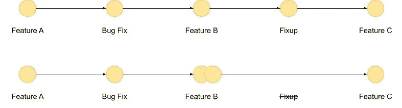
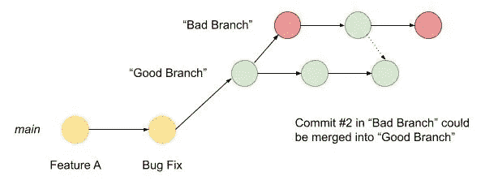

# 所有开发人员都应该知道的 5 个高级 Git 技巧

> 原文：<https://levelup.gitconnected.com/5-advanced-git-tips-that-all-developers-should-know-15bf9b634847>


照片由[普里西拉·杜·普里兹](https://unsplash.com/@priscilladupreez?utm_source=medium&utm_medium=referral)在 [Unsplash](https://unsplash.com?utm_source=medium&utm_medium=referral) 拍摄

这篇文章是继我的帖子之后的。

许多开发人员以直接的“提交”、“拉”和“合并”方式来处理 Git。然而，Git 提供了大量的能力、技巧和技术，可以提高开发人员的技能。

因为“拉请求”和“代码审查”是任何开发人员工作中至关重要的一部分，所以理解 Git 的内部工作方式可以让您和您的同事在审查自己的工作时更加简单。

# 1.隐藏您的修正

你始终致力于代码库，就像一个好的开发人员应该做的那样。保持一整天提交的运行时间表将有助于你记录当天你完成了什么。

就我个人而言，当我编码时，我会做一个“有内容的”提交，然后是一系列的“修正”提交。

*   也许我忘了检查一个文件？
*   代码不工作，所以我做了一个小改动
*   测试不再通过，所以我更新了代码库，直到他们通过

在所有这些情况下，你的同事不会因为他们需要筛选的大量提交而感谢你，特别是如果这些提交包含一些应该是之前提交的一部分的小行。

这就是**交互式 Rebase** “修正”命令的用武之地。使用交互式 Rebase，您可以重放一系列提交，并在此过程中进行更改。对于每次提交，您都会看到几个选项，例如:

*   **挤压** —使用提交，但是合并到先前的提交中
*   **删除** —移除/删除此提交
*   **修正** —类似于“挤压”，但是忽略提交消息
*   …还有更多吗

如果您有许多小的提交，它们构成了一个更大的特性的一部分，那么“修复”在这里非常有用。

举个简单的例子。我有 5 个提交，3 个特性，1 个 bug 修复和一个“修正”。理想情况下，修复提交应该是“特性 B”的一部分，因此我们可以很容易地将其合并到“特性 B”提交中，并放弃修复提交。



将“修正”提交压缩到先前提交中

为此:

```
# Perform an interactive rebase on the last 3 commits
git rebase -i HEAD~3
```

Git 现在将打开您最喜欢的编辑器(在我的例子中是 VS 代码),您将看到一个文本文件，其中列出了您的 3 次提交以及一些有用的文本。

> **提示:**要将 VS 代码设置为您的 Git 编辑器，运行以下命令:
> `git config — global core.editor “code -w”`

```
pick f9738b8 Feature B
pick 634966f Fixup
pick 6cef066 Feature C

# Rebase 6b4e8f3..6cef066 onto 6b4e8f3 (3 commands)
# ....
```

现在要做的最简单的事情就是把单词`pick`(意思是“使用这个提交”)换成`f`或者`fixup`。

当您保存并关闭编辑器时，交互式基础将自动:

1.  将您的历史倒回 3 次提交
2.  一起重放提交“特性 B”**和**“修正”提交
3.  提交“特性 C”

“修复”提交现在已经合并到您的干净树中，就好像它总是前一个提交的一部分一样！

> **提示:**使用`s`或`squash`将执行与`fixup`相同的操作，但会保留您的提交消息，并将其合并到之前的提交消息中。

# 2-重做上次提交

你写了一些代码，但是你犯了一个错误！假设您意外地在提交中包含了一个不应该在那里的文件，一些测试结果可能不属于树。

幸运的是，`git reset`前来救援。

虽然您的大部分提交是好的，但这个额外的文件是不受欢迎的。您不能真正运行`revert`,因为您不想撤销整个提交，只是在没有额外文件的情况下重新提交。

## 软复位

Git 有两种类型的重置，软重置和硬重置。对于这个例子，**软复位**将简单地撤销您的最后一次提交并存放文件，为您再次提交做好准备。

```
# Run a "soft reset" on the last commit
git reset --soft HEAD~1
```

一旦执行了重置，就好像提交从未发生过一样。您可以自由地从提交中“卸载”流氓文件，然后再次提交。

## 硬重置

与软重置不同，硬重置将撤销提交，但不会暂存文件。相反，它们会被完全移除。

当你这样做的时候要小心，因为你会删除你的提交，但是如果你想了解如何恢复它们，请继续往下读。

```
# Delete the previous commit from the branch
git reset --hard HEAD~1
```

# 3 —樱桃采摘

你已经开始了一个“spike”分支来测试一些新的功能，但是在几次提交之后，你意识到它就是不能工作。

但是，在这个分支中进行的提交可能是有用的，并且可能需要用到项目的其余部分。

不是合并整个“坏的”分支，你只是想**“挑选”好的提交并丢弃其余的**。



从“坏分支”中挑选“好”提交

```
# Using git log to find the commit id (hash) of the good commit you want

# Checkout the good branch
git checkout goodbranch

# Cherry pick into `good branch` the commit 634966f
git cherry-pick 634966f
```

在您挑选之后，Git 将简单地将提交应用到当前分支。

确保您的传入提交与您当前的树很好地配合

但是，您可能遇到的任何合并冲突在这里仍然适用，所以要小心。

# 4 —改进提交消息

作为一个在我的主要工作中多产的代码审查者，我可以从第一手经验中说，好的“提交消息”对理解开发人员从代码库中想要什么大有帮助。

但是，我并不总是实践我所宣扬的，很多时候我会定期承诺，然后意识到我的信息并不完全是描述性的。

像 Git 中的大多数东西一样，有许多方法可以解决这个问题。

## 修改上次提交

如果你需要做的只是修改你最近的提交，那么`git commit --amend`就是完美的命令。

只需运行命令，编辑器就会打开。将显示您之前的提交消息，您可以简单地编辑该消息并关闭编辑器。

然后 Git 将“重放”您的提交，但是这次是用您新的有用的提交消息。

## 修改多个提交

如果你需要重写多个提交，或者，如果你需要重写的提交不是最近的，那么**交互式 Rebase** 可以帮助你。

像`fixup`一样，您可以让 Git 重放许多提交，然后对它们执行操作。但是，不使用`f`(或`fixup)`，我们将使用`r`(或`reword)`)。

```
# Perform an interactive rebase on the last 2 commits
git rebase -i HEAD~2

# Change the second commit (826cb5a) from pick to reword
pick 6b4e8f3 Bug Fix
reword 826cb5a Feature B

# When you close the interactive editor,
# git will open a new editor for each commit you wish to edit
```

和以前一样，交互式 rebase 将自动运行以下过程:

1.  展开 2 次提交
2.  重放每次提交
3.  对于每个标记为`r`的提交，打开一个新的文本编辑器来改写提交消息

> reword 功能是保持提交标题可读性的理想选择，同时使用其他行来更深入地解释提交的目标。这是因为大多数在线 Git 评审工具(Azure DevOps、GitHub 等。)使用提交消息的第一行作为“标题”

# 5 —恢复删除的提交

“丢失的提交”很容易通过错误的重置或者过于激进的**硬重置**而发生，但是，幸好有一些快速技巧，“丢失的提交”不需要担心。

举个例子:

1.  3 个提交被添加到分支
2.  运行一个交互式的 Rebase，并且，意外地，通过`drop`命令删除了最终提交
3.  …接下来会发生什么？

在这种情况下， **reflog** 将保存保存。Reflog 是 Git 内部引擎深处的一个小日志，它记录了每一个动作及其对应的提交 id。

```
# Commit "Feature D" to the tree
git commit -m "Feature D"

# Perform an interactive rebase on HEAD~3
git rebase -i HEAD`3

# Accidentially drop the final commit (Feature D)

# Run git reflog to see the final commit tree
git reflog

a8e2d9e (HEAD -> main) HEAD@{0}: rebase (finish): returning to refs/heads/main
a8e2d9e (HEAD -> main) HEAD@{1}: rebase (start): checkout HEAD~3
44bd680 HEAD@{2}: commit: Feature D
a8e2d9e (HEAD -> main) HEAD@{3}: rebase (finish): returning to refs/heads/main
a8e2d9e (HEAD -> main) HEAD@{4}: rebase (reword): Feature B
826cb5a HEAD@{5}: rebase: fast-forward
6b4e8f3 HEAD@{6}: rebase (start): checkout HEAD~2

# We can see the commit ID of Feature D (44bd680)

# Using git cherry-pick, we can add it back in
git cherry-pick 44bd680
```

通过这个简单的例子，我们可以看到 reflog 维护了发生的所有事情的提交 Id，即使我们的提交`44bd680`不再是树的一部分，我们也能够将它选回到我们的分支中。唷！

# 下一步是什么

这 5 个技巧仅仅是 Git 力量的冰山一角。如您所见，除了基本功能之外，Git 还有许多命令可以真正增强您的流程。

这些技巧都可以进一步探索，所以我强烈推荐阅读位于[https://www.git-scm.com 的 Git 参考文档。](https://www.git-scm.com.)

[](https://git-scm.com/docs) [## 参考

### 快速参考指南:GitHub 备忘单|可视化 Git 备忘单

git-scm.com](https://git-scm.com/docs) 

这篇文章的灵感来自我写的另一篇关于[重置](https://medium.com/swlh/squash-and-rebase-git-basics-5cb1be1e0dac)的文章。一位评论者问到“从中间挤压”，我建议使用**交互式 Rebase** 。但是，这是一个如此巨大的话题，也许会有其他文章，我会把这变成一个系列…