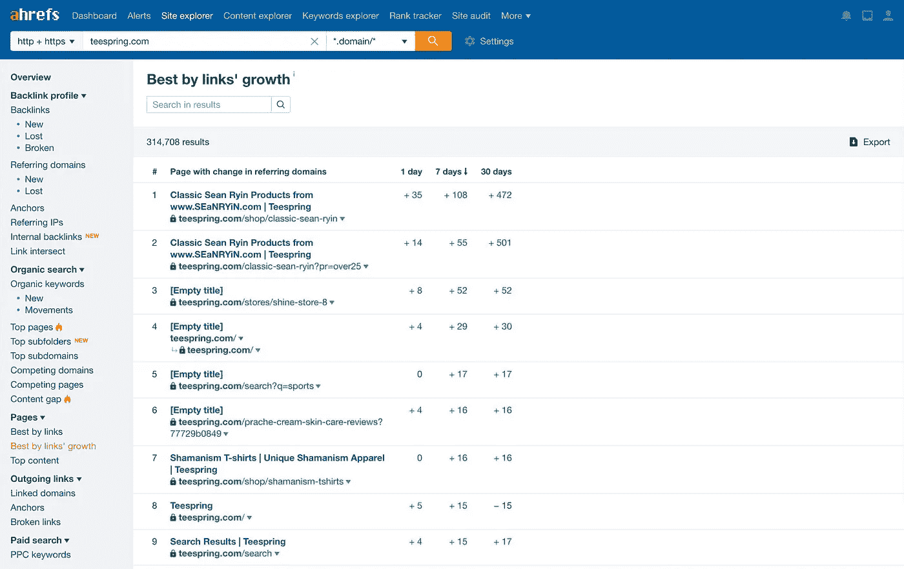
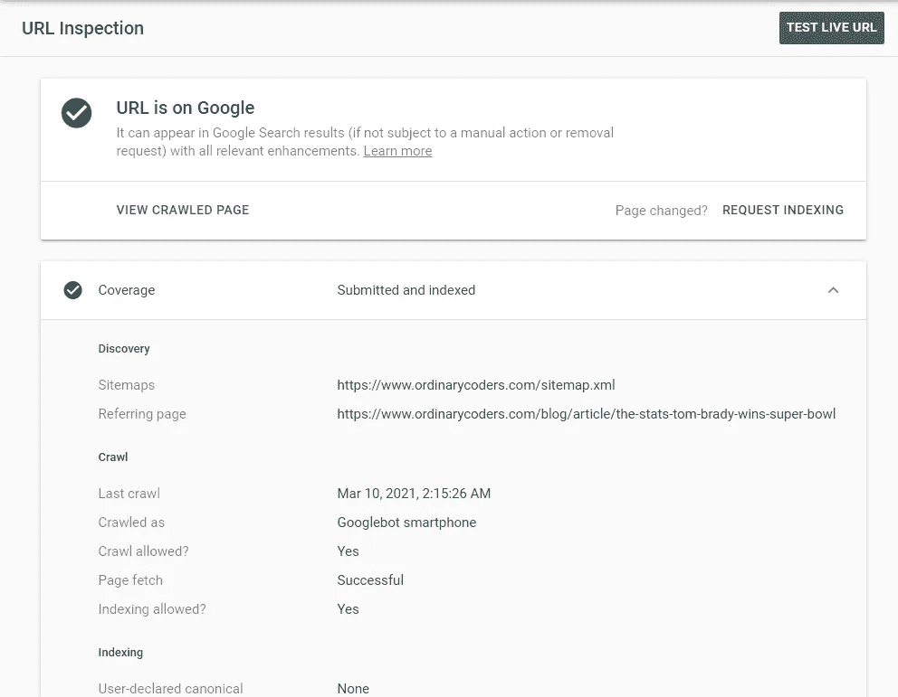

# 5 2021 年 Ahrefs 替代品

> 原文：<https://levelup.gitconnected.com/5-ahrefs-alternatives-for-2021-bce2562ef9e7>

许多 SEO 分析网站提供相同的工具和功能。

因此，我不会给你一个很长的个人轶事，告诉你为什么我认为你应该使用一种服务而不是另一种，相反，我会检查主要的工具，定价和 5 Ahrefs 替代品的免费试用，这样你就可以得出自己的结论。

但是，首先，让我们先了解一下 ahref，然后再讨论 ahref 的替代方案。

毕竟，如果你没有一个控件，就很难比较服务。

# **Ahrefs**

**什么是 Ahrefs？**

[Ahrefs](https://ahrefs.com/) 成立于 2011 年，是一款链接分析工具，旨在帮助收集和衡量网站的链接质量。

它被称为“多合一搜索引擎优化工具集”,拥有你所需要的一切来监控并最终改善你的搜索引擎优化，以获得更高的浏览器排名和更多的流量。

Ahref 提供 5 种主要工具:

*   现场审计(免费)
*   网站浏览器(免费)
*   关键词浏览器
*   等级跟踪器
*   内容浏览器

**Ahrefs 主要工具**

*Ahrefs 网站审计(免费)*

网站审计是一个免费的工具，抓取你的网站，确定搜索引擎优化问题，并建议确切的解决方案。

创建一个 Ahref 帐户以获得访问权限。然后添加一个项目(即您的网站)以开始使用该工具。

审计着眼于:

*   HTML 标签
*   社交媒体标签
*   内容质量和副本
*   页面性能
*   传入/传出链接
*   图像、CSS 和 JS 资源

自动审计爬网只需几分钟，报告就会出现在您的电子邮件收件箱中。

将最近的爬网与以前的网站爬网进行比较，可以看到健康评分和主要问题都在页面上突出显示。

没有必要去猜测哪些 SEO 问题在影响你的健康得分。

*Ahref 的站点浏览器(免费)*

使用 Ahrefs Site Explorer 工具查看网站的有机搜索流量、付费流量、研究和反向链接。

创建一个免费帐户，然后验证您的域名所有权。

订阅高级计划，在任何网站上使用所有 Ahrefs 网站浏览器工具。

见解包括:

*   Ahrefs 等级
*   URL 排名
*   域名排名
*   反向链接
*   引用域
*   有机关键词
*   有机交通
*   交通价值
*   付费搜索

*Ahrefs 排名追踪器*

监控你在 170 个国家的谷歌排名。

可见性、位置分布、平均位置和平均流量都是可见的。

查看您网站的数量:

*   拇指甲
*   录像
*   推特信箱
*   人们也问答案
*   图像包
*   网站链接
*   特色片段
*   广告词
*   购物结果
*   知识卡片

你也可以比较你在上述方面与你的竞争对手相比如何。

*Ahref 的内容浏览器*

调查竞争对手的内容创建策略，并使用 Ahrefs content explorer 确定您自己的链接构建策略。

排序依据:

*   有机交通
*   引用域
*   交通价值
*   域名评级
*   社会共享

搜索竞争对手的文章基于有机交通，涉及领域，交通价值，领域评级，和社会份额。

有 12 个过滤器可供选择，从作者和出版物到语言和字数，以帮助缩小搜索范围。

然后将你自己的网站的性能与这些指标进行比较，看看要涵盖哪些主题。

Ahrefs 指出，“如果竞争对手表现优于你，那可能是因为他们保持了内容的新鲜度。”

*Ahref 的关键词浏览器*

关键字浏览器显示任何关键字的概述。

当你搜索关键词时，改变国家和浏览器以获得你的目标受众的准确表现。

即时查看:

*   关键词难度
*   搜索量
*   付费和有机点击
*   全球卷
*   关键词创意

向下滚动页面会显示基于搜索词的关键词想法。

这些想法是基于短语匹配、相似术语和自动完成查询产生的。

**Ahrefs 的定价**

每个价格点提供了 5 个主要工具，每周分配不同的报告、审计和抓取。

如果您不确定要使用多少工具，请创建一个帐户，并从 7 天 7 美元试用开始。

如果你达到了每周限额，那么考虑升级到更大的套餐。

**关于 Ahrefs 的附加信息**

*   7 天 7 美元促销优惠
*   免费使用站点审计和站点浏览器工具
*   有 13 种语言版本
*   Ahrefs SEO 工具栏 Chrome 扩展

# **1。谷歌搜索控制台**

**什么是谷歌搜索控制台？**

[谷歌搜索控制台](https://search.google.com/search-console/about)是谷歌提供的免费网络服务。

以前被称为谷歌网站管理员，这项服务允许域名所有者在谷歌搜索结果和谷歌发现上检查他们网站的索引状态和可见性。

主要报告包括:

*   URL 检查
*   表演
*   总点击量
*   总印象
*   平均 CTR
*   平均位置
*   索引
*   新闻报道
*   网站地图
*   搬迁
*   提高
*   核心网络生命
*   移动可用性

**谷歌搜索控制台报告和工具**

*谷歌搜索控制台的网址检查工具*

搜索站点上的特定页面，并使用 URL 检查来:

*   检查 URL 是否出现在谷歌搜索结果中
*   查看该页面是否在站点地图上
*   验证页面是否被谷歌机器人抓取
*   查看网页何时被爬网
*   了解该页面是否适合移动设备

此外，测试动态 URL，并在页面更新时请求重新索引。

*谷歌搜索控制台的性能报告*

检查您的谷歌搜索结果和谷歌发现任何日期范围的表现。搜索一个词后，搜索结果会出现在谷歌上，而谷歌发现是一种基于用户搜索活动建议内容的移动体验。

这两个报告都允许您查看总点击量、总展示次数和平均点击率。但是，平均位置只能在谷歌搜索结果报告中找到。

过滤依据:

*   查询(即关键词)
*   您网站的页面
*   国家
*   设备
*   出现
*   日期

查询和设备不是谷歌搜索结果的过滤器，因为内容只在移动设备上自动建议。

*谷歌搜索控制台的索引工具*

覆盖率、网站地图和删除是索引工具包含的三个特性。

覆盖率视图下:

*   页面错误
*   带有警告的有效页面
*   有效页面
*   排除的页面

向下滚动到“Coverage Details”部分，并单击任何状态，以获取有关箭头的更多信息并验证修复。

在网站地图部分，你可以为谷歌的机器人添加新的网站地图。站点地图允许浏览器快速索引你的站点。

如果你想在谷歌上排名，我强烈建议你创建一个网站地图。

最后，还有一个删除工具，允许你提交一个从谷歌搜索中删除页面的请求。

提交不再存在的页面或不需要在谷歌上显示的页面的请求。

*谷歌搜索控制台的增强报告*

这最后一类工具除了检查核心网页的可用性之外，还检查网页的移动可用性。

核心 Web Vitals 工具提供了移动和桌面报告，用于显示网站的稳定性、速度和响应能力。

移动可用性工具显示移动设备上页面内容的可读性、可点击性和呈现方式。

**谷歌搜索控制台定价(免费)**

如前所述，谷歌搜索控制台是免费使用的。

所有需要的是一个免费的谷歌帐户和域名所有权。

我们有一篇关于如何设置谷歌搜索控制台的文章，如果你使用 Django 建立你的网站。

**关于谷歌搜索控制台的附加信息**

*   性能结果不是实时的
*   指标和工具仅适用于您验证的领域

# **2。谷歌分析**

**什么是谷歌分析？**

[谷歌分析](https://analytics.google.com/)是谷歌提供的另一项免费服务。

这是谷歌营销平台中的一个分析平台，一个统一网站分析和广告方法的平台。

这是一种网络分析服务，主要用于使用多种指标跟踪网站流量。

报告包括:

*   实时的
*   位置
*   流量来源
*   内容
*   事件
*   转换策略
*   观众
*   活跃用户
*   终身价值
*   断代分析
*   观众
*   用户浏览器
*   人口统计数据
*   兴趣
*   长狭潮道
*   行为
*   技术
*   移动的
*   跨设备
*   习俗
*   标杆管理
*   用户流量
*   获得物ˌ获得
*   所有流量
*   谷歌广告
*   搜索控制台
*   社会的
*   运动
*   行为
*   行为流
*   网站内容
*   现场速度
*   网站搜索
*   事件
*   发表的实验
*   转换策略
*   目标
*   电子商务
*   多通道漏斗

**谷歌分析主报告**

*谷歌分析的实时报告*

实时报告提供了关于当前在您的网站上的活跃用户的见解。

见解包括:

*   位置
*   流量来源
*   内容
*   事件
*   转换策略

*谷歌分析的受众报告*

谷歌分析的受众报告有 15 种不同的见解。

*   活跃用户
*   终身价值
*   断代分析
*   观众
*   用户浏览器
*   人口统计数据
*   兴趣
*   长狭潮道
*   行为
*   技术
*   移动的
*   跨设备
*   习俗
*   标杆管理
*   用户流量

获取用户年龄、性别、一般兴趣、语言、回头率和浏览器类型的细分，以便更好地将内容、广告和服务与您当前的受众相匹配。

*谷歌分析公司的收购报告*

了解用户如何通过渠道、树形图、来源/媒介和推荐报告到达你的网站。

查看来自以下公司的收购:

*   谷歌广告
*   谷歌搜索控制台
*   社会化媒体
*   运动

这些类别中的每一个都有自己的过滤器和指标，可以通过包括树形图、登录页面和用户流量来进行排序。

*谷歌分析的行为报告*

行为报告显示:

*   网站内容
*   现场速度
*   网站搜索
*   事件
*   出版商
*   行为流

除了网站速度和内容之外，用户在网站上的行为和移动的流程图也是可用的。

该报告还链接到 Google AdSense 或 Ad Exchange，以查看发布者页面上的印象、点击和收入。

*谷歌分析的转化报告*

转换率报告提供:

*   目标 URL
*   反向目标路径
*   漏斗可视化
*   目标流程

定义您希望您的用户采取的行动，例如订阅或购买产品，然后监控客户端的转换率、初始值和生命周期值。

**谷歌分析定价(免费)**

该服务是免费使用的，只需验证您的域的所有权并将其添加为一个属性。

**附加信息**

*   访问谷歌搜索控制台、谷歌广告和谷歌广告
*   谷歌分析学院(免费)
*   谷歌分析认证(免费)
*   谷歌页面分析 Chrome 扩展

# **3。芒果**

**什么是芒果？**

Mangools 是一个为网站所有者设计的搜索引擎优化工具，用于跟踪关键词、反向链接、排名和竞争对手。

第一个工具于 2014 年推出，从那时起，现在有五个 SEO 工具:

*   千瓦探测器
*   塞尔普切克
*   塞尔瓦彻
*   LinkMiner
*   站点分析器

**芒果的 SEO 工具**

*芒果的 KWFinder*

Mangools 的 KWFinder 是一个关键词研究工具，可以在不同的关键词难度下找到长尾关键词。

搜索任何关键字，获得相关关键字的详细列表，每个关键字都带有:

*   谷歌广告的每次点击成本
*   谷歌广告中的点击付费
*   搜索量趋势
*   平均每月搜索量
*   关键词 SEO 难度
*   搜索引擎结果页面

在你的领域中搜索术语，确定关键字、自动补全建议和问题结果，你可以在下一篇文章中使用它们来改进你的 SEO。

*芒果的检查员*

SERPChecker 或搜索引擎结果页面分析让您检查竞争网站的 SEO 权威。

键入关键字，查看竞争对手:

*   链接简档强度
*   领域权威
*   页面权限
*   引用流
*   信任流
*   脸书股票
*   Alexa 等级
*   外部链接
*   引用域
*   页面折叠上方的可见性

*芒果的守望者*

搜索引擎结果页面观察显示您的关键字的性能指数的变化，以预测您的网站的潜在有机流量。

添加您的域、位置、设备和关键字以开始跟踪。

监视器:

*   关键词位置
*   关键词位置变化
*   平均位置
*   最佳位置
*   平均每月搜索次数
*   每月估计访问量

*芒果的链接矿工*

链接矿工是一个反向链接分析所有领域链接回您的网站。

查看链接域的:

*   反向链接源 URL
*   源预览
*   引用流
*   信任流
*   页面的外部链接
*   脸书股票
*   Alexa 等级
*   后退`href`路径
*   锚文本
*   链接强度

*Mangools 的网站分析器*

Mangools 的 SiteProfiler 可以测量任何网站的 SEO 指标和洞察力，无需验证所有权。

查看:

*   领域权威
*   页面权限
*   Alexa 等级
*   推荐 IP
*   脸书股票
*   引用流
*   信任流
*   反向链接配置文件
*   引用域
*   顶级内容
*   竞争对手

所有指标都显示在一个控制面板上，以便于访问。

**芒果的定价**

定价基于使用情况。更高的计划允许更多的 24 小时查找、搜索、建议和同时登录。

上图显示的是年度定价，但也有月度定价。

**关于芒果的更多信息**

*   10 天免费试用
*   SEO 浏览器扩展

# **4。Ubersuggust**

**什么是 Ubersuggest？**

[Ubersuggest](https://neilpatel.com/ubersuggest/) 是一个免费的关键词工具，允许用户反向工程竞争对手的 SEO 策略。

查看在你自己的网站和竞争对手的网站上排名靠前的页面，立即获得关键词和内容建议。

主要工具包括:

*   关键词分析器
*   关键词创意
*   内容理念
*   竞争分析
*   交通概况
*   按流量分类的关键字
*   流量排名靠前的页面
*   类似网站
*   搜索引擎优化浏览器
*   搜索引擎优化分析器
*   反向链接

**Ubersuggest 的主要工具**

*Ubersuggest 的关键词分析器*

搜索一个关键字，并查看每个关键字的以下明细:

*   搜索量
*   SEO 难度
*   有偿困难
*   每次点击成本
*   关键词创意
*   内容理念

更改关键字搜索的语言和国家。

*Ubersuggest 的竞争分析*

竞争分析显示了任何领域的详细概况。

查看域的:

*   有机关键词
*   每月有机交通量
*   领域权威
*   反向链接
*   交通
*   SEO 关键词排名
*   顶级搜索引擎优化页面
*   搜索引擎优化关键词
*   竞争领域

*Ubersuggest 的 SEO Explorer*

使用搜索引擎优化浏览器抓取网站。爬行大约需要 10 分钟。

在完成视图中:

*   页面搜索引擎优化得分
*   每月有机交通量
*   有机关键词
*   反向链接
*   健康检查
*   严重错误
*   警告信息
*   推荐
*   现场速度
*   顶级搜索引擎优化问题

**Ubersuggest 的定价**

如果您创建了一个免费帐户，就可以访问更多的关键字、每日排名跟踪和个性化的 SEO 建议。

**关于 Ubersuggest 的附加信息**

*   7 天免费试用
*   铬延伸
*   没有帐户的 3 次免费每日搜索

# **5。塞姆拉什**

**什么是 SEMrush？**

[SEMrush](https://www.semrush.com/) 拥有 40 多种工具和报告。有 5 个不同的兴趣领域，每个领域都有多种工具。

SEMrush 提供 40 多种工具。

*   搜索引擎优化
*   关键词研究
*   页面搜索引擎优化
*   本地搜索引擎优化
*   等级跟踪
*   链接建筑
*   竞争对手搜索引擎优化分析
*   内容
*   内容营销
*   内容创建和分发
*   内容优化
*   内容营销分析
*   市场调查
*   竞争对手分析
*   市场分析
*   付费广告
*   竞争对手公关监控
*   广告
*   竞价排名关键词研究
*   网站货币化
*   SMM 和 SERM
*   社交媒体管理

**SEMrush 主要工具**

*SEMrush 的 SEO 工具(免费)*

SEMrush SEO 工具显示以下领域的概述:

*   竞争研究
*   流量分析
*   有机研究
*   关键词间隙
*   反向链接间隙
*   关键词研究
*   关键词魔术工具
*   关键词管理器
*   有机交通洞察
*   链接建筑
*   反向链接分析
*   反向链接审计
*   链接构建工具
*   批量分析
*   等级跟踪
*   位置跟踪
*   传感器
*   级别
*   页面和技术搜索引擎优化
*   现场审计
*   SEO 内容模板
*   页面搜索引擎优化检查器
*   日志文件分析器
*   列表管理

*SEMrush 的本地 SEO 工具(免费)*

使用当地的搜索引擎优化工具来查看您的企业的在线存在，网站搜索引擎优化，以及在一个验证域的浏览器排名。

得到关于…的报告:

*   企业列表管理
*   SEO 位置跟踪
*   现场审计
*   页面搜索引擎优化检查器

*SEMrush 的广告工具(免费)*

使用 SEMrush 广告工具查看付费广告指标，与竞争对手比较关键词，并跟踪您的广告位置。

*   营销分析
*   广告研究
*   展示广告
*   产品列表广告研究
*   关键词研究
*   关键词间隙
*   关键词魔术工具
*   关键词管理器
*   PPC 关键字工具
*   广告历史
*   广告跟踪
*   位置跟踪
*   社交媒体广告
*   社交媒体广告

SEMrush 的社交媒体工具

使用社交媒体工具安排在脸书、Twitter、LinkedIn、Instagram 和 YouTube 上发布社交媒体帖子。

*   社交媒体海报
*   社交媒体追踪
*   社交媒体广告

*SEMrush 的内容营销工具(免费)*

研究内容创意，获得潜在反向链接列表，并使用他们的内容管理工具查看您的内容的可读性和 SEO 性能。

*   课题研究
*   SEO 内容模板
*   SEO 写作助手
*   品牌监控
*   后期跟踪
*   内容审计

*SEMrush 的竞争研究工具(免费)*

使用竞争研究工具获得访问、访问持续时间、跳出率、设备故障、反向链接等信息。

*   CI 附加组件
*   流量分析
*   市场探险家
*   搜索引擎优化
*   有机研究
*   关键词间隙
*   反向链接分析
*   反向链接间隙
*   广告
*   广告研究
*   展示广告
*   产品列表广告
*   内容和公关
*   品牌监控
*   课题研究
*   后期跟踪
*   社会化媒体
*   社交媒体追踪

**SEMrush 定价**

注册 SEMrush 是免费的。立即获得对大多数工具的访问，但是，结果和请求将是有限的。

**附加信息**

*   SEMrush 有 11 种语言版本
*   7 天免费试用
*   免费帐户每天限 10 个请求

*原载于*[*https://www.ordinarycoders.com*](https://www.ordinarycoders.com/blog/article/ahrefs-alternatives\)*。*