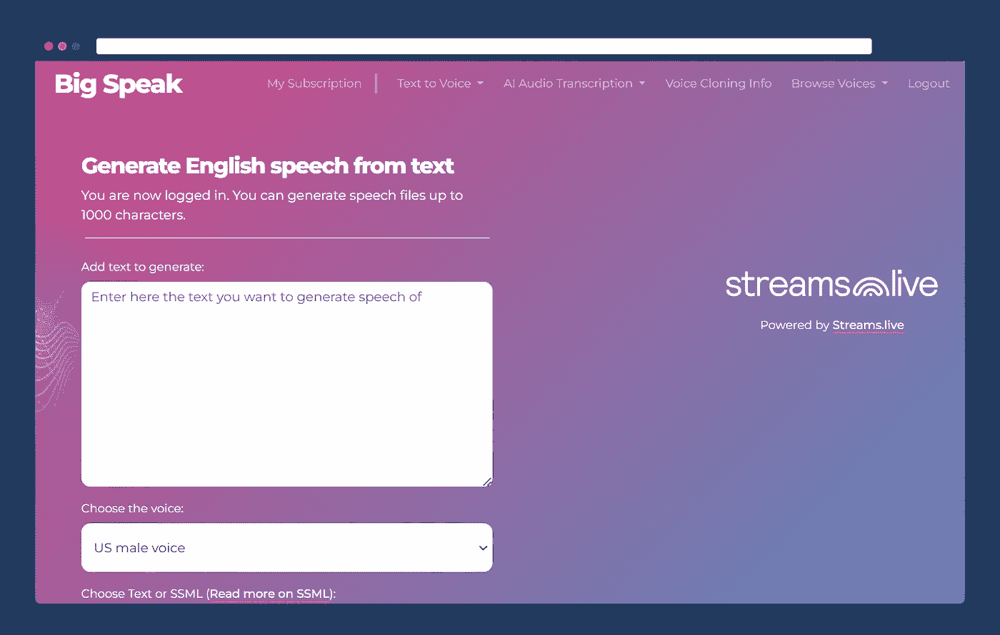
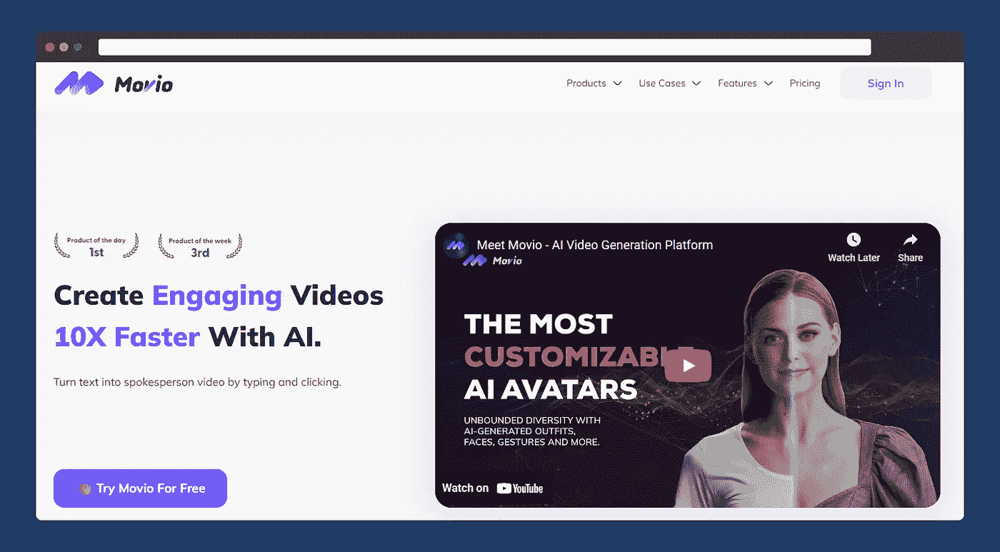
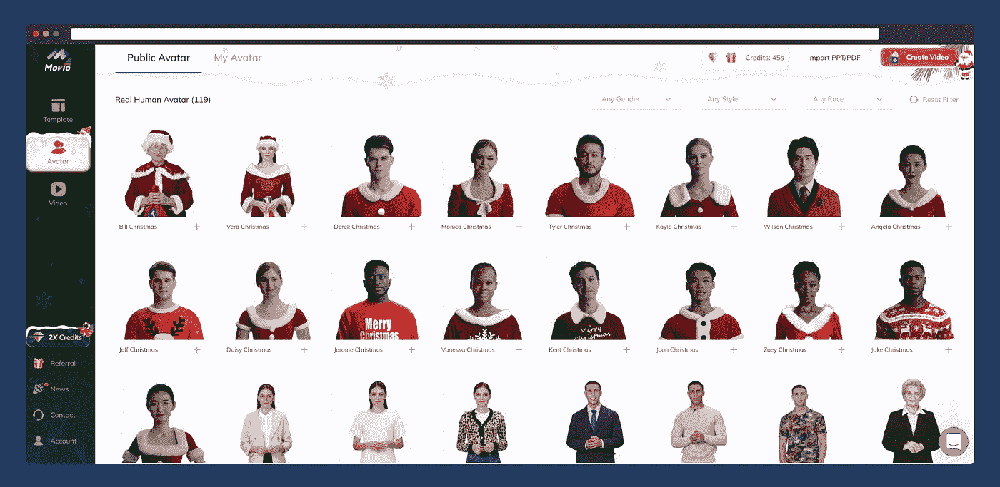
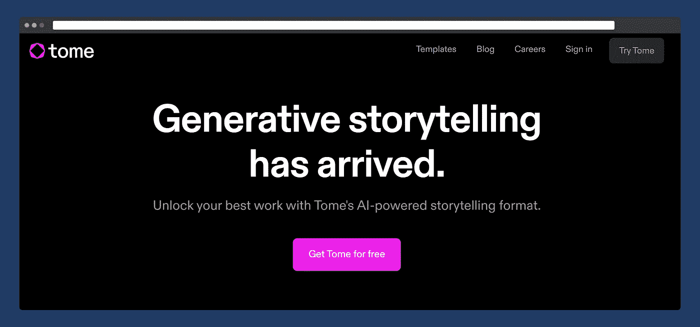
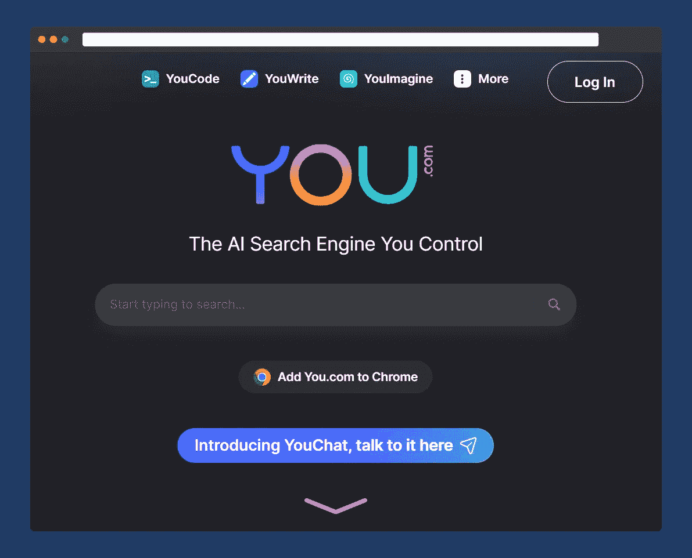
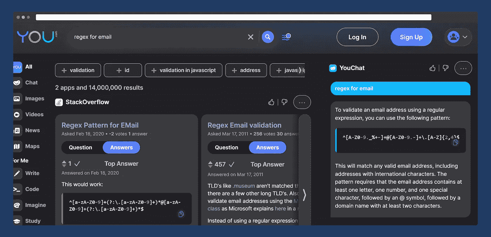
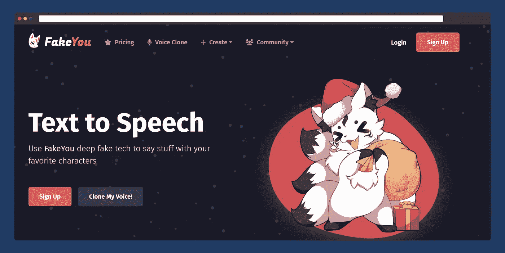

# 5 个基于人工智能的难以置信的网站和工具，好得令人难以置信

> 原文：<https://levelup.gitconnected.com/5-ai-based-unbelievable-websites-tools-that-are-too-good-to-be-true-b8337bc44172>

## ChatGPT 不在其中。

使用 [DALL-E 2](https://openai.com/dall-e-2/) 创建的图像

有时候，我们必须长时间练习和训练自己，才能在某些事情上达到完美，例如编辑一张图片、画一幅肖像、写一个故事或一篇文章，甚至写一段代码。

我们仍然需要做同样的事情来掌握我们想要学习的技能，但是做事的方式已经改变了。计算机进行训练*。*

> “最简单地说，人工智能(AI)是指模仿人类智能执行任务的系统或机器，可以根据收集的信息迭代地改进自己。”— [甲骨文网站](https://www.oracle.com/in/artificial-intelligence/what-is-ai/)

这里有 5 个你可能没用过的网站和工具，但是它们可以让你的生活变得更加轻松。

# 说大话

*网站链接:*[**https://bigspeak.ai/**](https://bigspeak.ai/)

Big Speak 是一个令人难以置信的工具，它允许您使用混合的机器学习算法从文本中生成听起来逼真的音频。只需添加您的文本提示，它会将其转换为可下载的音频格式。

作为一个非注册用户，您可以从文本生成音频文件，最多 300 个字符；如果您登录以生成较长的音频文件，您可以生成多达 1000 个字符的文件。

最好的部分是这个工具是完全免费的。

# Movio

*网站链接:*[**https://www.movio.la/**](https://www.movio.la/)

Movio 是一个由人工智能驱动的出色的视频生成平台。你可以选择一个合适的模板，添加文本提示，从 100 多个真人头像库中选择一个头像，甚至在创建视频之前在网站上选择语言。

数百个可定制选项的头像

该网站非常强大，可以为 YouTube、Instagram 甚至官方商业演示制作完整的视频。

若要创建视频，如果您使用的是免费计划，则需要配额。当你注册的时候，你得到 50 个学分，你可以使用。有[订阅计划](https://www.movio.la/pricing)如果你想认真考虑这个网站为你的视频创作。

我制作了一个演示视频，你可以在这里查看。

有一个替代网站可以让你制作逼真的真人视频，名为 [*synthesia.io，我之前已经提到过*](/9-incredible-websites-that-every-developer-should-bookmark-1534d52f3f7d) *。*

# 册

*网站链接:*[**https://beta.tome.app/**](https://beta.tome.app/)

Tome 或 tome 是另一个出色的人工智能演示创作工具。你所需要做的就是添加一个提示，人工智能将创建漂亮的演示幻灯片，真正脱颖而出。

幻灯片中使用的图像也是使用 [OpenAI 的 DALL-E](https://openai.com/dall-e-2/) 由人工智能生成的。我输入了“人工智能的兴起”的提示，它就创造了[这个](https://tome.app/digitalwitcher/the-dawn-of-artificial-intelligence-clc3l5qtx38lz8r3ambxsza0r)。

因此，如果你想提高你的 PowerPoint/演示技巧，这个网站可以帮助你。

# You.com

*搜索引擎链接:*[【https://you.com/】T21](https://you.com/)

这是一个人工智能搜索引擎，它做的工作和谷歌一样，但更好。当你搜索某样东西时，它会准确地从各种网站中找到你想要的结果。

例如，当我搜索“regex for email”时，它会从 Stack Overflow 等网站找到最佳解决方案。

此外，它还有诸如 *YouCode* 、 *YouWrite* 和 *YouImagine* 等子部分，可以帮助你编码、写博客，甚至生成图像。

最好的一点是，它会附上获取结果的网站，尤其是代码，因此不会侵犯版权，不像 [GitHub Copilot](https://www.techtarget.com/searchsoftwarequality/news/252526359/Developers-warned-GitHub-Copilot-code-may-be-licensed) 。

结果正确与否取决于用户，不像基于 [*ChatGPT 的聊天机器人给出的结果*](https://stackoverflow.com/help/gpt-policy) 相当不准确。

# 发客优

*网站链接:*[**https://fakeyou.com/**](https://fakeyou.com/)

FakeYou 是一个深度伪造的 AI 网站，可以将任何文本提示转换为任何你想转换的角色声音。截至本文撰写之时，有超过 2800 个角色的声音可供选择，包括现实生活中的名人，如*阿姆、伊丽莎白女王、2Pac* 等。甚至电影角色如*达斯·维德，杰克·斯派洛船长*等等。

我复制了阿姆的说唱神歌词，转换成 2Pac 的声音，结果令人咋舌，虽然只转换了一部分歌词。但这的确令人印象深刻。

我喜欢演奏这两位我最喜欢的说唱歌手的歌曲。

# ChatGPT 有其局限性

近日， [OpenAI](https://openai.com/) 于 2022 年 11 月 30 日推出的人工智能聊天机器人 [*ChatGPT*](https://openai.com/blog/chatgpt/) ，在短短几天内就聚集了数百万用户。

聊天机器人基于 [*GPT(生成式预训练转换器)*](https://en.wikipedia.org/wiki/GPT-3) ，这是一种使用转换器架构的语言模型，并使用非结构化文本的大型数据集进行训练。

虽然用户可以有数百种方式使用聊天机器人，但它肯定有两个不容忽视的主要缺陷。

*   *GPT 的一个潜在缺陷是它容易产生有偏见或误导的输出，尤其是当它被馈送有偏见或误导的输入时。*
*   *GPT 的另一个潜在缺陷是，它有时会生成无意义或与输入无关的输出。*

由于聊天机器人仍处于萌芽阶段，它将随着时间的推移而改进。

# 结束语

还有几十个其他网站是使用人工智能创建的，我现在选择了其中最好的一个，所有这些，如果使用得当，可以增强你的工作。我会多测试，和大家分享。

自从 ChatGPT 面向公众推出以来，人们既感到兴奋，也感到恐慌。我们都必须接受现实，事情在变化，我们都必须迅速适应。

我不想提到 ChatGPT，但它在过去的 3 周里取得了巨大的成功，你必须给予应有的信任。OpenAI 团队所做的工作无可挑剔。我肯定会就此单独写一篇文章。

如果你喜欢读这篇文章，你可能也会发现下面的文章值得你花时间去读。

 [## 如果你是开发者，你必须订阅的 9 个 YouTube 频道

### 强烈推荐给软件开发人员的 YouTube 频道，帮助他们在软件开发职业生涯中脱颖而出。

levelup.gitconnected.com](/9-youtube-channels-that-you-must-subscribe-to-if-you-are-a-developer-d7ac881c9798)  [## 每个开发者都应该收藏的 9 个不可思议的网站

### 这些网站不仅会帮助你的软件开发之旅，还会帮助你的内容…

levelup.gitconnected.com](/9-incredible-websites-that-every-developer-should-bookmark-1534d52f3f7d) 

如果你喜欢阅读有助于你更好地学习、生活和工作的故事，可以考虑 [*成为*](https://viveknaskar.medium.com/subscribe) *的订阅者。成为会员后，你可以无限制地阅读 10000 篇故事、文章和作家。每月只要 5 美元。* [*如果你使用我的链接*](https://viveknaskar.medium.com/membership) *注册，我将获得一点佣金，帮助我写更多的文章。趁你还在的时候，* [*注册我的简讯*](https://viveknaskar.substack.com/) *。它是免费的。*