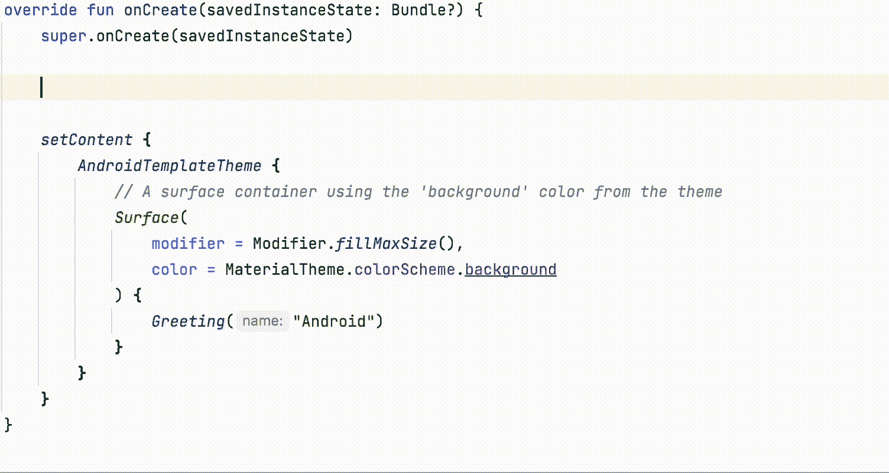
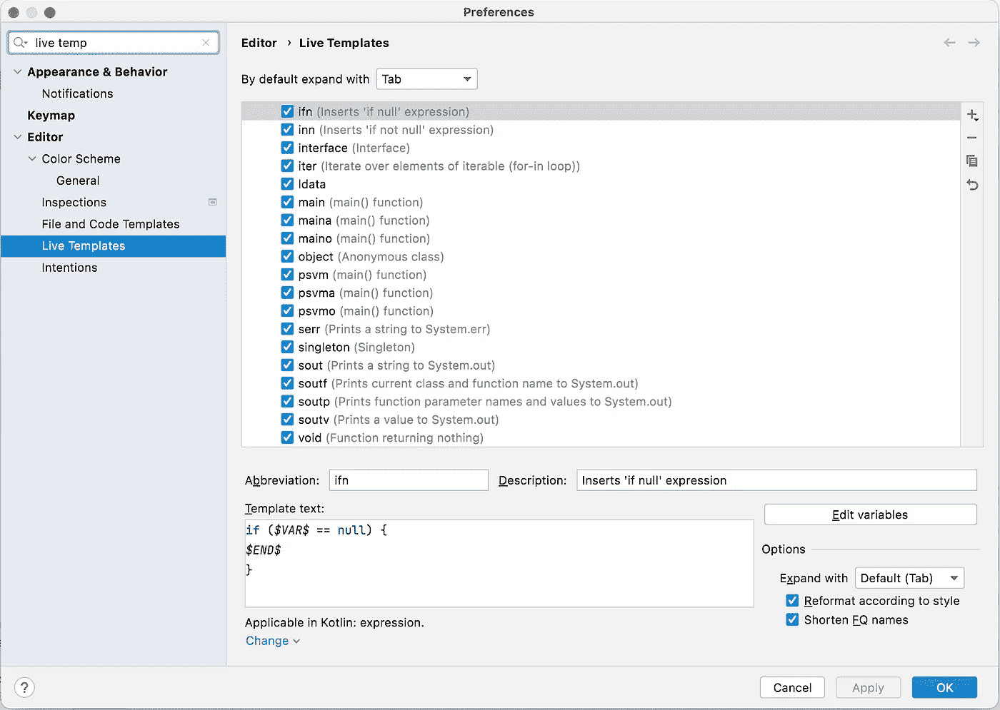

# 5 个 Android Studio Live 模板可加快编码速度

> 原文：<https://levelup.gitconnected.com/5-android-studio-live-templates-to-code-faster-9a0330cd256c>

## 使用这些自定义快捷方式来节省时间，并避免重复编写相同的内容


由[帕布鲁·阿罗约](https://unsplash.com/@pablogamedev?utm_source=medium&utm_medium=referral)在 [Unsplash](https://unsplash.com?utm_source=medium&utm_medium=referral) 上拍摄的照片

作为开发人员，我们会多次编写相同的代码。例如，想想你写了多少次 if 条件来检查变量是否为空。可能**几千次**吧？

Android Studio(因此，IntelliJ)附带了一个名为 Live Templates 的功能，允许开发人员定制转化为书面代码的快捷方式或缩写。按照前面的例子，在 Java 和 Kotlin 中，我们有一个默认的快捷键。

要激活这个实时模板**，**我们需要写`ifn`，然后按 enter 或 tab。代码中会出现我们想要检查的变量的占位符。要在这些变量之间移动，需要再次单击回车键。



活动模板

默认实时模板列表以及添加我们自己的模板的位置在首选项→编辑器→实时模板中。



实时模板管理器

在这里，您可以为特定的语言制作自己的模板。这将需要一个缩写(在最后一个例子中是`ifn`)，一个可选的描述和模板本身。要设置占位符，我们需要在可变的文本周围放置$符号。

既然您已经看到了实时模板的作用以及如何创建模板，我想分享一些我自己创建的模板。这些都是我每天做的事情，所以请在评论中分享你的想法。

# 1.ViewModel 中的 LiveData

当向视图公开一个 LiveData 变量时，我总是使用这个模板。这创建了一个可以在 ViewModel 中读写的变量，以及另一个暴露在视图中且只能读取的变量。

```
**Abbreviation:** 
ldata**Template Text:** val $READVAR$: LiveData<$CLASS$>
        get() = _$READVAR$
private val _$READVAR$ = MutableLiveData<$CLASS$>()**Applicable in Kotlin**
```

# **2。快速日志调用**

有时候，当我想补充调试器，或者我在寻找一个无法调试的错误时，我会使用 Logcat。为此，我有一个快速信息的模板。

```
**Abbreviation:**
logui**Template Text:** Log.d("UIDEBUG", "$MESSAGE$")**Applicable in Kotlin**
```

# 3.清单权限

我通常在我的应用程序中使用相同的权限，但我过去常常忘记这些权限到底是什么。为了解决这个问题，我制作了这个模板来编写这些权限，而不是去 GitHub 并导航到我的项目的 AndroidManifest。

```
**Abbreviation:** perms**Template Text:**
<uses-permission android:name="android.permission.INTERNET" />
<uses-permission android:name="android.permission.WRITE_EXTERNAL_STORAGE" />
<uses-permission android:name="android.permission.READ_EXTERNAL_STORAGE" />**Applicable in XML**
```

# 4.垂直线布局

这个我最近不怎么用，因为我大部分时间都在尝试使用 Compose，但它是我的最爱之一。这个程序为一个 XML 视图创建了一个垂直的 LinearLayout，其中已经为一个 ID 写了一个占位符，默认为垂直方向。

```
**Abbreviation:** vll**Template Text:**
<LinearLayout
    android:id="@+id/$ID$"
    android:layout_width="match_parent"
    android:layout_height="match_parent"
    android:orientation="vertical" >

    $VIEW$</LinearLayout>**Applicable in XML**
```

# 5.特定调度程序的暂停功能

我总是在我的[库](https://developer.android.com/codelabs/basic-android-kotlin-training-repository-pattern#0)的功能中使用这个。如果你想在函数中有 n 个参数，你可以复制粘贴并调整它。

在这个例子中，我取零个参数，所以如果你想发送一个参数，你可以用一个缩写做另一个模板，叫做`susdis1`等等。

```
**Abbreviation:** susdis0**Template Text:**
suspend fun $NAME$(): $RETURN_TYPE$ = withContext($DISPATCHER$) {
    $CONTENT$
}**Applicable in Kotlin**
```

如果你想阅读更多这样的内容，并支持我，不要忘记检查我的个人资料，或给媒体一个机会，成为会员，以获得我和其他作家的无限故事。每月只有 5 美元，如果你使用这个[链接](https://medium.com/@molidev8/membership)，我会得到一小笔佣金。

[](https://medium.com/@molidev8/membership) [## 通过我的推荐链接加入 Medium—Miguel

### 阅读米格尔的每一个故事(以及媒体上成千上万的其他作家)。你的会员费直接支持米盖尔…

medium.com](https://medium.com/@molidev8/membership)