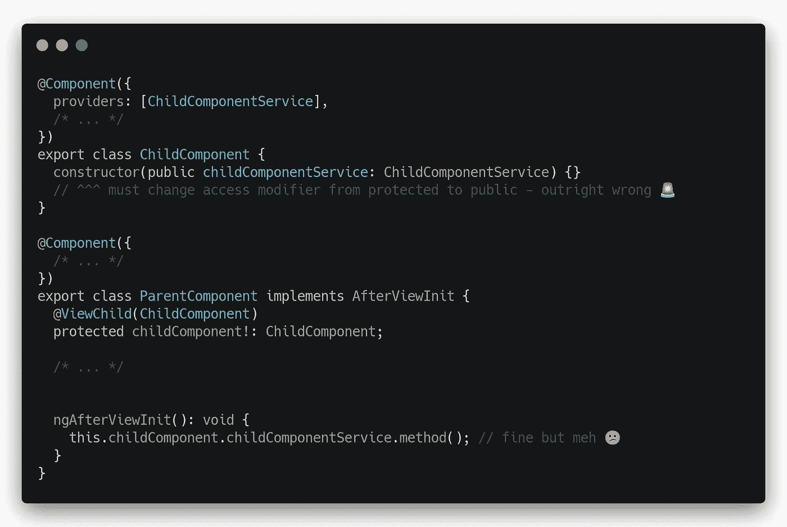
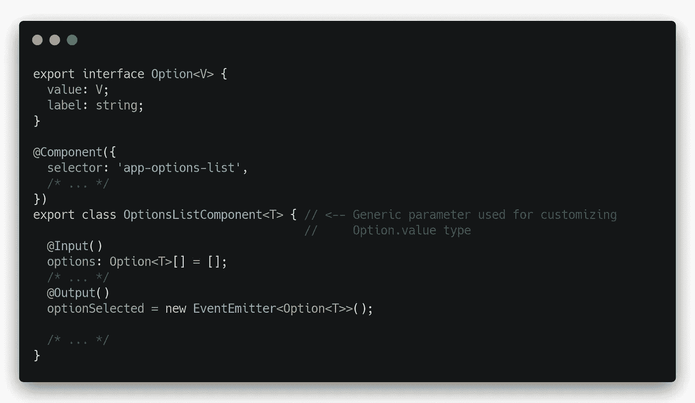

# 你可能不知道的 5 个令人惊讶的棱角特征

> 原文：<https://levelup.gitconnected.com/5-angular-features-you-might-not-have-known-about-d809babb51a4>

## 使用这些鲜为人知但很方便的技巧，让你的角度代码库更安全、更整洁

来自[像素](https://www.pexels.com/cs-cz/foto/podnikatel-ruce-pracovni-stul-vladce-5582597/?utm_content=attributionCopyText&utm_medium=referral&utm_source=pexels)的[第三人](https://www.pexels.com/cs-cz/@thirdman?utm_content=attributionCopyText&utm_medium=referral&utm_source=pexels)的照片

因为 Angular 非常适合企业软件开发，所以 Angular 代码库可以变得很大。每一个大的代码库都会随着时间的推移而退化，通常是因为它的一些编程模式和实践已经被证明是不合适的，或者是由于代码库维护者的波动。本文将介绍五个简单而简洁的技巧来重构您的代码库，以获得更好的质量，或者如果您正在开始一个新项目，它们将帮助您明确您关于编码实践的想法。

# 💉管道实际上是可注射的

有时可能会出现这样的情况，当您需要使用没有导出配套格式化函数的管道来格式化控制器方法中的一些值时(内置的角度管道有这些函数:`PercentPipe` → `formatPercent`、`CurrencyPipe` → `formatCurrency`、…)。

使用没有这种相关格式化功能的管道的一个简单方法是将它的依赖项注入到您的控制器中，然后使用这些依赖项实例化管道本身，并在最后一步调用它的`transform`方法——类似这样:

之前-手动管道实例化

问题解决了。或许足够了。但是构造函数中的这些依赖项实际上是不需要的代码，仅仅是为了实例化管道的需要而存在的。然而，有一个简洁的解决方案。因为管道是 Angular 管理的对象，所以它们应该是可注入的。通过在`@Component.providers`中列出这些管道，然后将它们像服务一样注入到控制器的构造函数中，您将获得由角度依赖注入自动创建的管道实例及其所有依赖项，而无需不必要的技术管道:

后-通过角度 DI 进行管道实例化

# 👀ViewChild 也可用于服务

很少有好的理由将`@ViewChild`与子组件结合使用。对子组件这样做的通常用例是在假设父组件和子组件总是一起使用的情况下使用子组件的方法。在非常微妙的情况下，还需要使用子组件的组件提供的服务的方法。

具有组件提供的服务的父组件和子组件

这样做的一个常见的简单方法是将一个`@ViewChild`与一个组件一起使用，并在您的子组件中打破该服务的封装，如下所示:

使用对子组件的引用来访问子组件的服务

但是，有一个更好的解决方案，允许您直接获得子组件的组件提供的服务，而无需访问子组件:

直接访问子组件的服务

只是不要忘记这个技巧只需要用于*组件提供的服务*，也就是那些在`@Component.providers`中列出的服务。在装饰元数据中有`providedIn: root`的服务或者在`@NgModule.providers`中列出的服务在这种情况下会被简单地注入到你的父组件的构造函数中，这样就可以了。

# 🧨角服务可以有 NgOnDestroy

许多 Angular 开发者不知道的一个非常令人惊讶的事实。它确实得到了官方的支持！一个片段说了 1000 多个字:

由于`ngOnDestroy`在服务中可用，您也可以使用与在组件中相同的技术在服务中自动取消订阅。

下面列出的文章对自动退订的技巧做了一个很好的总结，值得一读，大约只需要 5 分钟:

 [## 像专业人士一样自动退订角度组件

### 快速处理 unsubscribe()调用的 5 个技巧

levelup.gitconnected.com](/auto-unsubscribing-in-angular-components-like-a-pro-742220b01d0c) 

*不过需要注意的是，我会忽略在服务中创建订阅，因为大多数时候，来自服务的数据消费者通常是组件、指令和管道。*

# 📐推断通用组件的类型

这是 Angular 编译器的一个很大的特性，尤其是如果你正在使用自 Angular 12 以来强烈推荐的 AOT 和严格模式。它非常优雅地克服了组件中的各种类型转换怪癖和奇怪的模板编译错误。

让我们假设您有一个实现选项列表的组件`OptionsListComponent`，它使用一个带有通用值的数组`Options`:

实现具有泛型值类型的选项列表的组件

这种带有泛型参数的组件的真正威力在于它在许多不同值类型上下文中的无限广泛的用途:

动作中的一般角度分量类型推断

请参阅—不需要对不同的值类型进行类型转换或重新实现。严格模式下的艾薇·AOT 做得很好！

从我的实践和经验来看，通用组件类型推断在巨大的代码库中是一个真正的救命稻草，在那里有防止代码重复的巨大需求，并且代码重用率是代码质量的主要度量之一。

另外，它也适用于指令和管道！

# 🪙应用程序初始值设定项是多标记的，可以这样使用

您可能已经多次使用或见过应用程序初始化器，最常见的用法如下:

之前—所有初始化代码都在一个工厂中

注意小小的`multi: true`静态提供者元数据。这意味着可以在你的引导模块提供者中声明多个`APP_INITIALIZER`——出于某种原因，没有多少教程和文档提到这一点。这就打开了将大的应用程序初始化器按照职责分成多个更小的初始化器的大门，例如:

after——初始化代码按照职责划分到多个工厂中

它适用于以下初始化器标记:

*   `PLATFORM_INITIALIZER` —角平台初始化后运行的初始化器，
*   `APP_BOOTSTRAP_LISTENER` —初始化每个引导组件后运行的初始化器，
*   `APP_INITIALIZER` —在应用程序初始化过程中运行的初始化器。

注意，各个初始化器是并行执行的。

这是一个很好的特性，因为从软件工程的角度来看，使用多个初始化器的方法符合单一责任原则——与初始化器相关的代码将更容易测试，也更简单。

# 📦结论

到目前为止，您已经看到了提高 Angular 代码库质量和安全性的五个技巧。当我第一次听说这五个技巧时，我很惊讶。和 Angular 一起工作的时候有什么让你惊讶的？不要犹豫，在下面的评论中告诉其他读者吧！

# 👓值得一看的文章

 [## 这种角度技术将显著降低大型项目中的代码重复

### 告别大型项目中 ng 模板的代码重复和性能问题

levelup.gitconnected.com](/this-angular-technique-will-significantly-lower-code-duplication-in-big-projects-28fd62c3eadd)  [## 正确处理角度应用中的负载指示器

### 一个优雅的，没有麻烦的方式来摆脱无意义的技术管道在您的业务角组件。

levelup.gitconnected.com](/handling-loading-indicators-in-angular-applications-the-right-way-11ff8b8896ba)