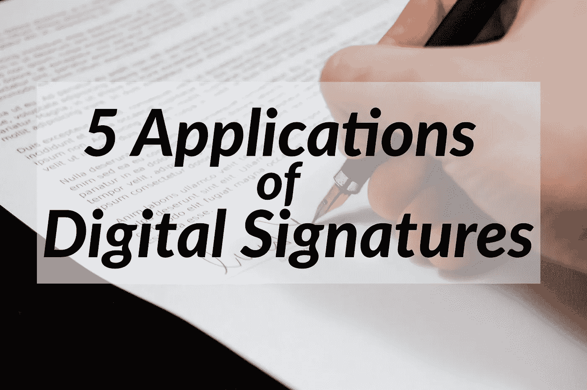
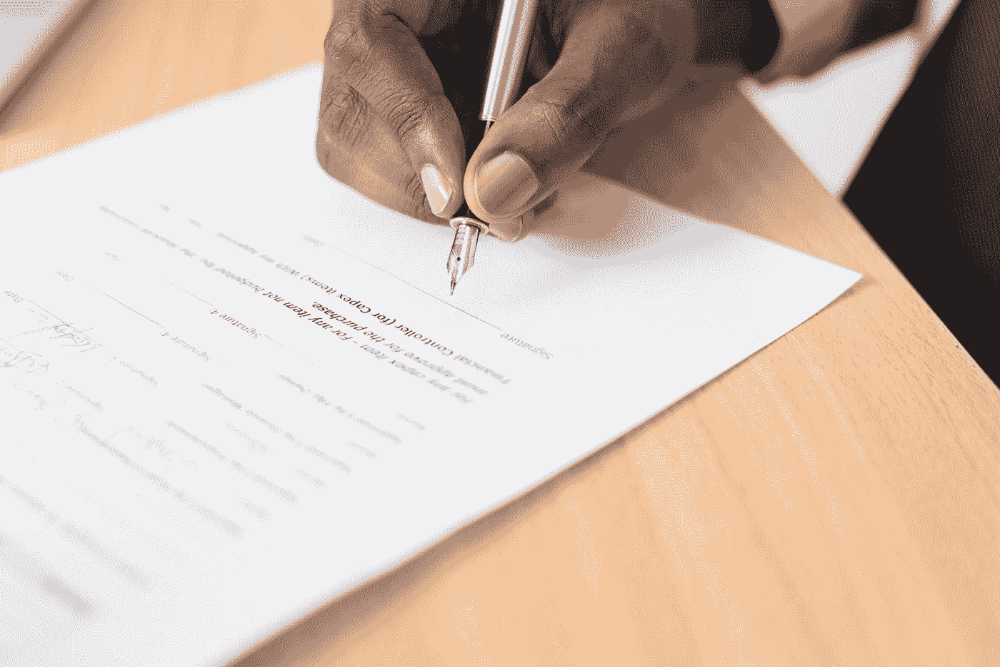
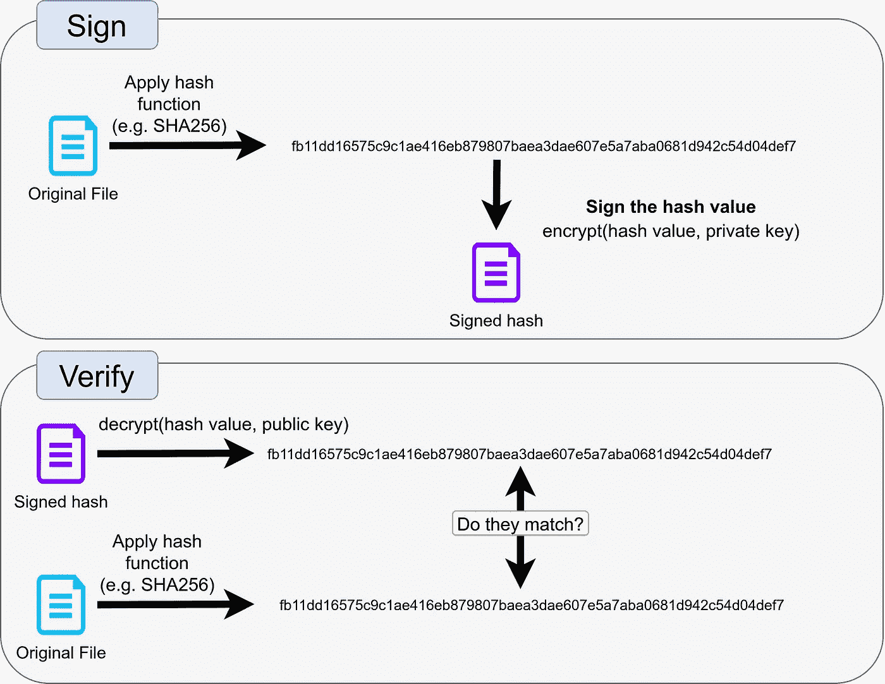
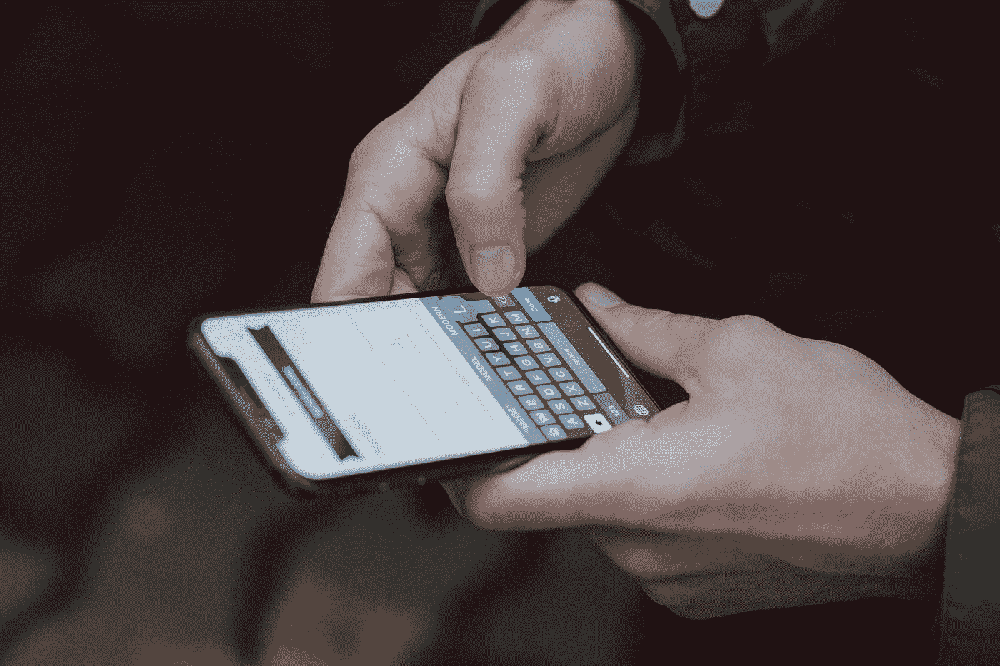
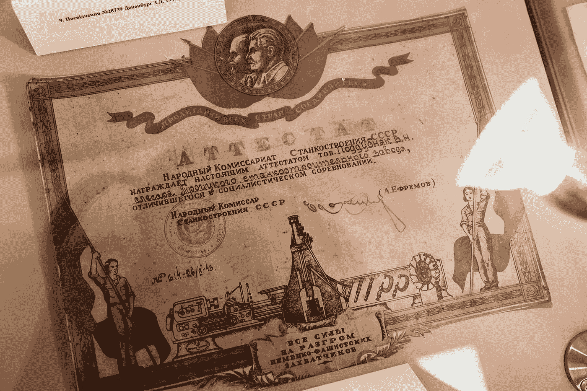

# 5 数字签名的应用

> 原文：<https://levelup.gitconnected.com/5-applications-of-digital-signatures-4e785d22d439>

## 了解它们是什么以及如何使用它们



图片由 [Pixabay](https://www.pexels.com/de-de/foto/person-die-im-dokumentationspapier-unterschreibt-48148/) 提供

我们用签名来表明我们已经阅读了合同，并希望尽我们的一份力量来履行合同。它们有两个目的:表达一种意图，并能够向当局证明在一方当事人不遵守合同的情况下表达了这种意图。例如，如果你签了一份租房协议，你的房东就有证据证明你想每月支付规定的租金。你有证据证明你可以使用这个公寓。

让我们来了解一下这种方法的问题和数字等价物！

# 为什么手写签名有问题

我们先来探讨一下传统签名的问题。



照片由 [Cytonn 摄影](https://unsplash.com/@cytonn_photography?utm_source=medium&utm_medium=referral)在 [Unsplash](https://unsplash.com?utm_source=medium&utm_medium=referral) 上拍摄

## 问题#1:将签名与您的身份联系起来

我们假设你想忽悠一个房东。你签名，但是你用了不同的签名。为了能够看出这是一个假签名，你的房东需要一个身份证明文件。签名本身是不够的。而且身份证件上需要有签名！

现在楼主需要检查(1)身份证件是否有效，(2)签名是否相同。

## 问题#2:接受有效签名

如果你把你的签名写两遍，看起来会不一样。如果你的身份证件过期了，你需要一个新的，这有时是一个问题。如果颁发机构允许更改，那么他们需要跟踪您的更改。

如果你生病了，你可能再也不能用同样的方式写那个签名了。

这里的另一个问题是，你不能仅仅交换铅笔和你书写的媒介。甚至桌子和座位也会影响你的笔迹。一个典型的例子是:当你接受包裹并确认你已经收到它们的时候，要在上面签名。

## 问题#3:拒绝无效签名

如果别人知道你的签名，他们可能在几个小时的练习后创造出一个非常相似的签名。

## 问题#4:防止签名文档被篡改

如果你有多页，而你只在最后一页签名:你如何防止人们更改第一页？

## 问题#5:否认

你可能已经和一家公司签订了合同，但是后来意识到这是一个错误的决定。你改变主意了。所以你声称你从未签过。如果这是可能的，那就糟了。我们需要合同的不可否认性。

# 数字签名是如何工作的？

非对称加密是一组算法，具有加密和解密不使用相同密钥的特性！

```
Symmetric cryptography:
  encrypt(plain text, key) = ciphertext
  decrypt(ciphertext, key) = plain textAsymmetric cryptography:
  encrypt(plain text, key A) = ciphertext
  decrypt(ciphertext, key B) = plain text
```

这很神奇，因为它允许你公开分享`key B`，而另一个`key A`——私人分享。然后你可以用你的 **私钥**对任何文本**进行**加密，人们会知道消息是你加密的，因为**公钥**、`key B`、**可以解密它**。****

因此，数字签名是非对称加密的文件，其中解密密钥是公开的。每个人都可以解密它，但只有密钥持有者可以加密文件，这样特定的公钥就可以解密它。

最棒的是，你现在可以清楚而安全地证明`key A`的持有者确实签署了该文件。你刚刚解决了问题#2、#3、#4 和#5！

请注意**问题#1 仍然存在**:你仍然需要确定`key A`的持有者确实是你认为的那个人。

有几种具体的算法属于这一类。RSA 密码系统无疑是最著名的，紧随其后的是 DSA(见[差异](https://security.stackexchange.com/a/5100/3286))。ECDSA 也相当普遍。

还请注意，如果文件是用私钥加密签名的，那么您实际上需要公钥来读取它。这可能不是所期望的。相反，您可以[计算文件的较短哈希值](/the-3-applications-of-hash-functions-fab1a75f4d3d)并签署该哈希值。该方案是这样的:



图片作者:马丁·托马斯

# 应用#1:通信(电子邮件、短信)



[freestocks](https://unsplash.com/@freestocks?utm_source=medium&utm_medium=referral) 在 [Unsplash](https://unsplash.com?utm_source=medium&utm_medium=referral) 上的照片

当你写电子邮件时，你不需要在隐私和篡改方面信任你的电子邮件提供商。你可以用收件人的公钥加密邮件，在你这边签名。通过这种方式，发送者可以确定没有被篡改，并且消息来自于你。只可能是您的提供商根本没有传递消息。

# 应用#2:代码贡献


[扬西·敏](https://unsplash.com/@yancymin?utm_source=medium&utm_medium=referral)在 [Unsplash](https://unsplash.com?utm_source=medium&utm_medium=referral) 上的照片

许多代码是由许多人以开源形式编写的。他们可能是对编码感兴趣的志愿者，或者他们可能因为这些贡献而得到报酬。项目的维护者需要确保所有的贡献都是有帮助的，但是他们可能没有时间去检查每一个贡献。他们需要能够信任一些人。通常第一个会被彻底检查，但是随着时间的推移，你甚至会成为一个贡献者。人们开始信任你。但他们需要确定是同一个人。他们需要确定你的贡献没有改变。出于这个原因，你签署每一个贡献。

# 应用#3:软件更新


马库斯·温克勒在 [Unsplash](https://unsplash.com?utm_source=medium&utm_medium=referral) 上的照片

想想你的智能电视/ Alexa / FritzBox。所有这些设备都需要更新。假设您可以在设备中插入一个带有更新文件的 u 盘。作为制造商，您希望确保更新没有被更改。你要保证设备能继续工作。所以你在设备内共享公司的公钥。当设备发现更新时，它通过检查更新的签名来验证该公司是来源。

# 应用#4:数字文凭



Marjan Blan | @marjanblan 在 [Unsplash](https://unsplash.com?utm_source=medium&utm_medium=referral) 上的照片

当你申请工作时，你潜在的新雇主可能想看你的推荐信和文凭。尤其是因为冠状病毒正在全球肆虐，这些文件以数字形式提交。用人单位如何核查文凭是否真的有效？

数字签名会有所帮助。你需要有一个数字签名版本的毕业证书，并且能够以一种值得雇主信任的方式共享公钥。例如，你的大学可以简单地把密钥放在他们的网站上。未来的雇主需要下载你的大学签名，然后对照你的简历运行`gpg --verify`。

如果您想尝试签署文件，首先安装 Gnu 隐私保护(简称:GnuPG，更简称:GPG)并创建您自己的 gpg 密钥:

[](https://www.gnupg.org/documentation/guides.html) [## GnuPG -用户指南

### 这个页面收集了 GnuPG 的用户指南文档。感谢 DocBook 系统，约翰·迈克尔·阿什利的…

www.gnupg.org](https://www.gnupg.org/documentation/guides.html) 

然后，您可以运行这些命令:

```
# Create a my-cv.pdf.gpg file - a signed version of my-cv.pdf:
gpg --sign my-cv.pdf# Verify the signature:
gpg --verify cv-curriculum-vitae.pdf.gpg
# Prints:
# gpg: Signature made Fr 16 Apr 2021 19:22:38 CEST
# gpg:                using RSA key 
# D1E632346B642680EF360D696901E782EF663EC4
# gpg: Good signature from "Martin Thoma (Generated on 
# 2021-01-15 for private use) <[info@martin-thoma.de](mailto:info@martin-thoma.de)>" [ultimate]# Get the contained document:
gpg --output original.pdf --decrypt cv-curriculum-vitae.pdf.gpg
```

# 应用#5:加密货币


德米特里·德米德科在 [Unsplash](https://unsplash.com?utm_source=medium&utm_medium=referral) 上拍摄的照片

为了证明你是一枚比特币的持有者，系统使用了非对称加密技术。一开始，有人被保证是硬币的合法拥有者。之后，有效所有者被定义为与给定公钥匹配的私钥的所有者。

请注意，数字签名仅证明特定时间点的所有权。它们没有解决一个拥有者可能只花了硬币两次的问题——双重花费问题。

“硬币”其实是用词不当。请参阅我关于 UTXO 的文章了解更多详情:

[](https://medium.com/coinmonks/the-utxo-model-f5eb1fc9a853) [## UTXO 模型

### 比特币的技术基石

medium.com](https://medium.com/coinmonks/the-utxo-model-f5eb1fc9a853) 

# 摘要

*   数字签名证明签署的文档是由密钥持有者签署的。
*   密钥持有者不一定是您认为的那个人，您仍然需要首先验证其身份。
*   公钥必须由验证方共享和获得。
*   私钥仍然是私有的，不能丢失。
*   RSA、DSA、ECDSA 是目前加密签名的好算法。使用经过良好测试的库来应用它们——密码学很难，很容易出错。

我希望本文为您的软件开发工具箱提供了另一个工具！