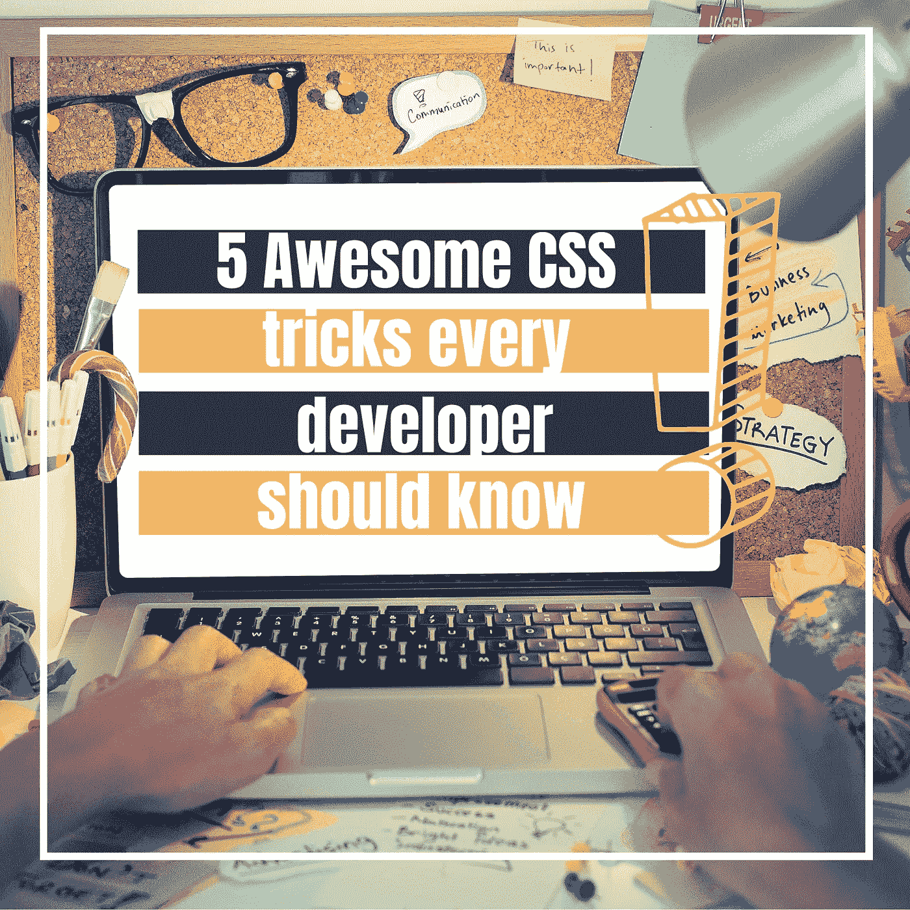
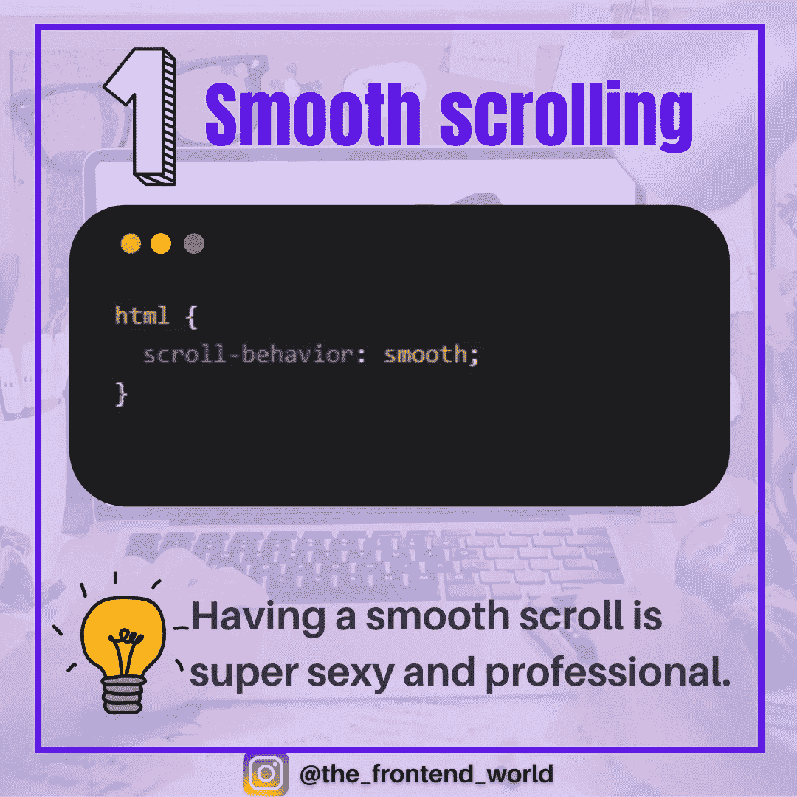
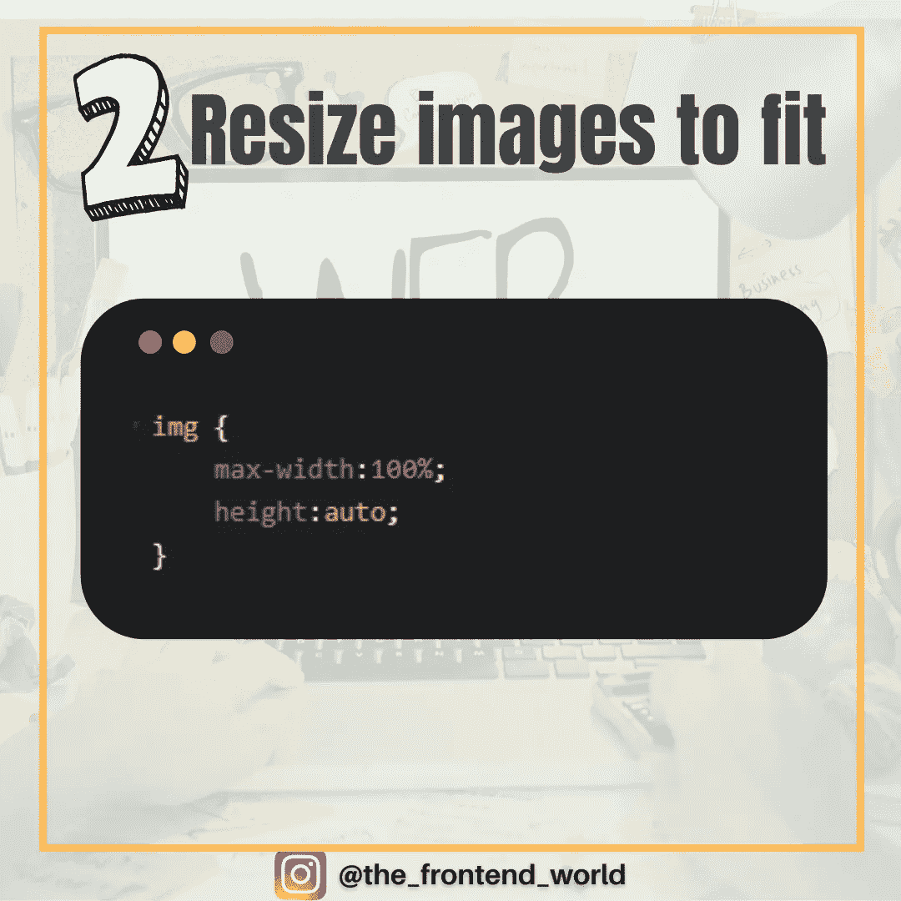
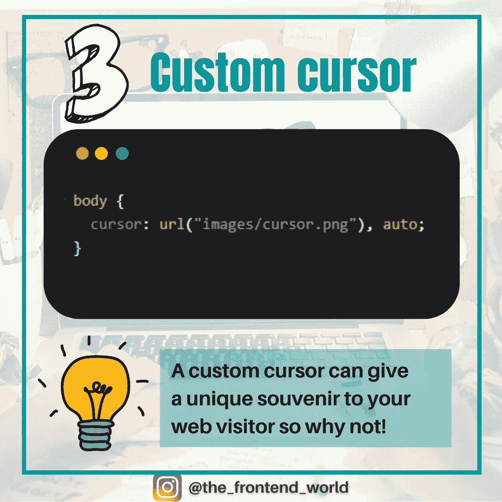
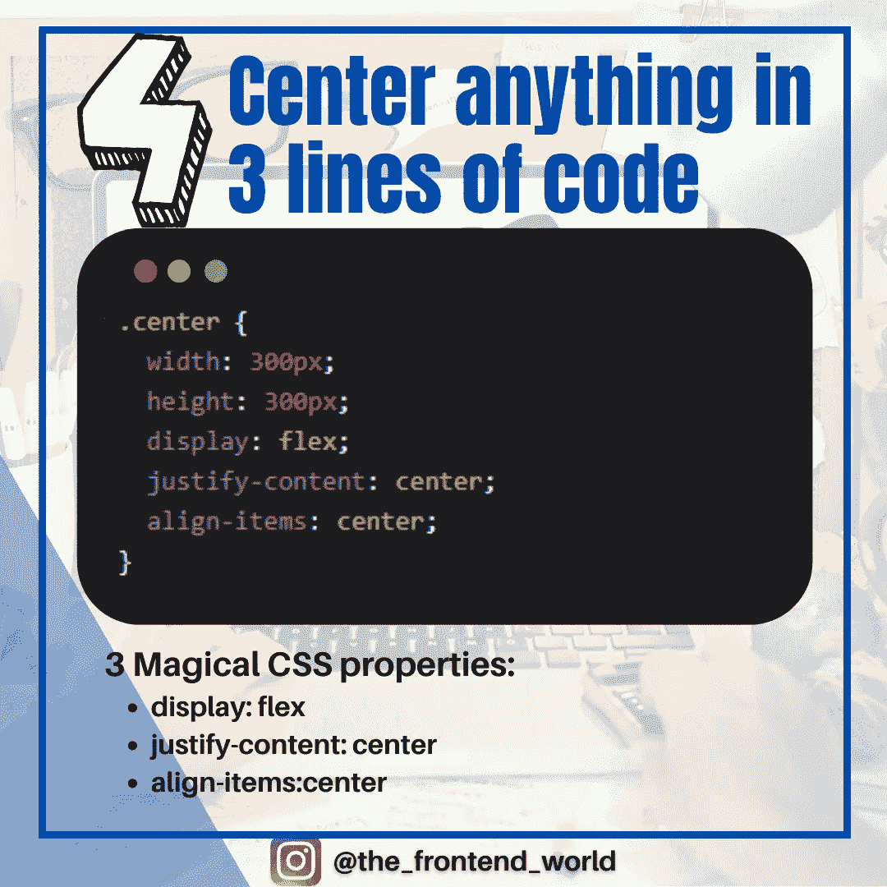
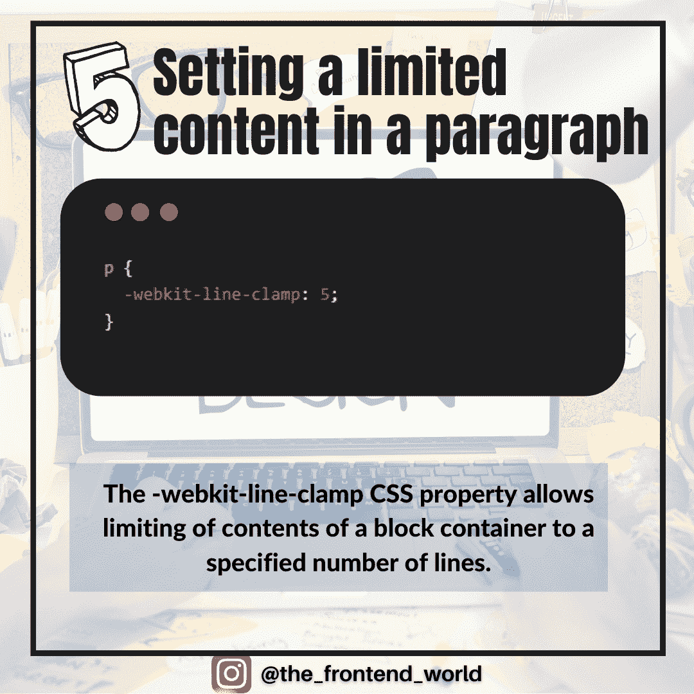

# 每个开发人员都应该知道的 5 个可怕的 CSS 技巧

> 原文：<https://levelup.gitconnected.com/5-awesome-css-tricks-every-developer-should-know-39396d4be992>

## 用 CSS 用更少的代码行做更棒的事情

作者:FAM

这一次，我用几行代码收集了你可以用 CSS 做的最棒的事情。

准备好了，我们开始吧！

# #1:平滑滚动

当你有一个显示网页不同部分的按钮时，这项技术非常重要。用简单的`href="#goToContact"`来做，肯定会动作很快但不性感。拥有流畅的卷轴超级性感专业。你的网站访问者应该得到最好的用户体验。

平滑滚动

作者:FAM

# #2:调整图像大小

谁不为让图片适合你的网页而头疼呢？我有一个简单的方法像专家一样处理这个问题；-)

这里有一个例子:

调整图像大小以适合

作者:FAM

# #3:将图像设置为光标

想让你的光标像你的 web app 或者网站一样特别？这可以给你的网站访问者一个独特的纪念品，为什么不呢:

自定义光标

更多细节？以下是你需要阅读的内容:

 [## 如何在你的网站上使用自定义光标

### 你的网站应该是不同的。它应该代表你！

levelup.gitconnected.com](/how-to-use-a-custom-cursor-on-your-website-7b46b7570995) 

作者:FAM

# #4:将所有内容集中在 3 行代码中

以 CSS 为中心，谁最后没有拔自己的头发？这里有三个神奇的 CSS 行来居中显示任何内容:

将 CSS 中的任何内容居中

作者:FAM

# #5:在段落中设定有限的内容

你需要在你的段落中只显示几个短语吗？同样，CSS 只用一行代码就可以做到这一点。CSS 属性允许将块容器的内容限制在指定的行数。

有限的段落行数

# 回顾一下？

5 个可怕的 CSS 技巧

# 亲爱的读者，我希望这是清晰和有用的

*无论你在哪里，我都希望你和你的家人平安。坚持住。明天会更好！*

**让我们在** [**中**](https://medium.com/@famzil/) **，**[**Linkedin**](https://www.linkedin.com/in/fatima-amzil-9031ba95/)**，** [**脸书**](https://www.facebook.com/The-Front-End-World) **，**[**insta gram**](https://www.instagram.com/the_frontend_world/)**，或者**[**Twitter**](https://twitter.com/FatimaAMZIL9)**。**

**FAM**

[www.fam-front.com](http://www.fam-front.com/)

# 分级编码

感谢您成为我们社区的一员！[订阅我们的 YouTube 频道](https://www.youtube.com/channel/UC3v9kBR_ab4UHXXdknz8Fbg?sub_confirmation=1)或者加入 [**Skilled.dev 编码面试课程**](https://skilled.dev/) 。

 [## 编写面试问题+获得开发工作

### 掌握编码面试的过程

技术开发](https://skilled.dev)