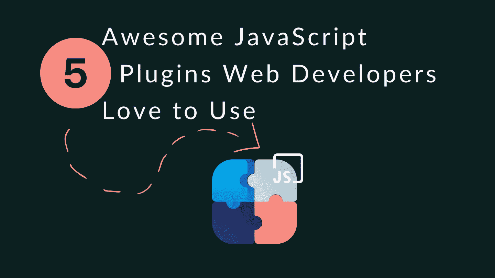
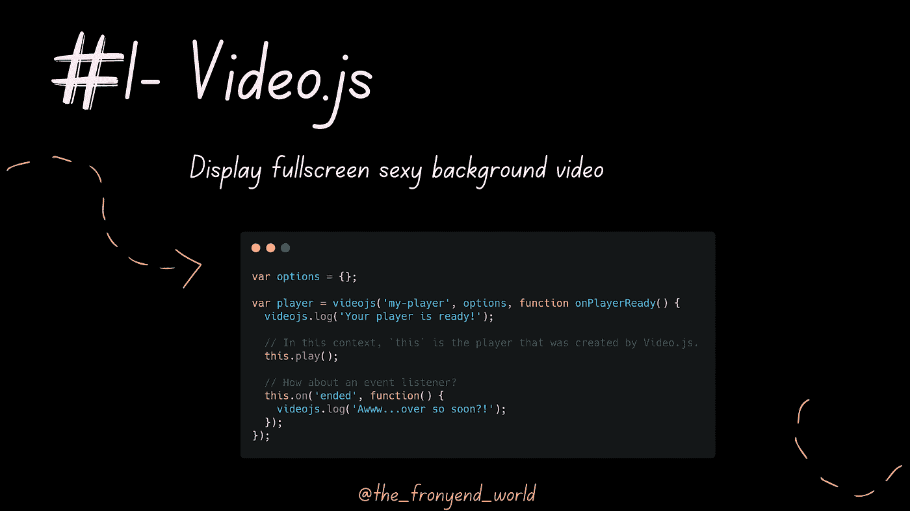
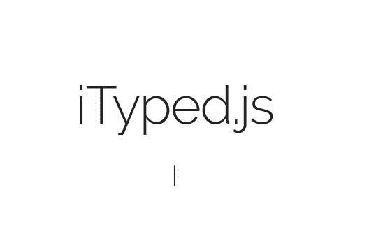
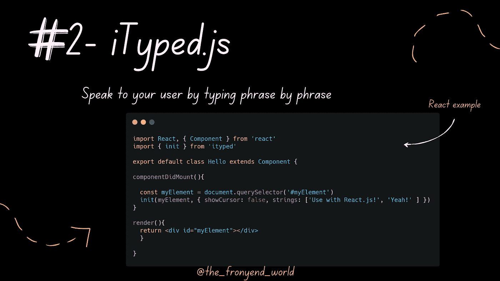
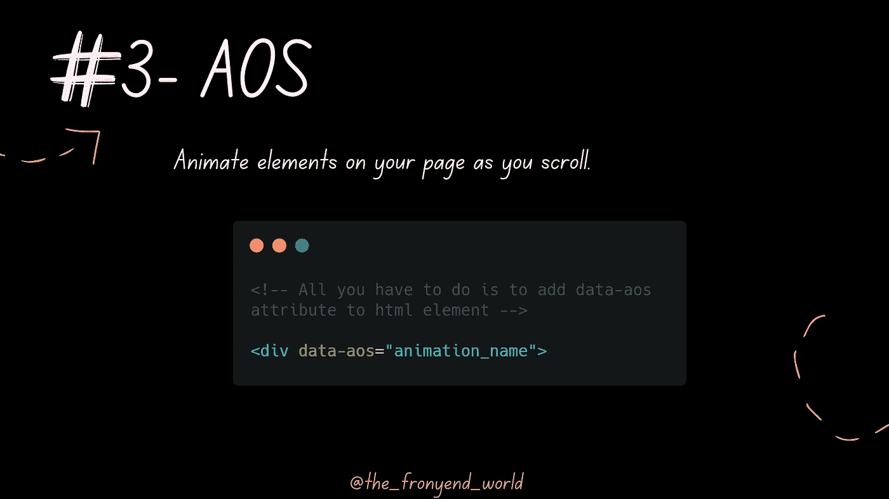
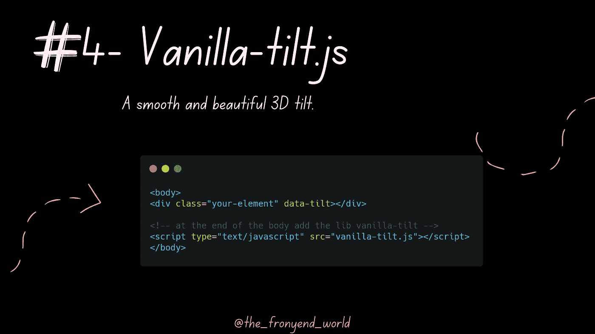
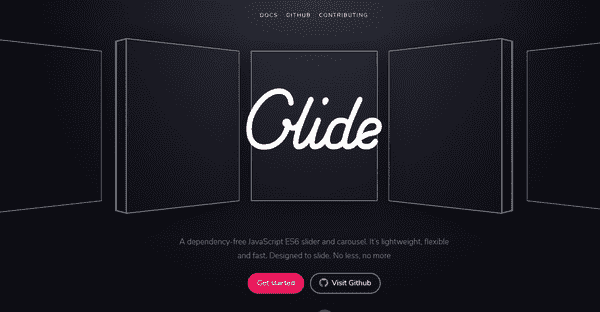
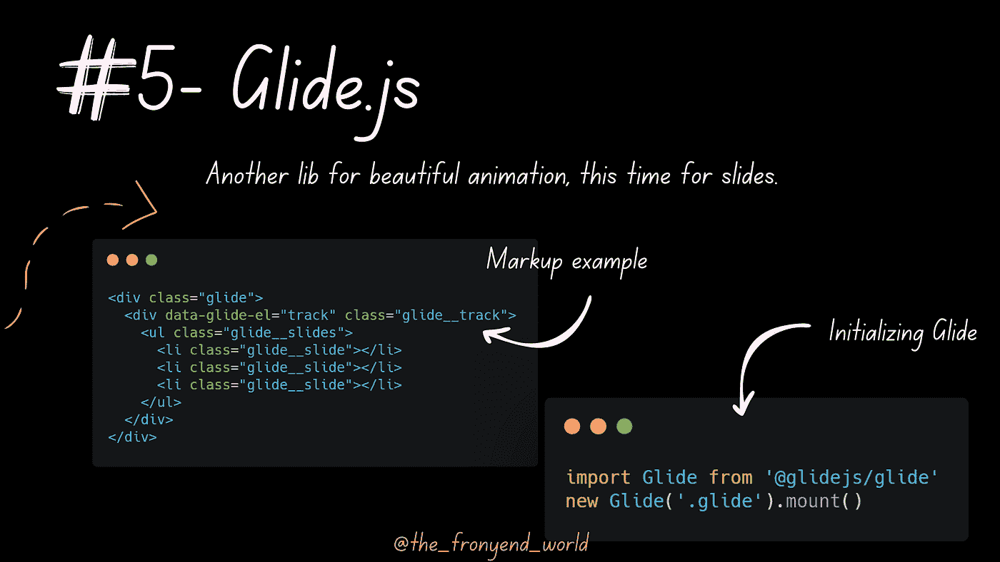

# Web 开发人员喜欢使用的 5 个超棒的 JavaScript 库

> 原文：<https://levelup.gitconnected.com/5-awesome-javascript-plugins-web-developers-love-to-use-78009f563fb1>

## 小的库可以在用户体验上产生巨大的差异。



作者:FAM

既然有小而快的 JS 库可以完成这项工作，为什么还要开发令人敬畏的动画呢？在这篇文章中，我将介绍一些改变你的网站外观和用户体验的库。

# 1- Video.js

要不要加个全屏性感背景视频？嗯， [video.js](https://github.com/videojs/video.js) 可能是你的朋友！

> [Video.js](https://github.com/videojs/video.js) 是一款专为 HTML5 世界打造的网络视频播放器。它支持 HTML5 视频和媒体源扩展，以及其他播放技术，如 YouTube 和 Vimeo(通过[插件](https://videojs.com/plugins/))。它支持在桌面和移动设备上播放视频。这款播放器现在被超过 60 万个网站使用。

## 想试试吗？

*   [NPM](https://www.npmjs.com/package/video.js)

```
npm install video.js
```

*   例子



# 2- iTyped.js

iTyped 插件是我的最爱之一。我喜欢它。有了这个插件，你可以告诉你的访问者很多事情，而不会让你的网站内容和文本超载。我最喜欢的让我的网络应用有点人性化和口语化的方法是一个短语一个短语地输入，而不是一次给出全部信息。



iTyped.js

👉顺便说一句，我现在正在我的网站上使用它来给我可爱的访问者提供关于我的快速而简要的信息😜

## 想试试吗？

*   [NPM](https://www.npmjs.com/package/ityped)

```
npm i ityped
```

*   示例(带 React)



# 3- AOS

我最近发现了这个插件，发现它使用起来超级简单和有趣(我计划在我的新作品集网站中使用它😁).

这个插件是一个小程序库，当你滚动的时候，它可以让你的页面上的元素产生动画效果。当你上下滚动时，AOS 允许你动画元素。如果您滚动回顶部，元素将动画显示到它们以前的状态，并且如果您向下滚动，元素将再次动画显示。

## 想试试吗？

*   [NPM](https://www.npmjs.com/package/aos)

```
npm install aos --save
```

*   例子

在 [AOS GitHub](https://github.com/michalsnik/aos/tree/v2) 上找到高级设置。



# 香草倾斜

你可能已经注意到这个著名的动画，经常在网站模板和网络应用程序中使用。从 [Tilt.js (jQuery 版本)](https://github.com/gijsroge/tilt.js)分叉的平滑 3D tilt javascript 库。


## 想试试吗？

*   [NPM](https://www.npmjs.com/package/vanilla-tilt)

```
npm i vanilla-tilt
```

*   例子

## 可供选择的事物

*   jQuery:[https://www.npmjs.com/package/tilt.js](https://www.npmjs.com/package/tilt.js)
*   **反应过来:**https://github.com/jonathandion/react-tilt
*   **聚合物:**[https://github.com/YingshanDeng/polymer-tilt](https://github.com/YingshanDeng/polymer-tilt)



# 5- Glide.js

另一个漂亮的动画库，这次是幻灯片。Glide.js 是一个独立的 JavaScript ES6 滑块和转盘。它轻巧、灵活、快速。



[滑行](https://glidejs.com/)。射流研究…

## 想试试吗？

*   [NPM](https://www.npmjs.com/package/glidejs)

```
npm install @glidejs/glide
```

*   例子

```
**<!-- 1- Required Core stylesheet -->**
<link rel="stylesheet" href="node_modules/@glidejs/glide/dist/css/glide.core.min.css"><!-- Optional Theme stylesheet -->
<link rel="stylesheet" href="node_modules/@glidejs/glide/dist/css/glide.theme.min.css">**<!-- 2- Now, prepare a little markup for test -->**
<div class="glide">
  <div data-glide-el="track" class="glide__track">
    <ul class="glide__slides">
      <li class="glide__slide"></li>
      <li class="glide__slide"></li>
      <li class="glide__slide"></li>
    </ul>
  </div>
</div>**<!-- 3-  initialize and mount a Glide -->**
import Glide from '@glidejs/glide'
new Glide('.glide').mount()
```



# 最后的想法…

你觉得这些牛逼的小图书馆怎么样？你用过它们吗？你最喜欢什么？你能和我们分享一下吗？😏

亲爱的读者，我希望这是明确和有用的。我希望你和你的家人无论在哪里都平安！坚持住。明天会更好！

**让我们接触一下** [**中**](https://medium.com/@famzil/)**[**Linkedin**](https://www.linkedin.com/in/fatima-amzil-9031ba95/)**[**脸书**](https://www.facebook.com/The-Front-End-World)**[**insta gram**](https://www.instagram.com/the_frontend_world/)**[**Youtube**](https://www.youtube.com/channel/UCaxr-f9r6P1u7Y7SKFHi12g)**或**********

****[👉我的网络世界](http://www.fam-front.com/)****