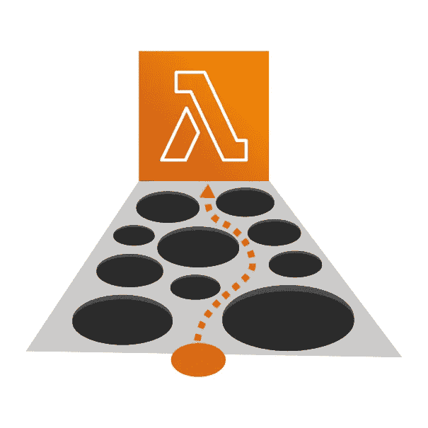
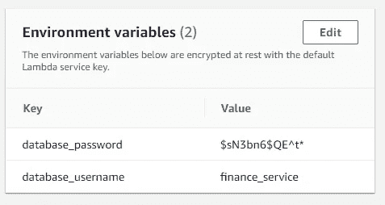

# 大多数开发人员不知道的 5 个 AWS Lambda 陷阱

> 原文：<https://levelup.gitconnected.com/5-aws-lambda-pitfalls-most-developers-dont-know-about-ec556a02792f>

使用 AWS Lambda 可以在启动和运行服务时节省大量时间，但在广泛使用时会有一些主要缺点。理解这些陷阱是很重要的，因为它们通常并不重要，直到你在生产中遇到它们时，已经太晚了，无法避免。

AWS Lambda 陷阱

# 1.专用 API 网关与自定义 DNS 不兼容

在大规模软件开发中，使用专用网络来提高内部服务的安全性是很常见的。这有助于防止未经授权访问不应提供给公众使用的服务。AWS Lambda 通过使用适当配置的 AWS VPC 来支持这一点。

在大多数软件开发中，使用 DNS 来分离服务也是标准的。DNS 允许您部署新版本的服务并切换到该服务，而无需修改现有服务，这是可行的，因为 DNS 记录只是服务托管位置的指针。

专用 AWS API 网关

AWS Lambda 的一个常见配置是使用 AWS API Gateway 使 Lambda 可以作为 HTTP 端点进行访问。但是，如果在专用网络配置中使用 API 网关，则不能利用自定义主机名。这意味着您只能使用与基础设施紧密耦合的 AWS API 网关 DNS 记录，因此需要修改基础设施来发布服务的新版本。

修改现有的服务基础设施以发布新版本会增加变更的风险，并使回滚变得更加困难。

# 2.Lambda 的应用负载平衡器非常昂贵

AWS Lambda 的另一个前端是 AWS 应用程序负载平衡器，它修复了前面提到的 DNS 和网络问题。然而，与极低成本的 AWS API 网关相比，这是一个昂贵的替代方案。

AWS ALB 贵

在我所在的地区，AWS ALB 每月的基本成本约为 18 美元(计算能力成本之前)。这可能看起来不多，但随着微服务的兴起，组织提供数百种不同的 AWS Lambdas 是很常见的，这可能导致巨大的额外成本。

# 3.暴露的 AWS Lambda 环境变量

AWS Lambda 可以配置环境变量，比如数据库 URL、用户名和密码。当以只读权限查看时，此配置显示在控制台中。这意味着在生产中授予用户只读访问权限会导致暴露凭据。

密码泄露的示例

根据您对 AWS IAM 的控制和您的业务环境，这可能会也可能不会影响您，但在配置您的服务时值得考虑。

对此的另一个解决方案是将您的配置嵌入到您的应用程序 zip 中，我将在以后的文章中介绍这一点，所以请在这里关注我以获取相关的更新。

# 4.API 网关和 Lambda 超时限制

AWS Lambda 的硬超时为 15 分钟，当与 AWS API Gateway 结合使用时，最大超时为 29 秒。这意味着，根据上下文，任何超过其中一个时间的请求都将抛出错误并失败。

API 网关和λ限制

优雅地处理这些异常并向用户返回响应是很重要的，但是为了做到这一点，我们需要在超时限制之前超时。这需要额外的代码来跟踪执行的当前持续时间，并在过于接近超时限制时取消它。

AWS Lambda 超时还会导致管理长时间运行的流程的额外工作。要运行永久的后台进程，您需要不断地处理启动和停止，以适应超时。这通常比保持单个进程打开的基于 EC2 的解决方案要困难得多。

# 5.SQS 和拉姆达吞吐量限制错误

当使用 AWS SQS 作为 AWS Lambda 的直接触发器并限制 AWS Lambda 函数的吞吐量时，任何额外的请求都会引发错误。这些错误会对警报系统造成严重破坏，因为这些错误中的每一个都会显示在您的指标中。

SQS 和拉姆达极限

如果您利用死信队列，这也可能是一个问题，因为这些失败会导致每个任务的最大重试次数，甚至不会调用 lambda。这可能会由于吞吐量限制而导致好消息被推入死信队列。

# 最后

AWS Lambda 是一个很棒的服务，它能以最小的操作开销实现软件开发，但像所有工具一样，它也有局限性，理解它们是有帮助的。我经常使用 AWS Lambda 来运行服务，但我发现从长远来看，迁移到基于 AWS EC2 的服务通常更具成本效益，也更简单。

点击此处了解更多内容，或通过以下方式联系我:

*   **推特:** [@BenTorvo](https://twitter.com/BenTorvo)
*   【ben@torvo.com.au】邮箱: [邮箱:](http://torvo.com.au/)
*   **网址:**[torvo.com.au](http://torvo.com.au/)

