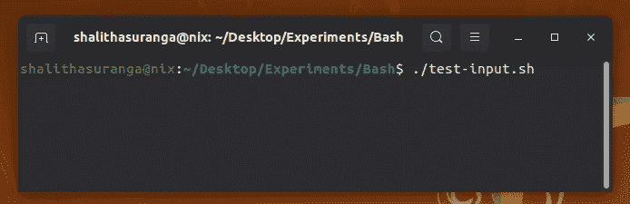

# 5 超越传统 Shell 脚本的 Bash 语法

> 原文：<https://levelup.gitconnected.com/5-bash-syntax-for-going-beyond-traditional-shell-scripting-6904d3e71af6>

## 使用现代 Bash 语法编写通用程序


由[西格蒙德](https://unsplash.com/@sigmund?utm_source=unsplash&utm_medium=referral&utm_content=creditCopyText)在 [Unsplash](https://unsplash.com/s/photos/coding?utm_source=unsplash&utm_medium=referral&utm_content=creditCopyText) 上拍摄，由 Canva 编辑

程序员经常使用 Bash 脚本来满足各种自动化需求，比如处理软件构建、应用系统配置、文件操作和网络相关操作。假设您正在开发一个软件框架，那么您可以编写一个 Bash 脚本来检查和安装所有需要的开发人员依赖项。因此，新参与者可以轻松地在他们的计算机上设置您的项目，而无需执行耗时的手动任务。

Bash 是一种命令语言——而不是一种现代的通用编程语言，它有一个全功能的标准库和开发人员友好的类似英语的语法。但是，在最近的 Bash 版本中，我们可以找到各种可以用于通用编程的语言特性。因此，现在 Bash 变得更加灵活，适合开发通用计算机程序。

在本文中，我将解释几种 Bash 语言语法和本机特性，您可以将它们用于通用计算。您可以使用这些语法使传统的 Bash 脚本变得现代和可读，或者构建可以用 Python 或类似 JavaScript 的现代动态语言开发的通用程序。

# 1.字符串操作技术

每种通用编程语言通常都在字符串对象上提供各种字符串操作方法。本身不支持 OOP 模式的语言通过特定语言的标准库提供字符串操作功能。例如，C 通过`string.h`头文件提供字符串操作函数，Go 通过[字符串包](https://pkg.go.dev/strings)提供这些函数。

Bash 是一个 Shell 解释器和一个简单的命令语言，所以它不能为您提供字符串方法或具有类似英语语法的全功能标准库。此外，用许多内置来扩展 Bash 会给 Shell 解释器增加不必要的复杂性(即 [PowerShell 很复杂](https://medium.com/swlh/why-i-switched-to-linux-after-using-windows-for-10-years-247de78058ef))。因此，Bash 支持使用参数扩展语法(`${}`)进行字符串操作。

我们可以使用参数扩展语法来查找子字符串，如下所示:

```
string="Bash is great!"echo ${string:8} # great!
echo ${string:0:4} # Bash
echo ${string:8:-1} # great (-1: upto 1st element from right)
```

我们可以得到字符串长度，如下所示。

```
string="Bash is great!";
len=${#string}echo "len = $len"
```

替换特定的子字符串也是小菜一碟:

```
string="Bash is great!!"echo ${string/Bash/GNU Bash} # GNU Bash is great!!
echo ${string//!/.} # Bash is great..
```

使用内置语法，大写和小写字符串转换也是可能的:

```
string="Bash"echo ${string^^} # BASH
echo ${string,,} # bash
```

与 Python 和 JavaScript 不同，Bash 本身不支持通过索引访问字符，但是您总是可以使用基于子串的方法:

```
function charAt() {
    string=$1
    i=$2
    echo ${string:i:1}
}echo $(charAt "Hello" 2) # l
echo $(charAt "Hello" 1) # e
```

这里我使用了命令替换语法来捕获函数输出——我将在下面单独的一节中进一步解释。

# 2.创建数组和字典

Bash 有非类型化的变量，所以它允许您在变量中设置任何字符序列。它试图将所有东西都视为字符流(字符串),并根据上下文操纵变量。尽管它没有为您提供类型系统，但它允许您使用数组和字典结构。这些数据结构对于通用编程无疑是有帮助的。

您可以使用以下代码片段初始化一个数组并遍历它:

```
A=(2 4 5 6 4)for i in ${A[@]}; do
    echo -n "${i} " # 2 4 5 6 4
done
```

您也可以将子串语法用于数组切片，如下所示:

```
A=(2 4 5 6 4)echo ${A[@]:2:4} # 5 6 4
echo ${A[@]:0:1} # 2
```

Bash 数组标识符总是引用第一个数组元素，类似于带有指针的 C 数组。因此，我们需要使用`[@]`符号来引用整个数组进行处理，如上面的示例代码所示。

追加数组元素的工作方式与 Python 一样:

```
A=(1 2 3)A+=(4)
echo ${A[@]} # 1 2 3 4A+=(5 6)
echo ${A[@]} # 1 2 3 4 5 6
```

使用字典就像使用 Python 和 JavaScript 一样简单。请看下面的示例代码，它遍历一个字典并打印键值数据:

```
declare -A D
D=(["one"]=1 ["two"]=2 ["three"]=3)for i in ${!D[@]}; do
    echo "$i -> ${D[$i]}" # one -> 1 ....
done
```

# 3.带有命令替换的强大的一行程序

Bash 提供了一种运行命令的方法，并通过命令替换语法用一行程序捕获标准输出。Bash 命令替换语法(`$(…)`)支持开发人员高效地组合多个命令。例如，您可以将`find`命令的结果作为参数发送给另一个命令，如下所示:

```
another-command $(find *.txt)
```

这种命令替换语法有助于我们以开发人员友好的方式使用函数。标准 Bash 函数的问题是返回值只接受有效的进程退出代码(因为 Bash 是面向命令的)。例如，下面的函数在 Bash 中使用`return`关键字就可以很好地工作:

```
function getNumber() {
    return 200
}getNumber
echo $? # 200
```

但是，如果您将上述代码片段的返回值更改为比`255`更大的数字，它将无法正常工作，因为最大的有效退出代码值是`255`。由于下面的命令替换，我们可以从 Bash 函数输出(不是标准的`return`)任何值:

```
function getMessage() {
    echo "Hello Bash!"
}msg=$(getMessage)
echo $msg # Hello Bash!
```

这里我们使用了`echo`命令而不是`return`关键字，因为命令替换语法捕获的是标准输出——而不是退出代码。上面的方法创建了一个 subshell，但是您可以找到各种[变通方法](https://stackoverflow.com/q/3236871/3565513)来避免第二个 Bash 实例。

# 4.算术运算和随机值生成

每种通用编程语言通常都支持带有内置语法的基本算术运算和通过标准库函数进行的高级数学运算。Bash 提供了内置的算术扩展语法(`$((…))`)和用于基本算术运算的内置命令`let`。请看下面的例子:

```
a=10
b=5echo "$a + $b = $((a + b))" # 10 + 5 = 15
echo "$a - $b = $((a - b))" # 10 - 5 = 5
echo "$a x $b = $((a * b))" # 10 x 5 = 50
echo "$a / $b = $((a / b))" # 10 / 5 = 2
echo "$a % $b = $((a % b))" # 10 % 5 = 0
```

您可以在算术扩展块中使用任何基本操作，如位运算、取幂(`**`)甚至三元运算。 [KornShell](https://en.wikipedia.org/wiki/KornShell) 支持算术扩展中的浮点数，但是您必须对 Bash 使用`bc`命令，因为它本身不支持浮点计算:

```
a=10
b=5.7echo "$a / $b = $(echo "scale = 2; $a / $b" | bc)" # 10 / 5.7 = 1.75
```

由于有了`$RANDOM` shell 变量，在 Bash 中生成随机数比在 Python 中更简单:

```
echo $(($RANDOM % 10)) # Random number between 0 and 10
```

您也可以像使用算术扩展一样使用`let`内置命令。

# 5.处理输入比 Python 和 Node.js 更容易

根据编程语言运行时环境的不同，处理控制台输入也不同。例如，您可以使用内置的 [readline](https://nodejs.org/api/readline.html) 包来捕获 Node.js 的用户输入。Bash 提供了内置的`read`命令来捕获带有提示消息的用户输入。`read`命令在语法上有点类似于 C 的`scanf`,因为它接受变量名作为参数。

请看下面的例子:

```
read -p "Enter your name: " nameecho "Hello, $name"
```

上述代码片段会产生以下结果:



使用 Bash 脚本从终端读取用户输入，这是作者的截屏

如果你需要从标准输入数据创建一个数组，你可以使用`-a`选项:

```
read -p "Enter numbers: " -a Aecho ${A[@]}
```

# 结论

Bash 是一个 Shell 解释器，但是它提供了许多其他现代语言提供的特性。Bash 变量确实是无类型的，但是我们可以使用内置的`declare`的最小变量类型特性。我们通常通过生成其他命令，使用 Bash 来满足各种自动化需求和传统的 Shell 脚本语法——但是 Bash 适合编写 CLI 程序( [NVM](https://github.com/nvm-sh/nvm/blob/master/nvm.sh) 是用 POSIX 兼容的 Shell 语言编写的)、实用程序脚本和其他通用程序，因为我之前展示过现代语法。例如，检查[这个基于用户输入的长人名生成短名的](https://gist.github.com/shalithasuranga/7692e265f1b566f9569386e6e55fc2b5) Bash 脚本，并将其与相同的 [Python 版本](https://gist.github.com/shalithasuranga/74d71bc8e4d1bb8f1df150bc20e4a862)进行比较——两个代码的可读性分数大致相同。

您甚至可以用 Bash 创建小的 GUI 程序。下面的故事解释了如何向 Bash 脚本添加 GUI 组件:

[](https://medium.com/swlh/how-to-modernize-your-bash-scripts-by-adding-gui-cba613a34cb7) [## 如何通过添加 GUI 使 Bash 脚本现代化

### 厌倦了在控制台上显示原始文本？试试 Zenity & notify-send。

medium.com](https://medium.com/swlh/how-to-modernize-your-bash-scripts-by-adding-gui-cba613a34cb7) 

让我们开始使用 Bash 作为一种最小的通用语言，我们可以在日常编程活动中使用它——不仅仅是为了自动化！

感谢阅读。

# 分级编码

感谢您成为我们社区的一员！升级正在改变技术招聘。 [**在最好的公司找到你的完美工作**](https://jobs.levelup.dev/talent/welcome?referral=true)**。**

**[](https://jobs.levelup.dev/talent/welcome?referral=true) [## 升级—转变技术招聘

### 升级—转变技术招聘🔥使软件工程师能够找到完美的角色…

作业. levelup.dev](https://jobs.levelup.dev/talent/welcome?referral=true)**