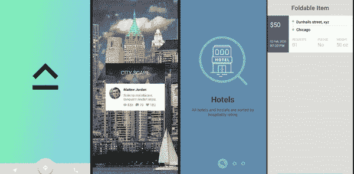

# 5 个漂亮的 android 动画库

> 原文：<https://levelup.gitconnected.com/5-beautiful-android-animation-libraries-2020-470e01875e66>



在现代技术世界中，每个人都试图通过他们的应用程序/网站为他们的用户提供流畅而美丽的体验。公司希望抓住用户的注意力，让他们的应用程序尽可能具有交互性

动画在这方面起着至关重要的作用。他们有两个目的:
**1)** 设计中的动画可以通过给应用程序带来生命来改善用户体验。

**2)** 它们是意义、功能性的，并给予用户流畅的交互。

然而，设计中的动画只有在正确的地方和正确的时间被结合才能增强用户体验。你可以查看 UI 动画的详细指南，并在这篇由[hotels, R.drawable.*key*)
val scr2 = PaperOnboardingPage("Banks", "We carefully verify all banks before add them into the app", Color.parseColor("#65B0B4"), R.drawable.*banks*, R.drawable.*wallet*)
val scr3 = PaperOnboardingPage("Stores", "All local stores are categorized for your convenience", Color.parseColor("#9B90BC"), R.drawable.*stores*, R.drawable.*shopping_cart*)
val elements: ArrayList<PaperOnboardingPage> = ArrayList()
elements.add(scr1)
elements.add(scr2)
elements.add(scr3)
return elements
}](https://uxdesign.cc/@skytskyi#678FB4)

## [第四步—](https://uxdesign.cc/@skytskyi#678FB4)

[现在我们将从`PaperOnboardingFragment`创建一个片段并提供数据。](https://uxdesign.cc/@skytskyi#678FB4)

```
val onBoardingFragment = PaperOnboardingFragment.newInstance(getDataForOnboarding())
```

## [第五步—](https://uxdesign.cc/@skytskyi#678FB4)

[我们将在活动中根据需要使用这个片段:](https://uxdesign.cc/@skytskyi#678FB4)

```
val fragmentTransaction: FragmentTransaction = fragmentManager!!.beginTransaction()
fragmentTransaction.add(R.id.*fragment_container*, onBoardingFragment)
fragmentTransaction.commit()
```

## [最后一步—设置触摸监听器](https://uxdesign.cc/@skytskyi#678FB4)

[我们将用我们的逻辑将监听器设置为片段，并将片段替换为另一个片段。](https://uxdesign.cc/@skytskyi#678FB4)

```
onBoardingFragment.setOnRightOutListener **{** val fragmentTransaction: FragmentTransaction = fragmentManager!!.beginTransaction()
    val bf: Fragment = BlankFragment()
    fragmentTransaction.replace(R.id.*fragment_container*, bf)
    fragmentTransaction.commit()
**}**
```

[完全实现](https://uxdesign.cc/@skytskyi#678FB4)

[更多详情请查看官方 GitHub 回购..](https://uxdesign.cc/@skytskyi#678FB4) [@](https://github.com/Ramotion/paper-onboarding-android)

# 扩大收藏——

这是我为你选择的最后一个动画库。让我们从它的实现开始，看看它是如何工作的。完整的文档可以在官方 [**Github repo**](https://github.com/Ramotion/expanding-collection-android) 找到


## 步骤 1 —创建布局

首先，我们将创建所有需要的布局文件并修改它们。我们将在主要布局中使用`ECBackgroundSwitcherView`和`ECPagerView`:

然后，我们将为名为 **list_element.xml** 的适配器创建一个项目布局:

我们的最后一个布局将是一个标题布局，它将被放大到屏幕中央的卡片上:

## 步骤 2-创建适配器类

我们已经完成了布局，现在让我们创建一个适配器来保存每个项目的详细列表:

## 步骤 3-静态数据模型

现在，我们将创建模型类，并用静态数据填充列表，以显示在应用程序中:

首先，我们将为卡片创建一个模型类:

然后，我们将创建一个名为 Comment.java 的模型类，它将保存适配器类的数据:

[https://gist . github . com/aasif 1297/86d 19 cdd 942 BF 3c 8272168 c 3909835 b 0](https://gist.github.com/aasif1297/86d19cdd942bf3c8272168c3909835b0)

最后，我们将创建一个名为 ExampleDataset.java 的数据集类，并用模拟数据填充我们的列表。您可以从 API 或 firebase 或任何后端服务器获取实际数据。

## 最后一步—组合所有组件

现在，我们将在主类中设置 ECBackgroundSwitcherView 和 ECPagerView 及其适配器:

本文到此为止。您可以在这里查看 GitHub 资源库中的资源或所有这些动画的完整项目 [@](https://github.com/asifjawaid/AndroidAnimations)