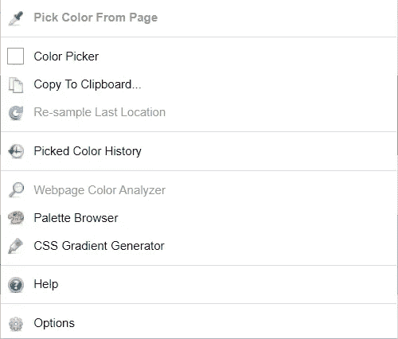
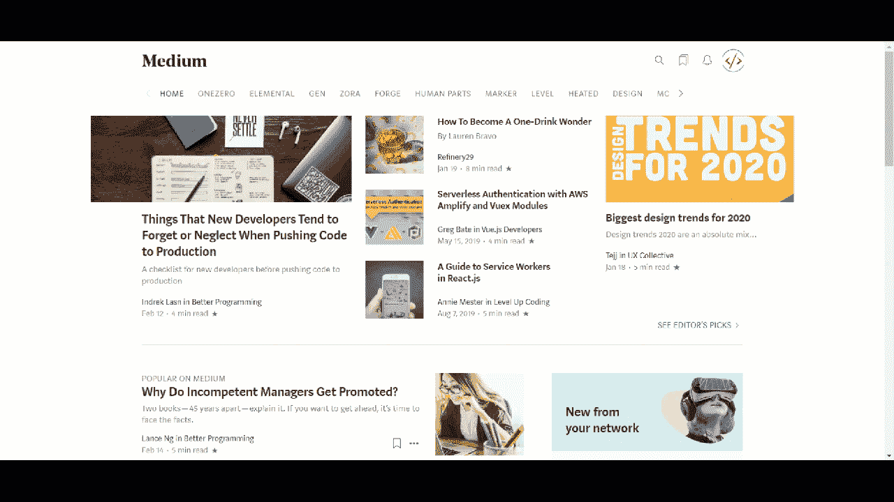
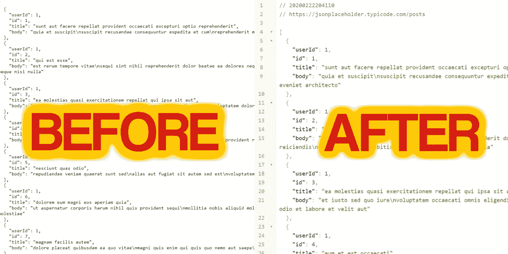
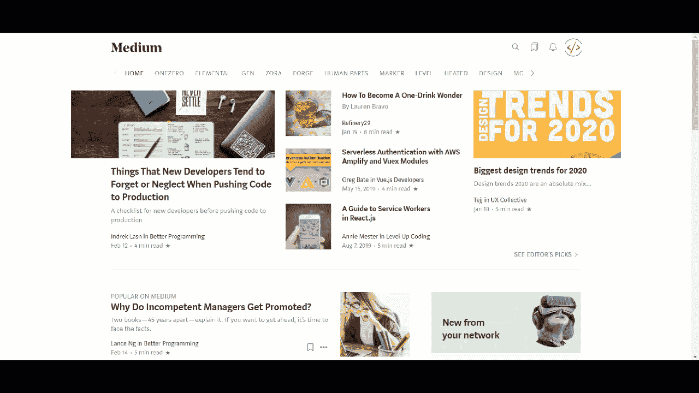
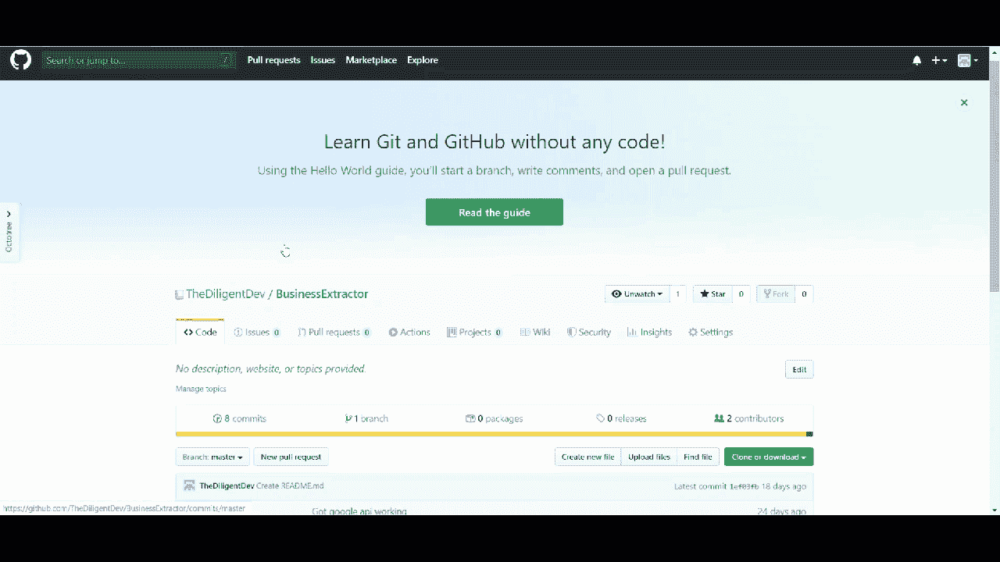
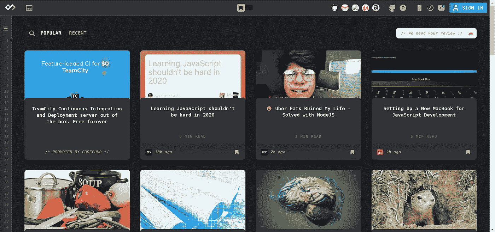

# 2020 年开发人员的 6 个最佳 Chrome 扩展

> 原文：<https://levelup.gitconnected.com/5-best-chrome-extensions-for-developers-in-2020-69fce903f8ea>

听过“更聪明地工作，而不是更努力地工作”这句话吗？当你是一个开发人员，做一百万个微决策，处理 10 件不同的事情时，这就是效率和疲惫的区别。这就是为什么你需要最好的工具。

Chrome 扩展只是众多超级有用的工具之一。下面是我们经常使用的最好的扩展列表。我们希望他们能像帮助我们一样帮助你。

## 色彩奇拉

ColorZilla 是为你的网站选择颜色的好工具。它有你需要的一切，包括一个滴管颜色选择器，颜色历史，和一个完整的网页分析器。我们每天都用它来获得基于 UX 设计的完美色彩。

色彩奇拉

在这里下载这个扩展: [ColorZilla](https://chrome.google.com/webstore/detail/colorzilla/bhlhnicpbhignbdhedgjhgdocnmhomnp)

## 网站调色板

你有没有去过一个网页，喜欢上了调色板？好吧，网站调色板已经覆盖了你。有了这个扩展，你可以很容易地在几秒钟内得到一个页面的调色板。每次我碰到一个有很棒的颜色的新网站，我都会运行这个并保存它们以备后用。

在这里下载这个扩展:[站点调色板](https://chrome.google.com/webstore/detail/site-palette/pekhihjiehdafocefoimckjpbkegknoh)

## JSON 查看器

作为开发人员，我们一直在与 JSON 合作。不幸的是，查看和格式化 JSON 是一件痛苦的事情。这就是 JSON Viewer 派上用场的地方。它允许您在浏览器中查看 JSON，并具有您最喜欢的 IDE 中的许多特性。

JSON 查看器

你可以在这里下载这个扩展: [JSON Viewer](https://chrome.google.com/webstore/detail/json-viewer/gbmdgpbipfallnflgajpaliibnhdgobh)

## 字体忍者

网站的字体可能是最重要的方面之一。很难找到好看的字体组合。所以为什么不让别人来做所有的艰苦工作。当你偶然发现一个有很好字体选择的网站时，你可以使用字体忍者来找出他们到底用了什么。

在这里下载这个扩展:[字体忍者](https://chrome.google.com/webstore/detail/fonts-ninja/eljapbgkmlngdpckoiiibecpemleclhh)

## 八叉树

不可否认，GitHub 已经成为开发人员的武器库中最受欢迎的工具之一，但是很难可视化您的存储库。这就是章鱼树的用武之地。它允许你查看 Github 库的文件结构，就像在你最喜欢的 IDE 中一样。

八叉树

在这里下载这个扩展:[八叉树](https://chrome.google.com/webstore/detail/octotree/bkhaagjahfmjljalopjnoealnfndnagc)

## 每日 2.0

作为一名开发人员，您应该不断学习。如果你不是，你将很容易被落下。Daily 2.0 让相关开发文章的查找变得异常容易。最重要的是，每次你打开一个新标签，它会显示你的文章。真的是没脑子。

每日 2.0

在这里下载这个扩展:[每日 2.0](https://chrome.google.com/webstore/detail/daily-20-source-for-busy/jlmpjdjjbgclbocgajdjefcidcncaied)

# 录像

录像

# 结论

我们希望你喜欢我们列出的 2020 年开发者的 6 个最好的 Chrome 扩展。虽然我们喜欢这些，但我们总是在寻找新的。如果你有你喜欢的扩展，请在评论中告诉我们。我们可能要更新名单了。