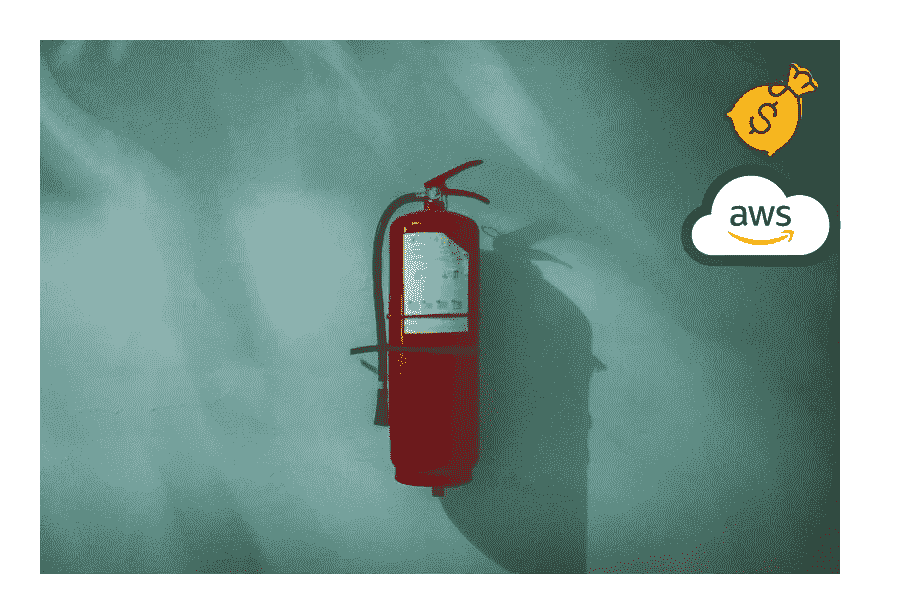
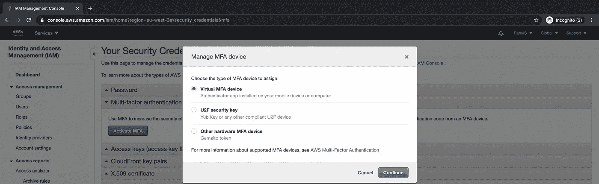
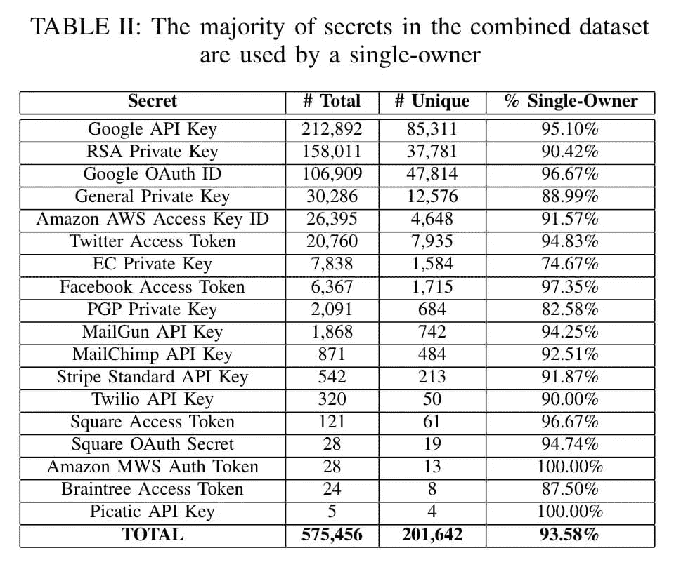
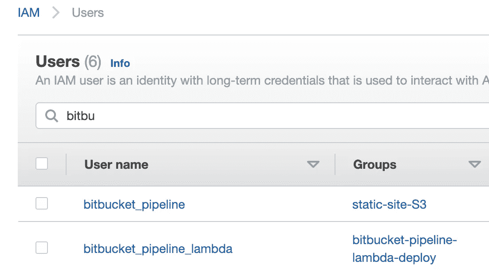
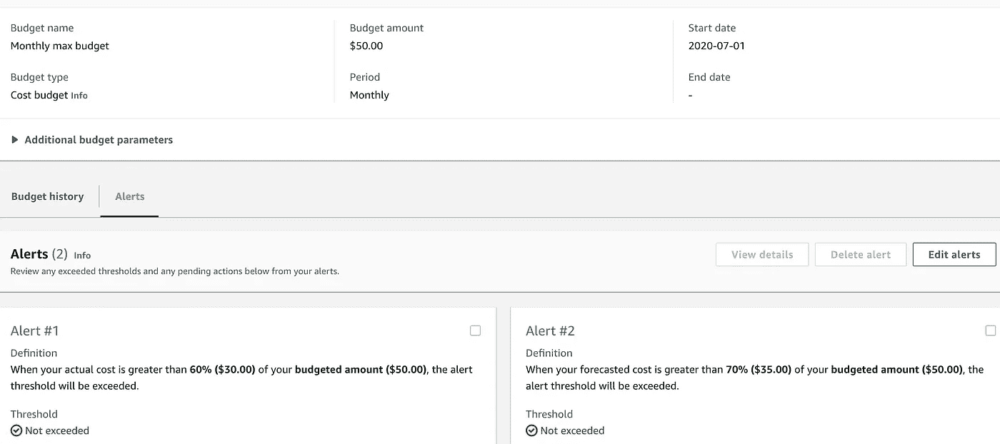

# AWS 云安全的 5 个最佳实践

> 原文：<https://levelup.gitconnected.com/5-best-practices-for-aws-cloud-safety-4bf45fdca79b>

## 如何保护您的 AWS 帐户

由 [Unsplash](https://unsplash.com?utm_source=medium&utm_medium=referral) 上的 [Piotr Chrobot](https://unsplash.com/@chrumo?utm_source=medium&utm_medium=referral) 拍摄的照片

我是被一条推特触发的，在这条推特上，一个 AWS 账户被黑客攻击，令人惊讶的账单是 6 万美元，哎呀。

推特高额账单

当我在这里推广使用和试验 AWS 技术时，我觉得有必要与你分享 5 个保护你的 AWS 帐户的最佳实践，希望这不会发生在你身上。让我们穿过它们。

## 1.AWS 根帐户安全性

创建 AWS 帐户时，您需要做的第二件事是为管理任务创建另一个 IAM 用户。尽可能少使用您的 root 帐户，并创建一个具有管理权限的非 root 帐户来设置云资源。

最佳实践是删除与 root 用户相关联的任何编程访问键。如果根帐户存在 PEM 文件或 DER 证书，最好立即删除这些密钥。

## 2.启用 MFA

启用多因素身份验证，作为对您的 root 帐户以及其他拥有广泛权限的非 root IAM 用户的额外保护。

有几个选项，但选择“虚拟 MFA 设备”是最简单的，因为你可以通过“谷歌认证器”或“微软认证器”使用你的手机。更多信息[点击这里](https://aws.amazon.com/iam/features/mfa/)。

## 3.不要在代码中共享访问键

一个常见的错误是在代码中使用访问键。代码的问题是它被分发、分叉，并且可能在持续集成工具上被测试。到处都是。

在 Git 存储库中找到不同的键

有像 [Git-Secrets](https://github.com/awslabs/git-secrets) 这样的工具来扫描代码库中的秘密。使用环境变量和工具，如'[参数存储库](https://docs.aws.amazon.com/systems-manager/latest/userguide/systems-manager-parameter-store.html)'来存储您的密钥。

## 4.使用特定用户

当您需要授予外部服务对您的 AWS 帐户的访问权限，并且您需要访问密钥时，请创建一个仅具有执行任务所需权限的特定用户。

bitbucket 管道的用户

例如，当您使用连续交付工具(如 bitbucket pipeline)将代码部署到 S3 时，只需向该用户添加 S3 权限。

## 5.计费提醒

当您每月花费时，使用提醒来控制您的账单。这样，一旦成本朝着错误的方向发展，你就会得到通知。使用 [AWS Budgets](https://aws.amazon.com/aws-cost-management/aws-budgets/) 您可以设置多个阈值和相应的警报，在超过阈值时通过电子邮件或延迟通知通知您。

带预警的预算

降低账单意外风险的另一种方法是“ [AWS 成本异常检测](https://aws.amazon.com/aws-cost-management/aws-cost-anomaly-detection/)”。不像 AWS 预算那么简单，但它使用机器学习来检测你的成本中的异常。

现在，你有了 5 个最佳实践来保证你的 AWS 账户的安全，并降低令人讨厌的账单意外的风险。如果你知道更多，请分享并传播这些知识，这样每个人都可以在云中安全地进行实验。

在云中玩得开心！

# 海科·范德沙夫

*   ***如果你喜欢这个，请*** [***跟随 Serverlesscorner.com 上中***](https://serverlesscorner.com/about) ***。***
*   ***爱情*** ❤️ ***阅读*** ***我的故事和其他关于媒？*** [***成为会员***](https://serverlesscorner.com/membership) ***如果你还没有成为会员。***
*   ***想阅读更多无服务器？报名参加我的*** [***月刊***](https://serverlessconsulting.org/newsletter) ***📬关于无服务器技术和使用案例的启发性和深刻的故事。***

## 参考

1.  [https://www . the server side . com/blog/Coffee-Talk-Java-News-Stories-and-Opinions/AWS-root-account-best-practices](https://www.theserverside.com/blog/Coffee-Talk-Java-News-Stories-and-Opinions/AWS-root-account-best-practices)
2.  [https://spectra lops . io/blog/top-9-git-secret-scanning-tools/](https://spectralops.io/blog/top-9-git-secret-scanning-tools/)