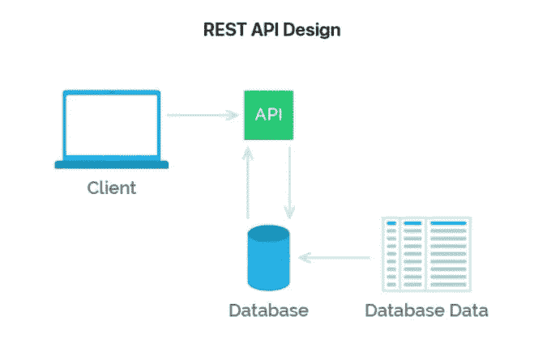

# REST API 开发要遵循的 5 个最佳实践

> 原文：<https://levelup.gitconnected.com/5-best-practices-to-follow-for-rest-api-development-3cff92987136>

## 开发 REST API 时要遵循的最佳实践

基金会提供的图片

应用程序编程接口是最流行的接口之一，它允许计算机之间进行无缝交互。开发 API 时有多种协议可供使用。

其中包括表述性状态转移(REST)、SOAP 和 GraphQL 等。API 有助于决定一个给定的分布式系统应该如何表现和响应各种请求。

在开发这类 API 时，有一些被认为是开发这类 API 的最佳实践。

在本文中，我们将研究开发表述性状态转移(REST) API 时考虑的一些最佳实践。

## **1。对各种请求使用适当的 HTTP 动词**

在开发各种路由时，有各种 HTTP 动词(GET、PUT、POST、DELETE)可以根据您想要服务的请求来使用。使用正确的 HTTP 方法非常方便。根据您想要响应的服务/请求，您可以使用以下动词。

*   获取—读取
*   上传—更新/替换
*   后期创建
*   补丁更新
*   删除-删除

这些是最常见的 HTTP 动词，主要用于在各种端点上执行各种响应。根据不同的请求和响应方式，您可以使用一些最常用的 HTTP 方法。

## **2。使用状态代码和消息处理响应(成功/错误)**

状态代码就像交通标志，指示请求是成功还是失败。当您想要指导用户他们的请求是否成功时，使用状态代码非常方便。这有助于引导他们以正确的方式执行请求。

各种状态代码及其含义

*   1xx 信息响应—请求已收到，正在继续处理
*   2xx 成功-请求被成功接收、理解和接受
*   3xx 重定向—需要采取进一步的操作来完成请求
*   4xx 客户端错误—请求包含错误的语法或无法实现
*   5xx 服务器错误—服务器无法满足一个明显有效的请求

## **3。利用 API 文档**

大多数时候你可以开发一个非常方便和漂亮的 API，如果没有合适的文档，人们/用户会发现很难理解你的 API 是如何工作的。

提供适当的 API 文档非常方便，可以让用户大致了解事情是如何工作的，以及需要提供请求的各种端点。

有各种各样的 API 文档工具，你可以利用它们来开发一些令人惊叹的、用户友好的 API(Swagger、Postman、ReDoc)。在您的 API 开发期间，您应该考虑为您的 API 开发更好的文档。

## **4。考虑 API 版本**

表述性状态转移(REST) API 项目尤其是用于商业目的的项目随着各种需求和更新而不断变化。为了确保我们记录每一个细节，并供将来参考，您应该考虑对您的 API 进行版本控制。

对 API 进行版本控制也意味着在您的各种端点中包含指定的各种版本。这可能包括对版本一使用类似于 ***/v1/*** 的东西，对版本二使用类似于 ***/v2/*** 的东西。

版本控制还可以清楚地区分哪个版本是最新的，并且有更好的优化和更新。如果您正在构建一个 REST API，尤其是为了商业或通用目的，您应该考虑提供版本控制功能。

## **5。端点格式(URL 路由/名词/camelCase)**

端点服务是执行给定请求时要遵循的路径。分配和设计更好的 URL 端点是一件值得考虑的事情。当设计和提出在执行请求时要命中的端点时，有各种各样的实践要考虑。

要遵循的一些最佳实践包括。

*   使用与资源相关的正确名称
*   用名词代替动词
*   避免使用下划线(使用连字符代替)
*   保持端点简单而简短。

## **出发前**

当您想要开发具有惊人的开发人员/用户体验的 REST API 时，考虑这些最佳实践是非常有用和方便的。这也将减轻你的工作，在未来当你想提供一些更新。

只是回顾一下 REST API 开发的一些最佳实践，包括。

*   对各种请求使用适当的 HTTP 动词
*   端点格式(URL 路由/名词/camelCase)
*   利用 API 版本控制
*   使用 API 文档
*   使用状态代码和消息处理响应(成功/错误)

## **更多阅读内容**

 [## Vue.js 的高级和深入学习资源

### 帮助您学习 Vue.js 的高级概念并超越基础知识的资源

levelup.gitconnected.com](/5-advanced-and-in-depth-learning-resources-for-vue-js-fec1146ea41f)  [## 如何开始构建命令行界面(CLI)应用程序

### 了解如何构建简单的命令行界面(CLI)应用程序

levelup.gitconnected.com](/how-to-get-started-building-command-line-interface-cli-applications-974e4b53c3df)