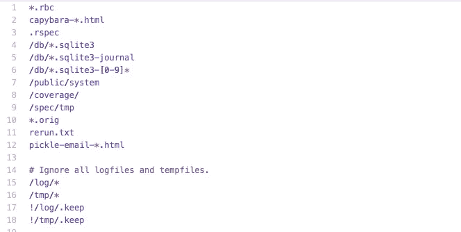
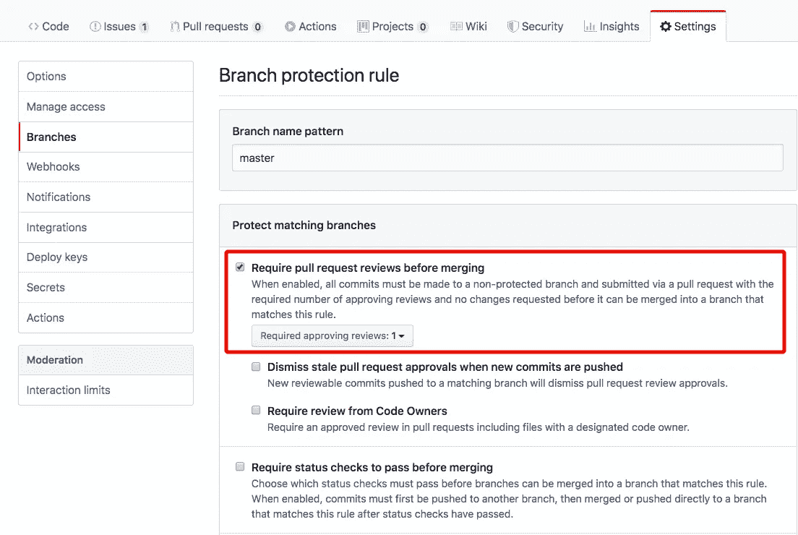
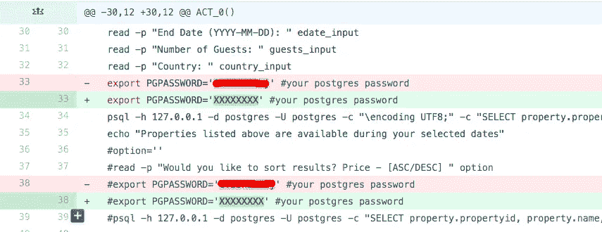

# 防止 Git 泄漏的 5 个最佳实践

> 原文：<https://levelup.gitconnected.com/5-best-practices-to-prevent-git-leaks-4997b96c1cbe>


克林特·帕特森在 Unsplash 上拍摄的照片

无数开发人员正在使用 Git 进行版本控制，但是很多人对 Git 的工作原理没有足够的了解。有些人甚至用 Git 和 Github 作为备份文件的工具。这导致了 Git 存储库中的信息泄露。[每天都有数千个新的 API 或密钥通过 GitHub 项目泄露。](https://www.zdnet.com/article/over-100000-github-repos-have-leaked-api-or-cryptographic-keys/)

我在信息安全领域工作了三年。大约两年前，我们公司有一个严重的安全问题，是由 Git 存储库中的信息泄漏引发的。

一名员工不小心向 Github 泄露了一个 AWS 密钥。攻击者用这个密钥从我们的服务器上下载更敏感的数据。我们投入了大量时间来修复这个问题，我们试图找出有多少数据泄露，分析了受影响的系统和相关用户，并更换了系统中所有泄露的密钥。

这是一个悲伤的故事，任何公司和开发商都不想经历。

关于这个我就不多写细节了。而是希望更多的人知道如何避免。这里是我给你的建议，让你远离 Git 泄漏。

# 建立安全意识

大部分初级开发者的安全意识都不够。有些公司会对新员工进行培训，但有些公司没有系统的培训。

作为开发人员，我们需要知道哪种数据可能会引入安全问题。请记住，这些类别的数据不能签入 Git 存储库:

1.  任何配置数据，包括密码、API 密钥、AWS 密钥、私钥等。
2.  [个人身份信息](https://en.wikipedia.org/wiki/Personal_data) (PII)。GDPR 表示，如果一家公司泄露了用户的 PII，该公司需要通知用户和相关部门，而且会有更多的法律麻烦。

如果你是为一家公司工作，不要在未经允许的情况下分享任何与公司相关的源代码或数据。

攻击者很容易在 Github 上找到一些带有公司版权的代码，这些代码是员工不小心泄露给 GitHub 的。

我的建议是，尽量严格区分公司事务和个人事务。

# 使用 Git 忽略

当我们用 Git 创建一个新项目时，我们必须设置一个**。git 适当忽略**。gitignore 是一个 Git 配置文件，它列出了不会签入 Git 存储库的文件或目录。

这个项目的 [gitignore](https://github.com/github/gitignore) 是一个有用的集合。gitignore 模板，有各种编程语言，框架，工具或者环境。

我们需要知道 **gitignore** 的模式匹配规则，并基于模板添加我们自己的规则。



# 用 Git 挂钩和 CI 检查提交

没有工具可以从 Git 存储库中找出所有敏感数据，但是一些工具和实践会有所帮助。

[git-secrets](https://github.com/awslabs/git-secrets) 和 [talisman](https://github.com/thoughtworks/talisman) 是类似的工具，它们应该作为[预提交钩子](https://git-scm.com/book/en/v2/Customizing-Git-Git-Hooks)安装在本地存储库中。提交前将检查每个更改，如果预提交挂钩检测到预期的提交可能包含敏感信息，将拒绝提交。

gitleaks 提供了另一种在 git 存储库中查找未加密的秘密和其他不需要的数据类型的方法。我们可以将它集成到自动化工作流程中，例如 CICD。

# 代码审查

代码审查是团队工作的最佳实践。所有的队友都会互相学习对方的源代码。初级开发人员的代码应该由更有经验的开发人员来审核。

大多数非预期的变化可以在代码审查阶段被发现。

[启用分支限制](https://help.github.com/en/github/administering-a-repository/enabling-branch-restrictions)可以实施分支限制，以便只有特定用户可以推送至存储库中受保护的分支。Gitlab 也有类似的选项。

将 master 设置为受限分支有助于我们实施代码评审工作流。



# 快速正确地修复它

使用上述所有工具和机制，错误仍然可能发生。如果我们快速正确地修复它，泄漏可能不会引入实际的安全问题。

如果我们发现 Git 存储库中泄露了一些敏感数据，我们不能再提交一次来清理。



这种修复是自欺欺人

我们需要做的是从整个 Git 历史中删除所有敏感数据。

**记得在任何清理之前进行备份，然后在我们确认一切正常后移除备份克隆**。

使用`--mirror`克隆一个空存储库；这是 Git 数据库的完整副本。

```
git clone --mirror git://example.com/need-clean-repo.git
```

我们需要 **git filter-branch** 从所有分支和提交历史中移除数据。假设我们想从 Git 中移除`./config/passwd`:

```
$ git filter-branch --force --index-filter \
  'git rm --cached --ignore-unmatch ./config/password' \
  --prune-empty --tag-name-filter cat -- --all
```

记住将敏感文件添加到。gitignore:

```
$ echo "./config/password" >> .gitignore
$ git add .gitignore
$ git commit -m "Add password to .gitignore"
```

然后我们将所有分支推至远程:

```
$ git push --force --all
$ git push --force --tags
```

告诉我们的合作者调整基础:

```
$ git rebase
```

[BFG](https://rtyley.github.io/bfg-repo-cleaner/) 是 **git 过滤分支**的更快更简单的替代方案，用于移除敏感数据。它通常比 **git 滤波器分支**快 10-720 倍。除了删除文件，BFG 还可以用来替换文件中的秘密。

BFG 将保持最新的承诺不变。它旨在保护我们不犯错误。我们应该显式删除该文件，提交删除操作，然后清除历史记录以删除它。

如果泄露的 Git 库被其他人分叉，我们需要遵循 [DMCA 拆除政策](https://help.github.com/en/github/site-policy/dmca-takedown-policy#c-what-if-i-inadvertently-missed-the-window-to-make-changes)要求 Github 移除分叉的库。

整个过程需要一些时间来完成，但这是删除所有副本的唯一方法。

# 结论

不要重蹈无数人的覆辙。努力避免安全事故。

使用这些工具和策略将有助于避免 Git 泄漏。