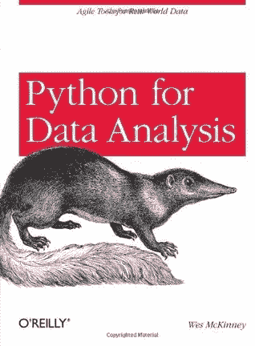
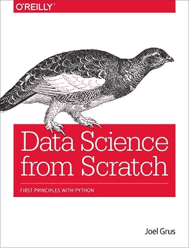
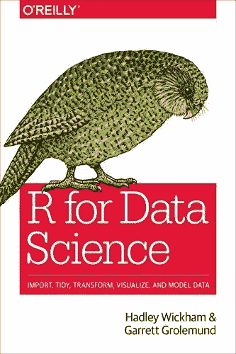
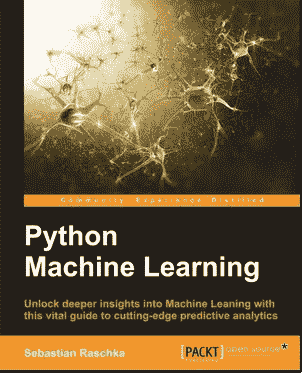
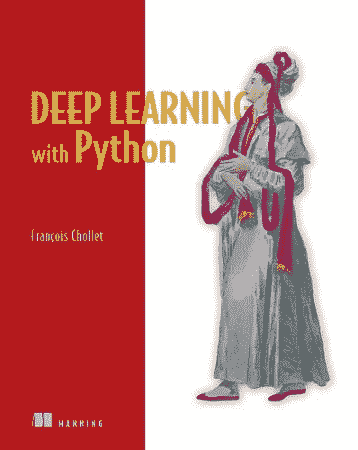

# 作为一名程序员，值得阅读的 5 本最佳编程书籍

> 原文：<https://levelup.gitconnected.com/5-best-programming-books-to-read-to-distinguish-yourself-as-a-programmer-eb1ae42ca352>

## 阅读这些书来了解其他程序员在想什么和做什么。

Vonecia Carswell 在 [Unsplash](https://unsplash.com?utm_source=medium&utm_medium=referral) 上拍摄的照片

如果你想成为一名出色的程序员，没有比阅读市场上最好的编程书籍更好的方法了。

你不仅会学到新的技术和策略，还会了解到其他程序员在想什么和做什么。

如果你想成为一名成功的程序员，仅仅学习基础知识是不够的。你还需要不断地学习和扩展你的知识。

最好的方法之一就是阅读编程书籍。

但是有这么多的编程书籍，你应该读哪一本呢？

这里有五本最好的编程书籍，可以帮助你脱颖而出。

# Wes McKinney 的《Python 数据分析快速入门》

好阅读

这本书是为希望尽快掌握数据科学的有经验的 Python 程序员准备的。它涵盖了数据科学的基础知识，包括加载数据、操作数据、执行统计分析和创建可视化。

作为一种编程语言，Python 是非常通用和强大的。不过也比较好学，对于初学者来说是个不错的选择。

Wes McKinney 的《Python for Data Analysis Quick Start》对于那些想学习如何使用 Python 进行数据科学的人来说是一个极好的资源。

这本书涵盖了 Python 编程的基础，包括数据类型、流控制和面向对象编程。它还探索了如何使用 Python 来完成特定的数据科学任务，例如处理数组、矩阵和数据框。

此外，这本书包括一些实际的例子和练习，以帮助读者实践他们所学到的东西。因此,《Python for Data Analysis 快速入门》是任何想要开始使用 Python 进行数据科学编程的人的理想指南。

# 乔尔·格鲁什的《从零开始的数据科学》

好阅读

Joel Grus 是一名数据科学家和软件工程师，曾在谷歌、Dropbox 和 Foursquare 等公司工作。2015 年，他出版了《从零开始的数据科学:Python 的首要原则》一书，旨在教没有数据科学背景的人如何做数据科学。

这本书从 Python 编程的基础开始，然后转移到概率、统计、机器学习和可视化等主题。

虽然这本书的目标读者是没有数据科学背景的人，但对于希望学习更多 Python 知识或提高技能的有经验的数据科学家来说，它也是一个有用的资源。

它还包括许多案例研究，向您展示如何将您所学的技术应用到真实世界的数据集。

# Garrett Grolemund 和 Hadley Wickham 的数据科学研究

好阅读

R for Data Science 是一本受欢迎的指南，面向希望掌握在当今现代环境中有效处理数据所需的技术技能的任何人。

由著名的数据科学专家 G. Grolemund 和 H. Wickham 编写，这个全面的资源包含了您需要了解的关于使用 R 进行复杂数据分析任务和其他关键数据科学项目的一切。

涵盖从概率和统计到导入和使用数据集的主题，R for Data Science 提供可行的建议和分步教程，使您可以轻松掌握数据科学最具挑战性的方面。

无论你是这个领域的新手还是已经有了处理数据的经验，这本书都会帮助你把你的技能提升到一个新的水平。因此，如果你准备好成为一名自信的数据科学家，只需看看 R 就能了解数据科学。

凭借其实践指导和专家见解的结合，这是任何希望在当今快节奏的技术环境中取得成功的人的终极资源。

# 塞巴斯蒂安·拉什卡的 Python 机器学习

好阅读

机器学习是一个快速发展的领域，它彻底改变了我们思考和理解数据的方式。

作为最广泛使用的机器学习编程语言之一，Python 已经成为数据科学家和开发人员构建高效模型的重要工具。

从一开始，Python 就是机器学习应用最常用的语言之一。凭借其科学的库、灵活的数据结构和用户友好的语法，Python 非常适合执行复杂的机器学习任务。

由著名的专家和教育家 Sebastian Raschka 设计，Python 的机器学习全面介绍了机器学习的核心概念和技术。

无论你是一个希望开始这个令人兴奋的领域的新手，还是一个希望加深你的知识的有经验的从业者，这本书提供了你需要的一切，以获得对使用 Python 进行机器学习的实际理解。

有了基于真实世界数据集的清楚的，一步一步的例子，它是任何希望掌握这种不可缺少的分析技术的人的完美资源。

因此，如果您准备好利用 Python 的机器学习的强大功能，那么只需看看 Python 的机器学习就够了！

# Franç ois Chollet 的深度学习的 Theano 和 TensorFlow

好阅读

对于任何对深度学习感兴趣的人来说，Theano 和 TensorFlow 是两个强大的工具，应该在你的列表中名列前茅。

两者都是高度复杂的人工智能和机器学习库，允许您轻松构建复杂的神经网络。将这两个框架区分开来的是它们的编码方法。

由于它们的高精度和高效率，两者都被广泛用于学术和工业领域。

Theano 是第一个提供全套符号微分工具的框架，这使它成为研究目的的理想选择，而 TensorFlow 专注于计算图形，这使它非常适合快速原型开发和生产部署。

最终，在这两种工具之间进行选择将取决于您作为数据科学家的具体目标和需求。

使用 Theano，您可以通过简单地定义哪些变量将作为输入或输出来传递，从而轻松地指定数学运算。

同样，TensorFlow 让您可以完全控制网络不同层之间的交互方式。

无论你是该领域的初学者还是专家，Theano 和 TensorFlow 都提供了一套强大的深度学习工具，肯定能帮助你实现目标。

# 最后的话

说到编程，知识就是力量。有了合适的工具和资源，您可以将您的编码技能提升到一个新的水平，并在当今竞争激烈的就业市场中真正脱颖而出。

关键是从扎实的基础入手，通过认真的阅读和学习就可以做到。虽然现在有无数的指南和资源，但是提高技能和知识的最有效方法之一是广泛阅读各种编程书籍。

想阅读更多我的故事，并在 Medium 上无限制地获取其他精彩故事吗？ [*考虑通过我的推荐链接*](https://israrkhan1112.medium.com/membership) *加入 Medium，每月仅需 5 美元。你的月供会直接支持我。在这里注册，每当我发表文章时，就可以得到我的文章。*