# 每个开发人员都会犯的 5 个常见 Git 错误

> 原文：<https://levelup.gitconnected.com/5-common-git-mistakes-every-developer-makes-988cb563aee1>

## 以及如何在 Sourcetree 中解析

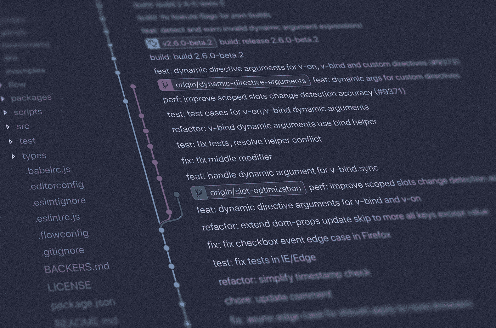

照片由[扬西·敏](https://unsplash.com/@yancymin?utm_source=medium&utm_medium=referral)在 [Unsplash](https://unsplash.com/?utm_source=medium&utm_medium=referral) 上拍摄

Git 不需要介绍。优秀的开发人员面临 Git 问题。有些问题很容易，有些很难。

我面临很多 Git 问题。你也是。Sourcetree 让你前进。我每天都用，不会转到 CLI。永远不会。

如何用 Sourcetree 解决常见的 Git 问题？通读。

# 1.撤消本地提交

假设您在这 4 次提交中添加了虚拟内容。你现在不想要它们了。以下是如何在 Sourcetree 中重置。

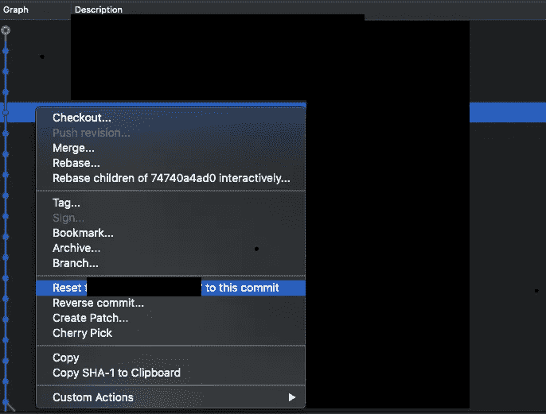

在 Sourcetree 中将分支重置为特定提交—作者截图

在进行重置之后，就像上面描述的那样，您会看到一个对话框。

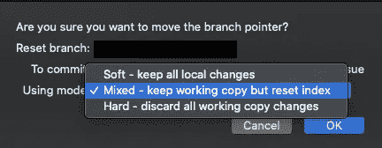

重置对话框—作者截图

选择你的重置策略。如果需要改变的话，我会用软的。当我在当前更改中做错了什么时，硬重置。

*   软—保留索引中的所有更改。
*   混合—保留更改，但不编制索引。
*   硬—放弃所有更改

考虑在 CLI 中执行同样的操作。在 CLI 中这样做需要很多命令。你不想慢下来。

你知道 Git 足以使用 GUI。跳过命令行界面。使用 GUI。

# 2.从 git 中移除文件而不删除它

您向文件中添加更改。现在你不想要它们了。此外，您希望忽略该文件。从 Git 忽略。

下面是如何在 Sourcetree 中删除和忽略一个文件。

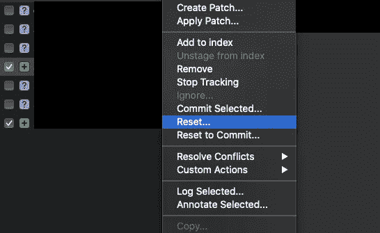

重置源代码树中的文件—按作者截图

右键单击一个文件。继续重置。继续下一步。

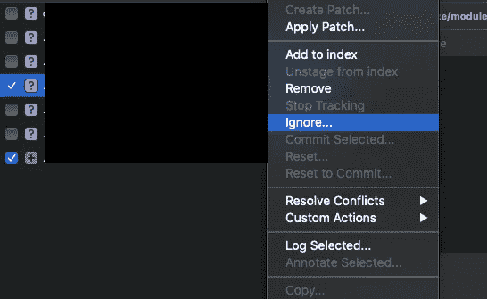

忽略 Sourcetree 中的文件—作者截图

右键单击一个文件。继续忽略。使用对话框继续下一步。

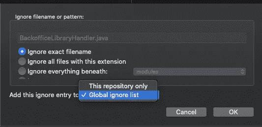

忽略源代码树中的文件对话框—作者截图

两种选择。全局忽略列表和本地忽略列表。选择一个，文件就不再被 Git 跟踪了。

# 3.编辑提交消息

您想要更改最后一条提交消息。在 CLI 中，您可以使用修改功能。

下面是如何在 Sourcetree 中修改最后一次提交。

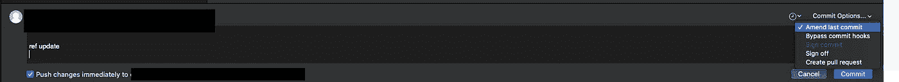

修改源代码树中的最后一次提交—作者截图

点击“提交”按钮后，左上角的大加号，你得到这个编辑器区域。在“提交选项”中，您可以选择“修改上次提交”。

然后，编辑器区域会填充上一条提交消息。改变它，推动改变。完成了。

# 4.用力推

你在本地有不同的历史。现在您需要更新远程分支。没有力量推动，那是不可能的。

以下是如何在 Sourcetree 中用力推动。

进入“首选项”，然后进入“高级”部分。选中“允许强制推送”。

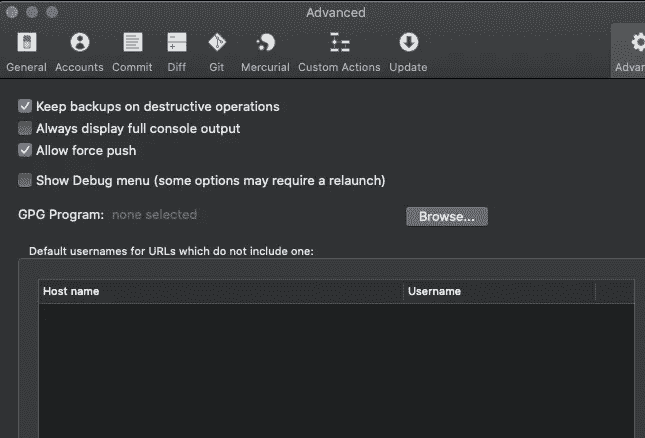

允许在源代码树中强制推送—作者截图

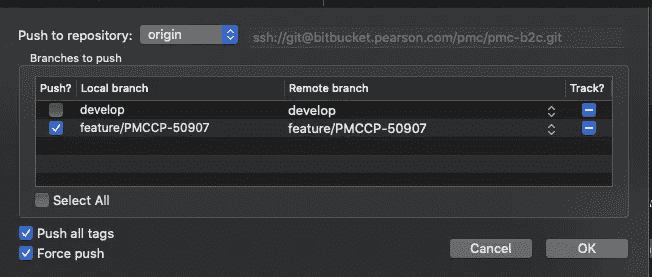

源树中允许的强制推送—作者截图

在允许该功能后，这里有一个强制推送复选框。

我不喜欢这种方式。自定义操作更快。这是我定制的强制推送设置。

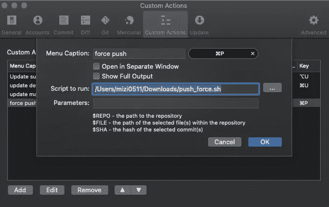

源树中强制推送的自定义操作

自定义动作触发热键并执行脚本。脚本是在后台执行的 bash 脚本。

```
# push_force.sh
#!/bin/bashfunction pushF() {
    git push -f 
}pushF
```

我经常用力推。对我来说，重定基础是一条可行之路。重置基础后，强制推送是强制性的。

# 5.重置基础

我改变了基础。我看到很多问题发生时，重新基地。不仅在 Sourcetree 上，而且在一般情况下。

我将我的分支重新基于开发分支。我喜欢我的改变在最上面。然后，我可以毫不费力地删除、重置或恢复更改。

以下是如何在 Sourcetree 中进行 rebase。

这是我的 basing bash 脚本。这将重新确定您在开发分支上的更改。

```
#!/bin/bashfunction update() {
    if git show-branch remotes/origin/$1 &> /dev/null; then
        echo "✅ Update branch '"$1"'."
        git fetch origin $1:$1
        git rebase $1
    else
        echo "❌ Skip branch '"$1"' since it doesn't exist."
    fi
}update develop
```

当你重置基础时，Sourcetree 增加了错误的对话框，“遇到错误”对话框。看到这个不要怕。Git 处于 rebase 状态，Sourcetree 没有正确解决这个问题。

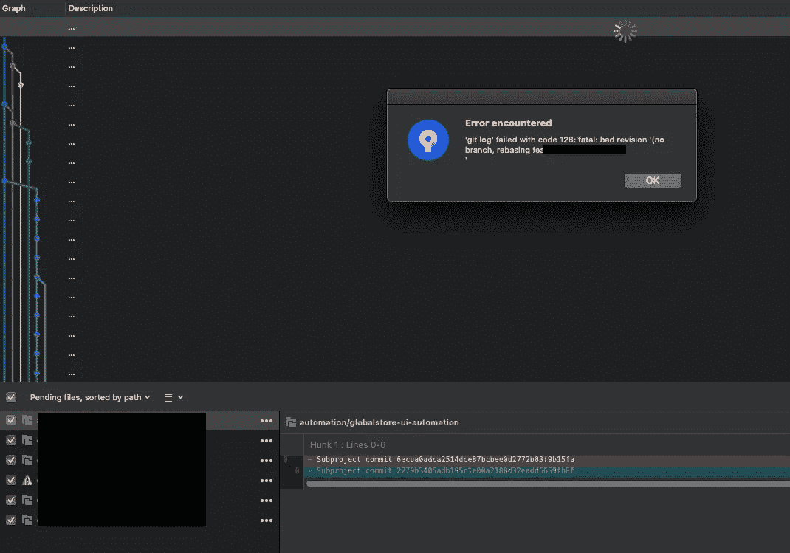

“遇到错误”对话框用于在 Sourcetree 中重置基础—作者截图

启动脚本后，您会看到这个屏幕。这意味着你们有矛盾。解决它们。并单击“提交”按钮。然后继续。

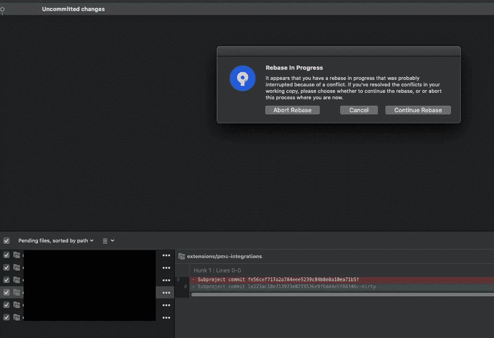

正在重建源代码树-作者截图

冲突已解决，您可以继续重置基础。或者你可以放弃。如果你中止它，你会得到一个干净的状态，否则你会更进一步。

# 结论

Git 对于每个伟大的开发者来说都是必不可少的。学习基础知识，然后继续使用 GUI。如果你知道基本知识，GUI 是很棒的。如果不是，请使用 CLI 一会儿。

您可以使用 Git 解决大多数版本的错误。使用 Sourcetree 为我解决问题提供了巨大的支持。

我快速前进，不费吹灰之力就能解决问题。强烈推荐 Sourcetree 来管理您的 Git repo。

# 今天就加入 Medium 吧！

*你为什么要* [*亡国*](https://zivce.medium.com/membership?source=responses-----f49b64432202---------------------respond_sidebar-----------) *？*率先抛弃微服 Chrome 模式。其次，你会接触到很多精彩的故事。你可以从实用主义程序员的书架上读到 [100 本左右的书。你可以看到来自 Pinterest 团队的障碍、非常有用的提示和很好的建议。你可以阅读谷歌云的最新发展。](https://medium.com/pragmatic-programmers/directory-of-pragmatic-programmer-books-on-medium-6a5cbadbd4b4?source=responses-----f49b64432202---------------------respond_sidebar-----------)

这就是你每月花 5 美元(两杯咖啡)得到的东西。你可以花 [$5](https://zivce.medium.com/membership?source=responses-----f49b64432202---------------------respond_sidebar-----------) 阅读整个实用程序员图书馆。

免责声明:[中的 2 美元，](https://zivce.medium.com/membership?source=responses-----f49b64432202---------------------respond_sidebar-----------)中的 5 美元将直接支持我，并为您提供精彩的话题。

# 资源

[](https://javascript.plainenglish.io/7-most-common-git-mistakes-eefdd5a5b0) [## 7 个最常见的 Git 错误

### 以及如何轻松解决。

javascript.plainenglish.io](https://javascript.plainenglish.io/7-most-common-git-mistakes-eefdd5a5b0) 

# 继续阅读相关文章

[](https://betterprogramming.pub/3-tips-to-improve-your-git-submodule-knowledge-171b10481a5a) [## 提高 Git 子模块知识的 3 个技巧

### 如何顺畅地使用 Git 子模块

better 编程. pub](https://betterprogramming.pub/3-tips-to-improve-your-git-submodule-knowledge-171b10481a5a) [](https://betterprogramming.pub/avoid-a-dirty-git-repo-4e9518d7914c) [## 避免肮脏的 Git 回购

### 如何清理你的 Git 回购

better 编程. pub](https://betterprogramming.pub/avoid-a-dirty-git-repo-4e9518d7914c)